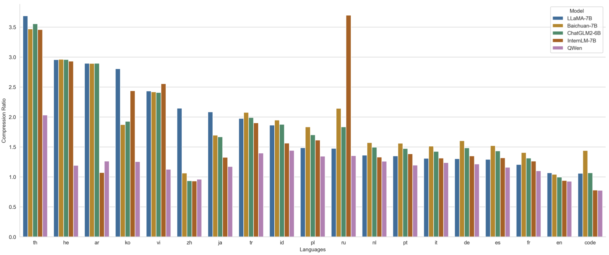

# Qwen — 通义千问开放权重主线起点

> [!tldr]
> 初代 Qwen 的历史意义不只是“阿里也发布了一个 LLM”，而是一次性搭起此后千问主线反复复用的三层底座：**中文—英文高质量预训练、Base/Chat 双轨开放、以及面向工具调用和 Agent 的产品接口**。它的能力今天已不算前沿，但 Qwen1.5 之后的大规模家族化，正是从这一代的 tokenizer、长上下文和 Qwen-Agent 生态长出来的。

## 一页判断

| 维度 | 初代 Qwen 的做法 | 对后续主线的意义 |
|---|---|---|
| 模型族 | 7B / 14B / 72B，Base 与 Chat 并行 | 建立“开放基座 + 对话模型”的发布范式 |
| 预训练 | 72B 版本使用约 3T tokens，中英为主并覆盖代码、数学等数据 | 把知识、中文能力与代码能力放进同一个通用基座 |
| 上下文 | 通过 RoPE/NTK-aware 等工程扩展支持更长上下文 | 为 Qwen2 以后 128K 主线积累经验 |
| Agent | Qwen-Chat 支持 function calling，官方同步维护 Qwen-Agent | 工具使用不是后来的外挂，而是早期产品目标 |

## 架构与训练

Qwen 是 decoder-only Transformer，采用 RMSNorm、SwiGLU、RoPE 和自研 tokenizer。官方模型卡给出的 tokenizer 可覆盖超过 15 万 token，目的不是追求“词表越大越好”，而是降低中文、多语言、代码和数字文本的切分损耗。

72B 版本的公开报告披露了约 3T tokens 的预训练规模。数据配比与清洗细节没有完全公开，因此这里不把“3T”直接等价成训练质量；更重要的事实是 Base 与 Chat 同时交付，后训练从一开始就承担 instruction following、安全和工具调用，而不只是聊天语气微调。

## 从语言模型到工具模型

Qwen-Chat 的 function calling 与官方 Qwen-Agent 框架，使这一代已经能把自然语言请求翻译为结构化工具参数。它仍依赖提示模板、工具描述和外部执行器，离今天的长程自主 Agent 很远，但训练接口上已经出现三个关键对象：工具 schema、调用轨迹和环境回传。

> [!insight]
> 对 Agent Training，初代 Qwen 最值得保留的不是旧 benchmark 分数，而是“Base → Chat → Tool-use runtime”的完整链条。它是千问系从单轮偏好对齐走向轨迹级训练的起点。

## 资料充分度与能力边界

- 初代报告主要围绕静态知识、语言、代码和数学评测，不能据此推断长程 Agent 稳定性。
- 公开材料没有给出完整数据配方、RLHF 数据规模和工具轨迹构造细节。
- Qwen-VL、Qwen-Audio 是同代支线，不混入通用文本正代结论。

## 一手资料

- [Qwen 官方仓库](https://github.com/QwenLM/Qwen)
- [Qwen Technical Report](https://arxiv.org/abs/2309.16609)
- [Qwen-72B Hugging Face model card](https://huggingface.co/Qwen/Qwen-72B)
- [[src/hf_model_card|本地 Hugging Face 模型卡 MD]]
- [[src/Official Source|本地来源索引]]
