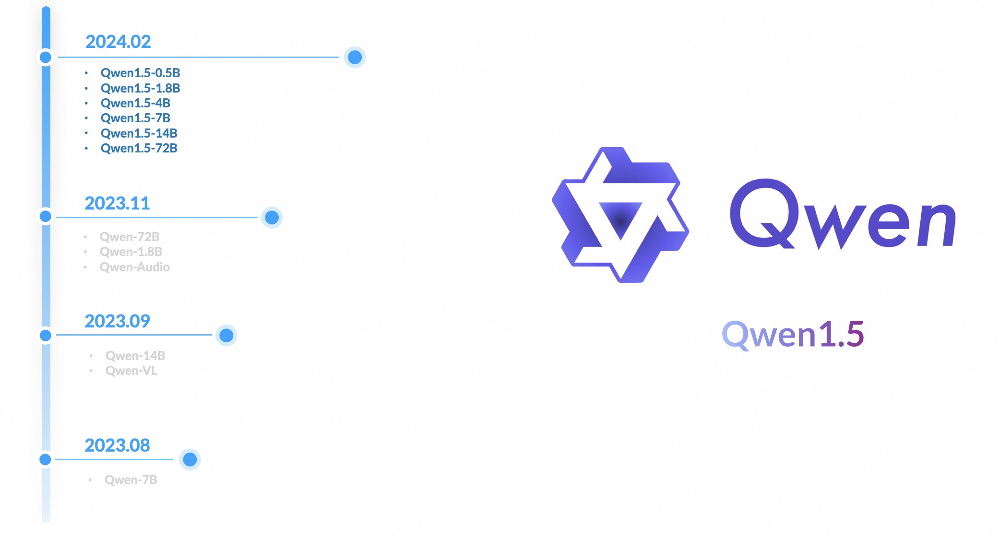
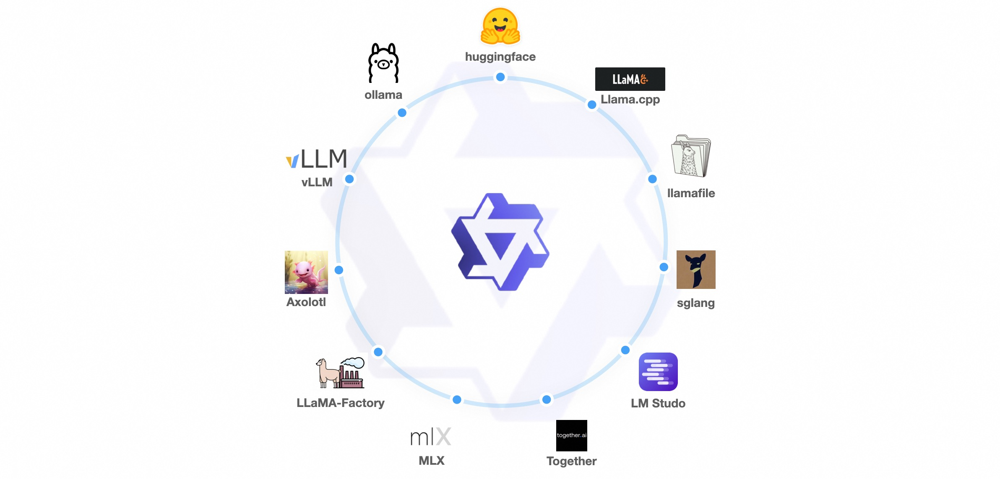
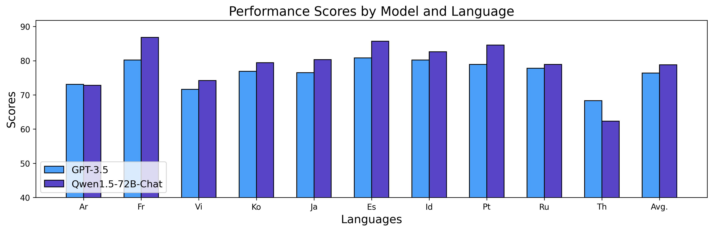

# Qwen1.5 — 从单个模型走向完整开放家族

> [!tldr]
> Qwen1.5 的核心升级是“可用性规模化”：0.5B 到 72B 的稠密模型、额外 MoE 版本、原生 Transformers 支持，以及 GGUF/AWQ/GPTQ 等量化交付，把千问从少数大模型变成可覆盖端侧、单卡和服务器的完整开放家族。

## 家族与工程栈

| 项目 | 官方发布内容 | 我的判断 |
|---|---|---|
| 尺寸 | 0.5B、1.8B、4B、7B、14B、32B、72B，并提供 MoE | 统一训练范式首次覆盖完整部署梯度 |
| 上下文 | 多数模型 32K | 长上下文从旗舰特性下沉到家族能力 |
| 推理格式 | BF16、GPTQ、AWQ、GGUF | 把“能下载”升级为“能在真实硬件跑” |
| 生态 | Transformers 4.37 起原生支持，无需 `trust_remote_code` | 大幅降低集成风险与维护成本 |

## 训练与能力变化

Qwen1.5 延续 decoder-only Transformer 路线，重点是训练数据、多语言、对话对齐与稳定性。官方对比图显示它在同尺度上对 Qwen 前代形成稳定提升；更重要的是，小模型不再只是压缩展示，而是被当作真实交付对象。

## 对 Agent Training 的意义

- 同一家族可以为 planner、executor、critic 选择不同尺寸，降低多模型工作流成本；
- 量化和标准 Transformers 接口让离线 rollout、私有工具环境和本地 verifier 更易部署；
- 32K 上下文提高了工具说明、历史轨迹和检索证据共同进入 prompt 的空间。

但官方发布页没有披露专门的长程工具 RL、轨迹级偏好优化或环境交互训练，不能把“支持 function calling”写成“已经解决 Agent 训练”。

> [!insight]
> 这一代最值得研究的是“模型能力—部署成本—工作流角色”的联合选择：一个 Agent 系统未必需要所有节点都用 72B，Qwen1.5 首次让同源不同尺度的角色分工变得现实。

## 资料充分度与边界

> [!warning]
> Qwen1.5 没有独立、完整的技术报告；一手材料以发布博客和模型卡为主。训练 tokens、后训练数据规模与消融未完整披露，因此本笔记能达到产品与家族分析标准，但不能达到论文级训练复现标准。

## 一手资料

- [Qwen1.5 官方发布博客](https://qwenlm.github.io/blog/qwen1.5/)
- [Qwen1.5-72B Hugging Face model card](https://huggingface.co/Qwen/Qwen1.5-72B)
- [[src/hf_model_card|本地 Hugging Face 模型卡 MD]]
- [[src/Official Source|本地来源索引]]
