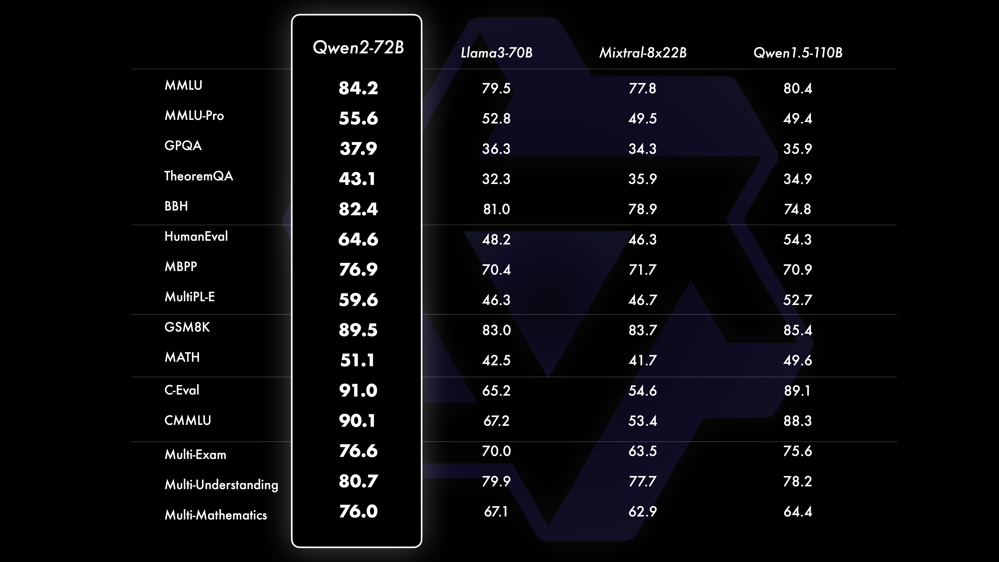
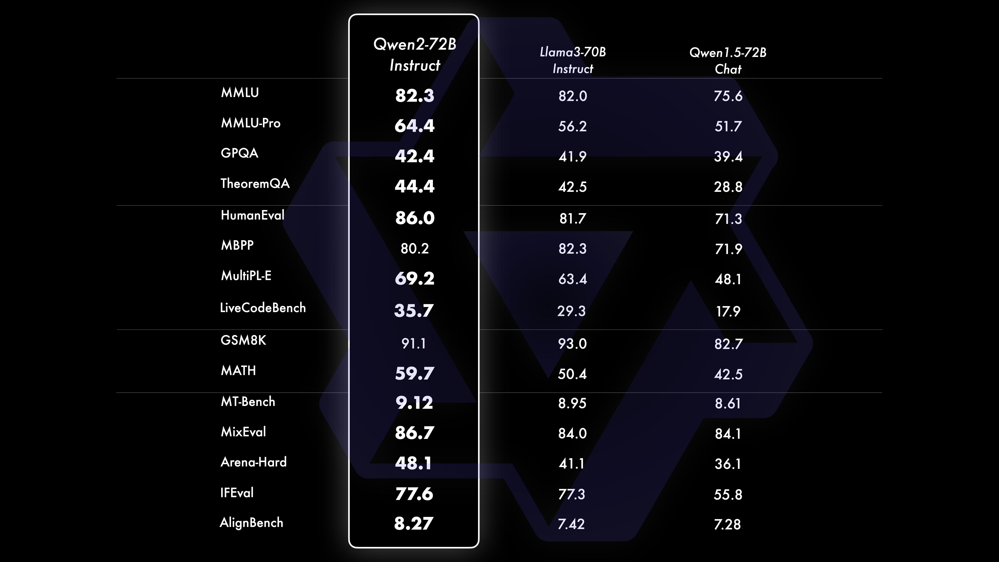

# Qwen2 — 多语言、GQA 与 128K 长上下文

> [!tldr]
> Qwen2 是千问第一次把“全球化与长上下文”写进正代架构：0.5B–72B 加 57B-A14B MoE，27 种新增语言、全尺寸 GQA，以及旗舰 128K 上下文。相较 Qwen1.5，它不只是扩家族，而是在 attention 成本、语言覆盖和训练配方上重做主干。

## 家族结构

| 类型 | 规模 | 关键定位 |
|---|---|---|
| Dense | 0.5B、1.5B、7B、72B | 从端侧到旗舰的通用模型 |
| MoE | 57B-A14B | 用 14B 激活参数换取更大容量 |
| Context | 7B/72B 最长 128K | 文档、代码库和长轨迹处理 |
| Language | 新增 27 种语言 | 从中英主导转向多语言通用模型 |

## 架构：GQA 成为默认选择

Qwen2 在全部尺寸采用 Grouped Query Attention，让多组 query 共享更少的 key/value heads，直接减少 KV cache。在长上下文和高并发服务中，它比普通 MHA 更经济。这个选择看似只是推理优化，实际改变了可训练和可部署的上下文长度上限。

## 数据、后训练与 Agent

官方强调高质量多语言、代码和数学数据，但没有披露可复现的完整配方。Instruct 版继续采用监督微调与人类偏好对齐，并强化 role-play、长文本、结构化输出和工具相关能力。

对 Agent 系统，Qwen2 的价值来自三个耦合变化：128K context 容纳更长网页、代码库和轨迹；GQA 控制 KV cache 成本；多语言训练让同一工具协议跨语言入口复用。

> [!insight]
> 长上下文不是 Agent memory 的同义词。Qwen2 增加的是“可放入窗口的信息量”，并没有自动解决轨迹筛选、状态压缩、错误恢复和 credit assignment；这些仍需外部 memory policy 与训练数据设计。

## 资料充分度与边界

- 128K 是特定模型与配置的最大能力，不代表所有尺寸、推理框架均默认支持。
- 图表主要是静态 benchmark，不能直接代表工具执行成功率。
- Qwen2-VL、Qwen2-Audio 等独立命名模型属于支线。

## 一手资料

- [Qwen2 官方发布博客](https://qwenlm.github.io/blog/qwen2/)
- [Qwen2 Technical Report](https://arxiv.org/abs/2407.10671)
- [Qwen2-72B Hugging Face model card](https://huggingface.co/Qwen/Qwen2-72B)
- [[src/hf_model_card|本地 Hugging Face 模型卡 MD]]
- [[src/Official Source|本地来源索引]]
