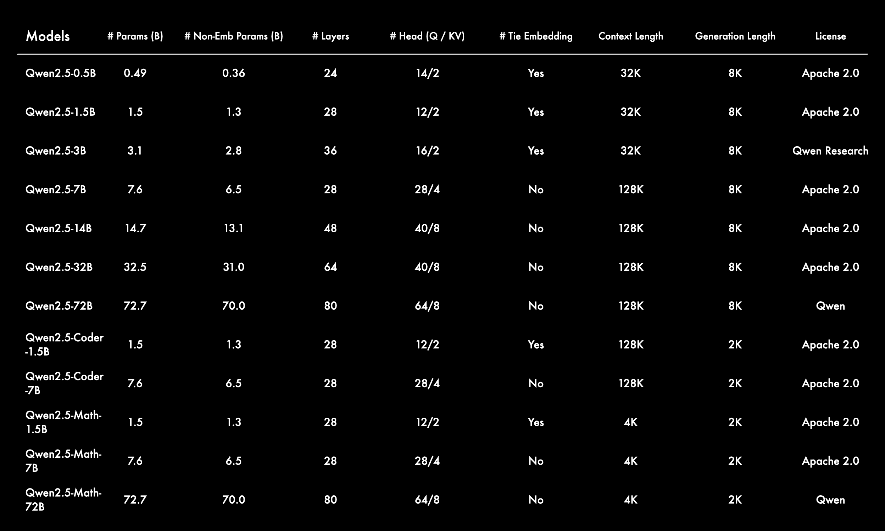
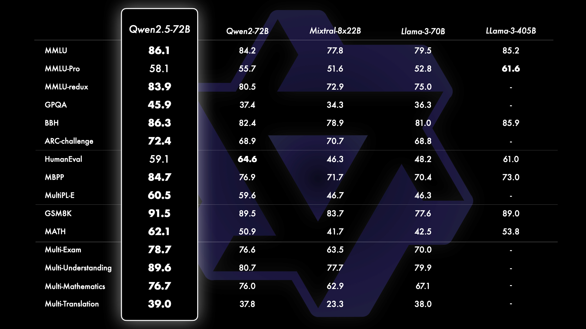
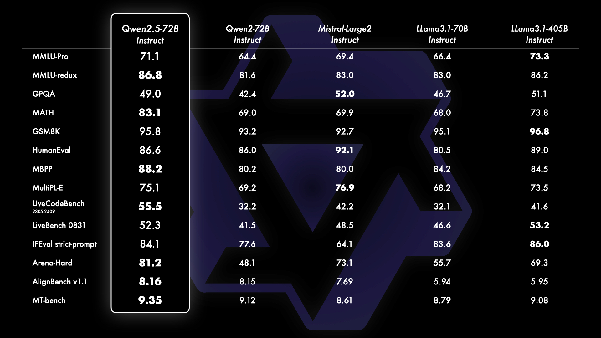

# Qwen2.5 — 18T tokens 后的工程化成熟代

> [!tldr]
> Qwen2.5 把 Qwen2 的骨架推到更成熟的数据与后训练阶段：最多约 18T tokens、128K 输入、8K 生成、29+ 语言，并显著加强代码、数学、表格、JSON 和 system prompt 控制。它是千问从“强开源模型”转向“可作为应用与 Agent 基座”的关键一代。

## 为什么是一次正代升级

| 维度 | Qwen2.5 | 相比 Qwen2 的变化 |
|---|---|---|
| 预训练 | 最多约 18T tokens | 知识、代码、数学数据规模和质量提升 |
| 长上下文 | 128K 输入，最长 8K 输出 | 不只读长文，也能生成长结构化结果 |
| 语言 | 29+ 语言 | 多语言继续系统化 |
| 后训练 | system prompt、role-play、JSON/表格 | 更贴近稳定应用接口 |
| 家族 | 0.5B–72B；Coder/Math 独立支线 | 通用主干与专项分支开始清晰分工 |

## Base 与 Instruct 要分开看

Base 评测回答“预训练基座学到了什么”，Instruct 评测则混入 SFT、偏好对齐、提示模板和推理配置。官方图表显示 72B Base 与 Instruct 均有明显增益，但不能把 Instruct 榜单提升全部归因于预训练。

## Agent 与结构化输出

这一代最实用的提升是对 **system prompt、结构化数据与 JSON** 的可靠处理。Agent harness 需要模型持续遵循角色、工具 schema、返回格式和停止条件；静态问答再强，格式漂移或忽略系统约束也会导致真实任务失败。

Qwen2.5 仍不能被描述为“原生长程 Agent 模型”：官方材料没有给出大规模环境 rollout、工具执行 RL 或长任务 credit assignment 的完整方案。更准确的定位是 **为 Agent 提供稳定语言—代码—结构化输出底座**。

> [!insight]
> Qwen2.5 是很好的“前 Agentic RL 基线”：先测纯 SFT/偏好对齐能把工具格式和短轨迹做到多稳，再与 Qwen3 以后模型比较，才能区分收益来自更强基座还是环境训练。

## 资料充分度与边界

> [!warning]
> 发布时官方说明独立技术报告仍在准备，公开证据主要来自博客和模型卡。18T、128K 等可以确认，但数据配比、后训练规模和关键消融不足以做论文级复现。

Coder、Math、VL、Omni 等均是专项支线；本页只讨论通用 Qwen2.5 正代。

## 一手资料

- [Qwen2.5 官方发布博客](https://qwenlm.github.io/blog/qwen2.5/)
- [Qwen2.5-72B-Instruct Hugging Face model card](https://huggingface.co/Qwen/Qwen2.5-72B-Instruct)
- [[src/hf_model_card|本地 Hugging Face 模型卡 MD]]
- [[src/Official Source|本地来源索引]]
