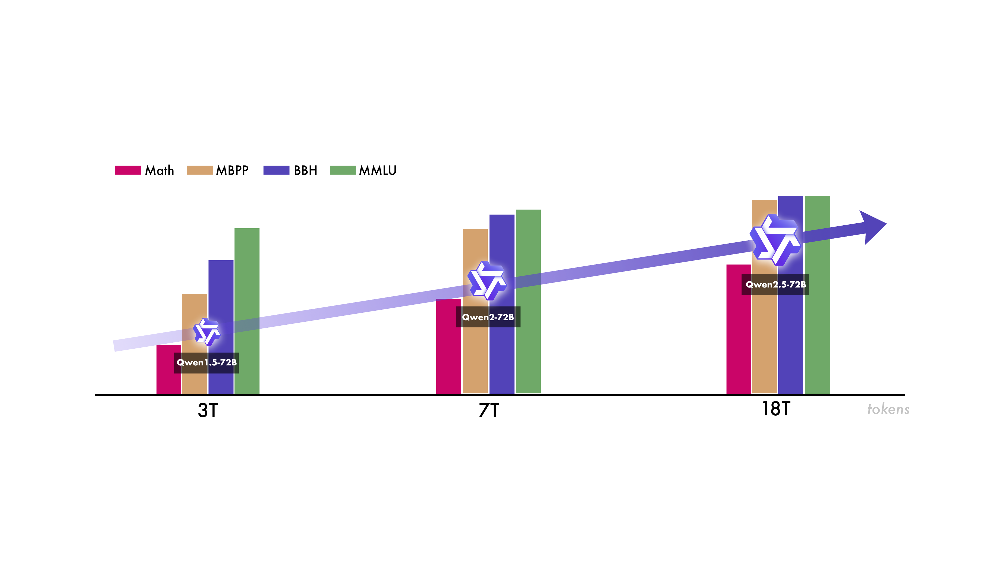
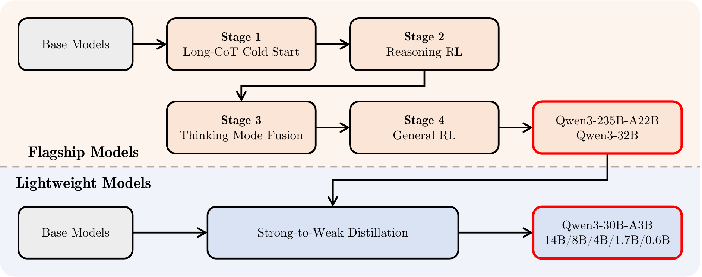
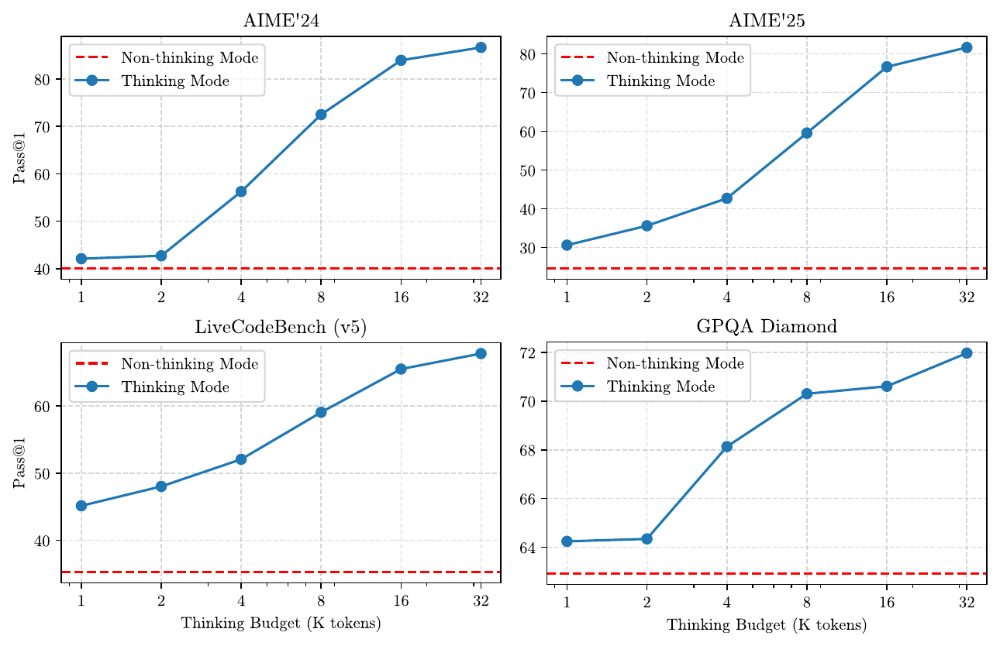

# Qwen3 Technical Report — 深度技术分析

> [!TL;DR]
> Qwen3 核心贡献：**单一模型统一 thinking/non-thinking 双模式** + **Thinking Budget 机制**实现推理资源动态分配。MoE 架构（235B总参/22B激活）以 60% 激活参数在 17/23 基准上超越 DeepSeek-R1。后训练四阶段设计（冷启动→推理RL→模式融合→蒸馏）是关键技术路径。



---

## 1. 问题与动机

### 1.1 现状痛点
- **模型分裂**：复杂推理需要 QwQ-32B，快速响应需要 Qwen2.5-72B，部署成本高
- **推理资源浪费**：简单任务用大模型推理不划算，复杂任务用小模型效果差
- **训练效率问题**：小模型直接 RL 训练效果差，GPU 消耗大

### 1.2 Qwen3 的解决思路
```
┌─────────────────────────────────────────────────────────────┐
│                    Qwen3 统一框架                            │
├─────────────────────────────────────────────────────────────┤
│  ┌─────────────┐    ┌─────────────┐                        │
│  │ /think      │    │ /no_think   │   ← 用户控制模式切换    │
│  └──────┬──────┘    └──────┬──────┘                        │
│         │                   │                               │
│         ▼                   ▼                               │
│  ┌─────────────────────────────────────────────────────┐    │
│  │              单一模型（Thinking Budget 控制）         │    │
│  │   -thinking: 复杂推理，分配更多 tokens               │    │
│  │   -no_think: 快速响应，最小化延迟                    │    │
│  └─────────────────────────────────────────────────────┘    │
└─────────────────────────────────────────────────────────────┘
```

---

## 2. 架构深度设计

### 2.1 Dense 模型架构（6个规模）

| 规模 | 架构特性 |
|------|----------|
| **0.6B/1.7B/4B/8B/14B/32B** | 统一架构设计 |

**关键设计选择**：
- **GQA (Grouped Query Attention)**：所有规模使用，加速推理
- **SwiGLU 激活函数**：替代 ReLU/GELU，增强非线性表达能力
- **RoPE 位置编码**：长上下文支持基础
- **RMSNorm**：替代 LayerNorm，效率更高
- **去除 QKV-bias**：减少参数量，提升训练稳定性
- **引入 QK-Norm**：对 Query-Key 做归一化，与 LLaMA 系列不同的设计

> [!设计洞察]
> QK-Norm 的引入是关键创新：通过对 attention score 的 Q、K 向量做归一化，可以稳定训练过程，防止梯度爆炸。这在长序列训练中尤为重要。

### 2.2 MoE 模型架构

| 模型 | 总参 | 激活参 | 专家数 | 激活专家数 |
|------|------|--------|--------|------------|
| Qwen3-30B-A3B | 30B | 3B | 128 | 8 |
| Qwen3-235B-A22B | 235B | 22B | 128 | 8 |

**MoE 关键设计**：
- **无共享专家（No Shared Expert）**：每个 token 路由到 8 个专家之一
- **Global Batch Load Balancing Loss**：解决专家负载不均问题
- **与 DeepSeek-R1 对比**：
  - DeepSeek-R1: 671B 总参，37B 激活
  - Qwen3-235B: 235B 总参，22B 激活
  - **效率提升**：60% 激活参数，35% 总参数

---

## 3. 预训练深度细节

### 3.1 数据处理 pipeline

```
┌─────────────────────────────────────────────────────────────────┐
│                    预训练数据 pipeline                           │
├─────────────────────────────────────────────────────────────────┤
│                                                                 │
│  PDF 文档 ──► Qwen2.5-VL ──► 文本提取                           │
│                            │                                    │
│  领域生成 ──► Qwen2.5-Math ──► 数学合成数据                     │
│                            │                                    │
│  代码生成 ──► Qwen2.5-Coder ──► 代码合成数据                    │
│                            │                                    │
│                            ▼                                    │
│                    36T tokens                                   │
│                    119 种语言/方言                              │
│                                                                 │
└─────────────────────────────────────────────────────────────────┘
```

### 3.2 三阶段训练策略

| 阶段 | 数据量 | 内容 | 上下文长度 | 目标 |
|------|--------|------|------------|------|
| **S1: 通用知识** | ~30T | 广泛领域知识 | 4,096 | 基础能力 |
| **S2: 知识密集型** | STEM+Code | 数学/科学/代码 | 4,096 | 推理能力 |
| **S3: 长上下文** | 适量 | 长文本 | 4K→32K | 上下文扩展 |

### 3.3 数据去污染（Test Data Leakage Prevention）

**LCS (Longest Common Subsequence) Matching**：
```
移除条件：LCS长度 ≥ 13 AND LCS长度 ≥ 0.6 × min(序列1长度, 序列2长度)
```

这个严格的去污染标准确保评估结果的可信度。

---

## 4. 后训练四阶段（核心技术）



### 4.1 阶段概览

```
Stage 1: Long-CoT Cold Start
    │
    ▼
Stage 2: Reasoning RL (GRPO)
    │
    ▼
Stage 3: Thinking Mode Fusion
    │
    ▼
Stage 4: General RL
```

### 4.2 Stage 1: Long-CoT Cold Start

**目标**：建立复杂推理的初始能力

**方法**：
- 使用 QwQ-32B 生成推理轨迹
- **Human Annotator 验证**：确保推理质量
- 3,995 query-verifier pairs

**关键设计**：不用纯 SFT，而是用 RL 验证过的 reasoning 数据做冷启动。

### 4.3 Stage 2: Reasoning RL (GRPO)

**算法**：GRPO (Group Relative Policy Optimization)

**训练数据**：3,995 query-verifier pairs（数学+代码）

**核心效果**：
```
AIME'24: 70.1 → 85.1 (+15.0)
```
仅用 RL 就实现如此大的提升。

**GRPO 特点**：
- 无需 critic model，减少计算开销
- 使用 group relative 方式估计 advantage

### 4.4 Stage 3: Thinking Mode Fusion ⭐核心创新

**目标**：将 thinking 和 non-thinking 能力融合到单一模型

**Prompt 格式设计**：

```
┌─────────────────────────────────────────────────────────────┐
│ Thinking Mode (/think)                                       │
├─────────────────────────────────────────────────────────────┤
│ <|im_start|>user                                           │
│ {query} /think <|im_end|>                                  │
│ <|im_start|>assistant                                      │
│ <think>                                                     │
│ {thinking_content}                                          │
│ </think>                                                     │
│ {response} <|im_end|>                                      │
└─────────────────────────────────────────────────────────────┘

┌─────────────────────────────────────────────────────────────┐
│ Non-Thinking Mode (/no_think)                               │
├─────────────────────────────────────────────────────────────┤
│ <|im_start|>user                                           │
│ {query} /no_think <|im_end|>                               │
│ <|im_start|>assistant                                      │
│ <think>>                                                    │
│ </think>                                                     │
│ {response} <|im_end|>                                      │
└─────────────────────────────────────────────────────────────┘
```

**关键洞察**：
- Thinking tokens 放在 `<think>` 和 `</think>` 之间
- Non-thinking 模式下这两个标签仍然存在，但内容为空
- 模型学会根据指令切换模式

### 4.5 Stage 4: General RL

**Reward System 三层设计**：

| Reward 类型 | 适用场景 | 实现方式 |
|------------|----------|----------|
| **Rule-based Reward** | 推理任务、格式遵循 | 精确匹配/格式验证 |
| **Model-based (with reference)** | 灵活格式任务 | Qwen2.5-72B-Instruct 评分 |
| **Model-based (no reference)** | 开放问答、偏好对齐 | 训练 reward model |

**20+ 任务覆盖**：
- Instruction Following
- Format Following
- Preference Alignment
- Agent Ability（多轮工具调用）
- RAG 场景
- Specialized domains

---

## 5. Strong-to-Weak Distillation ⭐关键发现

### 5.1 两阶段蒸馏

```
Off-policy Distillation → On-policy Distillation
```

**Off-policy 阶段**：
- 混合 teacher 模型的 /think 和 /no_think 输出
- 帮助学生模型建立基本推理能力
- 建立模式切换的基础

**On-policy 阶段**：
- 学生模型生成响应（在 /think 或 /no_think 模式下）
- 对齐 teacher 模型（Qwen3-32B 或 Qwen3-235B-A22B）的 logits
- **KL 散度最小化**

### 5.2 效率对比（关键数据）

| 方法 | AIME'24 | AIME'25 | MATH500 | GPU Hours |
|------|---------|---------|---------|-----------|
| Off-policy Distillation | 55.0 | 42.8 | 92.4 | - |
| + RL | 67.6 | 55.5 | 94.8 | 17,920 |
| + On-policy Distillation | **74.4** | **65.5** | **97.0** | **1,800** |

> **10x GPU 小时节省** (17,920 vs 1,800)

### 5.3 pass@64 分析

| 方法 | AIME'24 pass@64 | AIME'25 pass@64 |
|------|-----------------|-----------------|
| Off-policy Distillation | 90.0 | 83.3 |
| + RL | 90.0 | 83.3 |
| + On-policy Distillation | **93.3** | **86.7** |

**关键发现**：Distillation 后 pass@64 提升，说明学生模型探索空间扩展，推理潜力增强。RL 则没有这个效果。

---

## 6. Thinking Budget 机制

### 6.1 核心原理

用户通过控制输出长度（max tokens）来控制 thinking budget。

```
Thinking Budget ↑ → Thinking Tokens ↑ → 性能 ↑
```

### 6.2 Scaling 曲线特征

论文 Figure 3 展示了 Qwen3-235B-A22B 在数学、代码、STEM 任务上的 scaling 曲线：

- **平滑上升**：性能随 thinking budget 增加而持续提升
- **无饱和迹象**：如果延长到 32K+，预期性能会更好



### 6.3 对通用 Agent Training 的启示

| 任务复杂度 | 推荐 Thinking Budget | 原因 |
|------------|---------------------|------|
| 简单问答 | 短/无 | 快速响应 |
| 任务规划 | 中等 | 需要基本推理 |
| 复杂工具链 / 代码执行 | 较长 | 需要多步规划、验证与回溯 |
| 开放世界探索 | 最长 | 需要深度探索 |

---

## 7. Stage Ablation 实验（关键发现）

### 7.1 阶段效果分解

| Benchmark | Stage 2 (推理RL) | Stage 3 (模式融合) | Stage 4 (通用RL) |
|-----------|-----------------|-------------------|------------------|
| LiveBench (thinking) | 68.6 | 70.9 (+2.3) | 74.9 (+4.0) |
| Arena-Hard (thinking) | 86.8 | 89.4 (+2.6) | 93.8 (+4.4) |
| CounterFactQA | 50.4 | 61.3 (+10.9) | 68.1 (+6.8) |
| IFEval | 73.0 | 78.4 (+5.4) | 85.0 (+6.6) |
| ThinkFollow | - | 88.7 | 98.9 (+10.2) |
| ToolUse | 63.3 | 70.4 (+7.1) | 85.5 (+15.1) |
| **AIME'24 (thinking)** | 83.8 | 81.9 (-1.9) | 81.4 (-0.5) |
| **LiveCodeBench (thinking)** | 68.4 | 67.2 (-1.2) | 65.7 (-1.5) |

### 7.2 关键洞察：能力权衡

> [!重要发现]
> Stage 3-4 虽然提升了通用能力和工具使用能力，但**降低了复杂推理任务（AIME'24, LiveCodeBench）的性能**。
>
> **原因**：模型被训练在更广泛的任务上，可能损害了处理复杂问题的专业化能力。
>
> **设计决策**：Qwen3 接受这个权衡，以换取更强的通用性和实用性。

---

## 8. 评估细节

### 8.1 采样配置

| 基准 | Thinking Mode | Non-Thinking Mode |
|------|---------------|-------------------|
| Temperature | 0.6 | 0.7 |
| Top-p | 0.95 | 0.8 |
| Top-k | 20 | 20 |
| Max Output | 32,768 tokens | 32,768 tokens |
| AIME 特殊 | 38,912 tokens | 38,912 tokens |

### 8.2 采样次数

| 基准 | 采样次数 | 报告方式 |
|------|----------|----------|
| AIME'24/25 | 64 | 平均准确率 |
| GPQA-Diamond | 10 | 平均准确率 |
| CodeForces | 8 | 每个问题独立尝试 |

---

## 9. 关键结果深度分析

### 9.1 Qwen3-235B-A22B vs DeepSeek-R1

**激活参数效率**：60% 激活参数，17/23 基准胜出

| 能力维度 | Qwen3 优势领域 |
|----------|----------------|
| **Agent 能力** | BFCL v3: 70.8 vs 56.9 |
| **Coding** | LiveCodeBench: 70.7 vs 64.3 |
| **数学推理** | AIME'24: 85.7 vs 79.8 |
| **多语言推理** | MT-AIME2024: 80.8 vs 73.5 |

### 9.2 Qwen3-32B vs QwQ-32B

**17/23 基准胜出**，特别是：
- LiveBench: 74.9 vs 72.0
- Arena-Hard: 93.8 vs 89.5
- BFCL: 70.3 vs 66.4
- Multi-IF: 73.0 vs 68.3

### 9.3 小模型蒸馏效果

| 模型 | 对比基准 | 优势 |
|------|----------|------|
| Qwen3-30B-A3B | QwQ-32B | <1/10 激活参数，可比性能 |
| Qwen3-14B | DeepSeek-R1-Distill-Qwen-32B | 14B 超越 32B |
| Qwen3-8B | Gemma2-27B | 8B 超越 27B |

---

## 10. 研究启发与开放问题

### 10.1 对 Agent Training 的直接价值

> [!insight]
> 1. **Thinking Budget 控制**：工具任务可以动态调整推理深度
> 2. **Mode Switching**：复杂任务用 /think，简单操作用 /no_think
> 3. **工具调用能力**：Stage 4 General RL 显著提升了 ToolUse 能力
> 4. **轨迹成本意识**：训练与评测应同时报告成功率、thinking tokens 与环境交互次数，而不是只看答案准确率

### 10.2 Strong-to-Weak Distillation 的局限

- 学生模型仍受限于 teacher 模型的能力上限
- 对于超复杂推理任务，小模型蒸馏效果有限

### 10.3 能力权衡问题

Stage 3-4 的设计揭示了一个根本问题：
> 通用性与专业化难以兼得。未来可能需要针对不同场景的 specialized 版本。

### 10.4 Thinking Budget 的潜力

论文指出 thinking budget scaling 曲线尚未饱和：
> 如果扩展到 32K+ tokens，性能预期会更好

这为未来的 inference-time scaling 研究指明方向。

### 10.5 资料充分度与证据边界

本页基于完整 Technical Report、LaTeX 源码与官方模型卡，达到论文级精读标准。仍需注意：公开论文没有给出全部训练数据、RL 环境实现和线上 serving 配置，因此无法仅凭本文复现完整 Qwen3 训练系统。

---

## 相关链接
- 论文: [arXiv Link](https://arxiv.org/abs/2505.09388)
- 源码: [GitHub Link](https://github.com/QwenLM/Qwen3)
- 模型卡: [Qwen3-235B-A22B on Hugging Face](https://huggingface.co/Qwen/Qwen3-235B-A22B)
- 本地模型卡: [[src/hf_model_card|Hugging Face 模型卡 MD]]
