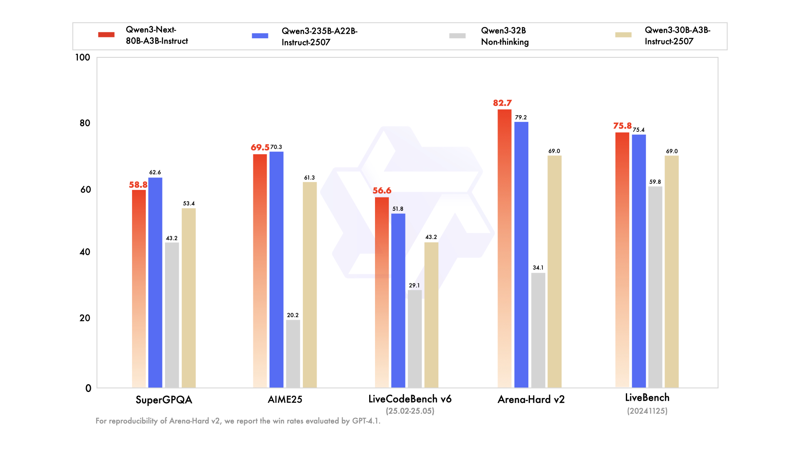

# Qwen3-Next — 超稀疏 MoE 与混合线性注意力转折点

> [!tldr]
> Qwen3-Next 不是普通的“Qwen3.1”，而是千问下一阶段架构实验的公开转折点：**80B 总参数、约 3B 激活**，用 Gated DeltaNet 与 Gated Attention 的混合层降低长序列成本，再用超稀疏 MoE 保留容量。Qwen3.5–3.8 后续都沿用了这条骨架。

## 核心规格

| 项目 | Qwen3-Next-80B-A3B |
|---|---|
| 总参数 / 激活参数 | 80B / 约 3B |
| 主干 | Gated DeltaNet + Gated Attention hybrid |
| 稀疏层 | 高稀疏 MoE |
| 上下文 | 262K 级长上下文 |
| 版本 | Instruct 与 Thinking 分开交付 |

## 架构为什么重要

标准 softmax attention 在序列长度增长时成本迅速上升。Qwen3-Next 让大多数层采用可线性扩展的 Gated DeltaNet，只周期性插入 Gated Attention 处理需要精确全局检索的模式。它不是“彻底抛弃 attention”，而是把两种机制做成可训练的分工。

超稀疏 MoE 则把 80B 参数容量压到约 3B 每 token 激活。这个数字不能简单等同于“3B 模型的成本”：专家路由、跨卡通信、KV cache 和 serving batch 都会影响真实吞吐，但它给出了比稠密模型更有潜力的容量—计算 Pareto。

## 训练与 Agent 视角

Qwen3-Next 延续 Qwen3 的 thinking / non-thinking 思路，但以独立 Instruct、Thinking checkpoints 交付。对训练研究，这种拆分比一个模型内部切 mode 更容易做清晰消融：可分别比较短回答偏好、长思维链 RL、工具执行和推理成本。

它对 Agent 系统的直接价值有两点：

1. 低激活参数更适合高并发 rollout 与多分支采样；
2. 262K context 可以承载代码库、网页证据和更长环境历史。

> [!insight]
> Qwen3-Next 真正的研究问题不是“线性注意力能否跑得更快”，而是混合记忆机制会如何影响长轨迹 credit assignment：局部状态更新适合 DeltaNet，精确回看与证据定位依赖 attention，两者的失败类型可能完全不同。

## 资料充分度与证据边界

- 官方博客与模型卡给出架构和 benchmark，但没有完整公开训练数据配方与所有消融。
- 80B/3B-active 是参数激活口径，不是端到端推理 FLOPs 或显存的完整代理。
- Qwen3-Coder-Next 是编码支线，不在本页正代范围。

## 一手资料

- [Qwen3-Next 官方技术博客](https://qwen.ai/blog?id=qwen3-next)
- [Qwen3-Next-80B-A3B-Instruct model card](https://huggingface.co/Qwen/Qwen3-Next-80B-A3B-Instruct)
- [[src/hf_model_card|本地 Hugging Face 模型卡 MD]]
- [[src/Official Source|本地来源索引]]
