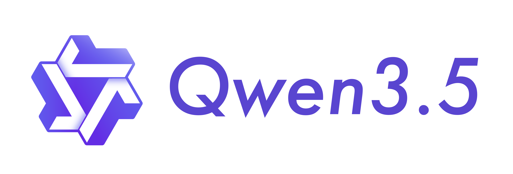

# Qwen3.5 — 原生多模态与 Agent 训练合流

> [!tldr]
> Qwen3.5 是千问主干定义变化的一代：通用正代不再是“文本模型 + VL 支线”，而是从预训练开始进行原生视觉—语言融合；同时把工具调用、环境反馈和大规模 Agent RL 作为后训练主任务。397B-A17B 开放模型给出了 hybrid Gated DeltaNet + MoE 的旗舰实现。

## 主干规格

| 维度 | Qwen3.5-397B-A17B / 家族特征 |
|---|---|
| 架构 | Hybrid Gated DeltaNet + Gated Attention，稀疏 MoE |
| 参数 | 397B total / 17B active（旗舰开放模型） |
| 模态 | 文本、图像、视频输入，统一生成文本与 action |
| 语言 | 201 种语言与方言 |
| 上下文 | 开放权重原生长上下文；托管 Plus 提供 1M 默认上下文 |
| 推理 | Thinking / non-thinking，工具使用与视觉推理合并 |

## 从“VLM 拼接”到 early fusion

官方博客强调在万亿级多模态 tokens 上进行 early fusion。这里的关键不是简单增加 image encoder，而是让文本、图像、视频与 agent observation 在预训练阶段共同塑造主干表示。这样，GUI 截图、网页结构和文档图表不再需要依赖独立 VL 支线再转写给语言模型。

Hybrid 架构沿用 Qwen3-Next 的路线：多数层用 Gated DeltaNet 获得长序列效率，周期性 Gated Attention 保留精确全局检索；MoE 则用 17B 激活承载 397B 总容量。

## 后训练：环境进入训练闭环

官方披露了百万级 Agent 环境、异步 RL 基础设施与大规模可交互任务。这一变化比静态榜单更重要：训练样本从“prompt—answer”扩展为“state—action—feedback—next state”的轨迹，reward 可以由代码执行、工具返回、环境终态和多模态 verifier 共同提供。

> [!insight]
> Qwen3.5 对 Agent Training 的最大启发，是把多模态 observation 与 tool action 放进同一 foundation model，而不是训练两个松耦合模块。这样做提高了端到端优化空间，也把 reward hacking、环境偏差和长程 credit assignment 推到更核心的位置。

## 托管版与开放版不要混写

Qwen3.5-Plus 是托管服务，具备 1M 默认 context 和内置工具；397B-A17B 是开放权重旗舰。两者可属于同一正代 family，但参数、上下文默认值和部署条件不能互相代替。

## 资料充分度与边界

- 官方博客披露训练范式，但没有公开百万环境的完整任务分布、reward 设计和失败轨迹比例。
- benchmark 图表混合语言、视觉、推理与 Agent 任务；结果受 harness 和推理预算影响。
- 不能由 17B active 直接推断单机成本，超大 MoE 的通信与权重驻留仍很重。

## 一手资料

- [Qwen3.5 官方技术博客](https://qwen.ai/blog?id=qwen3.5)
- [Qwen3.5-397B-A17B model card](https://huggingface.co/Qwen/Qwen3.5-397B-A17B)
- [Qwen3.8 官方仓库（覆盖 3.5–3.8 家族）](https://github.com/QwenLM/Qwen3.8)
- [[src/hf_model_card|本地 Hugging Face 模型卡 MD]]
- [[src/Qwen3.5 - GitHub|本地仓库摘录]]
