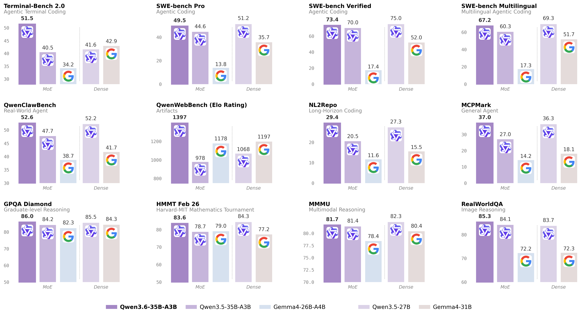

# Qwen3.6 — 小激活参数的 Agentic Coding 实用代

> [!tldr]
> Qwen3.6 没有再次换骨架，而是把 Qwen3.5 的原生多模态与混合架构做得更稳、更便宜、更适合真实 Agentic Coding。开放家族的代表是 **35B-A3B MoE** 与 **27B Dense**：前者追求 3B active 的吞吐，后者追求更简单的本地部署。

## 家族分工

| 模型 | 结构 | 适合场景 |
|---|---|---|
| Qwen3.6-35B-A3B | 35B total / 3B active MoE | 高并发 Agent、编码、成本敏感部署 |
| Qwen3.6-27B | 27B Dense | 单机/小集群、部署路径简单、稳定吞吐 |
| Qwen3.6-Plus / Max Preview | 托管闭源服务 | 更高能力上限与产品工具生态 |

两种开放模型都延续原生多模态、thinking/non-thinking 与 hybrid attention。正代升级的重点是训练和后训练，而不是发明另一个 attention 名称。

## Agentic Coding 的变化

官方把 repository reasoning、terminal tasks、frontend coding、tool use 与多轮修复放到核心评测。35B-A3B 仅约 3B active，却在多项编码 Agent 基准上超过前代同结构，并在 Terminal-Bench 2.0 等任务上体现出更强环境交互能力。

这里应把“coding benchmark”拆成两类理解：HumanEval 类静态生成主要测局部代码正确性；SWE-bench、Terminal-Bench、NL2Repo 更接近真实 Agent，需要检索、修改、执行、观察失败并继续修复。Qwen3.6 的进步主要强调后者。

## 对训练的启发

> [!insight]
> 3B active 的价值不只是便宜 serving，还在于允许训练时做更多 rollout、pass@k 和失败修复采样。Agent RL 常被环境吞吐而非单次前向限制；小激活 MoE 把计算预算从“每条轨迹更贵”转成“能探索更多轨迹”。

同时，官方模型支持保留 thinking context。这对多步任务有利，但也会放大错误思路污染后续步骤的问题。训练时应显式测试：保留、压缩、重启 reasoning state 哪一种在环境反馈后更稳。

## 资料充分度与证据边界

- 托管的 Plus/Max 与开放 35B-A3B/27B 不共享可验证的全部规格，不能混算参数或成本。
- 官方给出大量 Agent benchmark，但 harness、工具版本、采样预算会显著影响结果。
- 训练数据和 RL 环境细节未完整公开，无法复刻后训练流水线。

## 一手资料

- [Qwen3.6-35B-A3B 官方技术博客](https://qwen.ai/blog?id=qwen3.6-35b-a3b)
- [Qwen3.6-27B 官方技术博客](https://qwen.ai/blog?id=qwen3.6-27b)
- [Qwen3.6-35B-A3B model card](https://huggingface.co/Qwen/Qwen3.6-35B-A3B)
- [[src/hf_model_card|本地 Hugging Face 模型卡 MD]]
- [[src/Qwen3.6 - GitHub|本地仓库摘录]]
