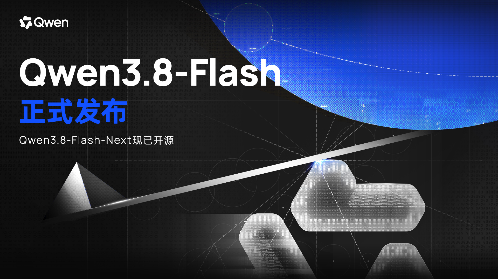
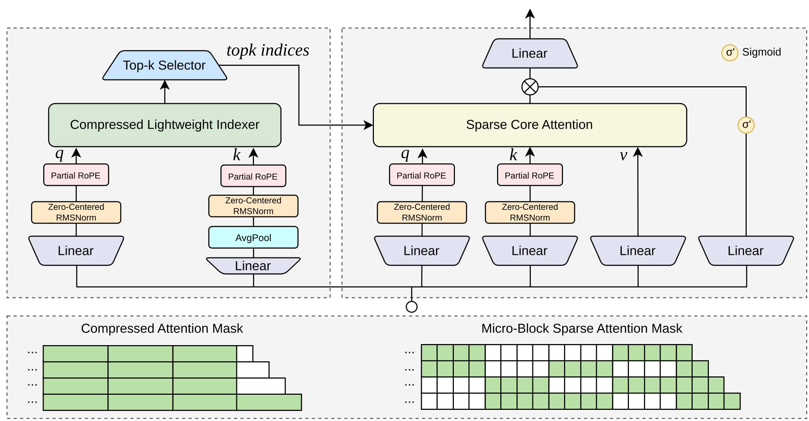
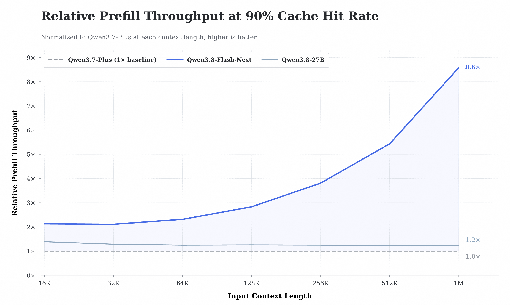

# Qwen3.8 Family — Max 级开放权重与长程 Agent

> [!tldr]
> Qwen3.8 不是“一个旗舰加几个小版”，而是同时覆盖 **2.4T-A95B 开放旗舰、27B Dense 本地路线、托管 Max 与低激活 Flash/Flash-Next** 的正代家族。主线目标已经从聊天与单步推理转向编码、专业研究和长程 Agent 执行，并提供 `reasoning_effort` 与 `preserve_thinking` 控制推理状态。

## 家族成员与工程约束

| 模型 | 参数 / 架构 | 模态 | Context | 定位 |
|---|---|---|---:|---|
| Qwen3.8-Max | 托管旗舰 | text / image / video → text | 1M 服务 | 能力上限、复杂专业任务 |
| Qwen3.8-2.4T-A95B | 2.4T total / 95B active MoE | 通用主干 | 262K 原生，可扩展 | 首个开放的 Qwen-Max 级权重 |
| Qwen3.8-27B | 27B Dense | 原生视觉语言 | 262K/服务扩展 | 本地与小集群部署 |
| [[Qwen3.8-Flash]] | Flash-Next 为 125B core / 6B active，另有 N-gram/MTP 参数 | 多模态 | 262K 原生、可扩至 1M | 高并发工具与 coding 工作流 |

## 2.4T-A95B：开放旗舰的结构

官方模型卡披露 92 层、8192 hidden dimension，并采用 `23 × (3 × Gated DeltaNet → MoE + 1 × Gated Attention → MoE)` 的周期布局。2.4T 总参数给容量，95B active 决定每 token 路由到的专家计算；它仍需要巨量权重存储与跨卡通信，不能被误解为“95B 部署成本”。

Qwen3.8 强调 coding、professional work、research 与 long-horizon agentic tasks，并把环境反馈后的重规划与端到端任务完成作为产品目标。`preserve_thinking` 允许历史推理状态跨轮保留，`reasoning_effort` 则把推理预算变成可控接口。

## Flash-Next：Qwen4 前瞻架构

Flash-Next 在 Gated DeltaNet + attention 骨架上加入 Qwen Sparse Attention、N-gram embedding、Gated Residual 与 Muon 训练，被官方明确称为下一代架构预览。其核心模型约 125B、每 token 激活约 6B，外加 51B N-gram 与约 4B MTP 参数。

## Agent Training 判断

Qwen3.8 的关键不是再多几个 benchmark 第一，而是把 Agent 的三个控制面正式产品化：

1. **推理预算**：根据任务动态选择 reasoning effort；
2. **状态延续**：保留或清理历史 thinking，影响多轮稳定性；
3. **环境执行**：模型对反馈重规划，而不是一次性生成完整答案。

> [!insight]
> 下一步最值得做的实验是“推理状态管理”消融：同一任务比较完整保留、摘要保留、错误后重启三种策略，并按成功率、token 成本和错误恢复时间评估。长程 Agent 的瓶颈可能不再是会不会推理，而是何时该忘掉错误推理。

## 产品价格快照

以下为 2026-08-27 模型市场快照，单位人民币 / MTok；动态价格不作为模型能力事实。

| 模型 | 输入 | 输出 | 缓存命中 |
|---|---:|---:|---:|
| Qwen3.8-Max | ¥12 | ¥36 | ¥1.5 |
| Qwen3.8-Flash | ¥0.8 | ¥2.7 | ¥0.1 |
| Qwen3.8-2.4T-A95B | ¥12 | ¥36 | ¥1.5 |
| Qwen3.8-27B | ¥3 | ¥12 | ¥0.6 |

## 资料充分度与证据边界

- Max 与 Flash 的托管规格、开放模型规格和价格不能互相替代。
- 1M 多为服务层扩展口径；开放权重模型卡的原生 context 与 YaRN 扩展需分开记录。
- 官方未公开完整预训练数据配方、Agent RL 环境分布和 reward 细节，无法复现训练闭环。

## 一手资料

- [Qwen3.8 官方仓库](https://github.com/QwenLM/Qwen3.8)
- [Qwen3.8-2.4T-A95B model card](https://huggingface.co/Qwen/Qwen3.8-2.4T-A95B)
- [Qwen3.8-Flash-Next 官方技术博客](https://qwen.ai/blog?id=qwen3.8-flash-next)
- [[src/hf_model_card|本地旗舰 Hugging Face 模型卡 MD]]
- [[src/00_Source_Index|Qwen3.8 官方资料索引]]
- [[src/06_Qwen3.8-Flash-Next - Hugging Face|Flash-Next 本地模型卡]]
