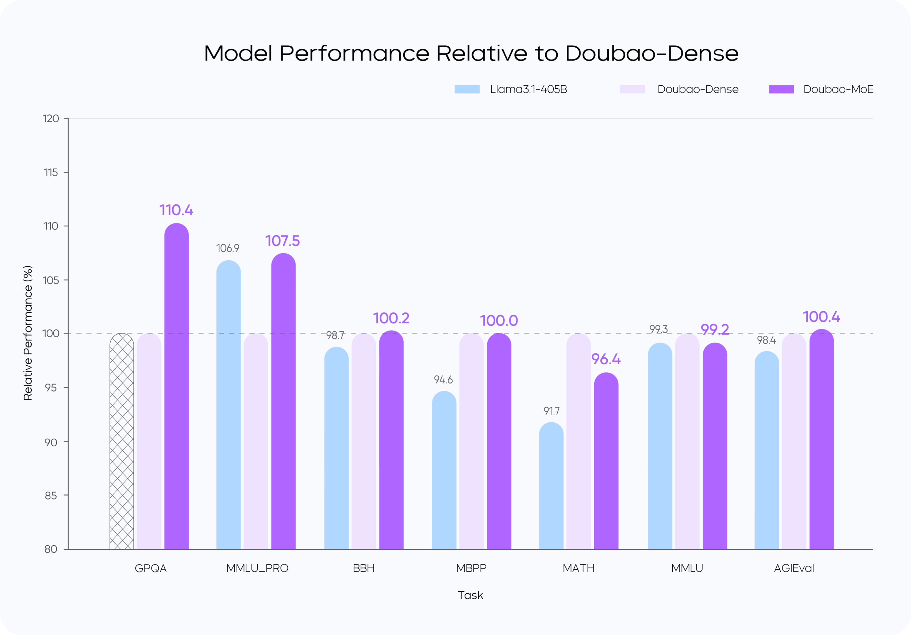
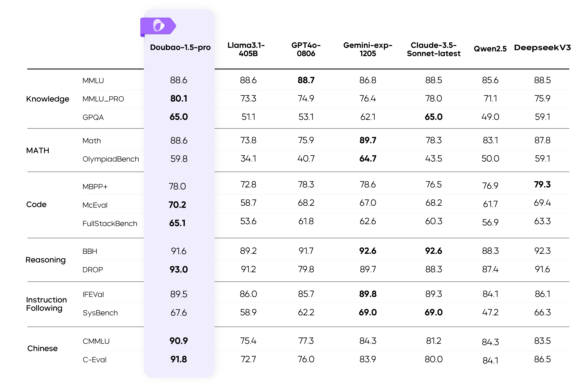

# Seed1.5（Doubao-1.5-pro）— 稀疏 MoE 的生产化起点

> [!tldr]
> Seed1.5 的核心不是堆出一个更大稠密模型，而是把 **稀疏 MoE、训练—推理一体化设计、低精度 serving 与多模态数据合成** 同时做成生产系统。官方将 2025-01-22 发布的 Doubao-1.5-pro 纳入 Seed1.5 主线；Atlas 保留 family 节点，但不能把 Seed1.5-VL 的全部论文结论倒灌给通用版。

## 一页判断

| 维度 | 官方做法 | 主线意义 |
|---|---|---|
| 架构 | 高稀疏 MoE，小激活参数 | 以更低推理计算承载更大容量 |
| Scaling | 在相同 9T tokens 阶段实验中研究 MoE 稀疏度 | 用可观测训练曲线选择效率点 |
| Serving | Prefill/Decode、Attention/FFN 四象限分别优化 | 模型结构从一开始考虑线上吞吐 |
| 多模态 | 图文、语音与纯文本混合训练；RL 阶段投入较多 | 多模态不是简单外挂 encoder |

## MoE：性能杠杆而非免费午餐

官方专题页称，在相同 9T tokens 的阶段性对比中，优化后的 MoE 以约为对应稠密模型 **1/7 的激活参数**达到或超过其性能。这个“7 倍杠杆”是特定内部对照，不等于所有 workload 都能获得 7 倍端到端加速；专家权重驻留、路由与通信仍有成本。

### 这张图真正回答了什么

它证明的是：在官方选定的数据阶段、训练预算和模型配置下，**容量与单 token 激活计算可以部分解耦**。它没有证明 MoE 在任意 batch、任意并行拓扑和任意上下文长度下都同比例更快。要把结论迁移到 Agent workload，至少还要记录专家负载均衡、跨卡 all-to-all、KV cache、长上下文 Prefill 以及低并发 Decode 的成本。

所以 Seed1.5 的研究价值不在“1/7”这个孤立数字，而在一条清晰的共同设计路线：训练时选择可服务的稀疏度，推理时再把不同瓶颈拆开优化，而不是训练结束后才尝试压缩。

## Serving 四象限：不是一个统一 kernel 问题

Seed1.5 把一次请求拆成 Prefill / Decode，又把每一阶段拆成 Attention / FFN。四个象限的瓶颈不同，不能只用“量化 + batching”概括：

| 区域 | 主要矛盾 | 官方披露的方向 | 阅读时应追问 |
|---|---|---|---|
| Prefill × Attention | 长序列计算与流水空泡 | 低精度 attention、Chunk-PP | TTFT 是否随上下文长度稳定增长 |
| Prefill × FFN | 大矩阵计算与专家并行 | W4A8、流水和专家调度 | 量化误差与专家负载是否均衡 |
| Decode × Attention | KV cache 访存、低算术强度 | 跨 query batching 等 | 低并发时是否仍有效 |
| Decode × FFN | 权重读取与 MoE 通信 | 低精度 FFN、批处理 | TPOT 尾延迟是否受热专家拖累 |

官方称 Chunk-PP 的 Prefill 方案可使 Tensor Core 利用率接近 60%。这应理解为特定系统栈中的工程观测，不应脱离硬件、并行配置和 batch 条件作为通用吞吐承诺。

这套分解很重要：它表明“模型能力”与“能否低延迟、高吞吐上线”不是两个串行阶段。架构选择会改变 serving 的瓶颈，而 serving 约束也会反过来限制可用架构。

## 多模态数据与后训练：重点是偏好标准

官方材料描述的多模态数据不只是现成图文对：还包括网页图文、渲染引擎、CV 模型辅助生成与模型自迭代。其作用是补足稀缺的细粒度视觉—语言监督，但也引入合成数据常见的模板化、错误自举和分布偏移问题。

后训练使用人工与模型合成的偏好数据，并针对不同 prompt 类型设置偏好标准，同时显式削弱长度偏好。这一点比“榜单更高”更值得记录：统一 reward 很容易把解释更长误判为回答更好；一旦迁移到搜索、代码和 GUI 轨迹，长度偏差会直接鼓励更多无效 action。

一个更合理的 Agent 版目标应至少同时包含：任务成功、事实/视觉正确性、工具调用必要性、轨迹长度和失败恢复质量。Seed1.5 没有公开完整 reward 公式，但它已经明确暴露了“偏好不能一把尺子量到底”的产品训练问题。

## 如何验收这一代

- **能力**：不要只复述官方总榜，抽取知识、代码、视觉各一组任务并固定 prompt；
- **效率**：同时记录 total/active parameters、TTFT、TPOT、吞吐和显存，而非只看理论 FLOPs；
- **MoE 稳定性**：比较不同 batch、上下文长度和并发下的尾延迟；
- **偏好质量**：对等质量的长短回答做成对测试，检查 reward 是否仍偏爱冗长；
- **多模态**：区分原始视觉理解、OCR/grounding 与依赖外部裁剪工具的结果。

> [!insight]
> Seed1.5 提供了一个很实用的研究命题：Agent 模型的 scaling law 应同时包含任务成功率、激活参数、TTFT/TPOT 与轨迹长度。只优化模型分数，会把成本问题推迟到无法修补的 serving 阶段。

## 资料充分度与证据边界

> [!warning]
> 通用 Seed1.5 缺少独立的完整 Tech Report；本页主要依据官方专题页，因此可以重建架构—系统—后训练的设计逻辑，却不能还原数据配比、专家数、路由损失、完整 RL recipe 和端到端 serving 配置。Seed1.5-VL 有 arXiv 报告，但它是多模态支线，只能用来理解同代视觉训练方法，不能代替通用模型的参数和评测证据。

## 一手资料

- [Doubao-1.5-pro 官方专题](https://seed.bytedance.com/en/special/doubao_1_5_pro)
- [Seed 官方模型索引](https://seed.bytedance.com/en/models?view_from=homepage_tab)
- [Seed1.5-VL Tech Blog（同代支线背景）](https://seed.bytedance.com/en/blog/first-release-of-seed-vlm-tech-report-comprehensive-solutions-for-image-video-gui-and-game)
- [[src/Official Source|本地来源索引]]
