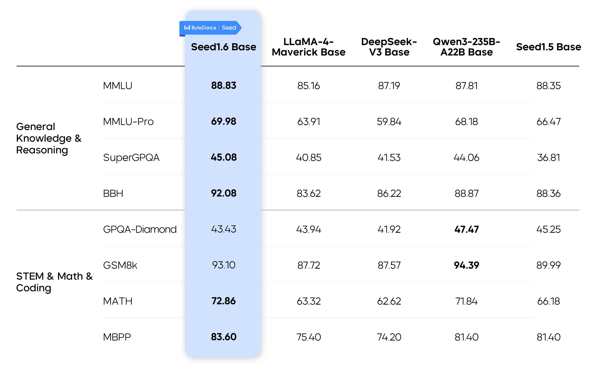
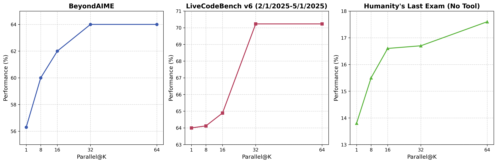
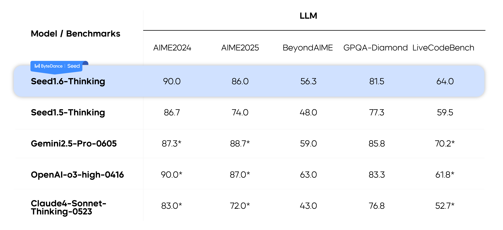

# Seed1.6 — 230B/23B-active 原生多模态与 AdaCoT

> [!tldr]
> Seed1.6 把 Seed1.5 的稀疏 MoE 主干升级为 **230B total / 23B active、256K context** 的多模态 family，并引入 AdaCoT：根据问题难度决定是否进入深度思考。它的关键不是多一个“thinking”开关，而是把推理质量、延迟和多模态任务统一到一个自适应策略中。

## 预训练三阶段

| 阶段 | 数据与目标 | 作用 |
|---|---|---|
| Text-only pre-training | 网页、书籍、论文、代码；规则+模型清洗 | 建立知识、代码和语言底座 |
| MMCT | 增加学科、代码、推理与高质量视觉数据 | 在连续训练中融合文本和图像 |
| LongCT | 多长度长上下文数据，32K 逐步扩到 256K | 避免一次性拉长导致训练不稳 |

官方明确披露 230B 总参数与 23B 激活参数，这比 Seed1.5 的“高稀疏 MoE”口径更可审计。

## AdaCoT：把推理预算变成策略

AdaCoT 根据问题难度自适应启动思考，目标是在准确率与 reasoning latency 之间找到更好的 Pareto。它不同于用户手工指定固定 token budget：决策本身也是模型行为，需要训练数据覆盖“该想”和“不该想”的边界。

风险也随之出现：如果训练 reward 只奖励答案正确，模型可能学会对简单题过度思考；如果过度惩罚 latency，又可能在难题上过早停止。可靠评测应同时报告准确率、思考触发率、thinking tokens 和校准误差。

## 多模态与长上下文

Seed1.6 在持续预训练中混合视觉数据，并覆盖 GUI interaction、视觉理解和深推理。官方多模态图表显示相对 Seed1.5-VL 的提升，但具体任务的 prompt、裁剪工具和输入分辨率会影响结论。

> [!insight]
> 对 Agent Training，AdaCoT 可以扩展成“自适应计算 + 自适应交互”：模型不仅决定想多久，还决定是否调用工具、是否请求更多 observation、何时停止 rollout。reward 应把 token 与环境 step 都计入成本。

## 资料充分度与边界

- 官方博客详细说明预训练阶段与 AdaCoT，但未公开完整数据配比、SFT/RL 数据规模和 reward 形式。
- 256K 是最大 context 能力，不等于长轨迹信息会被有效利用。
- Embedding 等衍生模型属于支线。

## 一手资料

- [Seed1.6 官方技术博客](https://seed.bytedance.com/en/blog/introduction-to-techniques-used-in-seed1-6)
- [Seed 官方模型索引](https://seed.bytedance.com/en/models?view_from=homepage_tab)
- [[src/Official Source|本地来源索引]]
