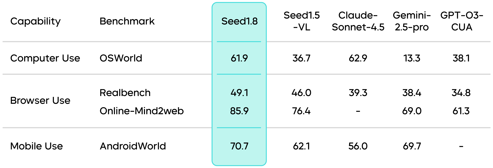
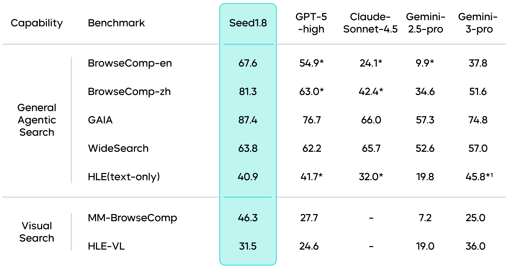
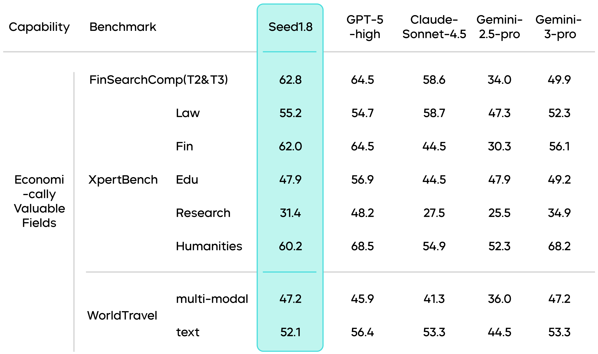

# Seed1.8 — 面向真实世界工作流的通用 Agent 模型

> [!tldr]
> Seed1.8 把主线目标从“强多模态模型”改成 **Generalized Real-World Agency**：统一 Search、Code Execution 与 GUI interaction，并用 no/low/medium/high 四档 thinking mode 控制延迟和成本。它的价值在于同时评估基础能力、工具执行、视觉 observation 与真实专业工作流。

## 四个设计目标

1. **Strong base**：保留语言、代码、数学、知识和视觉能力；
2. **Unified agent interface**：搜索、代码、GUI 使用统一交互协议；
3. **Cost-aware inference**：四档 thinking mode 与视觉 token 优化；
4. **Practice-aligned evaluation**：公共 benchmark 加金融、法律、旅行等高价值任务。

## Agent 能力不是单一分数

官方发布资料覆盖 GAIA、BrowseComp、GUI 与真实专业任务。后续 Model Card 报告 GAIA 93.2、BrowseComp-en 67.6、BrowseComp-zh 78.5。数字只有连同 harness 才有意义：搜索引擎、网页可访问性、工具错误处理、最大步数和采样策略都会改变结果。

BrowseComp 的 interaction scaling 很能说明问题：低推理配置在少于 50 步时约 45.0，中等推理约 55.0；放宽到最多 150 步后达到 67.6。它不是简单的“模型变聪明了”，而是显示**推理预算和环境交互预算共同决定成功率**。任何横向比较若不报告 step cap，都可能把预算差异误当能力差异。

GUI 任务需要视觉 grounding、动作选择、执行反馈和错误恢复。Seed1.8 把这些能力放在同一正代主线，而不是把截图先交给独立 VLM 再转写。

Model Card 在 ScreenSpot-Pro 上报告 64.3；加入 crop-box 工具后为 73.1。这 8.8 点增益恰好说明工具条件必须单列：crop-box 改善了局部视觉可读性，但它不是模型参数内生能力。OSWorld、RealBench、Online-Mind2Web、AndroidWorld 则分别考察桌面、网页与移动环境，不能用单一 grounding 分数替代端到端任务成功率。

## Thinking modes 与执行效率

四档 thinking mode 让同一模型在低延迟和深推理之间切换。它比“永远多想”更适合生产系统，但评测必须同时控制工具步数与 thinking tokens：否则模型可能通过更多搜索、更多代码执行换取分数，看不出真实效率。

| 模式 | 适合任务 | 主要失败模式 |
|---|---|---|
| no_think | 直接问答、格式转换、低延迟交互 | 难题上缺少规划与复核 |
| low | 短链推理、简单工具调用 | 复杂任务过早提交 |
| medium | 多步搜索、代码辅助、常规 Agent | 成本和成功率需要校准 |
| high | 高价值研究、困难 GUI、长程工作流 | 过度搜索、轨迹膨胀、错误累积 |

因此 thinking mode 不是四个静态“产品档位”，而是同一 policy 在不同预算下的行为面。理想系统应让难度估计、工具调用和停止条件联合优化。

## 专业工作流为何重要

Seed1.8 的评测延伸到金融、法律、旅行等任务，是从学术 benchmark 转向实际 Agent 的关键一步。这些任务的难点不是记忆更多知识，而是：从多来源收集证据、处理时效性、使用工具计算、保留引用，并把结果组织成可验收 artifact。

但内部或半公开专业任务也更难审计。一个可靠复测应保存网页快照、工具版本、完整轨迹、最终文件和 verifier 规则；否则只剩一个无法解释的成功率。

## 一张表看清证据

| 能力面 | 官方证据 | 可以得出的结论 | 不能直接推出 |
|---|---|---|---|
| Web Search | BrowseComp-en 67.6、zh 78.5 | 长程检索与证据整合较强 | 不同搜索后端下同样稳定 |
| General Agent | GAIA 93.2 | 多工具任务具备强完成能力 | 轨迹成本一定更低 |
| GUI grounding | ScreenSpot-Pro 64.3；crop-box 后 73.1 | 外部视觉工具可显著补足感知 | 73.1 全来自模型升级 |
| Hard reasoning | ZeroBench main 11.0 | 前沿难题仍有明显空间 | 榜单高分等于开放式科研能力 |

## 如何验收这一代

- 以相同搜索后端和 step cap 重跑 low / medium / high；
- 同时记录 reasoning tokens、工具调用数、wall-clock 和最终成功；
- GUI 结果分成“原图”“允许 crop-box”两栏；
- 对失败轨迹标注 perception / planning / tool / recovery；
- 专业任务必须保留引用、产物和可执行 verifier。

> [!insight]
> Seed1.8 最适合作为 interaction scaling 研究对象：固定模型，逐步放宽 reasoning tokens、搜索次数、代码执行次数和 GUI steps，绘制成功率—总成本曲线，而不是只报告无限预算下的最高分。

## 资料充分度与证据边界

- 2025-12 发布博客提供产品与 benchmark；更完整的 Seed1.8 Model Card 于 2026-03 发布，因此本页将两者合并阅读，但不新增一个重复正代节点。该组合足以支持较深入的 Agent 评测分析。
- 部分结果依赖 crop-box、浏览器/GUI harness 和内部专业任务；跨模型比较必须核对工具条件。
- 参数规模、训练 tokens 和完整 RL recipe 未充分公开。

## 一手资料

- [Seed1.8 官方发布博客](https://seed.bytedance.com/en/blog/official-release-of-seed1-8-a-generalized-agentic-model)
- [Seed1.8 Model Card](https://arxiv.org/abs/2603.20633)
- [[../2603_Seed1_8_Model_Card/Seed18-Model-Card-Towards-Generalized-Real-World-Agency|本地 Model Card 精读]]
- [[src/Official Source|本地来源索引]]
