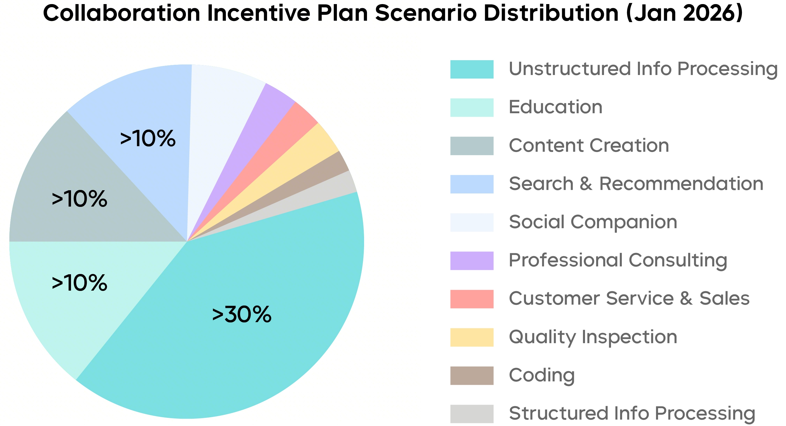
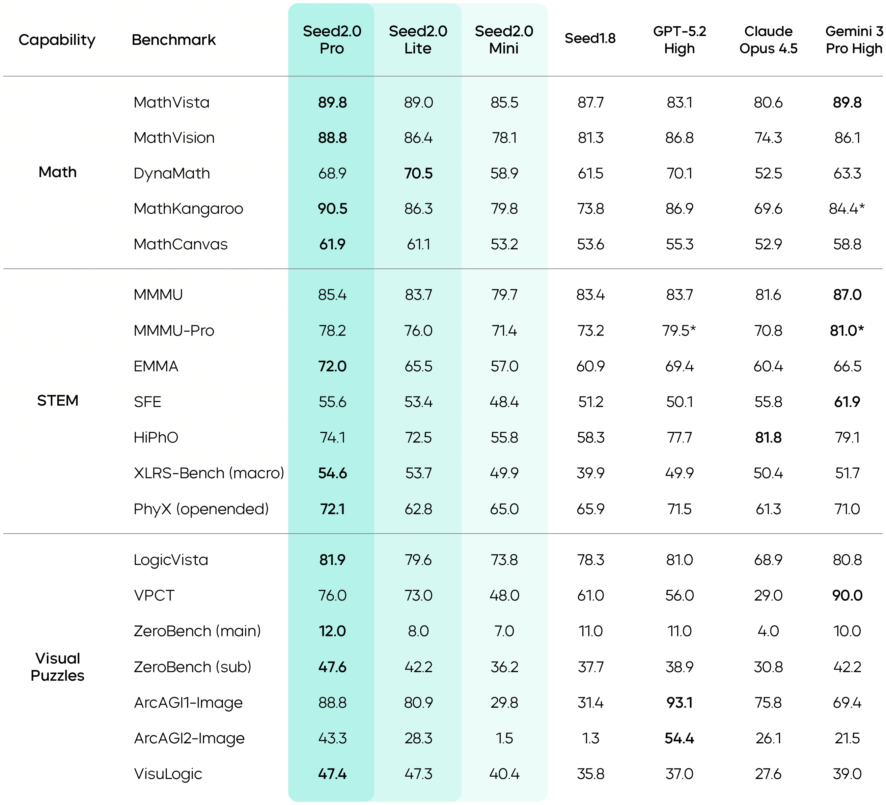
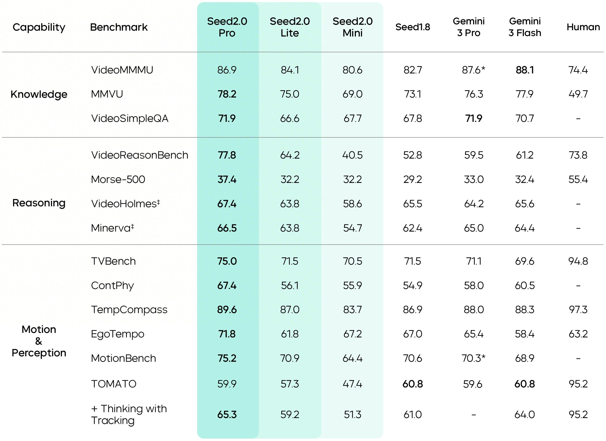

# Seed2.0 — Pro/Lite/Mini 组成的 Agent Foundation Family

> [!tldr]
> Seed2.0 将“Agent Foundation Model”做成三个生产档位：Pro 负责长链推理与复杂工作流，Lite 平衡质量和速度，Mini 优化吞吐与部署密度。主线能力同时覆盖多模态、搜索、编码、GUI 和真实长程任务；4 月升级后的 Lite 进一步统一视频、图像、音频和文本理解。

## 家族不是简单尺寸缩放

| 成员 | 官方定位 | 适合工作负载 |
|---|---|---|
| Seed2.0 Pro | 长链 reasoning、复杂流程鲁棒性 | 高价值研究、专业任务、长程 Agent |
| Seed2.0 Lite | 质量—速度平衡；后续升级 omni-modal | 通用生产服务、编码和多模态应用 |
| Seed2.0 Mini | 推理吞吐与部署密度 | 高并发、批生成、成本敏感 executor |

官方没有在网页上完整公开三者参数，因此不能根据 Pro/Lite/Mini 名称猜总参数或激活参数。

## 从 benchmark 到真实工作流

Seed2.0 的评测覆盖知识、推理、指令、SearchAgent、SkillsBench、GDPval、金融、SWE-bench、Terminal-Bench、多模态与 GUI。比单项冠军更重要的是，它尝试把研究级任务、CAD 操作、生物技术支持和代码修复纳入同一 Agent family。

### 代表性结果必须连同版本阅读

官方模型页持续更新，以下数字对应网页明确标注的 **Seed2.0 Lite（0428）**，不是三成员 family 的统一分数：

| 能力 | Benchmark | 官方结果 | 读法 |
|---|---|---:|---|
| 知识推理 | GPQA Diamond | 88.4 | 研究生级问答能力，不代表能完成研究流程 |
| 综合学科 | SuperGPQA | 69.6 | 学科广度较强，仍受题库形式约束 |
| 困难问答 | HLE no-tool text | 25.7 | 明确是无工具文本设置 |
| 搜索 | WideSearch / BrowseComp | 70.3 / 64.0 | 需核对搜索后端和 step budget |
| 深度研究 | ResearchRubrics | 59.2 | 更接近报告交付，但仍依赖 rubric |
| 专业工作 | SkillsBench / GDPval | 43.7 / 53.1 | 强调实际产物和职业任务 |
| 软件工程 | SWE multilingual / SWE-Bench Pro | 66.6 / 46.6 | 仓库、语言与执行环境不同 |
| 代码研究 | NL2Repo / PaperBench | 28.7 / 52.5 | 从需求或论文走向代码 artifact |
| 终端任务 | TerminalBench 2.0 | 43.3 | 终态验证比代码风格更关键 |
| GUI | OSWorld Verified / MobileWorld | 64.4 / 64.6 | 桌面和移动环境应分开比较 |

这些数字的价值是刻画能力面，而不是拼成一个平均分。特别是 Lite 在 4 月经历 omni-modal 升级，比较早期 2 月版或 Pro 时必须保留成员名与日期。

4 月版 Seed2.0 Lite 被官方称为 Seed 主线首个 omni-modal understanding 模型，可联合处理视频、图像、音频和文本。这种统一 observation 对长程 Agent 有价值：环境状态不必先由多个独立模型压成文本，但训练也更容易出现模态偏置和 reward 不一致。

## 三个真实工作流透露了什么

官方展示 CAD、生物技术研究与 Solovay–Kitaev 算法修复等案例。它们共同要求模型完成“理解任务 → 制定计划 → 调工具或写代码 → 运行 → 检查产物 → 修正”，而不是生成一次性答案。

- **CAD**：成功标准是几何/文件 artifact 是否满足约束，不是描述是否像设计师；
- **生物技术研究**：需要检索、证据整合和专业限制，引用与可追溯性比语气更重要；
- **算法修复**：需要读懂实现、定位缺陷、执行测试并用反馈迭代。

三类任务看似跨域，训练接口却很统一：环境状态、动作、artifact、verifier 和恢复轨迹。这正是“Agent Foundation Model”比“强聊天模型”更具体的含义。

## Agent Training 判断

> [!insight]
> Pro/Lite/Mini 最适合做“同 family 分层策略”：Pro 负责规划、困难验证与失败恢复，Lite 承担大多数交互，Mini 承担高频结构化动作。训练数据应记录何时升级模型，而不只是给每个角色固定分工。

Seed2.0 强调长程稳定性，但官网结果仍是特定 harness 下的终态指标。真正的训练审计还需要观察失败轨迹：错误来自 perception、planning、tool schema、执行器还是恢复策略。

### Family routing 不应写死

Pro/Lite/Mini 的合理用法不是把角色永久固定，而是训练一个可升级的路由：默认由 Mini/Lite 尝试，遇到低置信度、verifier 失败或环境异常时升级到 Pro；Pro 给出的计划也可交给更轻模型执行。这样才能把成本与可靠性放在同一个目标里。

建议记录四个路由信号：任务初始难度、过程中不确定性、verifier 失败类型、升级后的真实收益。如果升级只增加 token 而没有改善成功率，路由策略就是失败的。

## 如何验收这一代

1. 每个结果必须写明 Pro/Lite/Mini、日期版本、工具配置；
2. 长程任务同时报告首次成功率、恢复后成功率、环境步数与总 token；
3. omni-modal 任务按文本/图像/音频/视频组合分桶，防止平均分掩盖弱模态；
4. CAD、代码、研究报告分别使用可执行 artifact verifier；
5. 对 Pro/Lite/Mini 做动态路由消融，核算单位成功任务成本。

## 资料充分度与证据边界

> [!warning]
> Seed2.0 有官方模型页、Tech Blog 和 Model Card，足以支撑 family 定位、能力面和工作流分析；但参数、预训练 tokens、Agent RL 环境分布和 reward 细节仍未达到可复现技术报告的深度。本笔记可以做产品/训练判断，不能还原完整训练 recipe。官网会滚动更新，引用数字时必须保留模型成员与日期标签。

## 一手资料

- [Seed2.0 官方模型页](https://seed.bytedance.com/en/seed2)
- [Seed2.0 Tech Blog](https://seed.bytedance.com/en/blog/seed-2-0-official-launch)
- [Seed2.0 官方 Model Card（PDF）](https://lf3-static.bytednsdoc.com/obj/eden-cn/lapzild-tss/ljhwZthlaukjlkulzlp/seed2/seed2_model_card.pdf)
- [[../2605_Seed2_0_Model_Card/Seed2.0-Model-Card-Agent-Foundation-Model|本地 Model Card 笔记]]
- [[src/Official Source|本地来源索引]]
