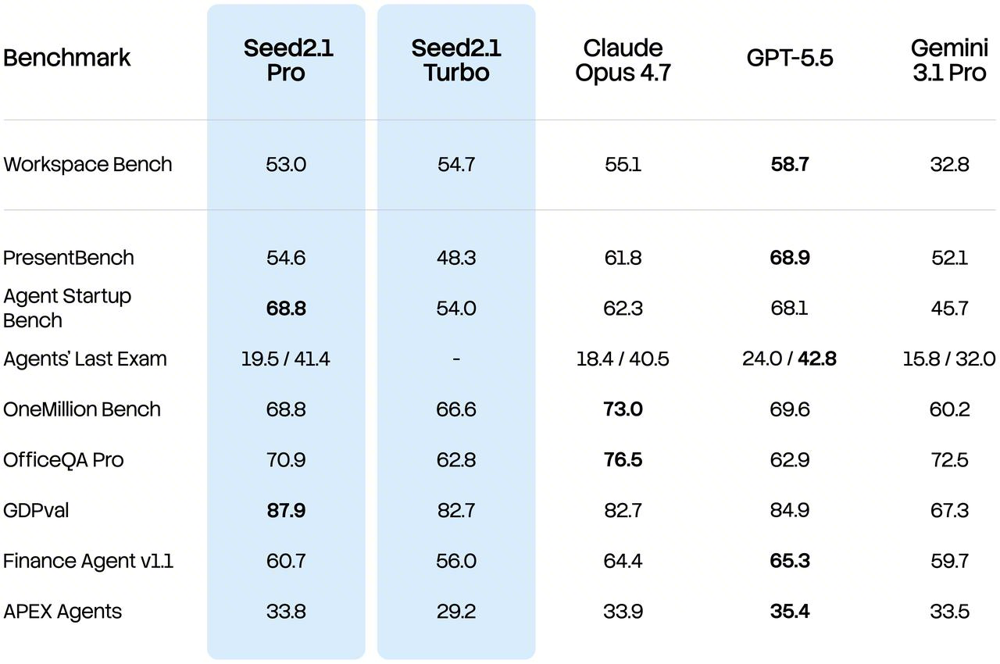
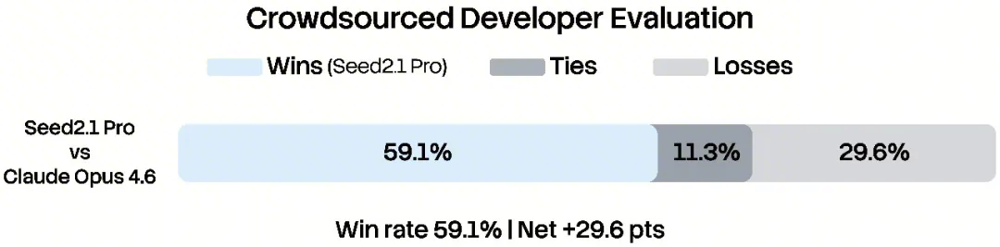

# Seed2.1 — 从通用 Agent 走向可交付生产力

> [!tldr]
> Seed2.1 的升级重点不是再定义“会用工具”，而是把 Agent 推向 **跨环境交付**：Pro 追求复杂任务与高价值场景，Turbo 追求更快执行；两者同时加强编码工程、知识推理、多模态理解、办公与真实科研计算。产品目标从展示 action 变为交付可验证结果。

## Pro 与 Turbo

| 成员 | 侧重点 | 训练/系统含义 |
|---|---|---|
| Seed2.1 Pro | 复杂推理、专业工作流、编码工程 | 更长规划、更强 verifier 与失败恢复 |
| Seed2.1 Turbo | 延迟与吞吐、通用生产任务 | 更严格的 token/step 成本约束 |

官方 2026-06-23 发布页强调 general agents 与 code engineering，并展示办公、咨询、科学计算和跨工具任务。它没有公开两者完整参数表，因此不猜测规模。

## 评测与案例怎么读

官方综合图覆盖知识、推理、多模态、Agent 与 coding。网页还给出 Code Arena Frontend 1539 / rank 8 的快照，并展示科学计算工作流：模型不仅生成解释，还要调用可执行计算并验证结果。

“可执行、可验证”是这一代最值得保留的关键词。对于研究或办公 Agent，最终答案的文风不是主指标；真正需要评估的是文件、代码、表格、计算结果和引用能否被外部 verifier 检查。

## 对 Agent Training 的启发

1. **Reward 走向 artifact-level**：由文件、测试、计算结果和任务终态给分；
2. **跨环境轨迹**：浏览器、代码解释器、办公软件的状态需要统一记录；
3. **Pro/Turbo 路由**：难度估计本身可以训练，失败后允许升级模型；
4. **长程可靠性**：不仅测首次成功，还要测环境异常后的恢复。

> [!insight]
> Seed2.1 代表 Agent 训练评价函数的迁移：从“回答是否像专家”转成“产物是否真的能用”。这要求 benchmark 保存环境、动作、artifact 与 verifier，而不是只保存最终文本。

## 资料充分度与证据边界

> [!warning]
> Seed2.1 当前一手材料以官方模型页和 Tech Blog 为主，案例与评测很丰富，但缺少公开参数、数据配方、RL 环境规模和系统消融。因此页面能达到高质量产品/Agent 分析标准，仍不能达到完整训练复现标准。

## 一手资料

- [Seed2.1 官方模型页](https://seed.bytedance.com/en/seed2_1)
- [Seed2.1 官方发布博客](https://seed.bytedance.com/en/blog/seed2-1-officially-released-advancing-ai-productivity)
- [Seed 官方模型索引](https://seed.bytedance.com/en/models?view_from=homepage_tab)
- [[src/Official Source|本地来源索引]]
