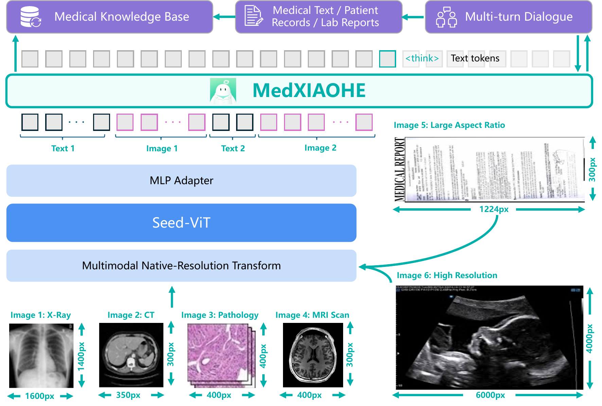
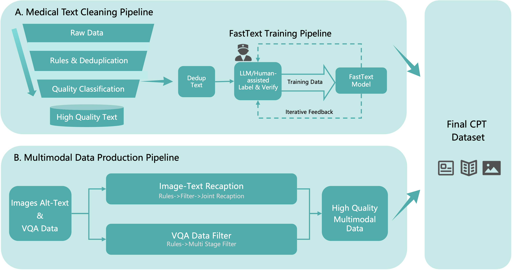
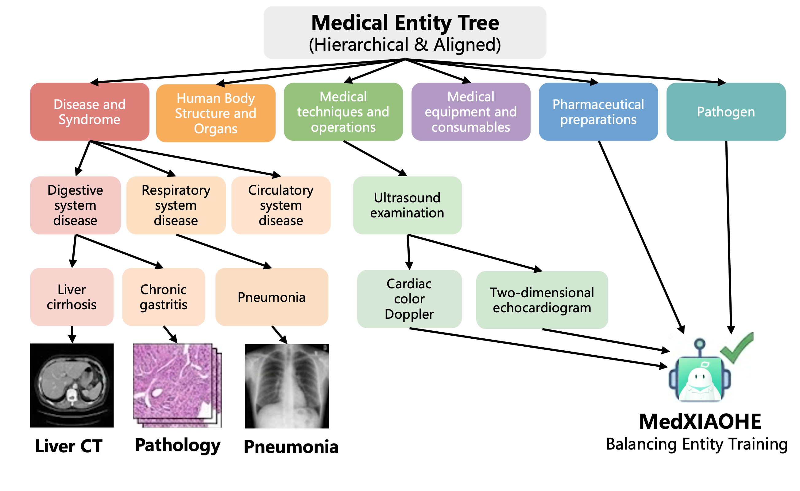
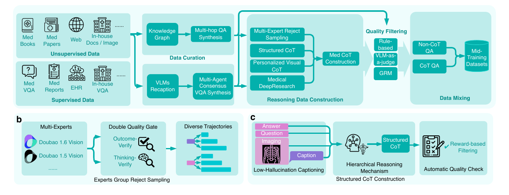
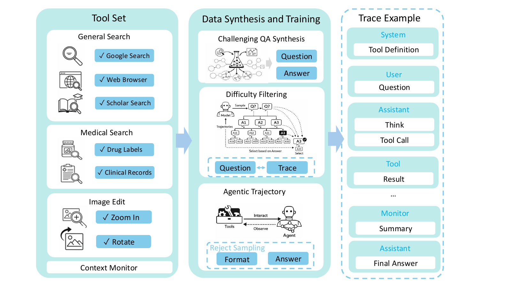
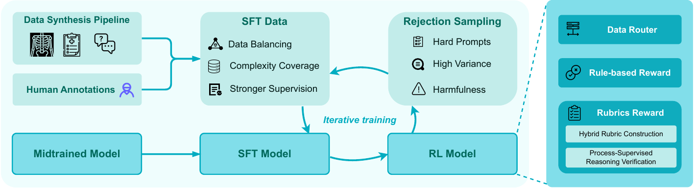
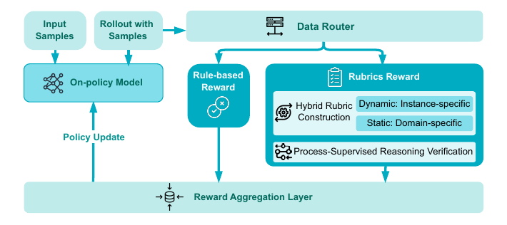

# MedXIAOHE — 数据、推理与可靠性训练

> [!tldr]
> MedXIAOHE 沿用 Seed 视觉语言基座，架构上没有另起炉灶；真正的贡献是一套完整训练 recipe：**640B tokens 的实体感知持续预训练、面向临床推理的 mid-training、工具增强轨迹、分层 reward，以及 RFT 与课程 RL 交替的后训练闭环**。它在 Seed 谱系中作为一个正常模型节点收录，不赋予额外“主线”标签。

## 一页判断

| 层次 | 关键做法 | 我的判断 |
|---|---|---|
| Architecture | Seed-ViT + multimodal connector + autoregressive LLM | 能力提升主要来自继续训练，而非结构创新 |
| Continual pre-training | 约 640B tokens；Medical Entity Tree 平衡长尾 | 把“知识覆盖”从模糊数据量变成可测对象 |
| Mid-training | KG 多跳、结构化 CoT、视觉 CoT、Agent 轨迹 | 在 SFT/RL 前先构造可验证推理先验 |
| Post-training | rule/rubric/process reward + safety gate | 不用单一 judge 覆盖所有任务 |
| RL curriculum | RFT → Foundation → Specialization → Alignment | 同时处理稀疏 reward、梯度冲突和熵塌缩 |
| Evaluation | 30+ 公共和内部 benchmark，统一 harness | 覆盖广，但内部集与公开集必须分开读 |

## 架构：不重新设计模型，重新设计训练过程

模型由 Seed-ViT、轻量多模态 connector 和自回归 LLM 组成，图像 token 与文本 token 进入统一 decoder。它可以在同一接口中处理长病史、指南、临床照片、医学影像、OCR 文档以及长报告，并保留多轮上下文。

报告明确说，MedXIAOHE 是在 Seed foundation model 上做 continual training，而不是重新发明架构。这个选择很务实：高风险垂直模型的主要瓶颈通常是领域数据质量、长尾覆盖、证据约束和后训练，而不是再增加一种 attention 模块。

参数规模、激活参数和训练算力没有公开，因此不能根据 Seed1.5-VL 推测其精确规模。

## 640B tokens：先治理，再谈领域 scaling

持续预训练语料约 640B tokens，报告给出了可核对的构成：

| 来源 | 规模 | 处理重点 |
|---|---:|---|
| 公共网页 | 310B tokens | 主题分类、更新 caption、两次去重、图文相关性过滤 |
| 授权医学书籍与论文 | 280B tokens | 扫描件 OCR、识别精度与细分类 |
| 临床病灶图像 | 28B tokens | 加强细粒度视觉诊断 |
| 开源数据集 | 22B tokens | 补充公开任务和模态覆盖 |

清洗流水线分成全局 hash 去重、规则过滤/规范化、模型质量过滤三层。医学 FastText 分类器通过“人工标注小批样本 → 初始分类器 → 强 LLM 二次核验 → 正负样本再训练”的自举循环迭代。

这里最值得借鉴的不是 640B 本身，而是来源质量与数量的反向关系：网页最大但最噪，授权书籍论文更小却更可靠。因此数据配比不能仅按 token 数决定。

## Medical Entity Tree：让长尾覆盖可测量

论文构造了五层、约 **140 万实体**的 Medical Entity Tree（MET），用途有三个：平衡实体训练、量化知识覆盖、定位稀疏领域并指导补数。

构建分三步：

1. 批量抽取实体，严格 JSON 输出；报告称相对逐句处理约加速 30×；
2. 实体类型化、embedding 聚类和层级归并；出现少于 10 次的实体、少于 5 个实体的类型会被过滤；
3. 将新实体增量挂接到冻结骨架，冲突项交给带检索的 ReAct Agent，以外部证据裁决并留下 reasoning/search log。

最终用 Aho–Corasick 自动机把数千万语料条目映射到实体树，约 20 小时完成，相比并行 LLM 扫描约加速 3×。MET 对临床知识集、Common Crawl 医学语料和 CMeKG 的 forward AMCS 分别为 0.96、0.95、0.97；更低的 backward AMCS（0.68、0.89、0.79）说明实体树包含不少基准未覆盖的长尾概念。

> [!insight]
> 这是比“再加一批领域数据”更可复用的方法：先建立 coverage map，再把训练失败映射到实体节点，才能区分模型不会推理，还是训练语料根本没有覆盖该知识。

## Mid-training：把原子能力组合成推理流程

### 内部推理数据

- **KG-guided QA**：从弱实体出发，在知识图谱上采样超过 5 hops 的路径，遮蔽中间属性形成复杂问题；再把问答实体与可靠路径对齐，生成可核验 reasoning trace。
- **Multi-expert reject sampling**：不同专家模型生成候选，Outcome-Verify 检查终点答案，Thinking-Verify 检查中间临床因果。
- **Reverse Structured CoT**：以 Understanding → Visual Observation / Knowledge Recall → Reasoning → Conclusion 四段约束生成过程，并检查是否偷看答案、逻辑是否成立、是否忠于图像。
- **Personalized Visual CoT**：区分视觉感知型任务与长链推理任务，避免冗长文字推理把模型注意力从细粒度图像上带走。

论文还披露了一个重要工程判断：医学视觉任务需要识别细微密度和病灶差异，因此 mid-training 会解冻 ViT，与语言模型联合优化；同时保留 general-domain replay，逐步提高推理数据比例，降低分布突变与灾难遗忘。

### Agentic reasoning

工具分为 General Search、Scholar Search、Visit、Search Drug、Search Clinical，以及图像 Zoom in / Rotate。训练问题来自 KG 多跳路径，并筛选为必须经过多步工具才有价值的样本。

影像 Agent 采用 Analyze–Reason–Conclude：先围绕解剖标志输出带 bounding box 的观察，再由这些可定位证据推出结论。工具数据还经过两层过滤：任务必须需要局部细节，而且加入工具后确实比无工具推理更好。这样能减少“为了训练 tool use 而强行调用工具”的伪轨迹。

## Post-training：reward 不是一个总分

SFT 使用专家标注与合成数据覆盖多种任务。进入 RL 前，团队优先选择当前 SFT 准确率在 **60%–80%** 的困难区域，并补入工具推理和多轮冲突样本：太容易的样本没有学习信号，完全不会的样本又难以获得正 reward。

分层 reward 包括：

- **Rule reward**：对可精确验证任务做集合、字符串或正则评分；
- **Rubric reward**：动态 rubric 理解当前上下文，静态 rubric 保留领域质量与用户体验标准；
- **Process supervision**：检查 `<think>` 的约束覆盖、逻辑稳健性和探索深度；
- **Safety gate**：一旦触发关键安全规则，整体 reward 直接归零；
- **Soft shaping**：对长度、格式等次级指标做连续调整，避免它们压过语义正确性。

### RFT-enhanced curriculum RL

论文观察到两种直接方案都不稳定：所有任务混训会产生梯度冲突和能力震荡；完全串行训练则会在简单任务上过度自信，导致 entropy collapse。解决方案是循环执行：

1. **RFT**：对每个样本采多条轨迹，把偶发成功蒸馏回监督数据；
2. **Foundation RL**：用短上下文和简单多模态样本稳定 reward；
3. **Specialization RL**：提高长程病例和高分辨率影像权重；
4. **Alignment RL**：重新注入通用与安全数据，恢复可塑性并防遗忘。

早期冷启动用逐步衰减的提示 scaffold，后期则监控策略熵，在过度确定时加入 entropy bonus。这里的核心不是“多阶段”三个字，而是 RFT 把稀疏成功变成稠密监督，RL 再探索新的成功，形成可循环的数据闭环。

## 评测：亮点与不能混读的地方

报告在 thinking mode、greedy decoding、Pass@1 条件下，与 GPT-5.2 Thinking、Gemini 3.0 Pro、Gemini 2.5 Pro 比较，并用统一 harness 汇总 30+ benchmark。

| 能力 | 代表结果 | 阅读结论 |
|---|---:|---|
| 公开视觉诊断 | MMMU_val-Med 87.53；MMMU_Pro-Med 73.88 | 综合医学图像理解较强 |
| 医学影像 | SLAKE 82.62；PATH_VQA 59.15；OmniMedVQA 83.40 | 多项领先，但 GMAI-MMBench/VQA_RAD/PMC_VQA 并非最佳 |
| 诊断与搜索 | RareBench 46.79；MedBrowseComp 29.00 | 长尾知识和搜索是明显强项 |
| 医学文本 | MedQA_USMLE 97.88；HealthBench-hard 46.10 | 知识与困难对话均有优势 |
| 长报告 | MIMIC-CXR 50.86；CheXpert Plus 49.43；IU-Xray 65.66 | 前两项领先，IU-Xray 仍落后 Gemini 3.0 Pro |
| 指令跟随 | MulDimIF 78.70；MedMTbench 63.75 | 多约束和长对话表现较强 |

同时必须标记三个边界：部分 VQA/Caption/OCR 是内部数据；因隐私策略变化，Gemini 3.0 Pro 没有跑这些内部集；不同论文的 prompt、解析和污染控制也可能不一致。统一 harness 改善了内部可比性，但不能自动消除内部数据不可复核的问题。

## 如何验收这个模型

- 按实体频次分桶，检查 rare/long-tail 增益是否来自 MET，而非总体数据量；
- 对同一视觉任务比较 short CoT、long CoT 与无 CoT，验证 perception–reasoning conflict；
- 工具任务同时报告无工具、允许工具、强制工具三组，检查工具是否真的必要；
- reward 消融分开移除 dynamic rubric、process reward、safety gate 与 RFT；
- 长报告使用实体级事实核验，分别统计遗漏、无依据新增和过度解释；
- 公共 benchmark 与内部集分栏，保留 prompt、解析器、解码和版本信息。

## 资料充分度与证据边界

> [!warning]
> 本页已基于完整技术报告和 LaTeX 源码精读，方法、训练和公开评测证据充分；但论文没有公开模型权重、参数规模、精确数据混合比例、训练算力及全部内部 benchmark。因此它达到技术报告精读标准，不等于可以复现训练，也不应把 benchmark 表现解释为可以独立提供临床诊断。

## 一手资料

- [Tech Report：arXiv 2602.12705](https://arxiv.org/abs/2602.12705)
- [BrainHao 中的完整 LaTeX 源码目录](https://github.com/linjh1118/BrainHao/tree/main/Topics/13_base_model/ByteDance_Seed/Variants/2602_MedXIAOHE/src)
- [中文 Poster](MedXIAOHE_poster_zh.html)
