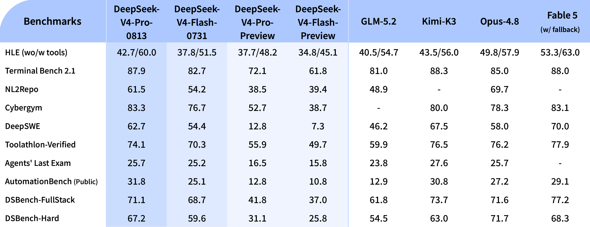

# DeepSeek-V4-Flash-0731

> [!tldr]
> **0731 不是普通日期补丁，而是正式替代四月 V4-Flash Preview 的新 checkpoint：模型仍是 13B activated 的 Flash 路线，但 agent 后训练出现跃迁，并把 DSpark speculative decoding 直接装进发行物。** 它甚至在官方 agent 表中全面超过 V4-Pro Preview，说明这里的主要变量是后训练与 agent harness 适配，而非参数规模。



> [!warning] 资料充分度：更新级完整，训练级不足
> 本页达到“正式 checkpoint 更新”的精读标准：官方给出了完整对照评测、reasoning 参数、vLLM/SGLang 部署与采样建议。**但它没有披露 0731 相对 Preview 的新增数据、RL 环境、reward、训练步数或消融，因此不能达到 GLM-5.3-Flash 那种从新基座到训练配方的完整技术深度。** 下文不会把未知的训练增益机制写成事实。

## 这次更新改变了什么

| 维度 | Flash Preview | Flash-0731 |
|---|---|---|
| 身份 | 四月预览 checkpoint | 七月正式 checkpoint，官方明确 supersede Preview |
| 主体规模 | 284B / 13B activated | 继承 Flash 路线，model card 未声称结构变化 |
| Agent 能力 | 首发水平 | 多个 coding / tool / automation benchmark 大幅跃升 |
| Reasoning | Non-think / High / Max | `low` / `high` / `max` 参数化控制更明确 |
| 推测解码 | 独立 DSpark 发行物 | checkpoint 自带 DSpark module |
| 长输出 | 1M context 家族能力 | High / Max 建议 max output 384K |

## 最重要的事实：小模型正式版打过了大模型预览版

| Benchmark | Flash-0731 | Flash Preview | Pro Preview | 0731 相对 Flash Preview |
|---|---:|---:|---:|---:|
| Terminal Bench 2.1 | 82.7 | 61.8 | 72.1 | +20.9 |
| NL2Repo | 54.2 | 39.4 | 38.5 | +14.8 |
| Cybergym | 76.7 | 38.7 | 52.7 | +38.0 |
| DeepSWE | 54.4 | 7.3 | 12.8 | +47.1 |
| Toolathlon-Verified | 70.3 | 49.7 | 55.9 | +20.6 |
| Agents' Last Exam | 25.2 | 15.8 | 16.5 | +9.4 |
| AutomationBench Public | 25.1 | 10.8 | 12.8 | +14.3 |
| DSBench-FullStack | 68.7 | 37.0 | 41.8 | +31.7 |
| DSBench-Hard | 59.6 | 25.8 | 31.1 | +33.8 |

这不是“所有通用能力都提升了”的证据，因为官方只公布了 agent 相关表；但它足以说明：四月 Preview 的参数规模不能代表七月的产品能力。特别是 DeepSWE 从 7.3 到 54.4，幅度大到不可能只归因于采样噪声。

## 我对跃迁来源的判断

官方没有公布训练配方，因此只能区分“证据”和“推断”：

- **确定**：checkpoint 已更换；官方称 agentic capabilities substantially enhanced。
- **确定**：代码 agent 用 minimal DeepSeek Harness、`max` reasoning、`temperature=1.0, top_p=0.95` 评测。
- **确定**：DSpark 已附着在 checkpoint 发行结构中。
- **推断**：增益很可能主要来自 agent-focused post-training、轨迹数据与 harness 对齐，而不是基础架构改造；model card 没有声称改变 284B/13B 主体结构。
- **未知**：训练是否继续使用 GRPO、是否加入 verifier reward、环境规模与失败轨迹如何构造。

因此更严谨的表述是“0731 证明后训练能让 Flash 越过 Pro Preview”，不能写成“某个已知 RL 算法带来了这些提升”。

## DSpark 与部署

0731 和早先 DSpark 包采用同一类结构：target model 与 draft/speculative module 放在同一 checkpoint 中。vLLM 的关键开关是：

```bash
vllm serve deepseek-ai/DeepSeek-V4-Flash-0731 \
  --trust-remote-code --kv-cache-dtype fp8 --block-size 256 \
  --data-parallel-size 4 --enable-expert-parallel \
  --moe-backend deep_gemm_mega_moe \
  --attention-config '{"use_fp4_indexer_cache": true}' \
  --speculative-config '{"method":"dspark","num_speculative_tokens":7,"draft_sample_method":"greedy"}'
```

SGLang 则使用 `--speculative-algorithm DSPARK`，且不要指定独立 draft model path，因为 draft 权重已经随 checkpoint 提供。这个区别很关键：把 DSpark 当成另一个完整模型加载，会错误增加部署复杂度。

## Reasoning 参数与提示格式

官方没有提供 Jinja chat template，而是用 `encoding` 目录处理 OpenAI-compatible messages。`reasoning_effort` 支持 `low`、`high`、`max`：

```python
prompt = encode_messages(
    messages,
    thinking_mode="thinking",
    reasoning_effort="max"
)
```

Agent 场景官方建议 `temperature=1.0, top_p=0.95`；其他本地任务可用 `top_p=1.0`。High / Max 建议允许最多 384K 输出。这里的“384K”是输出上限建议，不应误写成模型只有 384K context；V4 家族的 context 仍是 1M。

## 与同期模型的真实位置

Flash-0731 在 Terminal Bench 2.1 为 82.7，接近官方表中的 Opus-4.8 85.0；DeepSWE 54.4 对 58.0；Toolathlon 70.3 对 76.2。它进入 frontier 邻近区，但在 NL2Repo、Cybergym 和 DSBench-Hard 上仍有明显差距。

更重要的是，表中代码 agent 结果依赖尚待发布的 minimal DeepSeek Harness，DSBench 两项还是内部集合。因而该表最可靠的用途是比较 DeepSeek 自家 checkpoint，而不是宣称跨厂商绝对排名。

## 对 Agent Training 的启发

> [!insight]
> 0731 是一个很强的“同架构、不同后训练”自然实验。Agent 研究应把 Preview 与 0731 当作 paired checkpoints：在统一 harness 下比较轨迹长度、工具错误、恢复能力与 verifier 通过率，能比跨模型榜单更直接地定位 post-training 带来的行为变化。

建议重点记录：

1. 首次错误之后是否更会自我恢复，而不只是最终 solved rate。
2. `low/high/max` 三档生成 token、工具调用数与成功率的边际收益。
3. DSpark 开启前后的语义一致性、吞吐、接受率和长轨迹尾延迟。
4. Preview 与 0731 在同一失败任务上的 action-level diff。

## 一手资料

- [官方 Hugging Face model card](https://huggingface.co/deepseek-ai/DeepSeek-V4-Flash-0731)
- [DeepSeek-V4 Technical Report（arXiv:2606.19348）](https://arxiv.org/abs/2606.19348) — 解释 V4 family 架构；0731 没有另发 checkpoint 专属 report
- [[src/huggingface_model_cards/DeepSeek-V4-Flash-0731.md|本地 HF model card]]
- [[src/paper/main.tex|V4 technical report 源码（家族架构）]]
- [[DeepSeek-V4-Flash|Flash Preview 精读]]
- [[DeepSeek-V4|V4 family 总览]]

## 待补证据

- [ ] 等官方披露 0731 的训练数据、RL 环境、reward 与消融。
- [ ] 等 DeepSeek Harness 发布后复现公开 benchmark。
- [ ] 以统一硬件测 DSpark 接受率和端到端吞吐。
