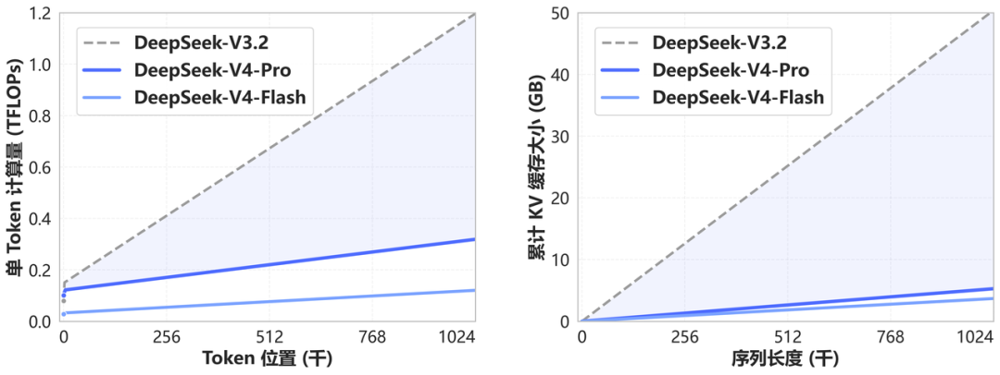

# DeepSeek-V4-Flash-DSpark

> [!tldr]
> **它不是新模型，也不是 Flash 的能力升级版，而是同一个 DeepSeek-V4-Flash checkpoint 加上 DSpark speculative decoding module 的部署发行物。** 该页的价值在于解释模型身份、推测解码路径和正确部署方式，不能把它画成新的训练代际。



> [!note] 资料充分度：发行物完整，不适用“独立基模精读”
> 官方明确写明 **not a new model**。因此它不存在独立的预训练、后训练和能力 benchmark 可供精读；若硬写成 GLM-5.3-Flash 那样的基模笔记反而会制造虚假信息。本页达到部署发行物说明标准，但不声称达到新 checkpoint 的训练精读标准。

## 先把身份说清楚

| 问题 | 答案 |
|---|---|
| 是新 checkpoint 吗 | 否，官方明确说与 V4-Flash 是 same checkpoint |
| 新增了什么 | 一个附着的 speculative decoding module |
| 会提升 benchmark 能力吗 | 官方没有这样声称；目标是加速 decode |
| 参数 / context | 沿用 Flash：284B total / 13B activated / 1M |
| 应放哪里 | V4 的推测解码支线，不进入主干模型时间线 |
| 后继关系 | 正式 [[DeepSeek-V4-Flash-0731]] 已把 DSpark 随主 checkpoint 发布 |

## DSpark 在推理链路中的位置

自回归生成通常每次只确认一个 token。推测解码让一个 draft/speculative module 先提出多个候选 token，再由 target model 验证；被接受的候选可以减少 target decode 的串行步数。

这里的关键不是另起一个大型 draft model。官方说明 target 与 draft 权重来自同一发行物，因此：

- vLLM 只需把 `method` 设为 `dspark`；
- SGLang 不应再传 `--speculative-draft-model-path`；
- 评估时要看 accepted tokens、吞吐和尾延迟，而不是假定“加模块一定等比例加速”。

## vLLM 的最小关键配置

```bash
vllm serve deepseek-ai/DeepSeek-V4-Flash-DSpark \
  --trust-remote-code \
  --speculative-config '{"method":"dspark","num_speculative_tokens":7,"draft_sample_method":"greedy"}'
```

`num_speculative_tokens=7` 表示每轮最多提出 7 个候选，`greedy` 是官方示例里的 draft sampling。最佳值会随硬件、batch、输出分布和 reasoning 长度变化，不能把示例超参当成普适最优。

SGLang 对应：

```bash
sglang serve \
  --model-path deepseek-ai/DeepSeek-V4-Flash-DSpark \
  --speculative-algorithm DSPARK
```

不要再指定独立 draft path；否则就偏离了这个发行物的结构。

## 为什么它对 Agent 系统重要

Agent 的成本常被工具执行时间掩盖，但在长 reasoning、代码生成和多轮修复里，decode 仍会积累成主要延迟。Flash 本身以 13B active 降低单 token 计算，DSpark 进一步减少串行 decode step，两者优化的是不同轴：

| 层面 | Flash 主体 | DSpark |
|---|---|---|
| 目标 | 降低每个 target token 的激活计算 | 一次 target 验证尽量接受多个候选 |
| 训练身份 | 基模 checkpoint | 附加推测模块 |
| 影响能力 | 决定能力上限 | 原则上保持 target 分布 |
| 主要指标 | accuracy、tokens/s、KV cache | acceptance、speedup、p95 latency |

## 应怎样验收 DSpark

> [!insight]
> 对 agent rollout，不要只报单流 tokens/s。真正有意义的是在相同任务成功率下，比较关闭/开启 DSpark 的端到端 wall time、GPU-hour、p50/p95 latency，以及不同轨迹阶段的接受率。

建议至少分开测：

1. 长自由 reasoning：候选可预测性可能较低。
2. 代码生成：局部模式更规则，接受率可能更高。
3. JSON/tool calls：格式规则强，但一个错误 token 会导致整段候选被拒。
4. 高并发 batch：draft 开销与 target 验证的重叠方式会变化。

## 证据边界

官方 model card 完整解释了“不是新模型”和推测模块身份，也给了家族架构与基准；但没有公开 DSpark 在不同硬件、batch、任务上的 acceptance、吞吐、显存与延迟曲线。因而本页不会写具体加速倍数。

## 一手资料

- [官方 Hugging Face model card](https://huggingface.co/deepseek-ai/DeepSeek-V4-Flash-DSpark)
- [[src/huggingface_model_cards/DeepSeek-V4-Flash-DSpark.md|本地 HF model card]]
- [DeepSpec 官方仓库](https://github.com/deepseek-ai/DeepSpec)
- [[DeepSeek-V4-Flash|Flash checkpoint 精读]]
- [[DeepSeek-V4|V4 family 总览]]

## 待补证据

- [ ] 在统一硬件测 accepted tokens / step、tokens/s 与 p95 latency。
- [ ] 比较 code、reasoning、tool JSON 三种输出分布。
- [ ] 验证与正式 Flash-0731 内置 DSpark 的结构和吞吐差异。
