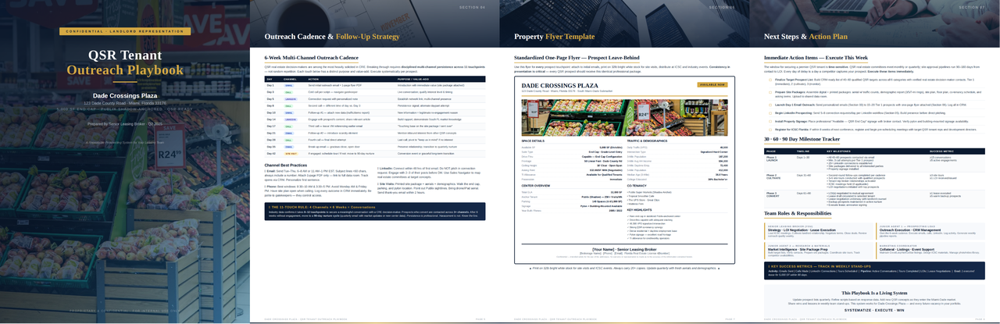

# DeepSeek-V4-Flash-Vision-Exp

> [!tldr]
> **Vision-Exp 是 DeepSeek-V4 家族第一个官方多模态实验 checkpoint：它在 Flash 主体上加入视觉模块并继续训练，在保住文本 agent 能力的同时，把图片/图表输入转化为 agent 可用的观察。** 它属于 V4 的多模态支线，而不是取代 Flash-0731 的文本主线。



> [!warning] 资料充分度：有限｜未达到完整技术精读标准
> 官方 model card 给出了定位、完整的文本/多模态 agent 表、仓库结构与最小推理覆盖范围，但**没有公开视觉编码器规模、视觉 token 化、图文数据量、continued training 配方、RL/verifier、上下文上限和消融**。因此这篇笔记能达到“实验 checkpoint 评测与使用说明”的标准，不能达到 GLM-5.3-Flash 那种架构—训练—部署全链路深度。原因是原始资料不足，而不是把缺失内容藏起来。

## 它确切增加了什么

官方只确认四件事：

1. 这是 V4 家族的 first experimental multimodal model。
2. 主体来自 DeepSeek-V4-Flash architecture。
3. 加入 visual modules，并经过 continued training 获得视觉理解能力。
4. 仓库最小推理实现覆盖 vision encoder、aligner、DFlash attention、MoE、Hyper-Connections 与 DSpark forward path。

这足以把它判为一个真正的新能力 checkpoint，而不是“用 OCR 工具包裹文本模型”；但不足以复原其视觉架构。HF collection 显示约 305B 参数，可作为发行规模线索，却不能据此精确拆出视觉模块参数。

## 文本能力有没有被多模态训练破坏

| 文本 Agent Benchmark | Vision-Exp | Flash-0731 | 变化 |
|---|---:|---:|---:|
| Terminal Bench 2.1 | 83.9 | 82.7 | +1.2 |
| NL2Repo | 57.7 | 54.2 | +3.5 |
| Cybergym | 75.3 | 76.7 | -1.4 |
| DeepSWE | 59.3 | 54.4 | +4.9 |
| Toolathlon-Verified | 75.9 | 70.3 | +5.6 |
| DSBench-Hard | 63.6 | 59.6 | +4.0 |
| AutomationBench Public | 25.7 | 25.1 | +0.6 |

从官方表看，continued multimodal training 没有造成系统性的 text-agent 退化，反而在多数 coding/tool 项上提升；Cybergym 小幅下降。更谨慎的说法是“官方口径下文本 agent 表现相当或更好”，不能据此推断所有纯文本能力都保持不变，因为没有知识、数学、写作等全面表格。

## 多模态增益集中在哪里

| 多模态 Benchmark | Vision-Exp | Flash-0731 | Opus-4.8 | 解释 |
|---|---:|---:|---:|---|
| ApexBench Pass@1 | 36.5 | 26.2† | 39.4 | 多模态复杂任务明显提升 |
| Agents' Last Exam | 27.3 | 25.2† | 25.7 | 官方表中超过该 Opus 口径 |
| Chartography | 64.3 | — | 65.0 | 图表理解 + 工具使用接近对照 |
| ZeroBench Pass@5 | 35.0 | — | 34.0 | 多次采样下达到强结果 |

† Flash-0731 在这两项里忽略输入中的多模态元素，所以不是公平 VLM 对照；它更像“没有视觉时会损失多少”的下界。

## Prompt 与仓库结构说明了什么

仓库同时接受 OpenAI-style JSON content blocks 与紧凑的 `<image>path</image>` 文本写法，两种示例编码后应得到相同 prompt 与 token IDs。`encoding/` 与 `inference/` 被刻意分开：提示格式不依赖 PyTorch，推理代码再显式引用 encoding。

```text
encoding/       OpenAI messages → model prompt
inference/      权重转换与最小 PyTorch 推理
  examples/     等价 TXT / JSON 视觉提示
config.json
generation_config.json
model.safetensors.index.json
tokenizer.json
```

这对可复现很有帮助：可以区分“输入编码错了”与“视觉前向错了”。但 minimal implementation 只是参考覆盖范围，不等于官方声明的高吞吐生产 serving。

## 目前不能回答的问题

- 视觉 encoder 是从零训练、继续训练还是继承某个已知模型？
- 图片如何切块、最大分辨率、视频输入与多图上限是多少？
- visual modules 与 Flash backbone 的参数占比和连接方式是什么？
- continued training 使用多少图文 token，包含哪些 agent trajectory？
- 是否有环境反馈 RL、视觉 verifier、grounding reward 或 OCR 专项数据？
- 文本能力改善来自新增 agent 数据，还是视觉训练本身的迁移？

这些不是笔记遗漏，而是截至 2026-08-31 官方材料没有披露。后续 technical report 出现后，应优先补这些问题。

## 对 Agent Training 的启发

> [!insight]
> Vision-Exp 的价值不只是“V4 能看图”，而是它保持了强文本 agent 主体，让我们可以研究 observation modality 的增量价值。最干净的实验是用 Flash-0731 与 Vision-Exp 做 paired comparison：相同任务、相同工具、只改变是否提供截图/图表，观察视觉信息究竟改善规划、验证还是错误恢复。

建议拆成三类轨迹：

1. 视觉是唯一证据，例如图表、截图、页面布局。
2. 视觉与 DOM/文本同时存在，测模型是否真正融合而非只读文本。
3. 视觉带来干扰或冲突，测 agent 是否会错误相信截图。

## 证据边界

官方分数使用 minimal DeepSeek Harness、Max effort、`temperature=1.0, top_p=0.95`。ApexBench 与 ALE 的文本基线会忽略图像，比较时必须保留脚注。Vision-Exp 是 experimental，不能默认其 API、权重格式或长期兼容性与主线正式版相同。

## 一手资料

- [官方 Hugging Face model card](https://huggingface.co/deepseek-ai/DeepSeek-V4-Flash-Vision-Exp)
- [[src/huggingface_model_cards/DeepSeek-V4-Flash-Vision-Exp.md|本地 HF model card]]
- [[DeepSeek-V4-Flash-0731|文本主线对照]]
- [[DeepSeek-V4|V4 family 总览]]

## 待补证据

- [ ] 等视觉架构与 continued training 报告。
- [ ] 补齐输入分辨率、视觉 token、视频与多图限制。
- [ ] 用同一多模态 agent harness 复测 paired checkpoint。
