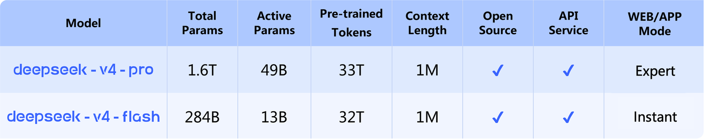
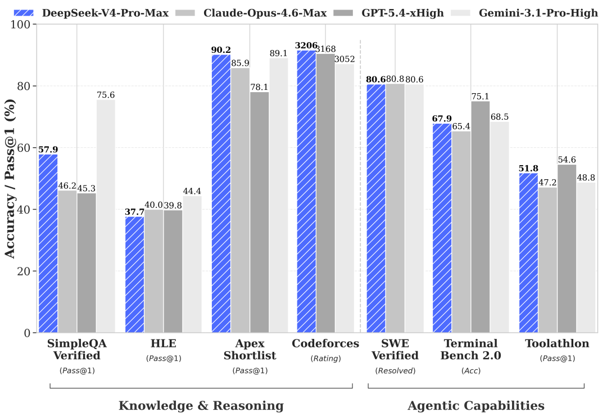

# DeepSeek-V4-Pro-Base

> [!tldr]
> **Pro-Base 是 V4 最大的开放预训练 checkpoint：1.6T 总参数、49B 激活、1M context、FP8 mixed。** 它展示了 V4 架构在没有对话与 agent 后训练时的知识、代码和长上下文底座，适合继续训练研究；它不是 Pro-Max，也不应直接用正式 Pro 的 agent 分数描述。

> [!failure] 资料充分度：不足｜未达到完整精读标准
> **这篇笔记没有达到 GLM-5.3-Flash 的完整标准。官方 HF 仓库没有 README/model card，保存下来的仓库元数据里 `cardData` 和 `config` 也为空；只有 family model card / technical report 的共用架构描述、规格行与 base benchmark。** 因此无法写出 checkpoint 专属配置、部署、完整训练配方与独立图片，只能把可靠证据和缺口明确分开。

## 可确认规格

| 维度 | 已确认信息 |
|---|---|
| 参数 | 1.6T total / 49B activated |
| 架构 | MoE；V4 family 的 CSA + HCA、mHC |
| Context | 1M tokens |
| 权重精度 | FP8 Mixed |
| 预训练规模 | family 共用披露为 >32T tokens |
| HF 创建时间 | 2026-04-22 |
| 家族发布时间 | 2026-04-24 |
| 用途 | 继续预训练、后训练、蒸馏与基座研究 |

## 为什么 Base 值得单独保留

正式 Pro 的强 reasoning / agent 能力来自预训练基座和后训练的叠加。若只保存 Instruct，就无法回答：

- 1.6T 参数本身带来多少知识收益？
- GRPO 与 on-policy distillation 主要改善 reasoning 还是工具行为？
- LongBench 的增益来自 architecture/pretraining，还是后训练策略？
- Flash 与 Pro 的差距在 Base 阶段已经有多大？

所以 Pro-Base 虽不进入普通用户的主线产品节点，却是理解 V4 scaling 的关键实验对照。

## Base 结果显示“容量收益”在哪里

| Benchmark | V3.2-Base | Flash-Base | Pro-Base | Pro 对 Flash |
|---|---:|---:|---:|---:|
| MMLU | 87.8 | 88.7 | 90.1 | +1.4 |
| MMLU-Pro | 65.5 | 68.3 | 73.5 | +5.2 |
| MultiLoKo | 38.7 | 42.2 | 51.1 | +8.9 |
| SimpleQA-Verified | 28.3 | 30.1 | 55.2 | +25.1 |
| FACTS Parametric | 27.1 | 33.9 | 62.6 | +28.7 |
| HumanEval | 62.8 | 69.5 | 76.8 | +7.3 |
| MATH | 60.5 | 57.4 | 64.5 | +7.1 |
| LongBench-V2 | 40.2 | 44.7 | 51.5 | +6.8 |

Pro-Base 相对 Flash-Base 的最大优势集中在事实知识：SimpleQA 与 FACTS Parametric 分别高 25.1、28.7 分。LongBench-V2 与复杂知识项也更强。这与 Instruct 阶段的观察一致：更多 reasoning tokens 能缩小代码/数学差距，但难以完全补回参数中不存在的知识。

不过 Pro-Base 也不是全表绝对领先：MGSM 84.4 低于 Flash-Base 85.7，CMath 90.9 低于 93.6。规模增大不保证每个 benchmark 单调提升，且单表不能替代对训练数据与方差的分析。

## 与 Pro Instruct 的边界

| 后训练能力 | Pro-Base | Pro |
|---|---|---|
| 领域专家 SFT / GRPO | 不应假定包含 | 官方披露包含 |
| on-policy distillation | 不应假定包含 | 官方披露包含 |
| Non-think / High / Max | 不应假定支持 | 支持 |
| Chat encoding | 无独立说明 | 官方提供专用 encoding |
| Agent benchmark | 没有 | 有完整官方表 |

“Base”不是能力更弱的 Chat SKU，而是训练阶段不同的 checkpoint。直接拿 chat prompt 调用可能产生不可控续写，不能据此评价模型基座质量。

## 对 Agent Training 的启发

> [!insight]
> Pro-Base 与 Flash-Base 提供了少见的同架构双规模基座对照。可以固定同一份 agent SFT/RL 数据，观察 13B active 与 49B active 在样本效率、知识保持、长轨迹稳定性和 reward hacking 上的差异。

最值得跟踪的不是最终最高分，而是：

1. 达到同一 solved rate 分别需要多少 RL rollout token。
2. 小基座是否更依赖 teacher distillation，大基座是否更能从 sparse reward 自学。
3. 领域专家合并时，大模型是否更少发生能力干扰。
4. 单位 GPU-hour 与单位 serving 成本下谁更合适。

## 当前无法完成的部分

- 没有仓库独立 README / model card，无法确认精确层数、专家数、routing 与完整 config。
- family 的 >32T 不等于已公开 Pro-Base 独立 token 数与数据配比。
- 没有 Base 专属训练曲线、ablation、部署 recipe 或 checkpoint 图片。
- 没有官方说明怎样把 Base 安全地转换为 chat / agent 系统。

## 一手资料

- [官方 HF 仓库（无 README/model card）](https://huggingface.co/deepseek-ai/DeepSeek-V4-Pro-Base)
- [[src/huggingface_repository_metadata/DeepSeek-V4-Pro-Base.json|本地 HF 仓库元数据]]
- [[src/huggingface_model_cards/DeepSeek-V4-Pro.md|V4 family 官方 model card]]
- [[src/paper/main.tex|V4 technical report 源码]]
- [[DeepSeek-V4-Pro|Pro Instruct 精读]]

## 补齐条件

- [ ] 官方发布 Base model card / config 后补结构与使用。
- [ ] 若公布数据与训练细节，补预训练全链路分析。
- [ ] 在统一后训练预算下做 Flash-Base / Pro-Base 对照。
