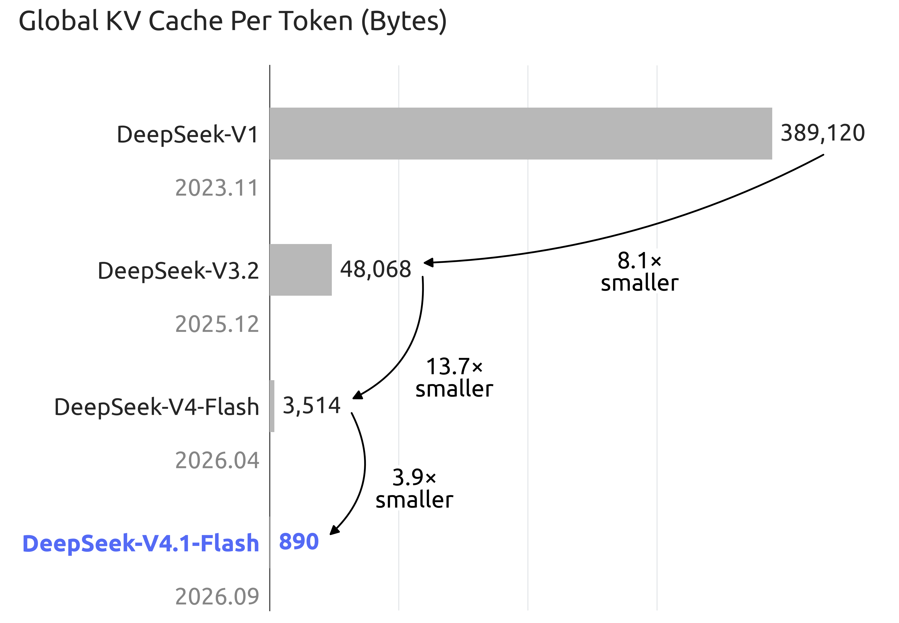

# DeepSeek-V4.1-Flash — KV Cache Compression for Million-Token Agents

> [!success] 资料充分度：充足｜达到完整精读标准
> 本笔记已逐项核对官方 HF Model Card、完整 Tech Report、官方架构图与评测表；正文中的架构、训练规模、KV 压缩和 benchmark 数字均可回溯到本目录 `src/` 的一手资料。

> [!tldr]
> **V4.1-Flash 不是 V4-Flash 的小修版，而是一次围绕“超长输入 agent 的真实服务成本”重构的 552B 多模态 MoE。** Causal Encoder–Decoder、CSA2、FP4 KV 与 bounded replay 把全局 KV 压到 890 bytes/token，约为 V4-Flash 的 1/4；模型以 45T multimodal tokens 从头训练，支持 1M context、最高 256K+ 输出建议和 1–100 连续 reasoning effort。我的判断：它把 DeepSeek 的竞争焦点从单纯 active parameters 推向了 **prefill、KV 常驻成本与长轨迹可持续性**。

## 老板速览

| 问题 | 结论 |
|---|---|
| 为什么是新主干叶子？ | 官方独立发布权重、模型卡与 Tech Report，并更换为 `deepseek_v41` 架构。 |
| 最大工程变化？ | 以 CED + CSA2 + FP4 KV 把 1M context 的 KV 存储和重复索引成本压下来。 |
| 能力形状？ | Terminal-Bench 2.1、DeepSWE、CyberGym、工具增强 HLE 很强；Terminal-Bench 3/4 仍明显落后 Opus 5。 |
| 适合什么？ | 输入很长、工具轨迹很长、需要反复读取仓库或文档的 agent workload。 |
| 不能误读什么？ | “Flash”是效率定位，不代表所有 benchmark 都比 V4-Pro 更强；跨厂商数字仍受 harness 影响。 |

## 谱系与规格

| 字段 | 官方披露 |
|---|---|
| 发布时间 | 2026-09-10 |
| 架构 | Multimodal MoE + Causal Encoder–Decoder |
| Backbone | 552B parameters |
| 激活参数 | Prefill 8B/token；decode 16B/token |
| Transformer | 40 layers：20-layer causal encoder + 20-layer decoder |
| Experts | 1 shared + 384 routed；每 token 激活 6 routed experts |
| Conditional memory | Engram 196B parameters，按 token lookup 稀疏访问 |
| 训练数据 | 45T multimodal tokens，从头训练 |
| 上下文 | 最高 1M tokens；官方建议 `max_tokens ≥ 256K` |
| 推理控制 | `reasoning_effort` 1–100 连续可调 |
| 输入 / 输出 | 图像 + 文本输入；文本自回归输出 |
| 许可 | MIT |

V4.1-Flash 的名字容易让人只看“Flash”，但官方首次把视觉编码器从预训练开始与文本共同训练，也给出了新的 prompt encoding、权重、推理实现和可复现实验说明。它应当作为 V4 之后的新架构节点，而不是 0731 checkpoint 的日期更新。

## 架构：四层压缩链

### 1. Causal Encoder–Decoder（CED）

前 20 层作为 causal encoder，后 20 层作为 decoder。decoder 的 global KV 不再由每一层 decoder hidden states 分别产生，而是从 encoder 最终 hidden states 投影得到。直接后果是：

- prefill 只激活约 8B 参数/token；
- decode 约 16B 参数/token；
- 输入占比极高的 coding / research agent，不再为每层重复保留同规模 global KV。

### 2. CSA2：跨层共享稀疏索引

Compressed Sparse Attention 2 把 attention layer 固定分成 **Full / Reindex / Reuse** 三种模式。主 KV、indexer K 和 Top-K indices 可以跨层共享；decoder 里的 hierarchical sparse indexer 又把后续检索限制在首个 Full layer 产生的候选池中，使深层索引成本不再随完整上下文线性膨胀。

### 3. FP4 main KV + SWA bounded replay

主 KV 用 E2M1 FP4，每 16 channels 配一个 E4M3 scale。对 sliding-window attention，模型不把全部 SWA KV 落 SSD，而只 replay 最近 `n_win` tokens 重建缺失状态。两者叠加后：

| 代际 | Global KV / token | 相对 V4.1 |
|---|---:|---:|
| DeepSeek-V1 | 389,120 bytes | 约 437× |
| DeepSeek-V4-Flash | 3,584 bytes | 约 4× |
| **DeepSeek-V4.1-Flash** | **890 bytes** | 1× |

### 4. mHC、Engram 与 DSpark

- **Single-Pass mHC**：重做 residual-stream mixing，并提供 Mega-mHC kernel。
- **Engram**：196B conditional-memory parameters，不参与每 token dense compute，而以 token lookup 稀疏访问。
- **DSpark**：半自回归 draft generation + confidence-scheduled verification，用于 speculative decoding。

这四层设计的共同目标不是“让一个 token 更聪明”，而是让百万 token 轨迹在真实硬件上更能被服务。

## 训练：模型算法稳定，环境数据扩张

预训练在 45T multimodal tokens 上从头进行；34T tokens 时开始把 context 延伸到 1M，并以 64K sequence 训练 sparse attention。视觉侧使用从头训练的 DeepSeek-ViT、2D-RoPE、3×3 pixel-unshuffle 和两层 MLP projector。

后训练仍是 **SFT → RL → on-policy distillation**，官方强调没有算法层面的新花样，主要改变来自数据 pipeline：大规模自动合成 agent tasks / environments，并渐进扩大数据、任务和 rollout。这个表述对 agent training 很有价值：V4.1 的 agent 增益更像环境与轨迹规模化，而不是新 RL loss。

## 评测：长轨迹执行强，但不是全面第一

以下均为官方 model card 在 `reasoning_effort=100` 下报告的 instruct 结果。

| Benchmark | V4.1-Flash | V4-Flash | V4-Pro | 观察 |
|---|---:|---:|---:|---|
| Terminal-Bench 2.1 | **90.6** | 82.7 | 87.9 | 长终端任务显著跃迁 |
| Terminal-Bench 3.0 | **30.0** | 7.6 | 11.8 | 大增，但低于 Opus 5 的 43.3 |
| Terminal-Bench 4.0 | **31.2** | 7.0 | 12.4 | 大增，但低于 Opus 5 的 51.8 |
| DeepSWE v1.1 | **74.2** | 54.4 | 62.7 | 官方表中略高于 Opus 5 的 74.0 |
| NL2Repo-Bench | **64.0** | 54.2 | 61.5 | 仓库级理解继续上升 |
| CyberGym | **88.1** | 76.7 | 83.3 | 官方表中最高 |
| HLE with tools | **63.9** | 51.5 | 60.0 | 工具增强研究任务突出 |
| AutomationBench | **54.8** | 37.7 | 43.2 | 业务自动化显著上移 |
| Agent's Last Exam | **31.8** | 25.2 | 25.7 | 长轨迹 agent 改善 |

### Harness 不是脚注

DeepSWE 和 Terminal-Bench 2.1 还比较了 Claude Code、Codex、OpenCode、Pi、mini-SWE 与 DeepSeek Harness。V4.1 在不同 scaffold 下分数明显变化，例如 DeepSWE 从 65.5–74.2，说明结果属于 **model × scaffold × budget**，不能只把最高值写成裸模型能力。

## 对部署与评测的建议

1. 先测“每个严格成功任务的 KV + token + 工具成本”，而不是只测 tokens/s。
2. 把 64K、256K、1M 三档上下文分开，观察 bounded replay 和 cache 压缩是否真的降低 P95 latency。
3. coding agent 同时用 mini-SWE、Claude Code 与自己的 harness，避免被单一 scaffold 排名绑架。
4. 连续 effort 不应只测 1 和 100；建议以 10/30/60/100 画 success–cost Pareto 曲线。
5. 多模态任务要单列视觉输入 token、OCR / grounding 错误和工具调用后的最终状态。

## 资料边界

> [!info]
> 资料足够达到 Tech Report 级笔记：官方公开了权重、完整模型卡、独立 Tech Report、两张核心图、编码实现、推理代码与部分评测复现说明。仍未完整披露 45T 数据配比、所有 RL 环境、训练算力与关键消融，因此本文不对这些空白作推测。

## 一手资料

- [🤗 HF Model Card](https://huggingface.co/deepseek-ai/DeepSeek-V4.1-Flash)
- [📄 Tech Report](https://huggingface.co/deepseek-ai/DeepSeek-V4.1-Flash/blob/main/DeepSeek_V41_Tech_Report.pdf)
- [[src/HF_Model_Card|HF Model Card 本地 Markdown]]
- [Tech Report 本地 PDF](src/DeepSeek_V41_Tech_Report.pdf)
- [[src/Source Index|本地来源索引]]

## 导航

- [[Topics/13_base_model/Base Model MOC|Base Model MOC]]
- [中文 Poster](deepseek_v4_1_flash_poster_zh.html)
