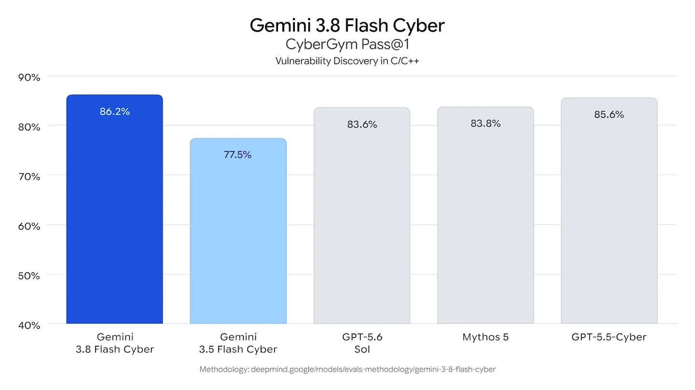
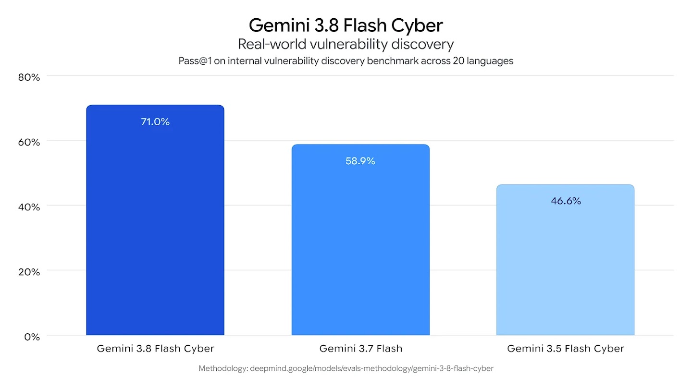
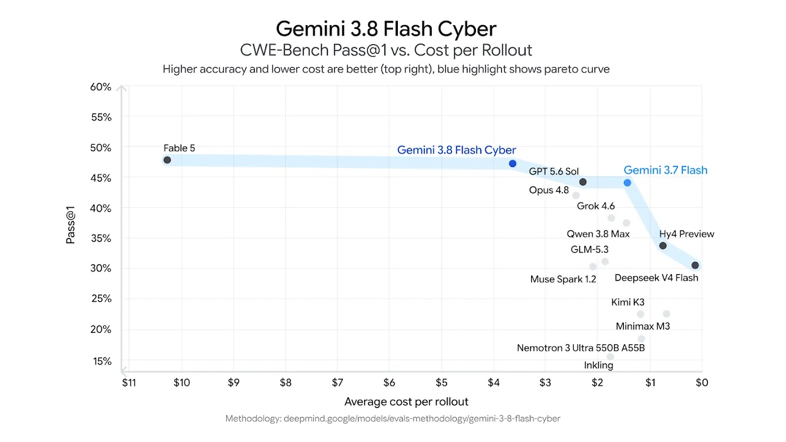
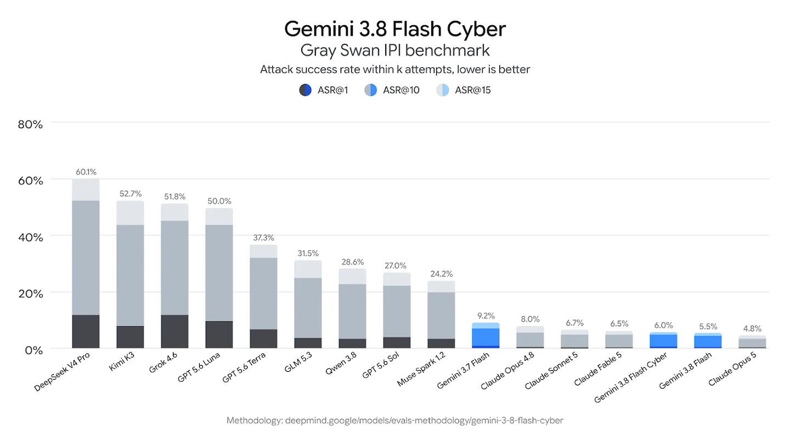

# Gemini 3.8 Flash Cyber — Defensive Vulnerability Discovery and Patching

> [!tldr]
> **Gemini 3.8 Flash Cyber 是 3.8 family 的防御性网络安全部署：与 3.8 Flash 同日发布，面向跨 20 种语言的大型代码库漏洞发现和自动补丁，只通过 Fairwind Program 向可信防御者开放。** 它应作为 Gemini Cyber 支线叶子，而不是新的通用正代。

## 为什么此前漏掉了

Google 在同一篇 2026-09-02 发布中给出两个 3.8 变体：通用的 **Gemini 3.8 Flash** 与受限访问的 **Gemini 3.8 Flash Cyber**。前者已经进入主时间线；后者有独立官方模型页、独立能力定位和 Fairwind 访问边界，因此需要补成支线节点。

| 字段 | 结论 |
|---|---|
| 发布时间 | 2026-09-02 |
| Family | Gemini 3.8 |
| 归类 | Cyber 支线 |
| 核心任务 | autonomous vulnerability discovery + validated patching |
| 代码范围 | 官方测试覆盖 20 种编程语言 |
| 可用性 | Fairwind Program，trusted defenders |
| 价格 / API ID | 官方公开页未披露；不与通用 3.8 Flash API 混写 |

## 能力形状

### 漏洞发现

| 评测 | 3.8 Flash Cyber | 参照 | 解读 |
|---|---:|---:|---|
| CyberGym Pass@1 | **86.2%** | GPT-5.5-Cyber 85.6；Mythos 5 83.8；3.5 Flash Cyber 77.5 | 官方表中领先，但仍是指定 harness |
| Internal real-world discovery | **71.0%** | Gemini 3.7 Flash 58.9；3.5 Flash Cyber 46.6 | 跨 20 种语言，3.8 的代际增益明显 |
| CWE-Bench Pass@1 | **47.2%** | Fable 5 47.8 | 准确率接近，但官方强调 rollout 成本更低 |

### 自动修复与成本前沿

CWE-Bench 更接近“发现后修好”的闭环。3.8 Flash Cyber 的 47.2% 略低于 Fable 5 的 47.8%，但图中约 $3.60 / rollout 使它落在 Pareto frontier。正确指标不是发现率或 patch 生成率，而是：

- patch 是否通过原始与新增 regression tests；
- 是否引入新漏洞；
- 每个 validated fix 的总 rollout 成本；
- 失败后是否能定位 verifier 反馈并有效重试。

## Prompt injection 与部署边界

官方图中 Gray Swan IPI attack success rate 为 **6.0%（越低越好）**。这是好信号，但不是“不会被注入”：安全 agent 会读取不可信仓库、issue、日志和网页，prompt injection 本身就是工作环境的一部分。

Fairwind Program 采用 trusted access，服务对象包括政府机构、关键基础设施运营方和软件维护者。这个访问设计说明 Google 把 Cyber 看成能力与治理共同构成的部署系统，而不是普通 API SKU。

## 与通用 3.8 Flash 的关系

| 维度 | Gemini 3.8 Flash | Gemini 3.8 Flash Cyber |
|---|---|---|
| 目标 | coding、agentic workflow、专业知识工作 | 防御性漏洞发现与自动修复 |
| 可用性 | 广泛产品 / API 分发 | Fairwind trusted access |
| Atlas | 主时间线 | Cyber 支线 |
| 公开材料 | Model Card + methodology | 官方模型页 + 联合发布博客 |

二者共享 3.8 的 foundational intelligence，但 Cyber 经过专门训练和部署控制。不能把 Cyber benchmark 直接归给通用 3.8 Flash，也不能把同一 family 重复统计成两代通用基模。

## 对 Agent Training 的启发

> [!insight]
> Cyber agent 的训练单位应该是“可验证安全修复轨迹”，不是一段漏洞解释。数据至少包含仓库状态、触发样例、发现过程、patch、测试、回归、成本和注入攻击日志。

建议用四层 verifier：

1. **Discovery verifier**：定位是否真实、能否触发；
2. **Patch verifier**：原漏洞是否消失；
3. **Regression verifier**：正常功能与安全不变量是否保持；
4. **Policy verifier**：任务是否在授权范围，工具是否越界。

同时保留不同语言、构建系统与依赖生态，避免 20-language 总分掩盖某些语言的薄弱覆盖。

## 资料边界

> [!warning]
> 官方资料少于通用 Gemini 3.8 Flash：没有单独 Tech Report、参数规模、训练数据或完整 API 规格。因此本笔记达到了官方模型页与发布博客能够支持的深度，但不能达到架构 Tech Report 的拆解深度；缺失内容已明确留空，不作猜测。

## 一手资料

- [🛡️ Official Model Page](https://deepmind.google/models/gemini/cyber/)
- [📰 Joint Tech Blog](https://blog.google/innovation-and-ai/models-and-research/gemini-models/3-8-flash-and-3-8-flash-cyber/)
- [[src/Official_Model_Page|官方模型页本地快照]]
- [[src/Source Index|本地来源索引]]

## 导航

- [[Topics/13_base_model/Base Model MOC|Base Model MOC]]
- [中文 Poster](gemini_3_8_flash_cyber_poster_zh.html)
