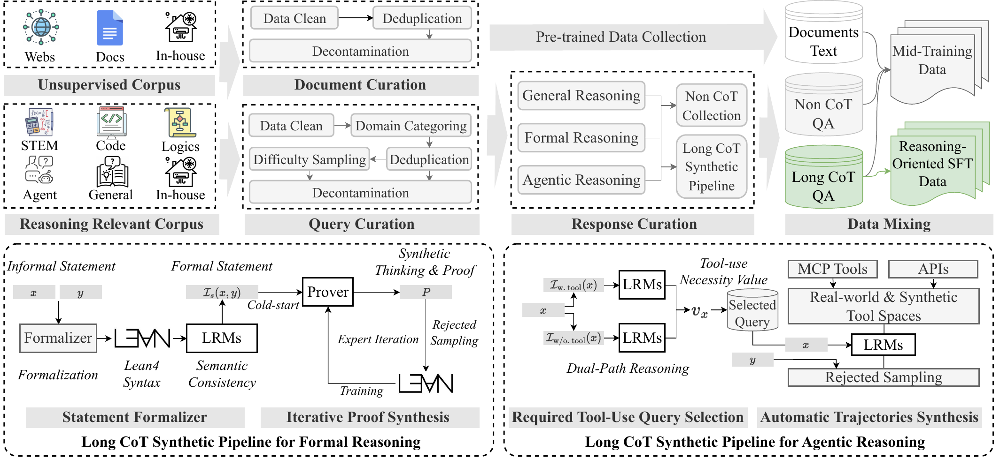
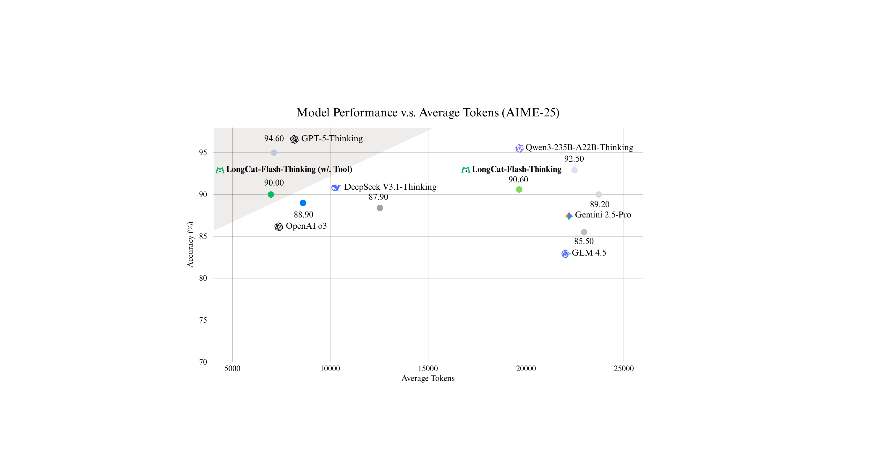

> [!tldr]
> 美团 LongCat 系列的**第一个 reasoning model**：在 [[2509_LongCat_Flash|LongCat-Flash]] 这个 560B MoE / 27B activated 的 non-thinking 基座上，叠加**长 CoT cold-start（mid-training + reasoning-oriented SFT）+ 大规模 RL** 这套两阶段范式。三个真正的核心贡献：(1) **Domain-Parallel RL**——把 STEM / Code / Agentic 三路解耦并行训练、再用 task-vector normalization + DARE dropout + SCE erase 三步融合成近 Pareto-optimal 单模型，绕开 mixed-domain RL 的 negative transfer；(2) **DORA (Dynamic ORchestration for Asynchronous rollout)** RL 系统——streaming rollout + 多版本 actor + elastic colocation，在数万张卡上比同步训练快 >3×，RL 投入占 pre-training compute 的近 20%；(3) **agentic efficiency 副产品**：AIME-25 平均 token 从 19,653 降到 6,965（-64.5%），精度不降。MiniF2F pass@1 = 67.6%（开源 SOTA，超 DeepSeek-V3.1 18 个百分点）。和 Flash 相比，它没有改架构，只是把同一基座"激活"成 reasoning model；后续 [[2601_LongCat_Flash_Thinking_2601|Thinking-2601]] 进一步把 agentic / tool-use 推到更深。

## 1. 问题与动机

[[2509_LongCat_Flash|LongCat-Flash]] 提供了一个高效基座（560B MoE / 27B activated），但有两个被作者明确点名的局限：

1. **基座本身 long CoT pattern 稀缺**——通用预训练语料严重偏向 general text，即便 STEM / code 子集里，显式的"分步推理 trace"也是稀缺的；mid-training 阶段如果直接做 SFT + RL，模型只会产生 homogeneous reasoning pattern（推理浅、不会反思、撞墙就死），RL 后劲不足。
2. **大规模 RL 在工业级 MoE 上极难稳定**——synchronous 训练被最长输出拖死（skewed generation），disaggregated 架构 device idleness 严重，asynchronous 又有 staleness + engine numerical gap 双重 distribution drift，会迅速 collapse。

再加上 mixed-domain RL（STEM / Code / Agentic 一起训）的 **negative transfer**——三域 response length 分布差异极大（论文 Figure domain_train_length_dis 直接画出来），混训会让训练不稳定且效率低下。

LongCat-Flash-Thinking 的目标就是用一套 **mid-training → reasoning SFT → domain-parallel RL → fusion → general RL** 的完整 pipeline，把这个 560B 基座"激活"成在数学、代码、agent、formal proving、safety 全方位能打的 reasoning model，同时 RL 训练成本可控（DORA）。

## 2. 方法核心思路：Cold-Start + Domain-Parallel RL

整个 pipeline 是五步：**Mid-training → SFT → Domain-Parallel RL → Model Fusion → General RL**。前两步是 cold-start，后三步是大规模 RL。

### 2.1 Mid-training: Reasoning Capability Enhancement

动机很清楚——基座的 reasoning boundary 太窄。作者在一个 in-house 小 MoE 上做了消融（Figure base_model_passk），把 mid-training 里 reasoning-intensive 数据占比加大，结果在三个 benchmark 上从 pass@1 到 pass@128 全面提升：

| Benchmark | pass@1 提升 | 高 k 提升（pass@64 / pass@128） |
|-----------|---:|---|
| AIME-24 | +27.7% | 显著放大 |
| BeyondAIME | +9.3% | 显著放大 |
| LiveCodeBench (24.08-25.05) | +6.5% | 显著放大 |

关键观察：**reasoning 数据加比例的提升在高 k（pass@64/128）上更猛**，说明 mid-training 真的"撑开了 reasoning boundary"而不只是让 top-1 更准。这是后续 RL 能挖出更多潜力的关键。

数据构造要点：
- STEM：数学 / 物理 / 化学问题，academic archives + textbooks + proprietary，重点采 **competition-level** 难题，过滤掉 fact-retrieval 型。
- Code：聚合开源 OJ / 程序设计竞赛数据。
- 关键的 **mixing ratio 调控**：把 reasoning-intensive 数据按一定比例掺回原 mid-training corpus，避免 catastrophic forgetting of generalist capabilities。
- 质量控制：heuristic rules + LLM-as-Judge 做 filtering / dedup / decontamination。

### 2.2 Reasoning-oriented SFT

SFT 阶段不仅做 general reasoning，还专门分出 **formal reasoning（Lean4）** 和 **agentic reasoning（tool use）** 两条独立流水线——这是后面 domain-parallel RL 的种子。

**(a) General Reasoning**
- Prompt curation：三阶段过滤（initial screening by LLM-as-Judge → ground-truth validation via model voting → difficulty filtering by expert model pass rate），保留中等以上难度且 ground truth 可信的题。
- Response generation：rejection sampling，LongCat-Flash-Chat 当 generator，rule-based + model-based 联合打分选最佳。
- 训练：AdamW, lr=3e-5, 2 epochs, context=48K。

**(b) Formal Reasoning（Lean4 ATP pipeline，论文一大亮点）**
论文专门设计了 expert-iteration pipeline：
1. **Statement Formalization**：8B autoformalizer 把 informal 自然语言题翻译成 Lean4 formal statement；两阶段过滤——syntax filtering（Lean4 Server v4.15 编译 `:= by sorry`）+ semantic filtering（model-based 检查语义漂移）。
2. **Cold-start Prover Training**：用现有 theorem-proving 工具筛出可证的 statement → 用 model-based synthesis 给每个 (statement, proof) 补一段 natural language thinking process → 形成 (statement, thinking, proof) 三元组 → SFT 一个初始 prover。
3. **Expert Iteration**：当前 prover 攻击仍未解的 statement → 新成功证明加入数据集 → 同步合成 thinking → 从头重训 prover。固定轮次自改进循环。

这套 pipeline 是 LongCat-Flash-Thinking 在 MiniF2F 上能到 **pass@1 = 67.6%**（开源 SOTA，超 DeepSeek-V3.1 的 49.6% 整整 18 个百分点）的根本原因。

**(c) Agentic Reasoning（Dual-Path Query Selection）**

核心 insight：现有 agent 数据集很多是"伪需求"——模型不用工具就能答。这种数据训不出真 agent。

作者的 **dual-path evaluation**：
- 对每个 query $x$，让 baseline 模型在 **w/o tool** 和 **w/ tool** 两种 template 下各采 N 条 trajectory。
- 用 LLM-as-Judge 算两边的 pass rate：$s_{\text{w/o. tool}}(x)$ 和 $s_{\text{w/. tool}}(x)$。
- 定义 **tool-necessity value**：$v_x = s_{\text{w/. tool}}(x) - s_{\text{w/o. tool}}(x)$。
- 只保留 $v_x > \tau_1 \land s_{\text{w/. tool}}(x) > \tau_2 \land s_{\text{w/o. tool}}(x) < \tau_3$ 的 query——也就是"没工具做不出 + 有工具能做出来"的真 agentic 题。

Trajectory 合成：搭一个支持 MCP server + 单/多轮 simulated tool 的 versatile environment，强模型生成候选 trajectory，多模型 judge 选最优，再按 #tool-call / dependency / reasoning depth 分层 curriculum。

### 2.3 Domain-Parallel RL（核心方法贡献）

这是这篇论文真正的方法创新点。背景观察：mixed-domain RL（STEM+Code+Agentic 混在一起训）会出现 **negative transfer**——三个域的 response length 分布差异巨大（论文 Figure domain_train_length_dis），导致 batch 内 distribution shift 剧烈，asynchronous 训练下尤其不稳。

**三步方案**：

**Step 1: Domain-Parallel Training**——三域独立训出三个 expert：

| 域 | Context | 关键设计 |
|----|---------|---------|
| STEM RL | 固定 64K | curriculum learning：逐步降低 pass-rate 阈值（题越来越难）+ 动态调 PPO clip $\varepsilon_{\text{pos}_{\text{high}}}$ 防爆炸 |
| Code RL | 48K → 56K → 64K 三段 | 当生成 90 分位长度逼近当前上限就 expand 一次 context |
| Agentic RL | 固定 48K | 强制 `<longcat_think>` + `<longcat_tool_call>` 结构化标签 + tool-call format reward（语法对就给小奖励，保证多轮稳定可解释） |

每个域都用独立的 query curation：STEM 排掉 multi-part / 选择题 / 判断题；Code 把 test case 标准化为 input-output 格式；Agentic 聚焦"需要复杂推理 + 工具"的数学题，每条带 grading rubric。

**Step 2: Model Fusion**——把三个 expert 合成一个：

借鉴 TIES / DARE / SCE 的工作，对每个 expert 计算 task vector $\tau_i = \theta^i_{\text{RL}} - \theta_{\text{SFT}}$，然后三步：
1. **Normalization**：normalize $\tau_i$ 的 magnitude，平衡三域贡献。
2. **Dropout (DARE)**：对 delta 参数做 dropout，prune redundant。
3. **Erase (SCE)**：擦除 minority-direction 更新的参数元素。

最终 single fused model 在所有 benchmark 上接近三 expert 的最优（见 Figure model_fusion_results）。

**Step 3: General RL Fine-Tuning**——fused model 之后再做一轮 general RL（creative writing、instruction following、safety 数据），防止 fusion 后通用能力 / 安全性退化。

> [!insight] Domain-Parallel + Fusion 的真正价值
> 这套方法的核心不在"分域训"（sequential training 也能做），而在 **"分域训完之后还能 fuse 成一个近 Pareto-optimal 单模型"**——这才是工程意义上能部署的形态。它解决了 RL 领域一个长期痛点：mixed-domain RL 的 negative transfer 在 async 场景下尤其严重（batch 内分布漂移叠加 policy staleness），但分域训完不 fuse 又会丢失 cross-domain synergy。task-vector normalization + DARE dropout + SCE erase 这套融合技术把"训 N 个专家、部署 1 个模型"变成可能，思路比 mixture-of-experts（路由层面融合）更轻、不需要改推理架构。

> [!insight] RL 算法层面的"工程级"修改
> 在 GRPO 基础上做了四项针对性修改，每项都对应一个明确的失败模式：(1) **去掉 KL loss**——$k_3$ estimator 梯度 biased，阻碍 substantial policy update；(2) **token-level loss + global max-len 归一化**（follow DR-GRPO）——解决 length bias；(3) **triplet clipping**（follow DAPO + Tencent MoBA）——$\epsilon_{\text{neg}_\text{low}}$、$\epsilon_{\text{neg}_\text{high}}$、$\epsilon_{\text{pos}_\text{high}}$ 三段，防止 MoE routing 跨版本变化导致的 negative-advantage 大方差崩溃；(4) **truncated importance sampling**——explicitly 处理 inference engine 与 train engine 的 numerical gap。这四条都不是 paper-level 创新，但是把工业级 async RL on MoE 的稳定性问题做了完整 diagnosis。

## 3. RL 系统：DORA（Dynamic ORchestration for Asynchronous rollout）

DORA 是这篇技术报告的另一块核心贡献，主要解决两个 RL infra 老大难问题：

### 3.1 要解决的两个问题

1. **RL scheduling**：disaggregated 架构（生成和训练分设备）→ device idleness 严重；colocated 架构（共享设备）→ generation（memory-bound）和 training（compute-bound）异构负载互相拖累。
2. **Skewed generation**：sync training 整个 batch 等最长输出，长 CoT / agent 场景尤其致命；async partial rollout 早期方案有 re-prefilling 开销大 + 单条 response 跨 policy 版本不一致的 convergence 隐患。

### 3.2 DORA 架构

**两组设备**：
- **Standalone Generator Group**：专做 rollout 的 inference engine 池。
- **Elastic Role Group**：可在 Generator / Reference-Actor / Reward-Critic 之间弹性切换的设备池。

**Streaming Rollout + 多版本 actor**：
- Inference engine 同时维护最多 staleness 个 policy weight 版本（demo 里 staleness=2，最多 3 版本同时在线）。
- 一条 response 由**同一版 actor 完整生成到底**，避免 segment 级 policy 不一致（这是 partial rollout 的痛点）。
- 完成的 sample 立即 stream 给下一阶段，不等最长那条。
- 超出 staleness 阈值的 in-flight sample 被丢弃重新调度（demo 里 prompt 10/12 被丢），但 KV-cache 可以 reuse / transfer，不浪费计算。

**Elastic Colocation**：训练阶段时 Elastic Group 切到 training 角色，Standalone Group 切到 training engine 帮忙重算 log-prob（弥补 inference / train engine 的 numerical mismatch），训练完了再切回 inference 继续生成。**near-zero bubble**。

### 3.3 大规模工程优化

- **Massive Streaming RPC**：基于 PyTorch RPC 改造，TCPStore 加 group-key primitive + 数据压缩，把控制面通信复杂度从 $O(N^2)$ 降到 $O(N)$；用双向 streaming RPC 替代 unary RPC，支持高性能 async rollout 流式传输。
- **Efficient MoE Parallelism**：560B 模型 expert parallelism degree 很高，host-side kernel launch overhead 会引起执行 desync；用 graph-level compilation 降低 kernel dispatch 频率，把通信和计算 overlap，**rollout 加速 1.5×**。

**最终效果**：DORA + 大规模优化 = 同步训练的 **>3× speedup**，跑在数万张 accelerator 上，RL 投入占 pre-training compute 的近 **20%**——这是非常重的 RL 投入。

### 3.4 训练算法配套（让 async 稳定）

为配合 DORA 的 async 特性，作者在 GRPO 之上做了多项算法改造（见前面 insight 列举的四点），以及三个 efficient training strategies：

- **With-replacement Online Filtering**：流式生成阶段删掉 acc=0 或 acc=1 的 prompt，保留稳定 challenging 的样本；sampling-with-replacement（不同于 dynamic sampling 的 without-replacement）允许 oversample 重生成。
- **Staleness Control**：最大 staleness 作 interruption 策略；oversample 的样本进 replay buffer，按 reuse-ratio 和新样本混合（要 shuffle）。
- **Incomplete-Signal Masking**：sandbox 报错 / 截断没被识别为 repetition 的样本直接 mask，保 reward 信号可靠。

### 3.5 Reward System

- **Non-verifiable**（creative writing / knowledge QA）：discriminative reward model，LongCat-Flash SFT checkpoint 起步，人类 + 模型联合标注 preference 训。只评 answer 部分，不看 CoT 过程。
- **Verifiable STEM**：**Generative Reward Model (GenRM) with reasoning process**——不是简单的 rule-based equal，而是带推理过程的判别模型。在人工标注测试集上：rule-based 80.9% → non-reasoning GenRM 94.0% → reasoning GenRM **98.8%**。能处理 $a^2 - b^2$ 等价 $(a+b)(a-b)$ 这类语义等价。
- **Verifiable Code**：分布式 code sandbox，支持 20+ 语言百万级并发，async interface + once-compilation multi-run + 压缩 + cache sharding。

## 4. 实验结果

主表（Leaderboard_wjn.tex，Table main_results）覆盖 8 大类共 20+ benchmark，对比 DeepSeek-V3.1-Thinking (671B/37B)、Qwen3-235B-A22B-Thinking、GLM-4.5 (355B/32B) 三个开源强敌，以及 OpenAI-o3、Gemini2.5-Pro、GPT-5-Thinking 三个闭源对手。

### 4.1 总表关键数字（LongCat-Flash-Thinking 560B / 27B activated）

| 类别 | Benchmark | LongCat-Flash-Thinking | 对比 |
|------|-----------|---:|---|
| General QA | MMLU-Pro | 82.6 | 略低于 Qwen3-235B (84.4) / Gemini2.5 (86.7) |
| General QA | MMLU-Redux | 89.3 | 略低 |
| Alignment | IFEval (strict) | 86.9 | 低于 Gemini (92.4) / GPT-5 (92.8) |
| Alignment | Arena-Hard (hard prompt gemini) | 69.9 | 中等 |
| Math | MATH-500 (Mean@1) | **99.2** | 并列第二（GPT-5 99.2、Qwen3 99.6 第一）|
| Math | HMMT-25 (Mean@32) | 83.7 | 第二（GPT-5 84.8 第一）|
| Math | AIME-24 (Mean@32) | **93.3** | 第二（DeepSeek-V3.1 / Qwen3 均 93.9 并列第一）|
| Math | AIME-25 (Mean@32) | 90.6 | 第三（GPT-5 94.6、Qwen3 92.5）|
| Math | BeyondAIME (Mean@10) | 69.5 | 第三（DeepSeek-V3.1 71.8 第一）|
| General Reasoning | GPQA-Diamond (Mean@16) | 81.5 | 中等（GPT-5 84.4 第一）|
| General Reasoning | ZebraLogic (Mean@1) | 95.5 | 第三（Qwen3 97.5 第一）|
| General Reasoning | **Sudoku-Bench (Mean@1)** | **56.0** | 第三，但远超 DeepSeek-V3.1 (1.0)、Qwen3 (2.0)、GLM-4.5 (1.0) |
| General Reasoning | **ARC-AGI (Mean@1)** | **50.3** | 第二（GPT-5 59.0 第一），超 o3 (47.3)、Gemini2.5 (46.8) |
| Coding | LCB 24.08-25.05 (Mean@4) | **79.4** | 第二（GPT-5 80.6 第一），开源最佳 |
| Coding | OJBench (Mean@1) | **40.7** | 第二（Gemini2.5 41.6 第一）|
| Agentic | SWE-Bench (Pass@1) | 59.4 | 中等（GPT-5 74.9、o3 69.1 领先）|
| Agentic | BFCL V3 (full) | 74.4 | 第三（GLM-4.5 79.1、Qwen3 75.7）|
| Agentic | $\tau^2$-Bench-Retail (Mean@4) | 71.5 | 第三（GPT-5 81.1 第一）|
| Agentic | **$\tau^2$-Bench-Airline (Mean@4)** | **67.5** | **第一**，超 GPT-5 (62.6)、o3 (62.5)、GLM-4.5 (66.0) |
| Agentic | $\tau^2$-Bench-Telecom (Mean@4) | **83.1** | 第二（GPT-5 96.7 第一）|
| Agentic | VitaBench | 29.5 | 第二（o3 35.3 第一）|
| **Formal ATP** | **MiniF2F-Test Pass@1** | **67.6** | **第一**，超 DeepSeek-V3.1 (49.6) **18 个百分点** |
| **Formal ATP** | **MiniF2F-Test Pass@8** | **79.4** | **第一**，超 DeepSeek-V3.1 (74.4) |
| **Formal ATP** | **MiniF2F-Test Pass@32** | **81.6** | **第一**，超 DeepSeek-V3.1 (79.5) |
| Safety | Harmful | **93.7** | 第一（Qwen3 84.3 第二）|
| Safety | Criminal | **97.1** | 第一（Qwen3 92.7 第二）|
| Safety | Misinformation | **93.0** | 第一（DeepSeek-V3.1 81.1 第二）|
| Safety | Privacy | 98.8 | 并列第二（Qwen3 / o3 100 第一）|

**判断**：
- 在 27B activated（小于 DeepSeek-V3.1 的 37B、Qwen3-235B 的 22B、GLM-4.5 的 32B 但模型本身小）的情况下，**数学 / 代码 / agent / formal / safety 多项第一或第二**。
- 三个明显的优势区：(1) **MiniF2F formal proving 全面碾压开源对手**（这是 cold-start SFT 的 expert iteration pipeline 直接转化出来的）；(2) **Sudoku-Bench / ARC-AGI 等 puzzle / 抽象推理远超开源对手**；(3) **Safety 四个子项三项第一、一项并列第二**。
- 弱项：General QA（MMLU-Pro / MMLU-Redux）和 Alignment（IFEval / Arena-Hard）相对靠后——这正是 cold-start 阶段把重心放在 reasoning 上的取舍。

### 4.2 Agentic Token Efficiency（另一核心卖点）

Figure token_efficiency0922 显示：在 AIME-25 上启用 tool use（agentic reasoning），LongCat-Flash-Thinking 把平均 token 消耗从 **19,653 降到 6,965（-64.5%）**，**精度不掉**。

> 这是这篇论文另一条值得单独记一笔的结论：**agentic system 不一定要靠"模型自己想得更长"来变强，把一部分推理 offload 到外部工具反而更省**。对成本敏感的部署（agent 长跑、高并发）直接受用。

### 4.3 Reward Model 准确率（小表但重要）

| Reward Model | Accuracy（人工标注集） |
|--------------|---:|
| Rule-based | 80.9% |
| Non-Reasoning GenRM | 94.0% |
| **Reasoning GenRM (Ours)** | **98.8%** |

→ 直接证明 GenRM 带 reasoning process 比 rule-based 强 17.9 个百分点，这是 RLSTEM 训练信号可靠性的关键。

### 4.4 推理配置

LongCat-Flash-Thinking 推理参数：temperature=1.0，topk=-1，topp=0.95。AIME / HMMT 用 Mean@32，MATH-500 用 Mean@1，GPQA-Diamond 用 Mean@16，Sudoku / ZebraLogic / ARC-AGI 用 Mean@1，代码 LCB 用 Mean@4，agentic $\tau^2$-Bench 用 Mean@4。

## 5. 与 Flash 的关系

| 维度 | [[2509_LongCat_Flash\|LongCat-Flash]] | LongCat-Flash-Thinking |
|------|------|------|
| 模型规模 | 560B / 27B activated MoE | **完全相同**（继承架构） |
| 架构创新 | Zero-Computation Experts + ScMoE + Variance Alignment | **无新架构**，直接用 Flash 基座 |
| 训练目标 | non-thinking foundation | 长思维链 reasoning model |
| 关键 pipeline | 2-stage pretrain + mid-training + agentic post-training | mid-training（reasoning enhance）→ reasoning SFT（含 Lean4 ATP + dual-path agent）→ domain-parallel RL → fusion → general RL |
| 核心方法贡献 | 架构 + scaling 稳定性 | **domain-parallel RL + DORA async 系统** |
| 卖点 | 推理 throughput（100 TPS、$0.7/M） | reasoning SOTA + agentic token 效率（AIME-25 -64.5%） |
| 主战场 | agent base / 高吞吐部署 | 数学 / 代码 / agent tool / formal proving |

可以这样概括：**Flash 提供"硬件友好、推理便宜的基座"，Thinking 提供"在这基座上把 reasoning 激活到 SOTA 的训练方法"**。两者结合就是 LongCat 在 reasoning 时代的完整答案。

后续 [[2601_LongCat_Flash_Thinking_2601|Thinking-2601]]（2601.16725）在 Flash-Thinking 的基础上进一步加强 **agentic search / tool use**，把这条线推得更深。

## 6. 局限与思考

1. **General QA / Alignment 数字偏弱**：MMLU-Pro 82.6、IFEval 86.9 都不进前列——cold-start 重 reasoning 的取舍很明显。如果场景偏知识问答 / instruction following，Flash-Thinking 不是最优解。
2. **Domain-parallel + Fusion 的成本**：训 3 个 expert + fusion + general RL，加上近 20% pre-training compute 的 RL 投入——这套流程对小团队不可复制。论文没有给"训一个 expert 用了多少卡天"的具体数字。
3. **Fusion 算法是 task-vector 系（TIES / DARE / SCE）**，本身不是新方法，但用在 RL 之后的 domain expert 上是合理的工程选择。**未给 fusion vs mixed-domain RL 的直接对比数字**（Figure model_fusion_results 只画了 fusion 后的结果，没画 mixed-domain 的失败基线）。
4. **DORA 的 staleness=2 是 demo 用的，实际生产配置没说**；KV-cache reuse / transfer 的命中率数据也没给。
5. **Agentic token 效率（-64.5%）目前只在 AIME-25 上验证**——AIME 是数学竞赛题，tool use 的边际价值可能正好高；在 general reasoning / 写作 / 多轮对话上未必有这么大收益。
6. **SWE-Bench 59.4（Pass@1）**：相对 GPT-5 的 74.9、o3 的 69.1 有明显差距——这是 agent 真实工程场景，Thinking-2601 应该会补这块。

> [!insight] 系列定位与局限
> LongCat-Flash-Thinking 是 LongCat 全系列**第一个真正的 reasoning model**，但它不是从零设计的 reasoning 架构，而是"用一套非常完整的训练 pipeline 把 non-thinking 基座激活"。这意味着它的天花板受 Flash 基座限制——General QA 的短板本质是基座预训练语料取舍的延续，光靠 post-training 补不回来。同时，它把"domain-parallel RL + DORA async 系统"这套方法学固化下来，成为后续 [[2601_LongCat_Flash_Thinking_2601|Thinking-2601]] 和其他 LongCat 后续工作的训练范式基线。

## 7. 关键链接

- LongCat Chat: https://longcat.ai
- HuggingFace: https://huggingface.co/meituan-longcat/LongCat-Flash-Thinking
- GitHub: https://github.com/meituan-longcat/LongCat-Flash-Thinking
- arXiv: https://arxiv.org/abs/2509.18883
- 系列起点：[[2509_LongCat_Flash|LongCat-Flash]]（2509.01322）
- 后续加强版：[[2601_LongCat_Flash_Thinking_2601|Thinking-2601]]（2601.16725）
