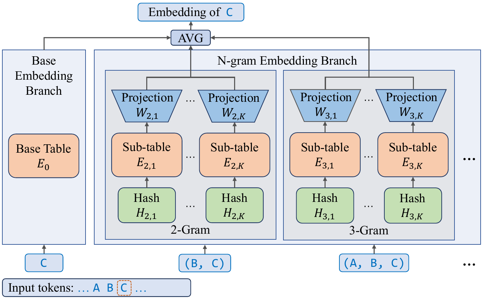
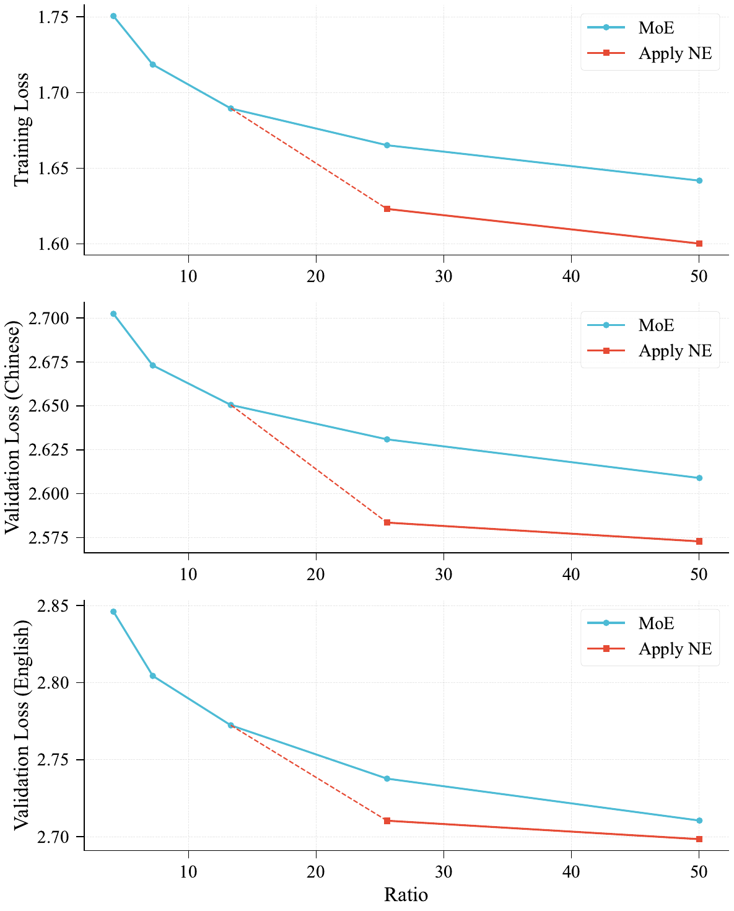

> [!tldr]
> LongCat 系列的 **小基座** 路线 + 一篇少见的 **scaling law 类方法论文**。核心反直觉发现：当 MoE 的 expert 数量已经过了 "sweet spot" 进入饱和区（即模型足够 sparse），与其继续加专家，不如把参数分配给 **N-gram Embedding** 这个本身 $O(1)$ lookup、零通信开销的稀疏维度——在宽模型 + 中等深度（≤40 shortcut layers）的常见 regime 下能取得更优的 Pareto frontier。落地为 **LongCat-Flash-Lite**：68.5B MoE（256 experts × 14 shortcut layers，激活 2.9B–4.5B），其中 **31.4B 参数（46%）是 N-gram embedding**。和参数等价的 LongCat-Vanilla（同样 68.5B 但全部为 MoE）比，base model 几乎全线领先（BBH +5.1、GPQA +4.3、BigCodeBench +2.6），并在 agentic / coding 任务上击败 Qwen3-Next-80B-A3B、Gemini 2.5 Flash-Lite、Kimi-Linear-48B-A3B。

## 1. 反直觉的核心发现：Embedding Scaling vs. Expert Scaling

传统看法：MoE 是 scaling sparsity 的唯一出路。但这篇指出 MoE 有两个根本瓶颈——(1) expert 数量边际收益递减；(2) all-to-all 通信 / 内存带宽开销随专家数膨胀。

**关键观察**：embedding 层是一个 **被忽视的、与 MoE 正交的稀疏维度**，因为它的 lookup 复杂度是 $O(1)$——你可以把参数量无限扩展，**几乎不增加任何计算和通信开销**。论文系统地证明：在特定 regime 下，把参数投到 embedding 比投到 experts 更划算。

### 三个核心 regime 判断（来自 280M / 790M / 1.3B 的 scaling 实验）

| 观察维度 | 结论 | 数字证据 |
|---------|------|---------|
| **专家数是否过 sweet spot** | MoE 在低 sparsity 区收益大、高 sparsity 区收益陡降（log-linear 衰减） | Figure 2（scaling-200M）：低 ratio 区 NE < MoE baseline；高 ratio 区 NE > MoE baseline |
| **模型宽度效应** | 模型越宽，NE 优势窗口越大 | 280M 激活：ratio > 30 时 NE 输给 MoE；790M：仅英文 val set 输；**1.3B：ratio 高达 50 仍有优势** |
| **模型深度效应** | 模型越深，NE 优势越被稀释 | 1.3B 配 20 vs 40 layers：深度 > 20 layers 后 NE 相对增益显著收缩（pre-norm 的 residual signal 衰减） |

> [!insight] Scaling law 发现的真正价值
> 这篇不是单纯的 "model card"——它给出了一条 **可操作的 scaling 决策规则**：当 MoE 已经过了 sweet spot、模型宽度足够大、深度不超过 40 shortcut layers（80 常规层，覆盖绝大多数实用模型），就应该停止加专家，转而 scale N-gram embedding。这把 "sparsity scaling" 这件事从"只能加 expert"的单维度，扩展成了 "expert × embedding" 的二维空间，并且第一次画出了清晰的 Pareto frontier。**对长尾应用（agentic / coding 场景）的小基座路线**，这是论文最值钱的贡献。

### 四条 architectural principle（论文用 Summary box 强调）

1. **NE 应在专家数超过 sweet spot 后才引入**（低 sparsity 区 NE 打不过加专家）
2. **NE 占总参数不超过 50%**（U 型曲线：过了某个比例 NE 反而劣于 MoE，intersection point 大约在 ratio=20 处）
3. **NE 词表大小应偏离 base vocab 整数倍**（不然 2-gram hash collision 数量爆炸，Figure 3）
4. **N=3-5、K≥2 时 NE 配置对超参不敏感**（N=2, K=1 是死角）

## 2. N-gram Embedding Scaling 方法

### 2.1 公式（核心 Over-Encoding 设计）

基础版本（Eq. 1）：对每个 token $t_i$，将其 embedding 增广为 base embedding 与 $N-1$ 个 n-gram embedding 的平均：
$$e_i = \frac{1}{N}\big(E_0(t_i) + \sum_{n=2}^N E_n(\mathcal{H}_n(t_{i-n+1}, \dots, t_i))\big)$$

polynomial rolling hash（Eq. 2）：$\mathcal{H}_n = (\sum_{j=0}^{n-1} t_{i-j} \cdot V_0^j) \% V_n$

最终版（Eq. 3，借鉴 Huang 2025 的 "Over-Encoding"）：每个 n-gram embedding 再拆成 $K$ 个子表，hidden size 缩 $\frac{1}{(N-1)K}$，并加 $W_{n,k}$ 线性投影回原空间。这个设计的精妙之处是 **参数量与 $N, K$ 无关**（因为 sub-table 维度反比缩放），可以在不增加参数预算的情况下缓解 hash collision。

### 2.2 Embedding Amplification（关键稳定化技巧）

这是论文里最容易被忽略但极重要的发现：**默认初始化下，attention 模块输出的 L2 norm 比 embedding branch 的 identity path 大一个数量级（~10×）**，导致 embedding 信号被 residual stream "drown out"。

两种修复方案（都来自 takase2025spikemorestabilizingpretraining）：
- **Scaling Factor**：给 embedding 输出乘 $\sqrt{D}$
- **Normalization**：embedding 输出与 residual 合并前先 LayerNorm

效果：训练 loss 和两个验证集 loss 一致下降 **0.02**——在大模型尺度这是个非常大的纯增益。论文取名为 **Embedding Amplification**。

> [!insight] 方法论的隐形价值
> "Embedding amplification" 这种细节通常不会被论文当主菜，但它是 NE 训练成败的隐形开关。和 LongCat-Flash 主报告里的 "Adam epsilon=1e-16"、"Variance Alignment" 一脉相承——美团 LongCat 团队有个鲜明风格：**每一项 stability trick 都有明确的 failure mode 诊断**（这里是 L2 norm ratio 失衡），而不是"调参玄学"。这种风格让他们的工作可复现性远高于一般 tech report。

## 3. 架构与训练

### 3.1 LongCat-Flash-Lite 架构

| 维度 | 配置 |
|------|------|
| Total params | **68.5B** |
| N-gram Embedding params | **31.4B（46%）** |
| Activated params | **2.9B – 4.5B**（zero-experts 动态） |
| Architecture | 与 [[2509_LongCat_Flash\|LongCat-Flash]] **完全相同**（继承 ScMoE + zero-computation experts + variance alignment 全套） |
| Shortcut layers | 14 |
| MoE 模块 | 256 FFN experts + 128 zero-experts，每 token 选 12 |
| 训练数据 | 11T tokens (8k seq) pre-train + 1.5T tokens mid-train (128k seq) + SFT |
| 长上下文 | YARN @ 32k stage，最终支持 256k |

### 3.2 与 LongCat-Flash 大基座的关系

- **同架构**：Lite 完全继承 Flash 的 ScMoE / zero-expert / variance alignment / hidden z-loss 全套设计，没有架构创新
- **不使用 Model Growth**：Lite 是 **from scratch 训练**，Flash 用了 14→28 层的 stack growth。这是两者的关键区别
- **核心差异在参数分配**：Flash 把 560B 全压在 MoE 专家上；Lite 把 68.5B 拆成 31.4B embedding + 37.1B MoE——同系列、不同 scaling 维度选择
- **Flash-Lite-Vanilla baseline**：论文把 NE 参数全部转成 experts，得到一个等参数等训练策略的对照基线，验证 NE 优势不是参数量带来的，而是分配方式带来的

## 4. 实验结果

### 4.1 Base model：NE vs. Vanilla（同 1.3T tokens 训练后）

| Benchmark | LongCat-Vanilla@1.3T | **LongCat-Flash-Lite@1.3T** | Δ |
|-----------|---:|---:|---:|
| MMLU | **64.81** | 64.01 | -0.80 |
| MMLU-Pro | 34.43 | **35.89** | +1.46 |
| CEval | 64.09 | **67.21** | +3.12 |
| CMMLU | 67.08 | **69.55** | +2.47 |
| BBH | 38.54 | **43.67** | **+5.13** |
| GPQA | 25.37 | **29.66** | **+4.29** |
| DROP | 47.92 | **52.43** | +4.51 |
| GSM8K | 50.00 | **50.50** | +0.50 |
| HumanEval+ | 28.66 | **31.10** | +2.44 |
| MultiPL-E | **30.20** | 30.03 | -0.17 |
| BigCodeBench | 33.42 | **36.05** | +2.63 |

判断：除了 MMLU 和 MultiPL-E 略输，Lite 几乎全线领先，**reasoning 类增益最大**（BBH +5.1、GPQA +4.3、DROP +4.5）。这验证了核心 thesis。

### 4.2 Chat model：vs. 同档竞品

| 任务类别 | Kimi-Linear-48B-A3B | Qwen3-Next-80B-A3B | Gemini 2.5 Flash-Lite | **LongCat-Flash-Lite** |
|---------|---:|---:|---:|---:|
| **Agentic Tool Use** | | | | |
| τ²-Airline (avg@8) | 44.0 | 45.5 | 35.0 | **58.0** |
| τ²-Retail (avg@8) | 18.86 | 57.3 | 37.5 | **73.1** |
| τ²-Telecom (avg@8) | 15.68 | 13.2 | 21.93 | **72.8** |
| VitaBench (avg@4) | - | 5.80 | 4.50 | **7.00** |
| **Agentic Coding** | | | | |
| SWE-Bench | 32.8 | 37.6 | 41.3 | **54.4** |
| TerminalBench | 20.0 | 15.19 | 20.0 | **33.75** |
| SWE-Bench Multilingual | 37.2 | 31.3 | - | **38.1** |
| PRDBench | - | 15.36 | - | **39.63** |
| **General / Math**（略） | 接近 | Qwen3-Next 最强 | 中等 | 多数领先 Kimi/Gemini |

**核心判断**：在 agentic 任务上 Lite 取得 **断崖式领先**（τ²-Telecom 72.8 vs. Qwen 13.2，差 5.5×；SWE-Bench 54.4 vs. Gemini 41.3）。在通用知识 / 数学 reasoning 上 Qwen3-Next-80B-A3B（80B 总参）整体更强，但 Lite 在中文（CEval 86.55 / CMMLU 82.48）显著超过 Gemini 2.5 Flash-Lite 和 Kimi-Linear。

### 4.3 Scaling curve 核心数字（Section 3）

- **280M activated**：ratio > 30 时 NE 反而劣于 MoE baseline
- **790M activated**：仅英文 val set 在 ratio=30 处劣于 MoE，其余全部领先
- **1.3B activated**：**ratio = 50 时 NE 仍保持优势**——宽度越大，NE 适用窗口越大
- **深度效应**：1.3B 在 20 layers 时 NE 优势明显，到 40 layers 时优势大幅收缩

### 4.4 N、K 超参 ablation（790M model）

- $N=2, K=1$ 是死角，明显劣于其他配置
- $N \geq 3, K \geq 2$ 后性能方差很小，配置不敏感
- 实践经验：$N \in [3, 5]$ 持续接近最优

## 5. 高效推理：从理论稀疏到实际加速

### 5.1 MoE 激活参数的实质降低

NE 把参数从 MoE 搬到 embedding，**embedding lookup 只按 token 数算开销、不按参数量算**——所以总参数不变、但 MoE 激活参数大幅降低。这对 **I/O bound 的解码场景**（大 batch）是直接红利。

### 5.2 Speculative decoding 的天然协同

- 大 batch + spec decoding 才能把"参数稀疏"翻译成"延迟降低"
- **draft model 用普通 embedding**（绕过 n-gram lookup 开销）
- **draft 阶段缓存 n-gram embedding**，verification 阶段复用

### 5.3 进一步的 NE-spec 协同（论文提出但未完成）

- **NE-based drafting**：把 NE 当超快 draft model（自带 short-range context）
- **Early rejection**：NE 表示作为 confidence estimator，提前拒绝低概率 draft token

### 5.4 系统级优化

- **N-gram Cache**（仿 KV cache 的设计）：CUDA kernel 直接在 device 管理 N-gram ID，绕过 inference framework 的复杂调度
- **Kernel fusion**：AllReduce+ResAdd+RMSNorm 等组合融合
- **Optimized Attention Combine**：splitkv combine kernel latency 降低 50%
- **PDL (Programmatic Dependent Launch)**：解决轻量模型的 kernel launch overhead 瓶颈
- 部署：Eagle3 + 3-step spec decoding + wide EP + SBO（继承 Flash 的推理栈）

## 6. 局限与思考

- **MMLU / MultiPL-E 略输 Vanilla**：说明 NE 不是 "免费午餐"，在某些任务上 dense expert 仍有优势。论文没深入分析哪些任务适合 NE、哪些不适合
- **PLNE 没采用**：Per-Layer N-gram Embedding 理论上更灵活，但实验中宽度/深度增加后未展现稳定优势，且会引入额外激活参数（每层投影矩阵）。论文承认这块还需要更多研究
- **Hash collision 仅在 2-gram 上观察**：高阶 n-gram 的 collision 行为没分析
- **1.3B 是实验上限**：所有 scaling law 结论都基于 ≤1.3B activated 的实验，外推到 3B+ activated（即 LongCat-Flash-Lite 本身的尺度）只是基于宽度趋势的合理推测，没有直接验证
- **训练数据相对小**：11T pre-train + 1.5T mid-train，比 LongCat-Flash 的 20T 少一半——可能与小基座定位有关，但也意味着上限可能没充分挖

## 7. 对小模型研究的启发

1. **重新审视 embedding 层**：过去几年的 scaling law 研究几乎都聚焦在 FFN / attention / layer 数，这篇把 embedding 拉回主舞台。对资源受限的小基座（≤10B activated）团队，NE 是比"再加 expert"更划算的杠杆
2. **宽度优于深度（在 NE 语境下）**：这与一般 "deep & narrow better for MoE" 的直觉相反，值得在小模型设计时重新评估 width/depth 比例
3. **小基座的 agent 友好性**：Lite 在 agentic / coding 上击败 80B 级别对手，说明 NE 这种 "cheap capacity" 对需要长 trajectory、复杂工具依赖的任务可能是结构上更适合的（论文推测是 NE 提供了更丰富的 token-level 表示）
4. **可操作的设计 checklist**：NE 占比 ≤50%、词表大小偏离 base vocab 整数倍、$N \in [3,5], K \geq 2$、必加 Embedding Amplification——这些都是从 0 开始复现 NE 的最小配置
5. **正交 scaling 维度的思路**：除了 expert 和 embedding，是否还有其他被忽视的稀疏维度？例如 router 本身、attention head 维度、KV cache 的词表化？

## 8. 在 LongCat 系列中的定位

[[2509_LongCat_Flash|LongCat-Flash]] 是大基座（560B MoE），把 expert sparsity 推到极致；本篇是 **小基座路线**（68.5B），探索了与 Flash 正交的 embedding sparsity 维度。两者共享 ScMoE / zero-expert / variance alignment 全套基础设施，差异在 **scaling 维度选择**——这是 LongCat 系列的方法论特征：**架构栈统一，参数分配策略多样化**。

> 📊 相关可视化: 暂无（如需后续制作 poster 可基于本笔记）

## 9. 关键链接

- arXiv: https://arxiv.org/abs/2601.21204
- HuggingFace: https://huggingface.co/meituan-longcat/LongCat-Flash-Lite
- 同系列大基座: [[2509_LongCat_Flash|LongCat-Flash Technical Report]] (2509.01322)
- 同系列推理版: [[2509_LongCat_Flash_Thinking|LongCat-Flash-Thinking]] / [[2601_LongCat_Flash_Thinking_2601|Thinking-2601]]
- 同系列全模态: [[2511_LongCat_Flash_Omni|Flash-Omni]] / [[2603_LongCat_Next|LongCat-Next]]
- 同系列形式化: [[2603_LongCat_Flash_Prover|Flash-Prover]]
