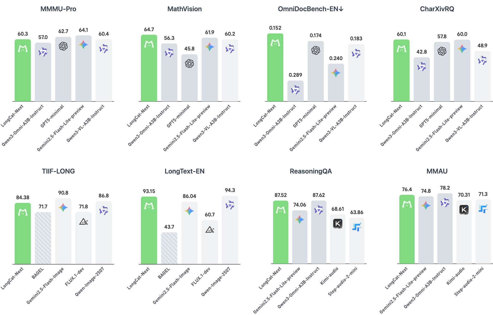
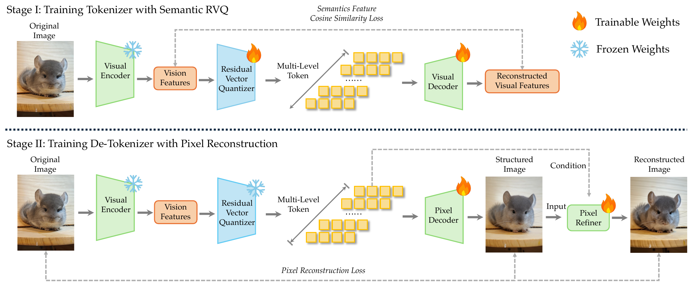

> [!tldr]
> LongCat 系列路线最激进的一篇：放弃 [[2511_LongCat_Flash_Omni|Flash-Omni]] 那种 encoder-decoder 拼接式架构，转向 **DiNA（Discrete Native Autoregressive）**——把 text / vision / audio 全部 lexicalize 成离散 token，在单个 decoder-only MoE 上用同一个 NTP 目标统一建模。核心创新 **dNaViT** 用 SAE（语义对齐编码器）+ 8 级 RVQ 实现任意分辨率图像的 28× 压缩离散化，**首次把离散视觉建模的能力天花板顶到接近连续编码器**（与 Qwen3-VL-A3B 持平甚至在 MathVista/MathVision 反超）。它的真正价值不是某个 benchmark SOTA，而是给「下一代 any-to-any 多模态模型该走哪条路」提供了一个工业级的可落地答案：**离散不是性能瓶颈，是范式选择**。



## 1. 范式问题：为什么需要原生统一离散 token？

当前多模态系统的问题是 **language-plus-auxiliary**——视觉/听觉被当作外挂组件，用连续 embedding 投影进 LLM 空间。这种范式带来三类问题：

1. **架构碎片化**：每个模态一套 encoder + projection，3D RoPE / 双向 attention / modality-aware MoE 等模态专属设计堆积。
2. **理解 vs 生成的对立**：理解用 SigLIP/CLIP 系编码器（语义对齐、低分辨率），生成用 VAE/VQ-VAE（像素重建、高分辨率），两个 codebook 不可调和，导致 Janus / BAGEL / Show-o 等模型需要双 head。
3. **基础设施不友好**：连续特征流过 LLM 时需要 modality-aware 路径，无法直接复用纯 LLM 的训练/推理栈。

作者认为这些问题的根源是**没有把模态真正「词汇化」**。如果视觉/听觉也能像 BPE token 一样作为离散符号序列进入 LLM，那么：
- 架构上，只剩 decoder-only + tokenizer/detokenizer pair；
- 训练上，单一 NTP 目标同时涵盖理解（img→text）和生成（text→img），它们是同一个预测过程的两个 conditional prior；
- 数据上，所有模态被拍平成 token 序列，NTP 自动充当跨模态自监督。

> [!insight] 「Lexicalizing」范式的真正意义
> 这不是「又一个统一多模态模型」——它是对 GPT-4o / Gemini / Qwen3-Omni 这一代「拼接式 omni」路线的反叛。**把视觉/听觉当作自然语言的"扩展词汇"，意味着承认 BPE 子词并不是世界的全部符号系统**。从工程上看，这意味着训练栈、推理栈、RL 栈、长上下文栈全部可以原样复用 LLM 的成熟基础设施；从科学上看，它把「理解 vs 生成」的对立彻底消解——它们只是同一个 NTP 在不同 conditioning 下的实例。这是 LongCat 系列最深的范式押注：**离散 token 自回归是通往真正 native multimodality 的唯一道路**，连续 embedding 投影只是过渡形态。

## 2. DiNA 架构

**DiNA = Discrete Native Autoregressive**——一个把所有模态压进共享离散空间的统一自回归框架。

| 组件 | 角色 |
|------|------|
| **Modality-specific tokenizer/detokenizer pair** | 视觉 dNaViT、音频 Whisper+RVQ tokenizer；负责 raw signal ↔ discrete ID 双向映射 |
| **Modality-agnostic decoder-only MoE** | LongCat-Flash-Lite A3B（68.5B total / 平均 3B 激活，2.9B–4.5B 浮动），继承 Zero-Expert + ScMoE 设计 |
| **End-to-end multimodal embedding** | 视觉 codebook 8×16384，音频 codebook 递减（8k/4k/2k/1k/1k/1k/1k/1k）；**全部随机初始化**，与语言 token 共训 |
| **Multimodality head** | LLM head 是标准 MLP（语言），多模态 token 由 task-aware **DepthTransformer** 并行解码出多级 token |

关键设计原则：
- **不引入 modality-specific inductive bias**：禁用 3D RoPE、双向 attention、modality-aware MoE；所有 token（text/visual/audio）走同一条 modality-agnostic 路径。
- **Pre-quantization features 只用来定 RVQ 的聚类分配，不直接决定 embedding 值**——embedding 值在 LLM 内部从头学起。这就是「native representation」：视觉 codebook embedding 与语言 token embedding 共同演化，最终在 LLM 的内部空间形成「视觉的母语」。
- **t-SNE 实验证据**：LongCat-Next 训练后视觉 token 与文本 token 在 embedding 空间中**交织分布**（interwoven），而对照的 Qwen2.5-VL 是分离的两个簇，Qwen3.5 只有部分对齐。这是 **Platonic Representation Hypothesis** 的实证：不同模态是同一现实的不同表达，应在共享语义空间中重合。

> [!insight] DiNA / dNaViT 的技术价值
> **DiNA 的核心赌注是：放弃 modality-aware 归纳偏置，让 MoE 自己涌现功能分化**。实验佐证了这个赌注——纯 text 训练时每 expert 平均 507.1 个 token，加入多模态训练后增到 584.6（capacity 利用率提升 15%），且部分 expert 自发特化为「视觉 expert」或「音频 expert」。这说明 modality specialization **不是必须硬编码的，而是数据驱动的结果**。配合 dNaViT 提供的「语义完整」离散 codebook，整个 pipeline 实现了「单 backbone + 多 tokenizer」的极简架构，同时性能不输给专家级 VLM。这是「native 多模态」路线的第一个工业级可行性证明。

## 3. dNaViT 视觉编码

**dNaViT = Discrete Native-resolution Vision Transformer**——把任意分辨率图像编码为层级离散 token、并支持从 token 反解图像的统一接口。

### 3.1 核心动机：Semantic Completeness

作者把视觉离散化的难点归为 **dual bottleneck**：
1. **Capacity of visual representation**：编码器本身的语义容量。
2. **Information loss from discretization**：连续→离散量化带来的信息损失。

针对第一点，提出 **semantic completeness** 原则：离散表示 $z$ 应满足
$$\mathcal{P}(A \mid z, \mathcal{Q}) \approx \mathcal{P}(A \mid I, \mathcal{Q})$$
即对任何图像相关查询 $\mathcal{Q}$，离散 token 上的后验应逼近原始像素上的后验。这衍生两条性质：
- **Discriminative Invariance**（判别不变性）：量化不破坏高层语义。
- **Generative Sufficiency**（生成充分性）：token 应能反解出图像的结构与纹理。

### 3.2 为什么选 Semantic-and-Aligned Encoder (SAE)



论文把现有视觉表示分四类，作者押注第四类 **SAE**：

| 类别 | 代表 | 优点 | 缺点 |
|------|------|------|------|
| Low-level Reconstructive | VAE / VQ-VAE (Emu3, Chameleon, LWM, VILA-U) | 像素保真度高 | 高层概念推理弱 |
| Self-supervised Semantic | DINOv2 / SigLIP (Janus 系列) | 结构/对比特征强 | 缺少显式语义 grounding |
| Encoder-free raw-pixel | EVE, NEO | 简单可扩展 | 像素冗余严重 |
| **Semantic-and-Aligned (SAE)** | **QwenViT / MoonViT / AIMv2** | **语义丰富 + 语言亲和** | 本文首次系统使用 |

SAE 是经过大规模 vision-language 训练的编码器，预量化空间已经满足 semantic completeness——直接复用即可，免去从头训练 SAE 的成本。本文实现版本直接采用 **Qwen2.5-ViT（28× 空间压缩）**。

### 3.3 Intrinsic Information Recovery（一个反直觉发现）

一个意外发现：**SAE 的 residual 架构本身就保留了低层信号传播的隐式通路**。把 ViT 写成 residual blocks 累加：
$$\mathbf{z}_p = \mathbf{x}_0 + \sum_{l=1}^{L} \mathcal{F}_l(\mathbf{x}_{l-1})$$
identity mapping $\mathbf{x}_{l-1}$ 让早期层的细粒度信号不被高层语义覆盖，而是逐步累积进 $\mathbf{z}_p$，所以即便没有显式重建监督，SAE 仍保有可观的重建能力。

定量证据（Table reconstruction_metrics）：用同一个轻量 ViT 解码器配不同 frozen encoder：

| Encoder | PSNR↑ | SSIM↑ | rFID↓ |
|---------|------:|------:|------:|
| ResNet50 | 20.88 | 0.509 | 0.462 |
| ViT-B/16 (Pretrained) | 21.86 | 0.581 | 0.885 |
| **ViT-B/16 (Random)** | **30.52** | **0.887** | 0.585 |
| QwenViT (w/o merger) | 18.16 | 0.460 | 0.987 |

**随机初始化 ViT 的重建质量反而最好**（PSNR 30.52），这印证了 residual 结构本身——而非 learned semantics——是 recoverability 的主要来源。QwenViT 加 merger 后因 14×→28× 激进下采样而退化，但仍保留粗粒度结构恢复能力。

### 3.4 RVQ + Native Resolution 的组合

- **8 级 RVQ**：每级用 EMA 更新 codebook（非 gradient descent），Laplace smoothing 防数值不稳，inactive entry（$N_k<1$）从当前 batch 重初始化以维持 codebook 利用率。
- **Native resolution**：用 Pack-n-Pack 风格的 sequence-based 建模，不同分辨率图像 flatten 进单一序列，用 variable-length FlashAttention 处理，最大序列长 8192，最大图像分辨率 1736×1736。
- **训练损失**：$\mathcal{L}_{\text{quant}} = \lambda_c \mathcal{L}_{\text{commit}} + \lambda_s \mathcal{L}_{\text{semantic}}$（commitment loss + 特征余弦相似度重建 loss）。

### 3.5 De-tokenization（与 tokenizer 解耦）

Codebook 冻结后训练 de-tokenizer：
- **400M ViT 像素解码器**：从离散 code embedding 直接重建像素。先经 learnable MLP patch unmerger 反向恢复空间 patch 序列，再过带 2D RoPE 的 transformer 层。
- **Flow-matching refiner**（init from OmniGen2）：在像素解码器输出上做细化，提升高频细节。以「像素重建 + 离散 code embedding」为条件。
- 损失：$\mathcal{L}_{\text{dec}} = \lambda_1 \mathcal{L}_{\text{pixel}} + \lambda_2 \mathcal{L}_{\text{percep}} + \lambda_3 \mathcal{L}_{\text{align}}$ + refiner 的 flow-matching loss。

## 4. 离散化方案：为什么 8 级 RVQ

Appendix 给出 RVQ 级数 ablation（用特征重建 loss 作为代理指标）：

| 策略 | 重建 loss |
|------|-----------|
| Vanilla VQ | 高 |
| 2-stage RVQ | 略低于 VQ |
| **8-stage RVQ** | **显著最低** |

结论：RVQ 的 residual 机制 + 组合性是低信息损失离散化的关键。8 级在 overhead 可控的前提下达到「充分低的信息损失」，作为默认配置。

## 5. 训练 pipeline

### 5.1 两阶段总览

```
Phase 1: Modality-specific tokenizer training
  ├── dNaViT tokenizer + detokenizer（独立训练）
  └── Audio tokenizer + detokenizer（独立训练）

Phase 2: Native multimodality training（共 ~2T tokens）
  ├── Stage 1 Pre-Align:    codebook embedding + DepthTransformer 暖身，LLM backbone frozen
  ├── Stage 2 Pre-training: 全部 unfreeze，8K seq，batch 8192
  ├── Stage 3 Mid-training: + Long CoT + Video + GUI + AnyRes Generation，32K seq
  └── Stage 4 SFT:          高质量指令数据，64K seq，batch 128
```

### 5.2 Audio tokenizer 细节

- 编码器：Whisper-large-v3（冻初始，再训）
- 8 级 RVQ，codebook 大小递减 8k/4k/2k/1k/1k/1k/1k/1k，12.5 Hz 帧率
- 训练数据：~250 万小时（1990 万小时 web audio 清洗后剩 320 万小时 + 120 万小时合成 + 40 万小时任务专属）
- 训练 3 阶段：decoder warm-up → semantic-acoustic joint（启用 RVQ）→ decoder fine-tune（DiT 24kHz）
- 关键设计：训练时借 **Qwen3-1.7B 作为 frozen LLM 监督**对齐文本空间，提升后丢弃——audio token 的 LLM-亲和性因此可迁移到其他 LLM 架构。

### 5.3 Internal Linguistic Guidance（音频生成的关键设计）

模仿 Moshi，把音频生成建模为 **text-guided audio modality**：
- **Parallel generation**：text/audio token 同步生成，audio 延迟 N 步（保对齐），低延迟适合全双工
- **Serial generation**：先 text 后 audio，单步只预测一种模态，语义质量高

统一训练范式：每个 text-audio segment 的 delay 从 1 到 text 长度之间**随机采样**，让模型学会任意 delay 步的语义对齐。Parallel 和 Serial 成为这个统一框架的两个极端。

### 5.4 Infrastructure：V-Half Pipeline Parallelism

多模态训练的工程难点：embedding 层 + modality-specific loss（DepthTransformer）和 LLM transformer 层的执行时间高度异构，naive 线性 pipeline 划分会产生严重 stage 间负载不均。

V-Half 方案：
- **V-shape schedule**：把 embedding 层（第 1 stage）和 modality loss（最后 1 stage）co-locate 在同一物理 device 上
- **Shared buffer**：modality loss 模块直接从同一 device 读取 RVQ 多级 token 的 hidden state，零拷贝
- **Decouple LLM head**：LLM head 单独配少量 transformer 层到独立 stage，避免 V-shape anchor device 过载
- **Adaptive LLM layer 分布**：剩余 transformer 层均匀分布

收益：pipeline bubble 显著缓解、跨 stage 通信彻底消除。

## 6. 实验结果

### 6.1 视觉理解（vs Omni + 专门 VLM）

LongCat-Next（A3B）vs Qwen3-Omni-A3B-Instruct / Qwen3-VL-A3B-Instruct / Gemini2.5-Flash-Lite / GPT5-minimal / InternVL3.5-A3B-Flash：

| Benchmark | LongCat-Next | Qwen3-Omni | Qwen3-VL | Gemini2.5-FL |
|-----------|---:|---:|---:|---:|
| MMMU-Pro | **60.3** | 57.0 | 60.4 | 64.1 |
| MMMU-val | 70.6 | 69.1 | 74.2 | 74.9 |
| **MathVista-mini** | **83.1** | 75.9 | 80.1 | 78.2 |
| **MathVision** | **64.7** | 56.3 | 60.2 | 61.9 |
| **VisuLogic** | **29.4** | 20.0 | 23.0 | 26.1 |
| OmniDocBench-en↓ | **0.152** | 0.289 | 0.183 | 0.240 |
| OmniDocBench-zh↓ | **0.226** | 0.406 | 0.253 | 0.312 |
| CharXiv-RQ | **60.1** | 42.8 | 48.9 | 60.0 |
| ChartQA | **88.0** | 86.8 | 86.8 | 79.0 |
| OCRBench | 86.5 | 85.4 | 90.3 | 84.8 |
| MMStar | 69.3 | 68.5 | 72.1 | 74.93 |

**判断**：在数学推理（MathVista/MathVision）和视觉中心推理（VisuLogic）上**反超专门 VLM Qwen3-VL-A3B**；在 OCR/Doc/Chart 上多数项领先；这是「离散视觉建模没有内在性能天花板」的最强证据。

### 6.2 视觉生成（vs 专门 T2I）

vs 专门 T2I 模型：

| Benchmark | LongCat-Next | Qwen-Image 2507 | Gemini2.5-Flash-Img | FLUX.1-dev | Seedream 3.0 |
|-----------|---:|---:|---:|---:|---:|
| GenEval | 84.44 | 87.00 | 79.67 | 66.00 | - |
| DPG | 84.66 | 88.32 | 85.82 | 84.00 | **94.31** |
| LongText-EN | 93.15 | 94.30 | 86.04 | 60.70 | 89.60 |
| LongText-ZH | 89.08 | 94.60 | - | 0.50 | 87.80 |
| WISE | 57.00 | 63.00 | **76.27** | 50.00 | - |
| TIFF | 82.85/84.38 | 86.10/86.80 | **90.53/90.80** | 71.10/71.80 | 86.02/84.31 |
| CVTG | 76.36 | 82.88 | 73.64 | 49.65 | 59.24 |

**判断**：unified 模型里 LongCat-Next 在长文本理解 + text rendering 上**显著领先**所有 unified 对手（见 Table omni_unified_results）；与专门 T2I 模型相比，GenEval/LongText 持平 SOTA，DPG/CVTG 略低但仍竞争性。**文本渲染（LongText / TIFF / CVTG）是 unified 架构的最大胜利点**，作者归因为语言理解深度参与语义规划。

### 6.3 与 unified 多模态模型对比（Table omni_unified_results）

横向对比 12 个 unified 模型（Janus-Pro / Show-o2 / OneCAT / Mogao / BAGEL / NEO-unify / Ovis-U1 / Lumina / OmniGen2 / UniWorld-V1 / X-Omni / InternVL-U / BLIP3-o）：

LongCat-Next 在所有理解+生成 benchmark 综合最强：
- 理解端：MMMU 70.6 / MathVista 83.1 / OCRBench 86.5 / DocVQA 94.2 / MMStar 69.3
- 生成端：GenEval 84 / DPG 84.66 / LongText 93.15/89.08 / WISE 57 / TIFF 82.85/84.38 / CVTG 76.36

唯一接近的是 NEO-unify（MMMU 68.9 / LongText-EN 91.40）和 InternVL-U（LongText-ZH 86.00 / CVTG 62.30），但每个对手都有明显短板。

### 6.4 音频

| 类别 | LongCat-Next | Qwen3-Omni | MiMo-Audio | Kimi-Audio | Gemini-3.1-FL | Step-Audio-2 |
|------|---:|---:|---:|---:|---:|---:|
| **MMAU** | **76.40** | 78.20 | 75.80 | 70.31 | 71.70 | 71.30 |
| VocalSound | 85.91 | **91.59** | 87.94 | **94.85** | 69.81 | 87.58 |
| TUT2017 | 43.09 | 40.74 | 15.06 | **65.25** | 23.15 | 30.67 |
| AlpacaEval | 86.83 | 90.10 | 85.67 | 78.74 | 62.56 | 53.06 |
| ReasoningQA | 87.52 | **87.62** | 75.34 | 68.61 | 65.64 | 63.86 |
| SeedTTS-zh↓ | 1.90 | **1.07** | 1.96 | 13.46 | - | 2.13 |

**判断**：与 omni 模型竞争性，与专门 audio 模型各有胜负；ASR/WenetSpeech 上略逊 Qwen3-Omni，但 audio understanding 综合强（MMAU 76.40 超大多数对手）。

### 6.5 纯文本（「multimodal tax」检验）

| Benchmark | LongCat-Next | Kimi-Linear-48B-A3B | Qwen3-Next-80B-A3B | Qwen3-Omni-A3B |
|-----------|---:|---:|---:|---:|
| MMLU | 83.95 | 79.91 | **89.28** | 87.10 |
| MMLU-Pro | 77.02 | 67.22 | **82.93** | 79.89 |
| CEval | 86.80 | 78.48 | **90.91** | 88.50 |
| SWE-Bench | **43.00** | 32.80 | 37.60 | - |
| Tau2-Telecom | **62.06** | 15.68 | 13.20 | 4.39 |
| Tau2-Retail | **73.68** | 18.86 | 57.30 | 40.80 |

**判断**：成功避免「multimodal tax」——加视觉/音频后纯语言能力不退化，甚至 **SWE-Bench 43.00 和 Tau2 系列 tool use 大幅领先**。这印证了「token-level 统一不会引入优化 trade-off」的核心 claim。

### 6.6 关键 ablation：离散 vs 连续的鸿沟是否真实存在？

Table combined_optimized_layout（Qwen-7B backbone）：

| Exp | Rep Type | PT Tokens | MT&SFT Tokens | Pre-Buffer | OCRBench | DocVQA | MMMU-val | MathVista |
|-----|---------|----------:|--------------:|:---:|---:|---:|---:|---:|
| I | Continuous | 0.1B | 4B | - | 779 | 88.2 | 49.8 | 59.6 |
| II | Discrete | 0.1B | 4B | ✓ | 598 | 78.0 | 44.8 | 47.3 |
| III | Continuous | 5B | 4B | - | 776 | 88.9 | 49.1 | 56.1 |
| IV | Discrete | 5B | 4B | ✓ | 720 | 86.7 | 48.0 | 54.2 |
| V | Discrete | 5B | 4B | ✗ | 705 | 85.2 | 49.8 | 56.7 |
| VI | Continuous | 5B | 300B | - | 858 | 96.0 | 58.0 | 75.0 |
| VII | Discrete | 5B | 300B | ✓ | 844 | 96.0 | 60.0 | 74.0 |

**三个核心发现**：
1. 短训练时 discrete 确实落后 continuous（Exp I vs II），但 gap 随数据规模收窄
2. **Pre-Buffer** 模块（codebook lookup 后的单层 FFN 重编码 multi-level sum）显著加速收敛、提升 token 表达力
3. **数据规模够大时（300B），discrete 几乎追平 continuous**（Exp VI vs VII：OCRBench 858 vs 844、DocVQA 96.0 vs 96.0、MMMU 58.0 vs 60.0 甚至反超）

> [!insight] 对多模态研究的启发
> 这篇论文最值得记住的实验结论是：**「discrete 视觉建模的性能天花板」是一个被广泛相信但未被证伪的迷思**。LongCat-Next 用 300B 量级训练 + SAE + 8 级 RVQ + Pre-Buffer 把离散和连续的 gap 压到 1% 以内，并在主模型规模上反超专门的连续 VLM（Qwen3-VL-A3B）。这对研究路线选择的启示是：(1) 不要因为「discrete 必然差」就放弃 native 统一架构；(2) 离散化的关键是**预量化空间要语义完整**（用 SAE 而非 VAE），**量化层级要够深**（8 级 RVQ），**codebook embedding 要 end-to-end 学**（不直接用 SAE 特征）；(3) 一旦跨过这道坎，RL、长上下文、KV cache、spec decoding 这些 LLM 成熟基础设施就能原样迁移到多模态，工程红利远超性能代价。

### 6.7 RL：discrete 表示天然适配 GRPO

视觉离散 token 直接作为 RL action space，无需 flow model 的 ODE→SDE 转换。
- **T2I RL**：多维度 reward（综合能力 / OCR / 语义对齐 / 图像质量），GenEval counting 提升 7.5%、position 6.75%、color_attr 4.56%
- **图像理解 RL**：发现严重的 **entropy explosion**（采样器和 actor policy 概率差 > 0.4 时单 token 会污染整条序列），提出 sequence-level filter（entropy filter + training-inference prob diff filter）稳定训练
- 理解 RL 收益：MMMU 64.22→66.45、RealWorldQA 66.01→72.54、MathVision 49.28→53.52

### 6.8 理解 vs 生成不冲突（关键消解）

同 checkpoint 下，Pure-Und（100B）/ Pure-Gen（100B）/ Unified（50B+50B）对比：
- Unified vs Pure-Und：loss 仅高 0.006
- Unified vs Pure-Gen：**loss 低 0.02**

结论：**generation 不损害 understanding，understanding 反而增强 generation**。这是 DiNA 单一 NTP 目标最重要的实证支撑。

## 7. 与 LongCat-Flash-Omni 的对比

| 维度 | [[2511_LongCat_Flash_Omni\|Flash-Omni]] | **LongCat-Next** |
|------|-------------------------------------|------------------|
| 范式 | encoder-decoder 拼接式（visual encoder → projection → LLM） | **DiNA：原生离散统一**（tokenizer → 共享 token 空间 → LLM） |
| 视觉表示 | 连续 embedding 投影 | **dNaViT 8 级 RVQ 离散 token** |
| 音频表示 | 离散 token + 双流 | **RVQ + Internal Linguistic Guidance**（parallel/serial 统一） |
| LLM 干预 | modality-aware 设计 | **完全 modality-agnostic**（无 3D RoPE / 无双向 attention / 无 modality-aware MoE） |
| 理解 vs 生成 | 双 head，分离建模 | **单一 NTP 目标统一**（只是 conditioning 不同） |
| 输入分辨率 | 固定/受限 | **Native any-resolution**（最大 1736×1736） |
| 训练栈 | 多模态专属 infrastructure | **复用纯 LLM 训练栈**（V-Half pipeline） |
| 路线定位 | 拼接式 omni 的工业级实现 | **下一代 any-to-any 范式探索** |

LongCat-Next 是对 Flash-Omni 范式的**主动反叛**：放弃拼接式架构的工程便利，押注离散统一的科学红利。它代表美团后续主推路线——LongCat-Flash-Omni 仍是当前生产主力，但 LongCat-Next 是 future。

## 8. 局限与开放问题

- **当前 dNaViT 优先保证语义解码一致性，pixel fidelity 还不是最强**——作者承认 tokenizer 还有提升空间。
- **音频 ASR（WenetSpeech / LibriSpeech）略逊 Qwen3-Omni**——可能是数据配比或 tokenizer 帧率（12.5 Hz）选择。
- **World knowledge T2I（WISE 57.00）落后 Gemini2.5-Flash-Img（76.27）和 Qwen-Image 2507（63.00）**——合成数据规模和概念覆盖还需补强。
- **RL 训练的 entropy explosion 是一个新发现的 failure mode**——sequence-level filter 是工程 fix，根因（hardware / numerical precision mismatch）尚未根治。
- **any-to-any 生成、interleaved 多模态长推理还没充分验证**——作者在 Future Work 中明确点名。

## 9. 关键链接

- GitHub: https://github.com/meituan-longcat/LongCat-Next
- HuggingFace: https://huggingface.co/meituan-longcat/LongCat-Next
- LongCat Chat: https://longcat.ai
- 系列基座: [[2509_LongCat_Flash|LongCat-Flash]]（560B MoE / ScMoE + Zero-Expert）
- 系列小基座: [[2601_LongCat_Flash_Lite|LongCat-Flash-Lite]]（A3B backbone 来源）
- 上一代 omni: [[2511_LongCat_Flash_Omni|Flash-Omni]]（拼接式 omni）
