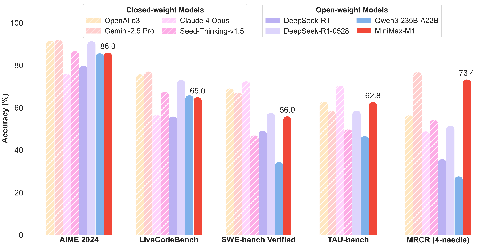
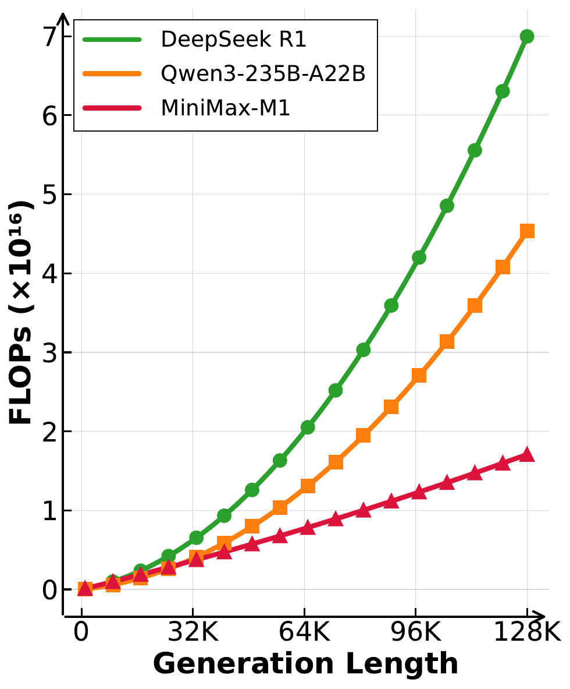
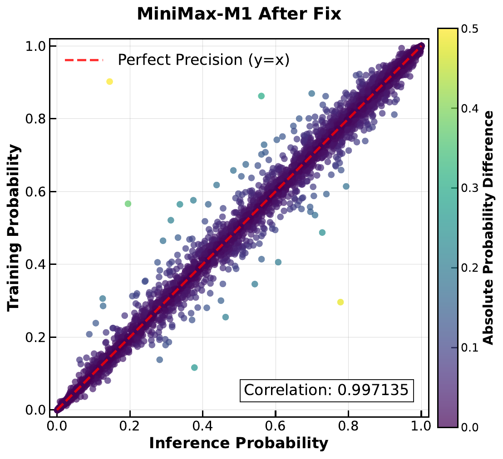

# TL;DR

MiniMax-M1 是首个开源的大规模 hybrid-attention 推理模型，通过 Lightning Attention（线性注意力 IO-aware 实现）实现高效的测试时计算扩展，支持 1M 输入和 80K 输出 tokens，训练成本仅 $0.53M（512 H800 GPU，3周）。

## 问题与动机

大语言推理模型（LRM）如 o1、DeepSeek-R1 通过大规模 RL 扩展测试时计算取得了显著成功，但传统 Transformer 的 softmax attention 存在二次复杂度瓶颈，限制了长推理链的高效扩展。MiniMax-M1 的核心动机是：

1. **效率问题**：长推理链的 FLOPs 成本过高（100K tokens 时 DeepSeek R1 的 FLOPs 是 M1 的 4 倍）
2. **上下文限制**：现有开源 LRM 的上下文窗口太小（通常 32K-128K）
3. **RL 训练效率**：扩展 RL 训练时的计算成本和稳定性问题

## 方法核心思路

### 1. Lightning Attention 混合架构

MiniMax-M1 基于 MiniMax-Text-01，采用 hybrid MoE + Lightning Attention 架构：

- **总参数量**：456B，激活 45.9B，32 experts
- **Attention 设计**：每 7 个 Lightning Attention 的 TransNormer blocks 后接 1 个 softmax attention 的 Transformer block
- **理论优势**：推理 FLOPs 接近线性扩展（100K tokens 时仅需 DeepSeek R1 25% 的 FLOPs）
- **原生上下文**：支持 1M tokens 输入（DeepSeek R1 的 8 倍）

### 2. CISPO 算法（Clipped IS-weight Policy Optimization）

CISPO 是 M1 提出的核心 RL 算法创新，核心洞察是：**token 级别的裁剪会导致关键的低概率 tokens（如 "Wait", "However", "Aha"）被永久丢弃**。

CISPO 裁剪的是重要性采样权重而非 token 更新：

$$
\hat{r}_{i,t}(\theta) = \text{clip}\left(r_{i,t}(\theta), 1-\epsilon^{IS}_{low}, 1+\epsilon^{IS}_{high}\right)
$$

关键区别：
- **PPO/GRPO**：裁剪 token 更新 → 丢弃低概率 tokens 的梯度
- **CISPO**：裁剪 IS 权重 → 所有 tokens 保留梯度贡献

在 Qwen2.5-32B-base 上，CISPO 相比 DAPO 达到相同性能只需 50% 的训练步数。

### 3. 混合注意力 RL 训练的工程挑战

作为首批在 hybrid 架构上扩展 RL 的工作，M1 团队发现了几个关键问题及解决方案：

| 问题 | 原因 | 解决方案 |
|------|------|---------|
| 训练/推理概率不一致 | LM head 激活值过大，FP16 精度不足 | LM output head 改用 FP32 |
| 优化器不收敛 | 梯度跨度大（1e-18 到 1e-5），相邻迭代相关性弱 | β1=0.9, β2=0.95, eps=1e-15 |
| 重复生成 | 低概率 tokens 后进入重复循环 | 3000 个连续 token 概率 >0.99 时早停 |

### 4. RL 数据与课程设计

**数据组成**：
- 数学推理：~50K 竞赛级题目（pass@10 在 0-0.9 之间）
- 逻辑推理：41 种任务（密码、数独等），~53K 样本（SynLogic 框架生成）
- 编程：30K 竞赛题目
- 软件工程：SWE-bench 风格的沙盒执行环境
- 通用领域：25K 复杂样本（GenRM reward model）

**课程策略**：先规则验证任务 → 逐步混入通用领域任务

### 5. 长思维扩展（40K → 80K）

- **数据过滤**：用 40K 模型筛选，去除简单样本，调整难度分布
- **窗口扩展**：40K → 48K → 56K → 64K → 72K → 80K
- **稳定性问题**：负样本比正样本增长更快，导致梯度不平衡
- **解决方案**：早停 + 样本级 loss 与 token 级归一化结合 + 降低梯度裁剪阈值

## 关键结果

| Benchmark | MiniMax-M1-80K | DeepSeek-R1-0528 | Qwen3-235B |
|-----------|---------------|------------------|------------|
| AIME 2024 | 86.0 | 91.4 | 85.7 |
| SWE-bench Verified | 56.0 | 57.6 | 34.4 |
| OpenAI-MRCR (1M) | 56.2 | -- | -- |
| TAU-bench (airline) | 62.0 | 53.5 | 34.7 |

**核心优势领域**：
- **长上下文**：远超所有开源模型，甚至超过 o3 和 Claude 4 Opus
- **工具使用**（TAU-bench）：超越 Gemini 2.5 Pro
- **软件工程**：仅次于 DeepSeek-R1-0528

**效率优势**：
- 100K tokens 生成：仅需 DeepSeek R1 25% 的 FLOPs
- RL 训练成本：$0.53M（512 H800 GPU，3 周）

## 对研究的启发

> [!insight]
> M1 的核心贡献在于验证了 **Lightning Attention + CISPO** 可以显著降低推理和 RL 训练成本。对于 GUI Agent 研究，1M 上下文窗口 + 80K 输出的组合特别有意义，因为 GUI 任务通常需要处理长截图序列 + 复杂的多轮规划。但 M1 主要验证的是沙盒环境（代码执行），**现实 GUI 环境（如浏览器/OS 操作）的 RL 训练** 是否也能受益于类似架构值得探索。

## 相关链接

- 论文: [arXiv Link](https://arxiv.org/abs/2506.13585)
- 源码: [GitHub - MiniMax-AI/MiniMax-M1](https://github.com/MiniMax-AI/MiniMax-M1)
