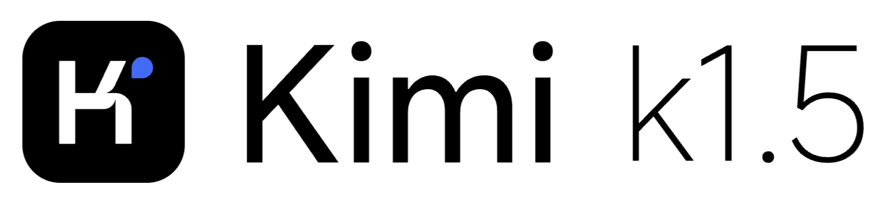
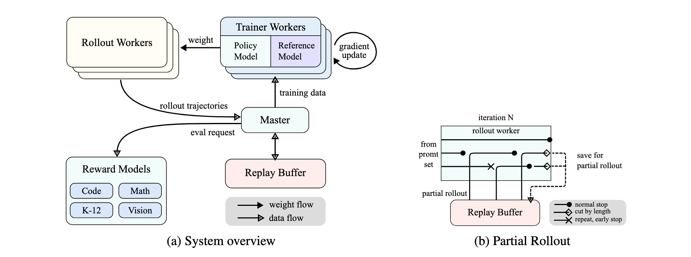
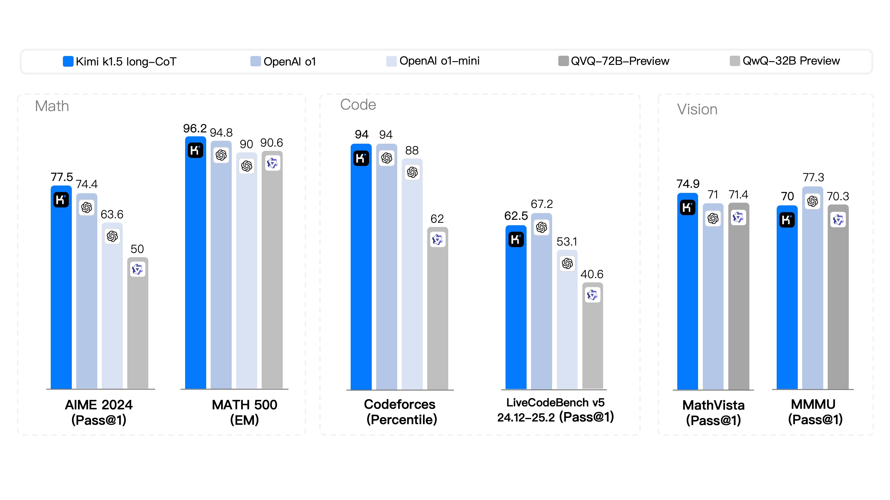
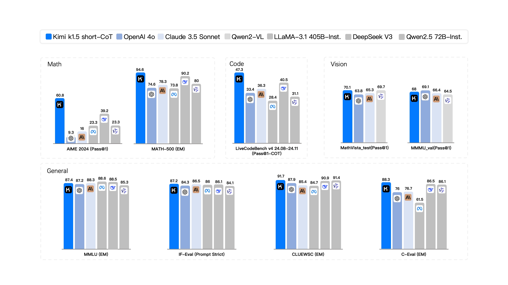

# Kimi k1.5

> [!tldr]
> k1.5 的核心贡献不是“复刻 o1”，而是证明 **RL context length 本身是一条 scaling 轴**：把 long-CoT rollout 扩到 128K，配合 partial rollout、online mirror-descent 风格 policy optimization、难度课程和 long2short RL，在不依赖 MCTS、value function、process reward model 的情况下，让模型学出规划、反思与纠错。

## 一页结论

| 问题 | k1.5 的回答 | 我的判断 |
|---|---|---|
| 推理能力还能怎样 scale？ | 增加 RL rollout context，而不只增参数/数据 | 把 test-time search 与 train-time RL 连接起来 |
| 长轨迹太贵怎么办？ | partial rollout 复用前序轨迹片段 | 这是 k1.5 最可迁移的基础设施贡献 |
| 是否需要复杂搜索树？ | 不依赖 MCTS / value / PRM | 长 context 让线性 CoT 自己承载规划与回溯 |
| 长 CoT 太慢怎么办？ | long2short RL | 不是纯蒸馏答案，而是让短策略继承长策略收益 |
| 是否只做文本数学？ | 文本 + 视觉联合训练与 Vision RL | 推理 scaling 跨模态成立 |
| 证据完整度 | 25 页报告 + 官方系统图与结果图 | 可以达到完整技术精读标准 |

## 核心判断一：context length 是 RL 的有效 compute 轴

报告观察到：随着训练推进，模型回答长度增长，困难 benchmark 的正确率也持续上升；最终把 RL context 扩到 128K 后，hard reasoning 仍有收益。这里的直觉不是“越长越好”，而是更长轨迹给模型更多搜索 step，让它能尝试、发现死路、反思并修正。

这等价于把一棵隐式搜索树压平到上下文中：历史尝试都作为后续 token 的条件。模型不需要显式 value function 管理树节点，却仍能利用整段探索轨迹。

> [!warning]
> 报告也观察到 overthinking：回答长度会在 RL 中显著增加。长度与正确率相关不等于无条件奖励长度；必须配合 length penalty、难度课程和 token-efficiency 目标。

## 核心判断二：partial rollout 是长程 RL 能否跑起来的关键

同步 on-policy RL 有明显长尾：一批 trajectory 里最慢的样本拖住整个 iteration。k1.5 将未完成的 long response 切成片段，跨 iteration 保存并继续，而不是每次从 prompt 重新生成。

它带来三项直接收益：

1. **复用已生成 prefix**，避免长 CoT 重算；
2. **减少 straggler idle time**，较短 rollout 完成后即可推进训练；
3. **保留探索连续性**，模型可从上次未完成的思路继续。

代价是数据会变得更 off-policy：轨迹前段由旧策略生成，后段由新策略续写。k1.5 的 policy optimization 因而必须对更新幅度更稳健，而不能假设每条 trajectory 完全来自当前策略。

## Policy optimization：不是简单 PPO 配方

报告从 long-CoT 场景出发，使用 online mirror descent 风格目标，并补上几项工程机制：

- **长度归一化与长度惩罚**：缓解过度思考；
- **采样策略**：让不同难度样本得到合理 rollout 预算；
- **难度课程**：初期不把大量 compute 浪费在几乎不可能成功的题上；
- **负样本梯度**：相较只学习成功轨迹的 ReST，更直接惩罚错误策略；
- **PTX / data recipe**：维持一般能力和训练稳定性。

关键不是某一个公式，而是 optimization、sampling、curriculum 和 infrastructure 必须围绕长轨迹共同设计。

## Long2short：把“会想很久”转成“能想得短”

k1.5 先获得强 long-CoT policy，再进行 long2short RL，让短输出在固定 token budget 内吸收长策略的能力。报告比较 DPO、shortest rejection sampling、model merge 等方案，long2short RL 在性能—长度平衡上最好。

这与普通 distillation 的差别在于：目标不是逐 token 模仿长 CoT，而是在短预算下重新优化可验证结果。对线上 agent 尤其重要，因为长轨迹能力与产品 latency 不能永远绑定。

## 多模态训练并非附属项

预训练采用多阶段流程：语言预训练、逐步多模态融合、cooldown、long-context activation。视觉 RL 数据覆盖视觉数学、图表、感知与可验证任务；reward 包含 rule-based 与 vision-language reward model。

因此 k1.5 的“reasoning scaling”不只在数学文本成立，也延伸到 MathVista 等视觉推理任务。

## 结果：长 CoT 与短 CoT 要分开读

### Long-CoT

| Benchmark | Kimi k1.5 | 结论 |
|---|---:|---|
| AIME 2024 | 77.5 | 与当时 o1 第一梯队接近 |
| MATH-500 | 96.2 | 高难数学非常强 |
| Codeforces | 94 percentile | 长推理能迁移到代码竞赛 |
| MathVista | 74.9 | 多模态 reasoning 有明确收益 |

### Short-CoT

官方强调相对 GPT-4o / Claude 3.5 Sonnet 在 AIME、MATH-500、LiveCodeBench 上最高可达数倍提升。这里应该读成：long2short 有效压缩了 reasoning 能力，而不是 short 模式全面等价于 long 模式。

评测仍要注意采样次数、token budget、pass@k / percentile 等指标差异；报告中的“o1-level”是能力轮廓，不是所有任务、成本和延迟上的等价。

## 训练与系统细节

| 模块 | 已公开设计 | 研究价值 |
|---|---|---|
| Prompt curation | 去除 trivial / unsolvable，保留可验证中等难度 | RL 数据质量比单纯数量更关键 |
| Long-CoT SFT | 少量高质量 warmup | 给 RL 一个会探索的初始策略 |
| Reward | math/code/vision 可验证 reward + RM | 以 outcome 为主，避免昂贵 PRM |
| RL system | synchronous iteration + partial rollout | 解决长轨迹 straggler |
| Hybrid deployment | 训练/推理解耦又可复用 GPU | 提高 on-policy 资源利用 |
| Sandbox | 动态容器支持代码执行 | reward 来自真实运行结果 |

## 对 Agent Training 的启发

> [!insight]
> 1. **轨迹续写是 agent RL 的基础能力**：web/code agent 的 environment state 也应像 partial rollout 一样可 checkpoint，而不只保存文本。
> 2. **先 scale horizon，再做 token efficiency**：过早强迫短答案可能压掉探索；先学会解决，再用 long2short 压缩。
> 3. **难度课程应按在线成功率更新**：用 pass@k 估计“可学区间”，动态调节任务采样。
> 4. **负轨迹不能只丢弃**：失败 rollout 应进入 policy gradient、preference pair 或 trajectory repair，而不是只保留成功样本。
> 5. **建议实验**：在同一 agent benchmark 上训练 16K/32K/64K/128K 四档 rollout，画成功率—总 token—wall time 曲线，并比较 restart 与 partial-resume。

## 局限与未公开项

- 基座模型参数规模与完整预训练 compute 没有像 K2/K3 那样充分披露。
- 128K context 的训练成本、partial rollout staleness 分布未给完整数字。
- 长 CoT 的 hallucinated self-correction 和无效循环仍需独立审计。
- 视觉 reward model 的训练数据、偏差和鲁棒性披露有限。

## 一手资料

- [Tech Report / arXiv](https://arxiv.org/abs/2501.12599)
- [Official GitHub](https://github.com/MoonshotAI/Kimi-k1.5)
- 本地报告：`src/Kimi-k1.5-Technical-Report.pdf`
- 本地官方说明：`src/Kimi-k1.5 - Official GitHub.md`

## 继续跟踪

- partial rollout 对不同 staleness 的性能与稳定性影响。
- long2short 是否能迁移到多步 tool-use，而不只短答案 reasoning。
- 以 environment state 为目标的长程 agent RL 如何复用这套系统。
