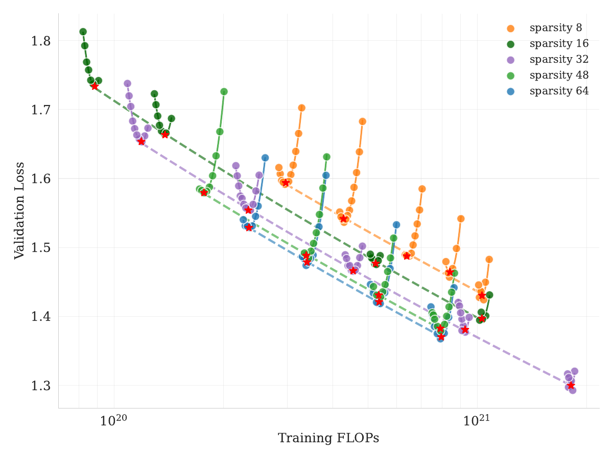
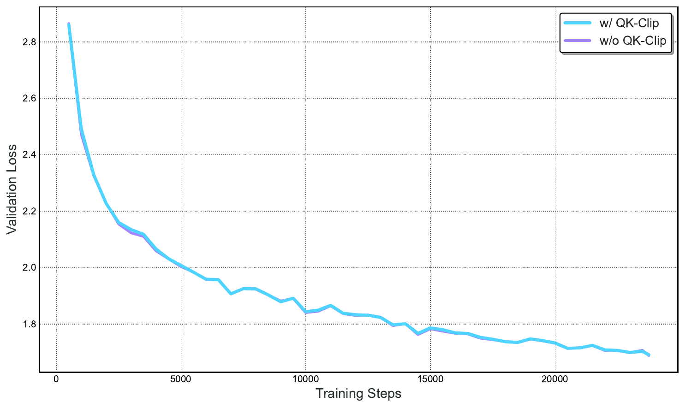
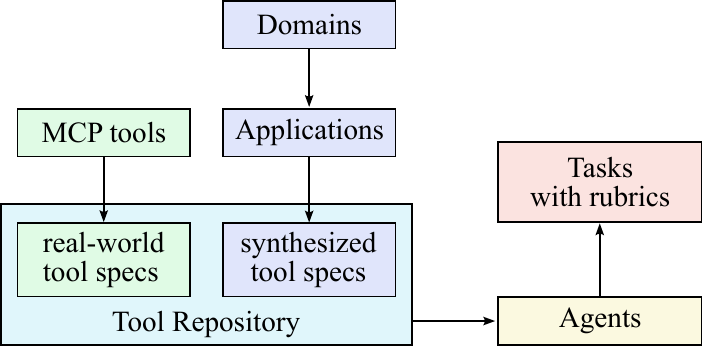
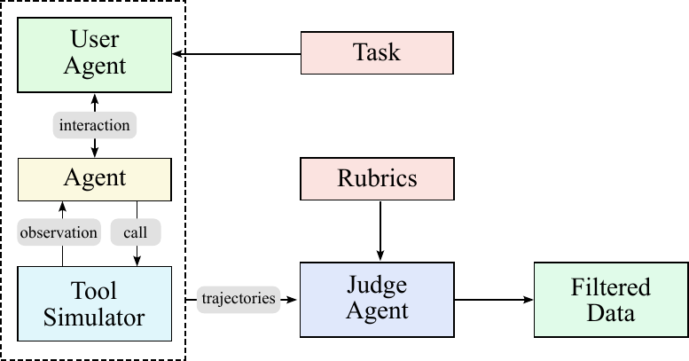
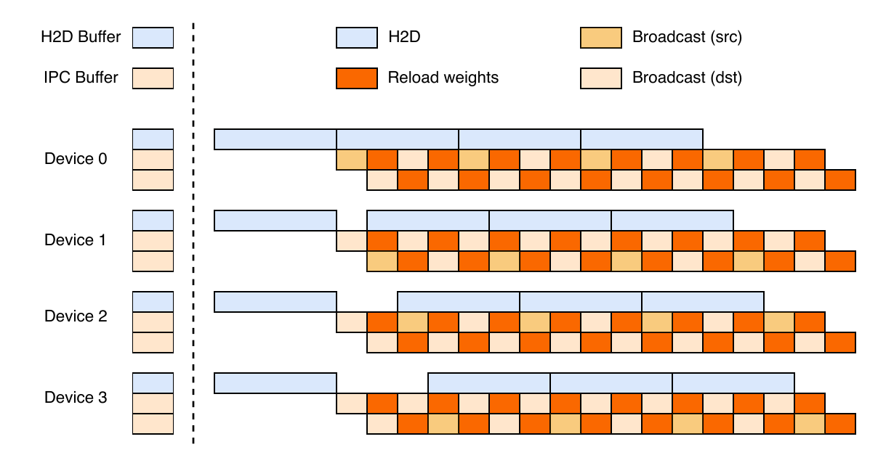

# TL;DR

Kimi K2 是一个 1.04T 参数的 MoE 模型（32B 激活），通过 MuonClip 优化器（Muon + QK-Clip 稳定化）实现了稳定的大规模预训练，并构建了大规模 agentic 数据合成 pipeline + RLVR + Self-Critique Rubric Reward 的完整 post-training 框架，在 SWE-bench、SWE-bench Multilingual、tau2-bench、ACEBench 等 agentic 任务上达到 SOTA，位列 LMSYS Arena 开源模型第一。

## 一页判断

| 维度 | Kimi K2 | 我的判断 |
|---|---:|---|
| 架构 | 1.04T total / 32.6B active，384 experts，top-8 | 用更高 sparsity 扩大知识容量，同时控制单 token 计算 |
| 优化器 | MuonClip | 真正贡献是让 Muon 在万亿参数 MoE 上不因 attention logits 爆炸而失稳 |
| 数据 | 15.5T tokens + rephrasing | 把“同一知识多次暴露”改成语义保持的多样改写 |
| Agent 数据 | 3K+ real MCP tools + 20K+ synthetic tools | 工具分布与任务/trajectory 合成一起扩展 |
| 后训练 | verifiable RL + self-critique rubric reward | 同时覆盖可验证与开放域 agent 目标 |
| 报告完整度 | 完整 Tech Report + LaTeX + 官方图 | 足以做技术精读，但仍不是完全可复现 recipe |

## 问题与动机

当前 LLM 正经历从静态模仿学习向 Agentic Intelligence 的范式转变：模型需要能够自主感知、规划、推理并在复杂动态环境中行动。这一转变对 pre-training 和 post-training 都提出了新挑战：

- **Pre-training**：高质量人类数据日益稀缺，token efficiency（每 token 的学习信号）成为关键 scaling 系数
- **Post-training**：agentic 能力（多步推理、长期规划、工具使用）在自然数据中稀有且难以 scale

核心问题：如何高效合成大规模、高质量的 agentic 轨迹数据，并将其与 RL 技术结合？

## 方法核心思路

### 1. MuonClip 优化器：稳定的大规模 Muon 训练

Muon 在相同 compute budget 下显著优于 AdamW，但 scaling 时会遇到 attention logits 爆炸导致的训练不稳定问题。QK-Clip 通过对 query/key projection weights 进行 per-head 裁剪来解决：

- 计算每个 head 的 max logit $S_{\max}^h$
- 当 $S_{\max}^h > \tau$ 时，对 $\mathbf W_q^{hc}$ 和 $\mathbf W_k^{hc}$ 乘以 $\sqrt{\gamma_h}$，对 $\mathbf W_q^{hr}$ 乘以 $\gamma_h$（其中 $\gamma_h = \min(1, \tau / S_{\max}^h)$）
- 对于 MLA，shared rotary components 保持不变以避免 cross-head 干扰

关键发现：只有少数 head 会出现 logit 爆炸，per-head clipping 最小化了干预。实验中 $\tau = 100$，logits 逐渐稳定衰减，15.5T tokens 训练全程无 loss spike。

### 2. 预训练数据：Rephrasing 增强 Token Utility

- **Knowledge Data Rephrasing**：通过 style-diverse prompting + chunk-wise autoregressive generation + fidelity verification，将知识数据重复暴露多次而不导致过拟合。实验证明：10 次 rephrasing + 1 epoch 训练效果优于 1 次 rephrasing + 10 epoch（SimpleQA: 23.76% → 28.94%）
- **Mathematics Data Rephrasing**：将数学文档改写为"学习笔记"风格，并翻译其他语言的高质量数学材料

### 3. 模型架构：Ultra-Sparse MoE + MLA

| 参数 | DeepSeek-V3 | Kimi K2 | 变化 |
|------|------------|---------|------|
| 总参数量 | 671B | 1.04T | +54% |
| 激活参数 | 37B | 32.6B | -13% |
| 总专家数 | 256 | 384 | +50% |
| 每 token 激活专家 | 8 | 8 | = |
| Attention Heads | 128 | 64 | -50% |
| 稀疏度 | 32 | 48 | +50% |

关键洞察：sparsity scaling law 表明在固定激活参数下，增加 sparsity（总专家数/激活专家数）持续降低训练和验证 loss。sparsity 48 比 sparsity 8 减少 1.69× FLOPs。

Attention heads 从 128 减至 64：128k context 下减少 83% inference FLOPs，而 validation loss 仅增加 0.5%~1.2%。

### 4. 大规模 Agentic 数据合成 Pipeline

**三层架构**：
1. **Tool Spec Generation**：从 GitHub 获取 3000+ 真实 MCP 工具 + 通过 hierarchical domain evolution 生成 20000+ 合成工具
2. **Agent & Task Generation**：为每个 tool-set 生成多样化的 agent（不同 system prompt + tool 组合）和任务，配对 explicit rubric（成功标准、期望工具使用模式、评估检查点）
3. **Trajectory Generation**：多 agent pipeline 生成 + LLM judge 过滤轨迹质量

**关键创新**：
- Multi-turn Trajectory Generation：LLM 生成 user personas 与 agent 多轮对话，tool simulator 维护状态并引入受控随机性
- Hybrid with Real Execution：代码/软件工程任务使用真实 sandbox 而非模拟，提供 ground-truth feedback

### 5. RL Framework：Verifiable Rewards + Self-Critique Rubric Reward

**Verifiable Rewards Gym**：
- Math/STEM/Logical：diverse coverage + moderate difficulty（pass@k 筛选）
- Complex Instruction Following：hybrid rule verification（code interpreter + LLM judge）+ adversarial hack-check
- Coding & Software Engineering：GitHub PR/issues 构建真实开发环境，Kubernetes 支持 10000+ 并发 sandbox

**Self-Critique Rubric Reward**：
- K2 作为 critic，通过 pairwise comparisons 判断自己的输出
- Core rubrics（Kimi 核心价值观）+ prescriptive rubrics（消除 reward hacking）+ human-annotated rubrics（特定上下文）
- 训练过程中 critic 通过 verifiable signals 持续更新（closed-loop critic refinement）

**RL 算法增强**：
- Budget Control：per-sample maximum token budget + 截断惩罚
- PTX Loss：防止在 RL 训练中遗忘高能力数据
- Temperature Decay：从 exploration 到 exploitation 的温度调度

## 关键结果

### Agentic Benchmarks
| Benchmark | Kimi K2 | Claude 4 Opus | Claude 4 Sonnet |
|-----------|---------|---------------|-----------------|
| SWE-bench Verified | 65.8% | ~68% | ~65% |
| SWE-bench Multilingual | 47.3% | - | - |
| tau2-bench | 66.1 | - | - |
| ACEBench (en) | 76.5 | - | - |

### General Benchmarks
| Benchmark | Score |
|-----------|-------|
| LiveCodeBench v6 | 53.7% |
| AIME 2025 | 49.5% |
| GPQA-Diamond | 75.1% |
| MMLU | 89.5% |
| LMSYS Arena | #1 open-source, #5 overall |

### Pre-training Base Model
Kimi K2-Base 在 10/12 English benchmarks 达到 SOTA，数学（MATH 70.22%）、代码（CRUXEval-I 74%）、中文理解（C-Eval 92.5%）均领先。

## 对研究的启发

> [!insight]
> 1. **MuonClip 的工程价值**：QK-Clip 解决了 Muon 大规模训练的不稳定性，为未来使用更高效优化器提供了范式
> 2. **Rephrasing > Multi-epoch**：数据复用应通过多样性改写而非简单重复，这对数据稀缺场景有重要借鉴
> 3. **Agentic Data Synthesis 的规模化路径**：从真实工具（MCP）+ 合成工具双轨构建 diversity，结合真实 execution sandbox 保证 fidelity
> 4. **Self-Critique 将 RL 扩展到开放域**：通过 closed-loop critic refinement，verifiable tasks 的能力可以迁移到主观评判任务
> 5. **对 Agent Training 的直接关联**：K2 把真实 MCP、合成工具、sandbox execution、verifier 与开放域 rubric reward 串成闭环；后续实验应重点拆分 simulator fidelity、真实执行比例和 critic 自举误差。

## 证据边界与复现缺口

报告公开了架构、MuonClip、rephrasing、agentic synthesis、RL 框架与大量结果，但训练数据明细、各阶段 token/compute、合成轨迹规模、reward 权重、critic 更新频率和完整超参数仍不充分。尤其是官方 agentic benchmark 依赖特定 harness 与 sandbox，独立复现时应同时报告模型权重、tool schema、context policy 与执行环境。

## 相关链接
- [Hugging Face Base](https://huggingface.co/moonshotai/Kimi-K2-Base)
- [Hugging Face Instruct](https://huggingface.co/moonshotai/Kimi-K2-Instruct)
- [Tech Blog](https://moonshotai.github.io/Kimi-K2/)
- [Tech Report](https://arxiv.org/abs/2507.20534)
- 本地完整 LaTeX 与图片：`src/`
