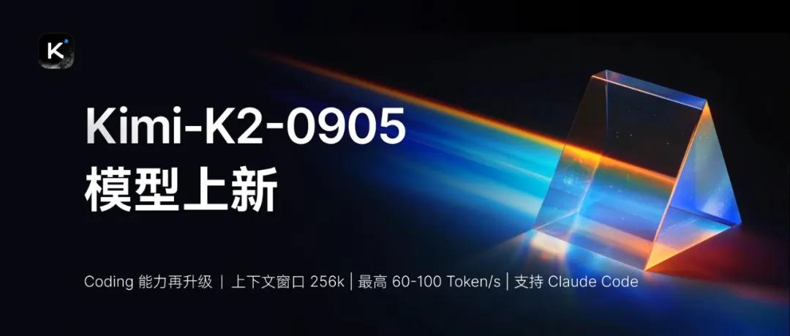
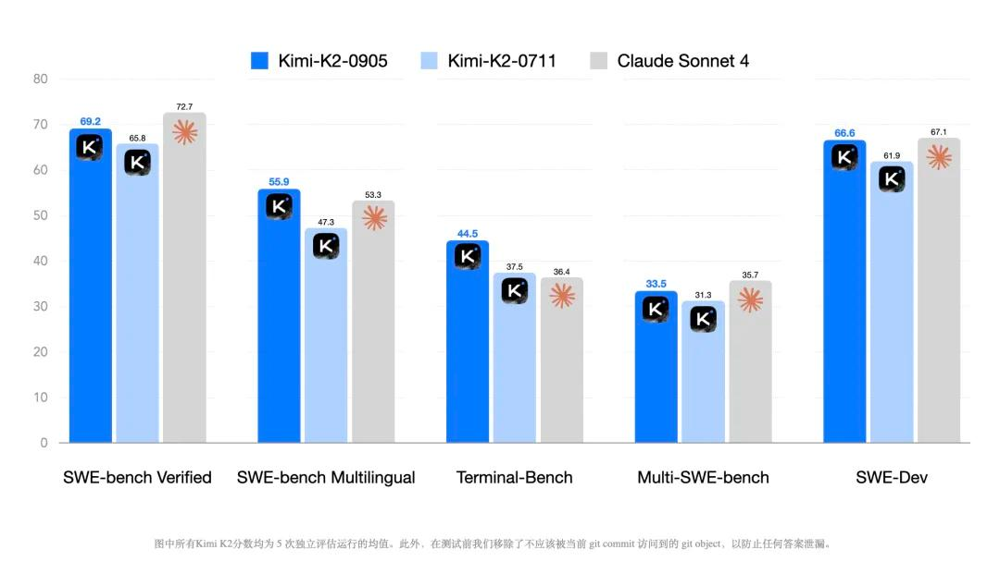
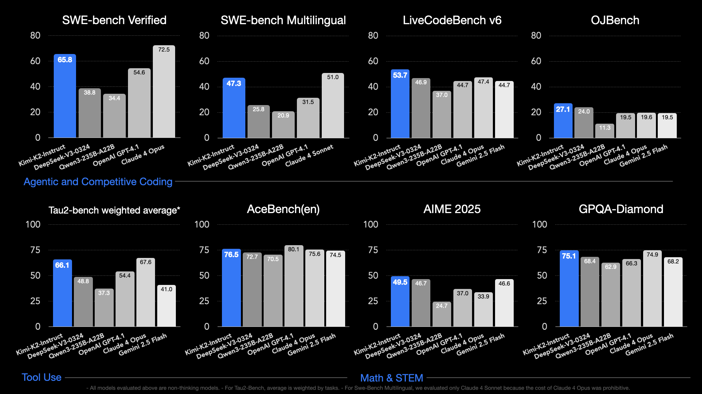

# Kimi K2-Instruct-0905

> [!tldr]
> 0905 是 K2 的第一次关键能力更新：**128K → 256K context**，强化 agentic coding 与前端生成，并在不换主干规格的情况下把 SWE / Terminal 表现整体抬高。它是“同一 K2 底座的 post-training 与服务迭代”，不是新一代 backbone。

## 原始资料边界

**0905 没有独立 Tech Report。** K2 family report 能解释共同的预训练架构、MuonClip 和 agentic post-training 框架，但不能证明 0905 具体用了哪些新增数据、RL 环境或训练步数；版本特有信息主要来自 HF model card 和发布 Tech Blog。因此本文的增量机制只能做到证据约束的分析，**达不到完整独立技术报告级别**。

## 版本定位

| 项目 | K2-Instruct-0711 | K2-Instruct-0905 | 判断 |
|---|---:|---:|---|
| Backbone | 1T / 32B active MoE | 相同 | 没有结构换代证据 |
| Context | 128K | 256K | 对 repo-level coding 和长轨迹最直接的升级 |
| 主要目标 | 通用 agentic model | coding + frontend experience | 更聚焦真实工程交付 |
| API | 普通服务 | 另有 60–100 tok/s high-speed 版本 | 服务层也被作为版本价值的一部分 |
| 权重格式 | block FP8 | block FP8 | 部署生态延续 K2 |

## 为什么 256K 对 coding agent 有实际意义

repo-level coding 的上下文不只是代码：system prompt、issue、检索片段、多个文件、terminal output、test failures 和 patch history 会共同增长。128K 到 256K 不会自动让模型“更会编程”，但会减少三类工程损失：

1. 过早裁剪早期约束，导致修复与需求偏离；
2. 丢失旧 test output，重复探索已经排除的方案；
3. 对大型仓库只能看局部，跨模块依赖推断不完整。

反过来，窗口更大也可能放大噪声和成本，所以 0905 的收益仍依赖 harness 怎样截断 Bash/Edit 输出、怎样检索文件和怎样压缩历史。

## 模型规格

| 项目 | 数值 |
|---|---:|
| Architecture | Mixture-of-Experts |
| Total / active parameters | 1T / 32B |
| Layers | 61（1 dense） |
| Experts | 384 routed，top-8，1 shared |
| Attention | MLA，64 heads，hidden 7168 |
| Expert hidden size | 2048 |
| Vocabulary | 160K |
| Context | 256K |
| Activation | SwiGLU |
| Checkpoint | block FP8 |

## 结果：增量集中在 software engineering

| Benchmark | 0711 | 0905 | 绝对提升 |
|---|---:|---:|---:|
| SWE-Bench Verified | 65.8 | 69.2 ± 0.63 | +3.4 |
| SWE-Bench Multilingual | 47.3 | 55.9 ± 0.72 | +8.6 |
| Multi-SWE-Bench | 31.3 | 33.5 ± 0.28 | +2.2 |
| Terminal-Bench | 37.5 | 44.5 ± 2.03 | +7.0 |
| SWE-Dev | 61.9 | 66.6 ± 0.72 | +4.7 |

这组结果有两个值得注意的点：

- 多语言 SWE 与 Terminal 的增幅大于 Verified，说明改进不只是对某一个常见 benchmark 分布做微调。
- 0905 的结果报告 5 次完整测试的 mean ± std，比只报单次 best run 更可信。

但比较仍不是纯模型对模型：除 Terminal-Bench 使用 Terminus-2 外，其余使用内部 SWE-agent 派生 harness；官方会裁剪 Bash/Edit context 并重写 system prompt。SWE-Dev 还会移除可能泄漏答案的测试文件，这是严谨之处，也意味着必须复用相同协议才能复现。

## 共同技术底座：可以从 K2 报告继承什么

0905 仍建立在 K2 family 上，因此下列机制可以作为背景：

- 1.04T sparse MoE，32.6B active；
- MuonClip 解决大规模 Muon 下 attention logits 爆炸；
- knowledge / math rephrasing 提升 token utility；
- 真实 MCP + 合成工具构成 agentic data pipeline；
- code/SWE 使用真实 sandbox 与 verifiable reward；
- Self-Critique Rubric Reward 扩展开放域偏好信号。

不能直接继承的是“0905 专属改进来自哪一项”。官方没有给出 0711→0905 的数据配比、训练阶段、消融或 compute，所以不能把所有分数增益简单归因于 context extension。

## 前端能力应怎样验收

官方强调 aesthetics 与 practicality，但 model card 没给完整前端 benchmark 表。比截图挑选更可信的验收应同时包含：

| 维度 | 可验证信号 |
|---|---|
| 功能 | build success、DOM assertions、interaction tests |
| 视觉 | screenshot similarity、布局溢出、响应式断点 |
| 工程 | 组件复用、依赖正确、lint/typecheck |
| 审美 | pairwise human preference / rubric judge |
| agent 效率 | tool calls、重试次数、wall time、token cost |

这类任务适合用 verifier + preference 的混合 reward，而不是只让视觉 judge 给总分。

## 部署与 API

- 推荐 temperature `0.6`。
- 支持 vLLM、SGLang、KTransformers、TensorRT-LLM。
- API 兼容 OpenAI / Anthropic；Anthropic-compatible API 会把请求 temperature 乘以 0.6。
- 高速 API 宣称约 60–100 tok/s，这是服务配置，不应与权重本体混写。
- 多步工具调用要求推理引擎支持 K2 native tool parsing。

## 对 Agent Training 的启发

> [!insight]
> 1. **版本增量应在同一 harness 下测**：0905 的 mean ± std 是好习惯，能区分真实提升与 agent run variance。
> 2. **长 context 必须搭配 observation policy**：建议把 terminal output 设计成可学习的保留/压缩动作，而不是永远 hard clamp。
> 3. **多语言 repo 是更好的泛化检查**：训练与评测不应只集中 Python / JS。
> 4. **建议实验**：固定 128K 与 256K 两个窗口，在同一 repo 任务上分别记录成功率、被截断的关键证据、重复命令与成本，验证“窗口”到底贡献多少。

## 一手资料

- [Hugging Face model card](https://huggingface.co/moonshotai/Kimi-K2-Instruct-0905)
- [0905 Tech Blog](https://platform.kimi.com/blog/posts/kimi-k2-0905)
- [K2 family Tech Report](https://arxiv.org/pdf/2507.20534)
- 本地归档：`src/Kimi-K2-Instruct-0905 - Hugging Face.md`

## 继续跟踪

- 是否发布 0905 专属训练说明或消融。
- 256K 长仓库任务中真正被利用的有效 context 比例。
- 前端“审美提升”的可复现评测，而非 showcase。
