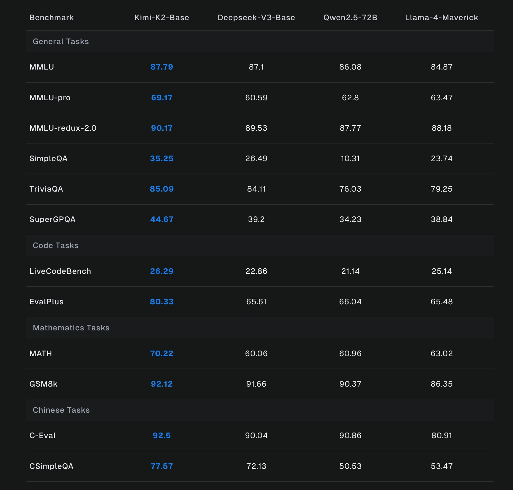

# Kimi K2 Thinking

> [!tldr]
> K2 Thinking 把 K2 从 instruct agent 推向“边想边调用工具”的 reasoning agent：256K context、最长 200–300 次连续工具调用、原生 INT4 QAT，并用 high-budget / heavy mode 扩展 test-time compute。它最值得关注的不是 AIME 高分，而是推理、搜索和工具轨迹被统一为一条可持续的长程策略。

## 原始资料边界

**官方没有发布 K2 Thinking 的独立 Tech Report。** 当前材料是 Hugging Face model card 和官方技术页面；它们提供规格、结果、INT4 与使用方式，却没有完整公开 reasoning SFT 数据、RL 任务配比、reward、训练 compute 和消融。因此本文能做到高质量“发布与机制解读”，但在训练 recipe 深度上**达不到有完整报告支撑的 GLM-5.3-Flash 标准**。

## 一页判断

| 维度 | K2 Thinking | 判断 |
|---|---|---|
| 底座 | K2，1T total / 32B active MoE | 主干不变，提升主要来自 reasoning/agent post-training |
| Context | 256K | 同时容纳长 CoT、工具参数和多轮 observation |
| 长程工具 | 200–300 consecutive calls | 相比常见 30–50 步退化，目标是保持连续目标与状态 |
| 量化 | MoE native INT4 QAT | 量化不是部署后处理，而是 post-training 分布的一部分 |
| Heavy mode | 8 条并行轨迹 + reflective aggregation | 用并行采样扩展 test-time compute，不是单轨迹无限变长 |
| 开放性 | 权重 + model card + tech page | 可运行、可测；训练过程不可复现 |

## 核心变化一：从“回答前思考”到“思考—行动交错”

K2 Thinking 的关键定位是 thinking agent：推理过程中可以动态调用搜索、Python、terminal 等工具，再把结果接回后续 reasoning。与一次性 chain-of-thought 不同，这里每个 tool observation 都会改变下一步策略，因此稳定性取决于：

- 能否在长轨迹中保持任务目标；
- 能否区分有用 observation 与噪声；
- 调用失败后是否会重规划；
- context 接近上限时怎样压缩历史；
- 最终答案能否引用真实工具结果，而非回到先验猜测。

官方称模型可维持 200–300 次连续工具调用；这更接近 Deep Research / coding agent 的真实 horizon，而不是传统 function-calling benchmark 的 1–3 次调用。

## 核心变化二：用 Heavy mode 横向扩展推理

Heavy mode 同时 rollout 8 条轨迹，再通过 reflective aggregation 生成最终答案。它把 test-time scaling 从“单条回答写得更长”扩展到“并行探索 + 汇总”。

结果也显示 Heavy 并非所有任务都只带来微小增益：HLE text-only 从 23.9（无工具）/44.9（有工具）升到 51.0，AIME25 从 94.5 升到 100.0。与此同时，成本至少包含 8 条轨迹和一次聚合，不能把 Heavy 分数与普通单次推理直接比较延迟或价格。

## 核心变化三：INT4 是训练出来的运行形态

模型在 post-training 中对 MoE 组件进行 weight-only INT4 quantization-aware training。官方称低延迟模式约有 2× generation speed-up，且所有公布 benchmark 都在 INT4 精度下获得。

这点比“BF16 模型部署后再 PTQ”更有研究价值：reasoning model 输出长、误差会跨 token 累积，部署后量化更容易破坏策略。QAT 把量化噪声提前暴露给 SFT/RL，使策略适应真正的 rollout precision，也减少 train–inference mismatch。

## 规格与继承关系

| 项目 | 数值 |
|---|---:|
| Architecture | MoE |
| Total / active parameters | 1T / 32B |
| Layers | 61（1 dense） |
| Experts | 384 routed，top-8，1 shared |
| Attention | MLA，64 heads |
| Hidden size | 7168 |
| Context | 256K |
| Vocabulary | 160K |
| Activation | SwiGLU |
| Quantization | native INT4 for MoE components |

这些结构值与 K2-0905 基本相同。没有官方证据说明 Thinking 改了 backbone；合理判断是：它在同一 K2 基座上投入更强的 reasoning、tool-use 与量化适配 post-training。

## 代表性结果

| 类别 | Benchmark | K2 Thinking | K2-0905 | 说明 |
|---|---|---:|---:|---|
| Reasoning | AIME25 | 94.5 | 51.0 | 纯推理差距巨大；Python 条件下 99.1 |
| Reasoning | GPQA | 84.5 | 74.2 | 高难知识推理提升 |
| Search | BrowseComp | 60.2 | 7.4 | 长程搜索/工具是核心增量 |
| Search | FinSearchComp-T3 | 47.4 | 10.4 | 专业检索同样提升 |
| Coding | SWE-bench Verified | 71.3 | 69.2 | 普通 SWE 增幅较小 |
| Coding | SWE-bench Multilingual | 61.1 | 55.9 | 多语言软件工程更明显 |
| Coding | LiveCodeBench v6 | 83.1 | 56.1 | 无工具代码推理提升显著 |
| Terminal | Terminal-Bench | 47.1 | 44.5 | 终端执行不是全面碾压 |

### 评测脚注比排行榜更重要

- 默认 temperature 1.0、256K context；部分 reasoning 允许 96K/128K thinking budget。
- HLE with tools 最多 120 steps，每步 48K reasoning budget；agentic search 最多 300 steps，每步 24K。
- context 超限时隐藏此前所有 tool outputs，只保留管理后的历史。
- SWE 类任务使用内部 SWE-agent 派生 harness；Terminal-Bench 使用 Terminus-2。
- Heavy mode 是 8 路并行，不应与普通模式等成本比较。
- 官方特别说明访问 Hugging Face 可能导致 HLE 泄漏，评测时进行了阻断。

因此 K2 Thinking 的强项可以确认是 reasoning + search-agent，但“模型本体”与“工具预算/框架”的贡献无法从这张表完全拆开。

## 训练机制：能确认与不能确认

### 能确认

- 在 K2 上构建 thinking agent；
- 长程 sequential tool use 是明确优化目标；
- MoE INT4 QAT 发生在 post-training；
- Heavy mode 使用 8 trajectories + reflective aggregation；
- benchmark 使用超长 token/step budget。

### 不能确认

- reasoning prompts、agentic trajectories 的规模与来源；
- RL 算法是否完整继承 K1.5 / K2，具体 objective 与 clip 配置；
- tool success、trajectory reward、judge reward 的组合权重；
- 200–300 calls 的训练分布、成功率曲线与失败类型；
- QAT 对不同 benchmark 的逐项消融。

## 对 Agent Training 的启发

> [!insight]
> 1. **量化必须进入 rollout loop**：如果上线以 INT4 生成轨迹，训练也应在同一数值条件下采样，避免策略对 precision shift 敏感。
> 2. **长 horizon 的关键指标不只是成功率**：应记录第 N 次调用后的目标漂移、重复调用、错误恢复和 evidence retention。
> 3. **并行 test-time scaling 要报告成本前沿**：比较 1/2/4/8 路在成功率、wall time、总 token 上的 Pareto frontier。
> 4. **context management 也是策略的一部分**：discard-all 会改变可见状态，训练时必须让模型接触相同压缩策略。
> 5. **建议实验**：构造 20/50/100/200-call 四档任务，分别测试 full history、summary、hide-tool-result，在固定 token 预算下比较最终成功与事实回溯。

## 使用提醒

- 官方推荐 `temperature=1.0`。
- reasoning content 与最终 answer 分开返回，客户端需保留正确字段。
- tool loop 必须支持 K2 原生 tool parser；只兼容 OpenAI schema 不代表能正确续接 reasoning。
- kimi.com 的轻量 chat mode 会减少工具和 step 数，未必复现 model card benchmark。

## 一手资料

- [Hugging Face model card](https://huggingface.co/moonshotai/Kimi-K2-Thinking)
- [Tech Blog / official technical page](https://moonshotai.github.io/Kimi-K2/thinking.html)
- 本地归档：`src/Kimi-K2-Thinking - Hugging Face.md`

## 继续跟踪

- 等待独立 Tech Report 或训练消融。
- 独立复测 200–300 tool calls 下的目标保持与错误恢复。
- 比较 INT4 / FP8 / BF16 在超长 reasoning 轨迹上的性能漂移。
