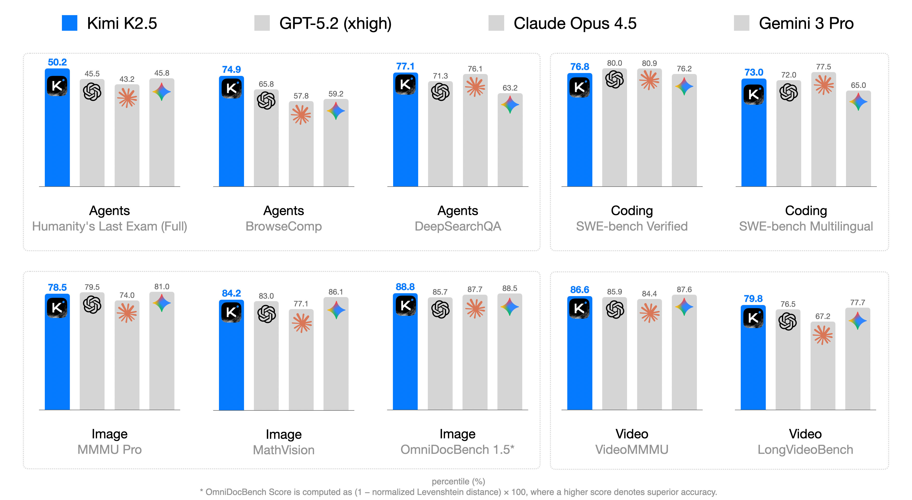
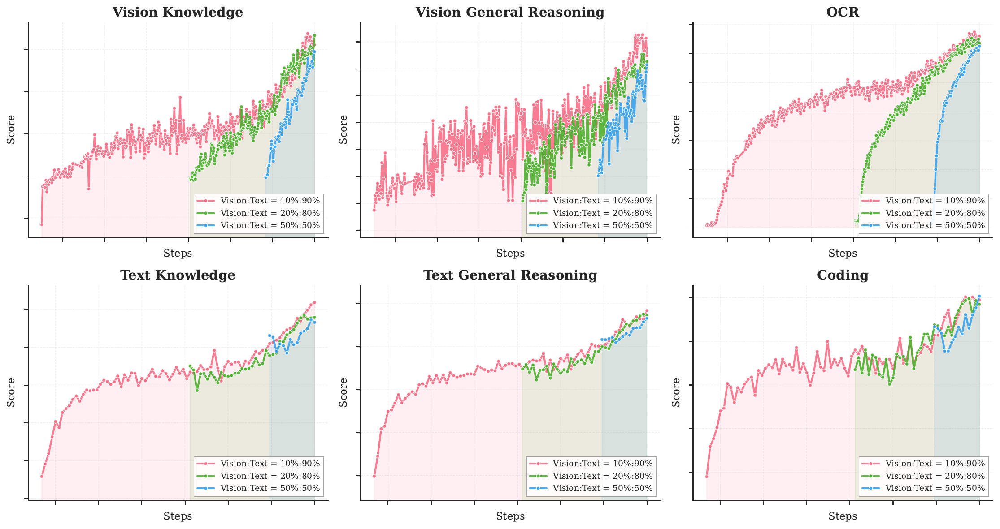
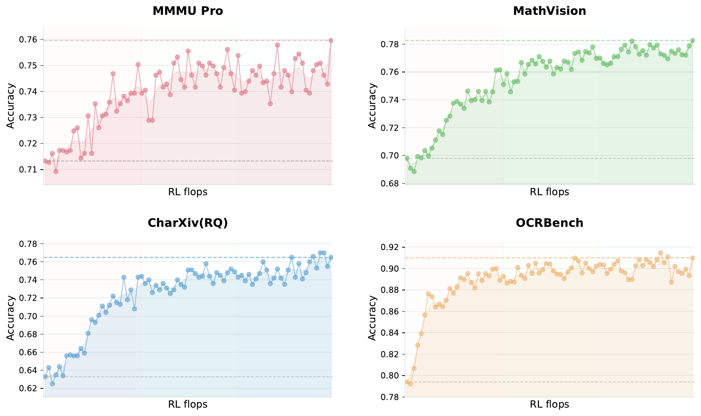
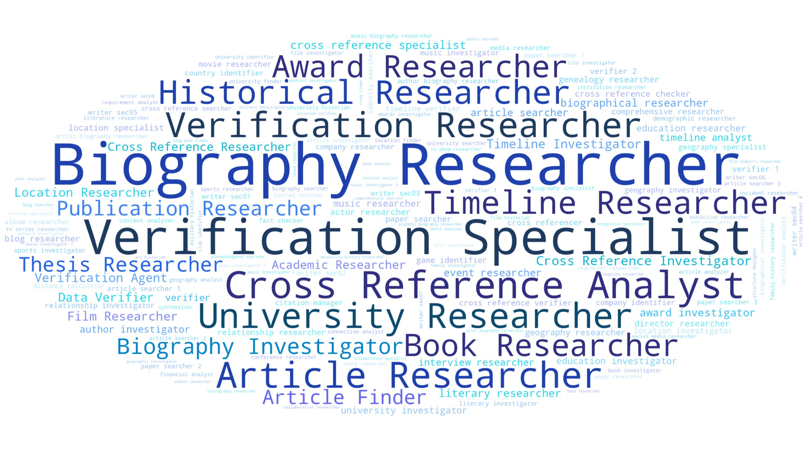
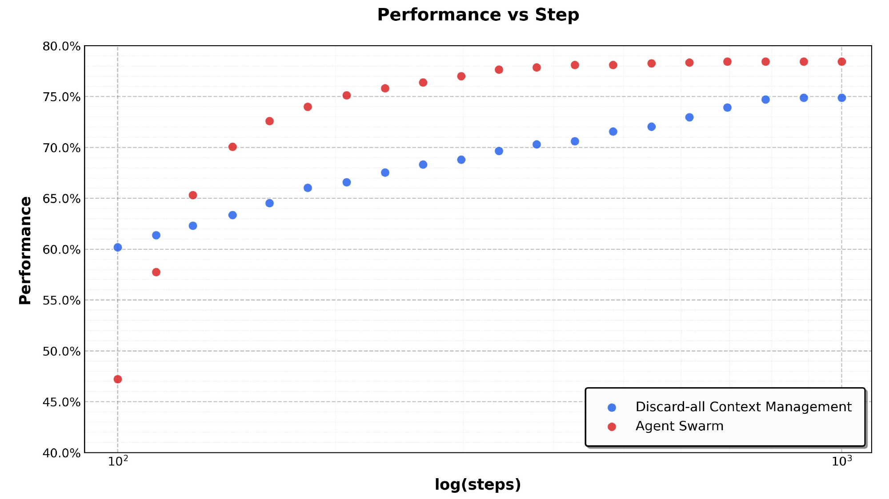
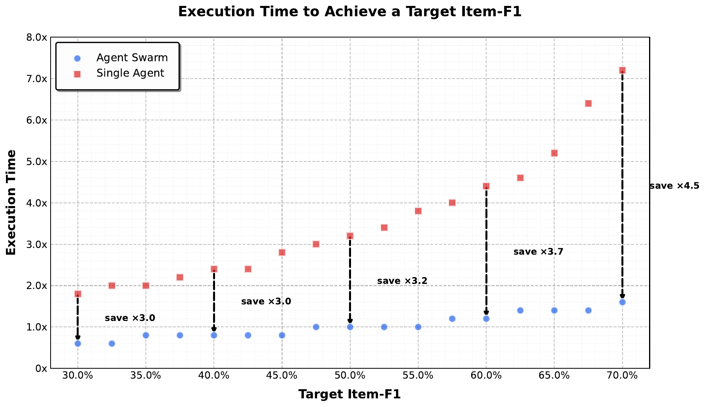

# TL;DR

Kimi K2.5 是一个原生多模态模型，通过两大核心创新构建统一架构：（1）**Joint Optimization of Text and Vision**——早期融合 + 低 vision ratio 的原生多模态预训练策略，配合 zero-vision SFT 激活视觉能力，视觉 RL 还能反向提升文本性能；（2）**Agent Swarm + PARL**——通过 RL 学习动态子 agent 实例化和并行调度，将任务复杂度从线性增长转为并行处理，在 BrowseComp 上比单 agent K2.5 提升 17.8%，同时减少 3~4.5× 执行时间。

## 一页判断

| 维度 | Kimi K2.5 | 我的判断 |
|---|---|---|
| 主干 | K2 级 1T / 32B-active MoE | 重点在原生多模态与 post-training，不是重做文本 backbone |
| 视觉训练 | early fusion + low vision ratio | 证明“更早、更久地混合”比后期大量灌视觉 token 更有效 |
| SFT | zero-vision SFT | 用文本中的程序化图像操作轨迹激活预训练视觉能力 |
| RL | joint multimodal RL | 视觉 RL 对文本 benchmark 产生正迁移，而非相互竞争 |
| Agent | Agent Swarm + PARL | 学习任务分解和并行调度，而不是用固定规则开子 agent |
| Infra | DEP + token-level clipping | 同时解决多模态 pipeline 负载与长程 off-policy drift |
| 报告完整度 | 完整 Tech Report + LaTeX + 10 张官方图 | 可做机制级精读；数据与 compute 仍非完全可复现 |

## 问题与动机

### 多模态联合优化的挑战

传统方法将视觉能力作为"事后附加"：在 LLM 训练后期以高 vision ratio（50%+）引入视觉 tokens。这种方式面临两个问题：
- 视觉-语言对齐不足，模态间存在冲突
- 高 vision ratio 浪费 token 预算（图像 tokens 并不都是信息密集的）

### Sequential Agent Execution 的瓶颈

现有 agentic 模型依赖 sequential execution（每个 reasoning step 和 tool call 按序执行），随着任务复杂度增加，latency 线性增长，限制了可处理的任务复杂度上限。

## 方法核心思路

### 1. Native Multimodal Pre-training

**核心发现（反直觉）**：在固定 vision-text token 预算下，**early fusion + lower vision ratio** 反而优于 late fusion + high vision ratio。

实验结果：

| Vision Injection Timing | Vision Ratio | Vision Knowledge | Vision Reasoning | Text Knowledge |
|------------------------|--------------|-----------------|------------------|----------------|
| Early (0%) | 10%:90% | 25.8 | 43.8 | 45.5 |
| Mid (50%) | 20%:80% | 25.0 | 40.7 | 43.9 |
| Late (80%) | 50%:50% | 24.2 | 39.0 | 43.1 |

**解释**：早期持续的低 ratio 混合让模型在更长训练窗口内自然发展 balanced multimodal representations，实现更深度的跨模态联合优化。

**MoonViT-3D 架构**：
- 从 SigLIP-SO-400M 初始化
- NaViT patch packing strategy 实现 variable-resolution 输入
- 核心创新：3D packing——4 个连续帧视为 spatiotemporal volume，共享参数，实现 4× 时间压缩
- 视频理解与图像理解共享同一参数空间，知识和能力自然迁移

### 2. Zero-Vision SFT

关键洞察：高质量文本 SFT 数据相对丰富，可以"零视觉"激活视觉能力。

**方法**：使用纯文本 SFT 数据，但所有图像操作通过 `IPython` 中的程序化操作代理（如像素级操作、目标尺寸估计、binarization counting 等）。

**结果**：
- 足以激活 diverse 视觉推理行为（目标定位、计数、OCR 等）
- 泛化到视觉 grounded 任务
- 相对于 text-vision SFT，zero-vision 效果更好（因为 joint pretraining 已建立了强 vision-text alignment）

### 3. Joint Multimodal RL

**Outcome-Based Visual RL**：
在 zero-vision SFT 之后，通过 outcome-based RL 进一步提升视觉理解能力。三类任务：
- Visual grounding and counting
- Chart and document understanding
- Vision-critical STEM problems

**关键发现：视觉 RL 提升文本性能**（跨模态正向迁移）：

| Benchmark | Before Vision-RL | After Vision-RL |
|-----------|-----------------|-----------------|
| MMLU-Pro | 84.7% | 86.4% (+1.7) |
| GPQA-Diamond | 84.3% | 86.4% (+2.1) |
| LongBench v2 | 56.7% | 58.9% (+2.2) |

**解释**：视觉 RL 增强了结构化信息提取相关的校准能力，减少了类似于视觉 grounded reasoning（计数、OCR）相关查询的不确定性。

**Joint Multimodal RL Paradigm**：
- 不按输入模态组织 RL 领域，而按能力（knowledge, reasoning, coding, agentic）组织
- Text-vision joint learning，最大化跨模态能力迁移
- GRM（Generative Reward Model）同样跨模态优化

### 4. Agent Swarm + PARL

**核心思想**：不通过预设规则指定并行化，而是让模型通过 RL 学习是否并行、何时并行、如何并行。

**PARL 架构**：
- **Trainable Orchestrator**：可学习的主 agent，负责动态任务分解、子 agent 实例化、并行调度
- **Frozen Subagents**：从固定中间策略 checkpoint 实例化的子 agent，执行轨迹不参与优化
- **Decoupled Design 的优势**：避免 end-to-end co-optimization 的两个核心挑战——credit assignment ambiguity 和 training instability

**PARL Reward**：
$$r_{\text{PARL}}(x, y) = \lambda_1 \cdot r_{\text{parallel}} + \lambda_2 \cdot r_{\text{finish}} + r_{\text{perf}}(x, y)$$

- $r_{\text{parallel}}$（instantiation reward）：防止 serial collapse——鼓励探索并发调度空间
- $r_{\text{finish}}$（sub-agent finish rate）：防止 spurious parallelism——防止通过大量创建无意义子 agent 来刷指标
- $r_{\text{perf}}$（task-level outcome）：最终任务质量

训练过程中 $\lambda_1$ 和 $\lambda_2$ 逐渐 anneal 至 0，确保最终策略优化主目标。

**Critical Steps as Resource Constraint**：
将 parallel agent 执行中的时间成本类比为计算图中的 critical path。定义：
$$\text{CriticalSteps} = \sum_{t=1}^{T} \left( S_{\mathrm{main}}^{(t)} + \max_i S_{\mathrm{sub},i}^{(t)} \right)$$

通过约束 critical steps 而非总 steps，显式激励有效并行化。

**Agent Swarm 作为 Proactive Context Management**：
- 传统 reactive 方法（Hide-Tool-Result, Summary, Discard-all）在 context overflow 后压缩或丢弃历史
- Agent Swarm 通过多 agent 架构实现 proactive context control：长任务分解为并行、语义隔离的子任务，每个子 agent 有独立 bounded local context
- 只有任务相关输出（而非完整交互轨迹）选择性路由回 orchestrator
- 实现 context sharding 而非 context truncation

### 5. RL 算法：Token-Level Clipping

从 K1.5 的 policy optimization algorithm 改进，引入 **token-level clipping** 来缓解 training/inference framework 差异导致的 off-policy divergence：

$$L_{\mathrm{RL}}(\theta) = \mathbb{E}_{x \sim \mathcal{D}} \left[ \frac{1}{N} \sum_{j=1}^K \sum_{i=1}^{|y_j|} \mathrm{Clip}\left(\frac{\pi_\theta(y_j^i | x, y_j^{0:i})}{\pi_{\mathrm{old}}(y_j^i | x, y_j^{0:i})}, \alpha, \beta\right) \cdot \ldots \right]$$

对 log-ratio 在 $[\alpha, \beta]$ 区间之外的 token 梯度置零，显式 bound off-policy drift。对需要长 horizon、multi-step tool-use reasoning 的复杂领域至关重要。

### 6. Decoupled Encoder Process (DEP)

在 Pipeline Parallelism 下，视觉 encoder 和文本 embedding 通常 co-locate 在 Stage-0，但 multimodal input size 的变化导致 compute load 和 memory usage 剧烈波动。

**DEP 三阶段**：
1. **Balanced Vision Forward**：视觉 encoder 在所有 GPU 上复制，基于 load metrics 均匀分配，丢弃中间激活只保留最终输出
2. **Backbone Training**：主 transformer 的 forward/backward，复用纯文本训练优化的并行策略
3. **Vision Recomputation & Backward**：重算视觉 encoder forward，执行 backward 计算视觉 encoder 梯度

DEP 实现 90% 相对纯文本训练的多模态训练效率。

## 关键结果

### 推理与知识

| Benchmark | Kimi K2.5 | Kimi K2 | Gemini-3 Pro | DeepSeek-V3.2 |
|-----------|-----------|---------|--------------|--------------|
| AIME 2025 | **96.1%** | 94.5% | 95.0% | 93.1% |
| HMMT Feb 2025 | 95.4% | 89.4% | **97.3%** | 92.5% |
| GPQA Diamond | 87.6% | 84.5% | **91.9%** | 82.4% |
| HLE-Text | 31.5% | 23.9% | 38.4% | 25.1% |

### Agentic

| Benchmark | Kimi K2.5 | Claude Opus 4.5 | GPT-5.2 |
|-----------|-----------|-----------------|---------|
| SWE-bench Verified | **76.8%** | ~75% | ~78% |
| BrowseComp | **74.9%** (w/ Discard-all) | 37.0% | 65.8% |
| OSWorld-Verified | **63.3%** | 66.3% | - |

### Agent Swarm（并行 vs 单 agent）

| Benchmark | K2.5 Agent Swarm | K2.5 Single | Claude Opus 4.5 | GPT-5.2 Pro |
|-----------|-----------------|-------------|-----------------|-------------|
| BrowseComp | **78.4%** | 60.6% | 37.0% | 77.9% |
| WideSearch Item-F1 | **79.0%** | 72.7% | 76.2% | - |
| In-house Swarm Bench | **58.3%** | 41.6% | 45.8% | - |

WideSearch 上实现 **3×~4.5× 执行时间减少**（随目标 Item-F1 从 30% 增至 70%）。

### 视觉理解

| Benchmark | Score |
|-----------|-------|
| MMMU-Pro | 78.5% |
| MathVision | 84.2% |
| OCRBench | 92.3% |
| LVBench (long video) | 75.9% |
| LongVideoBench | 79.8% |

## 对研究的启发

> [!insight]
> 1. **早期低 ratio 融合 > 晚期高 ratio 融合**：这对未来多模态预训练策略设计有重要启示，固定 token 预算下应追求更长窗口的模态联合优化
> 2. **Zero-Vision SFT 激活视觉能力**：文本-only 数据可以激活跨模态能力，说明联合预训练的 alignment 足够强，值得在 GUI Agent 中借鉴（用文本工具调用轨迹泛化到视觉 grounded tasks）
> 3. **视觉 RL 提升文本性能的双向增强**：模态联合 RL 不是零和博弈，而是可以产生正向迁移——对多模态 RL 设计有指导意义
> 4. **Agent Swarm 将复杂度从线性转为并行**：通过 learned dynamic decomposition，突破了 sequential agent 的能力上限；4.5× latency reduction 对实时 GUI Agent 场景价值巨大
> 5. **PARL 的 credit assignment 解法**：冻结 subagents，将协同逻辑与执行能力解耦——这对多 agent 系统的训练稳定性有普遍参考价值
> 6. **Critical Steps 作为 RL 目标**：将计算图 critical path 的概念引入 RL reward，比单纯激励并行（serial collapse 的反例）更能学到真正高效的调度策略

## 证据边界与复现缺口

报告足以确认 early-fusion/low-ratio、zero-vision SFT、joint multimodal RL、PARL、critical steps、DEP 和 token-level clipping 的设计与主要消融；但预训练/后训练数据清单、各模态 token 总量、swarm 训练任务规模、reward 系数调度、总 compute 与完整系统配置仍未全部公开。Agent Swarm 结果还依赖 orchestrator、subagent checkpoint、工具环境和并发预算，复现不能只下载单一权重。

## 相关链接
- [Hugging Face model card](https://huggingface.co/moonshotai/Kimi-K2.5)
- [Tech Blog](https://www.kimi.com/en/blog/kimi-k2-5)
- [Tech Report](https://arxiv.org/abs/2602.02276)
- 本地完整 LaTeX 与图片：`src/`
