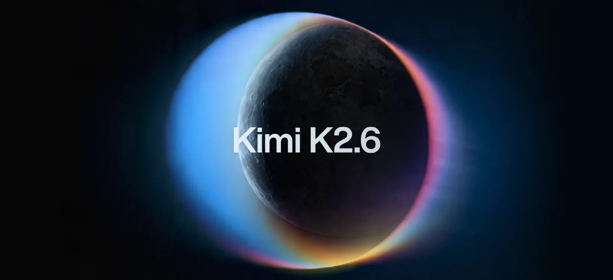
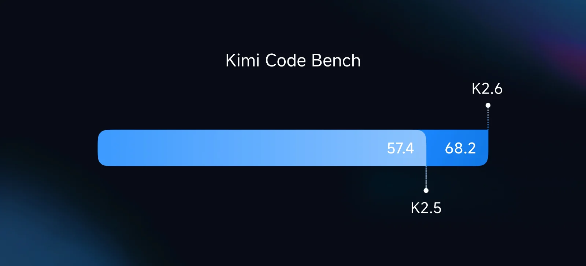
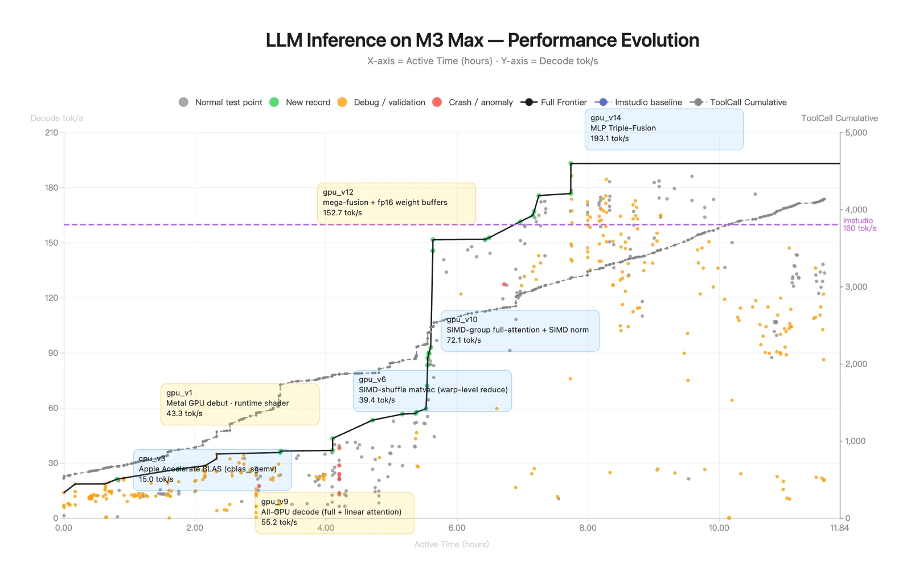

# Kimi K2.6

> [!tldr]
> K2.6 沿用 K2 的 1T / 32B-active MoE 主干和 K2.5 的原生多模态路线，重点不是新架构，而是把能力推向 **长程 coding、coding-driven design、主动后台 agent 和更大规模 Agent Swarm**。它更像 K2 正代的“能力收官版”，不是 K3 那种底座换代。

## 原始资料边界

**K2.6 没有独立 Tech Report。** 当前一手资料只有 Hugging Face model card 与官方 Tech Blog，公开了结构规格、评测、部署和案例，但没有披露专属训练数据、SFT/RL recipe、swarm 训练方法、reward 设计与消融。因此这篇笔记在架构和训练机制深度上**达不到 GLM-5.3-Flash 那种有完整技术材料支撑的精读标准**；以下明确区分官方事实与我的推断，不用宣传文案填空。

## 先给结论

| 维度 | 已公开事实 | 判断 |
|---|---|---|
| 架构 | 1T total / 32B active，61 层，384 experts，top-8，MLA | 基本继承 K2；没有证据表明 backbone 有代际变化 |
| 上下文 | 256K | 与 K2.5 / K2 Thinking 同级，服务长程工具轨迹 |
| 视觉 | MoonViT 400M，原生多模态 | 继承 K2.5 的统一视觉-语言路线 |
| Coding | SWE-Bench Verified 80.2，Terminal-Bench 2.0 66.7 | 这是 K2.6 最明确的增量 |
| Agent | 最高 300 sub-agents、4,000 coordinated steps | 横向 test-time scaling 更激进，但公开训练细节不足 |
| 主动性 | 24/7 background agents、跨平台调度 | 从问答转向持续执行，但安全/恢复/权限证据不充分 |
| 开放性 | 权重 + model card + Tech Blog | 能部署、能验证输出；不能复现训练过程 |

## 它相对 K2.5 真正新增了什么

### 1. 从“会写代码”转向“能完成长程工程任务”

官方把 K2.6 的 coding 场景明确扩到 Rust、Go、Python，覆盖前端、DevOps、性能优化和端到端项目。这里最重要的不是单题代码分数，而是长时间操作 repository、terminal 和 build/test feedback 的稳定性。

评测里 K2.6 相比 K2.5：

| Benchmark | K2.5 | K2.6 | 变化 |
|---|---:|---:|---:|
| Terminal-Bench 2.0 | 50.8 | 66.7 | +15.9 |
| SWE-Bench Pro | 50.7 | 58.6 | +7.9 |
| SWE-Bench Multilingual | 73.0 | 76.7 | +3.7 |
| SWE-Bench Verified | 76.8 | 80.2 | +3.4 |
| LiveCodeBench v6 | 85.0 | 89.6 | +4.6 |

> [!note]
> 这些结果并不只测裸模型：Terminal-Bench 使用 Terminus-2；SWE 系列使用从 SWE-agent 改造的内部 harness。应把分数理解为“模型 + scaffold +工具 + context policy”的系统结果。

### 2. Coding-driven design：视觉输入最终仍通过代码交付

K2.6 强调从简单 prompt 或视觉参考生成 production-ready UI、交互、动画和轻量全栈流程。与图像生成不同，它的输出是可运行的 HTML/CSS/JS 或工程代码，因此视觉理解、设计判断、代码执行和浏览器反馈构成闭环。

对 agent training 来说，这类任务比静态 screenshot imitation 更有价值：最终页面可以通过 build、DOM、交互测试、像素相似度和人工偏好共同验证。

### 3. Agent Swarm 从 K2.5 的实验能力走向更大规模

官方宣称 K2.6 可扩到 **300 个 sub-agents、4,000 个 coordinated steps**，能够把文档、网站、表格等交付任务拆给不同专门 agent。对比 K2.5，BrowseComp Agent Swarm 从 78.4 提升到 86.3，WideSearch item-F1 从 72.7 提升到 80.8。

但 model card 没有回答三个关键问题：

1. 300 个 sub-agents 是训练时上限、评测配置，还是产品演示峰值？
2. orchestrator 是否继续使用 K2.5 的 PARL，reward 和 critical-step 约束是否改变？
3. 4,000 steps 的成本、失败恢复、重复工作率和信息汇聚瓶颈是多少？

因此“更大 swarm”可以确认，“为什么能稳定扩大”暂时不能技术归因。

### 4. Proactive agent 是新的产品能力方向，不等于已解决自治安全

K2.6 被定位为可以持续运行的 background agent：管理日程、执行代码、跨平台工作。这个变化会把训练目标从一次性 task success 推向：

- 长期状态一致性；
- 何时主动、何时沉默；
- 权限边界和高风险动作确认；
- 失败后的 checkpoint / rollback；
- 多任务优先级与资源预算。

官方材料展示了方向，却没有公开这些指标或安全机制的系统评估。因此不能由“24/7”直接推出“可靠自治”。

## 模型规格

| 项目 | Kimi K2.6 |
|---|---:|
| Architecture | Mixture-of-Experts |
| Total / active parameters | 1T / 32B |
| Layers | 61（含 1 dense layer） |
| Routed / selected experts | 384 / 8 |
| Shared experts | 1 |
| Attention | MLA，64 heads，hidden size 7168 |
| Expert hidden size | 2048 |
| Vocabulary | 160K |
| Context | 256K |
| Vision encoder | MoonViT，400M |
| Activation | SwiGLU |
| Quantization | MoE 部分 native INT4 QAT |

规格几乎复用 K2 family。这进一步支持我的判断：K2.6 的主增量来自 post-training、数据、harness 与产品化，而非主干结构。

## 能力结果与边界

| 类别 | 代表结果 | 相对 K2.5 | 判断 |
|---|---:|---:|---|
| Agentic | HLE-Full w/tools 54.0 | 50.2 | 搜索/工具推理继续增强 |
| Agentic | BrowseComp 83.2 / swarm 86.3 | 74.9 / 78.4 | swarm 有增益，但幅度小于 base 能力提升 |
| Agentic | Toolathlon 50.0 | 27.8 | 多工具任务提升明显 |
| GUI | OSWorld-Verified 73.1 | 63.3 | 视觉操作能力提升 |
| Coding | SWE-Bench Verified 80.2 | 76.8 | 高位继续推进 |
| Reasoning | GPQA-Diamond 90.5 | 87.6 | 通用推理也有增益 |
| Vision | MMMU-Pro 79.4 | 78.5 | 视觉知识增益相对温和 |

评测 footnotes 很重要：HLE with tools 最长允许 262,144 tokens；BrowseComp 使用 discard-all context management；SWE 使用内部 harness。不同模型列里的 `*` 还表示部分分数来自官方/公开结果，不是全量同一框架复测。

## 部署信息

- 支持 vLLM、SGLang、KTransformers 等主流引擎。
- 提供 OpenAI / Anthropic-compatible API。
- native INT4 通过 post-training QAT 应用于 MoE 组件，目标是降低显存和生成延迟。
- model card 给出视觉输入、preserve thinking、interleaved thinking 与多步 tool call 示例；应用侧必须保证 tool parser 和 reasoning field 与模板兼容。

## 对 Agent Training 的启发

> [!insight]
> 1. **coding-driven design 是天然的多验证器任务**：build/test 验功能，DOM/视觉指标验结构，preference model 验审美。
> 2. **Swarm 应优化有效并行而非 agent 数量**：同时记录 critical path、重复搜索率、汇总损失和每成功任务的总 token。
> 3. **主动 agent 需要“何时不行动”的负样本**：仅奖励完成任务会把模型推向过度主动。
> 4. **建议实验**：固定同一 backbone，分别训练 single-agent、最多 8-agent、动态 64-agent 的 orchestrator，比较成功率、wall time、总 token 和 unsafe actions，避免用峰值 300-agent 代替效率证据。

## 一手资料

- [Hugging Face model card](https://huggingface.co/moonshotai/Kimi-K2.6)
- [Tech Blog](https://www.kimi.com/en/blog/kimi-k2-6)
- 本地归档：`src/Kimi-K2.6 - Hugging Face.md`

## 仍待补证

- 是否有后续独立 Tech Report；若发布，应补训练数据、RL recipe、swarm 机制和消融。
- 300-agent / 4,000-step 配置的成本、任务分布与复现实验。
- proactive agent 的权限、安全、恢复和长期状态评测。
