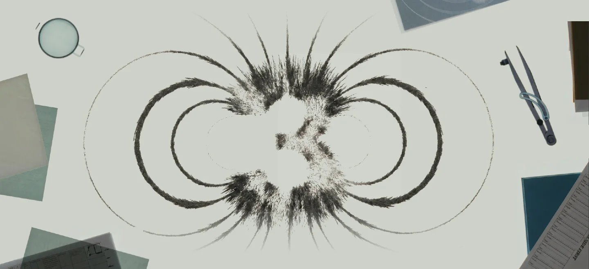
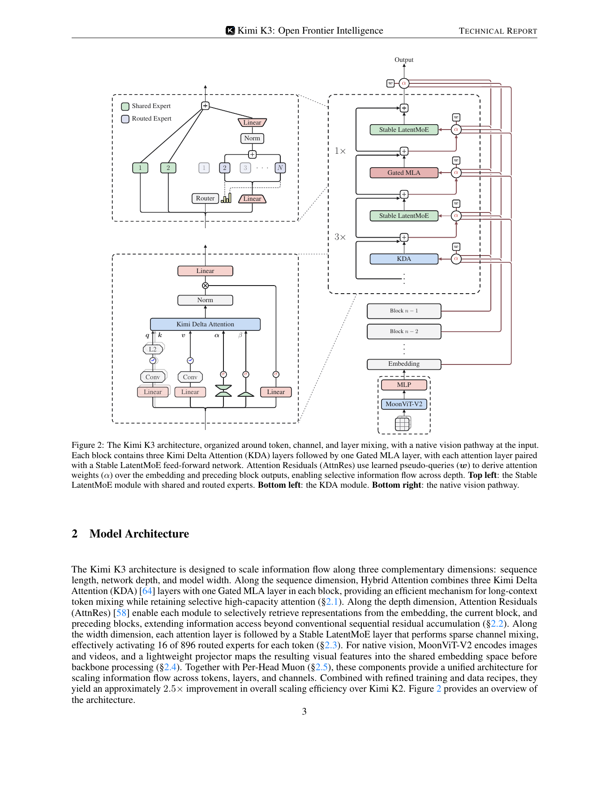
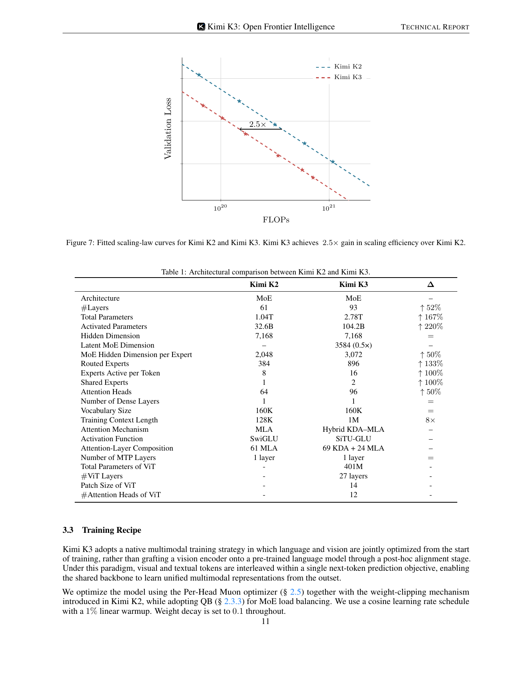
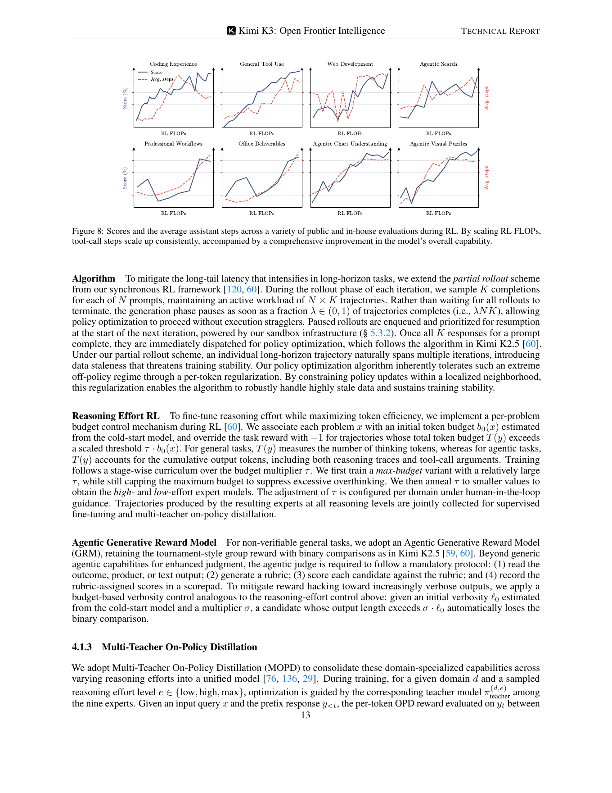
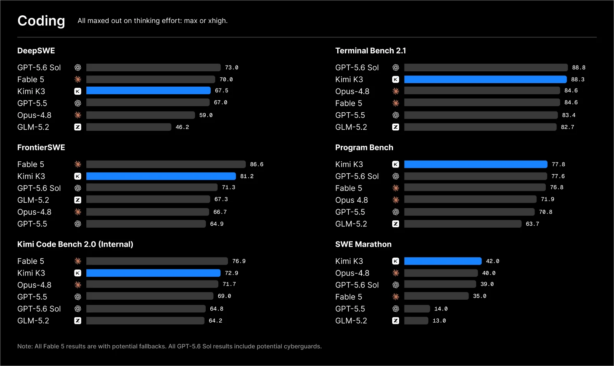
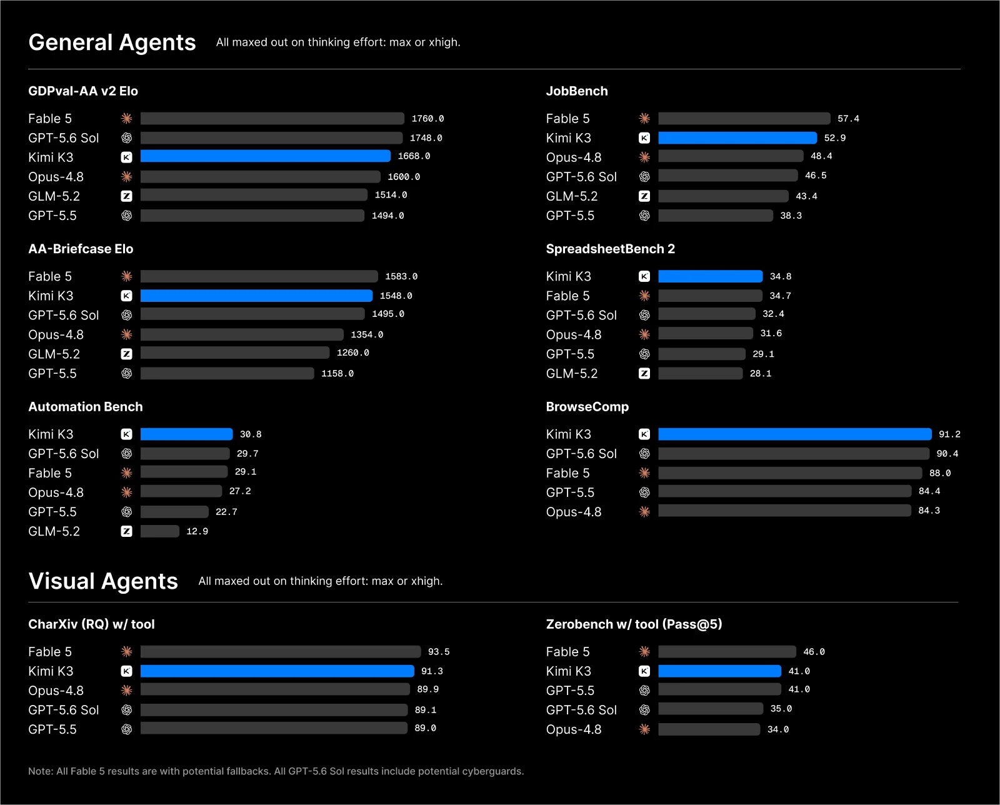
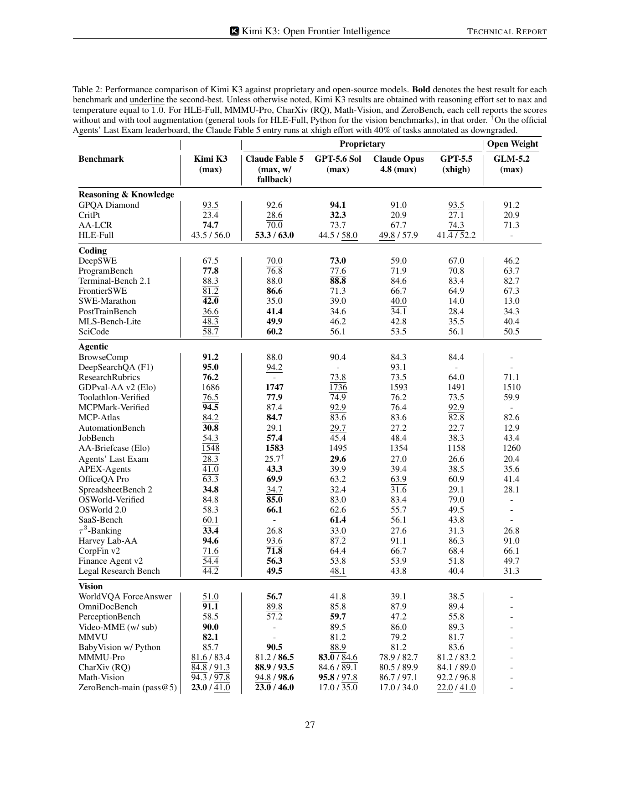

# Kimi K3

> [!tldr]
> Kimi K3 不是 K2 系列的小版本，而是一次同时沿 **序列长度、网络深度、模型宽度** 扩张的架构换代：2.78T 总参数、104.2B 激活参数、1M context，核心由 **KDA + Gated MLA、Attention Residuals、Stable LatentMoE** 组成。它的真正价值不只是 benchmark 更高，而是把长上下文、原生视觉和百万 token 的 agentic RL 放进同一套可训练、可部署的系统里。

## 一页结论

| 维度 | Kimi K3 | 我的判断 |
|---|---:|---|
| 定位 | 开源权重、原生多模态 agentic model | Kimi 从“强模型 + agent 外壳”走向“为长程 agent 共设计的基模” |
| 参数 | 2.78T total / 104.2B active | 参数规模大幅上升，但主要靠更高 MoE 稀疏度维持单位 token 成本 |
| 上下文 | 1,048,576 tokens | 不只是推理窗口；报告把 1M context 真正用于 agentic RL |
| 注意力 | 69 KDA + 24 Gated MLA | 3:1 线性/全局注意力混合，用固定状态压低长序列成本，同时保留周期性全局交互 |
| MoE | 896 routed experts，top-16 + 2 shared experts | Stable LatentMoE 同时解决宽度扩张、训练稳定和负载均衡 |
| 视觉 | MoonViT-V2，401M | 从训练起联合优化，不再把视觉编码器当后装插件 |
| 后训练 | coding / general agents / reasoning & knowledge 三域 RL | 能力来源是多域 RL、环境与系统共同扩展，不是单纯 SFT |
| 开放性 | 权重 + HF model card + 47 页 Tech Report | 证据完整度高，足以做架构、训练、评测和基础设施层面的技术精读 |

## 四个核心判断

### 1. KDA 的意义不是“又一种 linear attention”，而是把 1M context 变成系统能力

K3 每个 block 采用 **3 层 Kimi Delta Attention + 1 层 Gated MLA**。KDA 用带 channel-wise forget gate 的 delta-rule recurrence，把随序列增长的 KV cache 改成固定大小的 recurrent state；MLA 则周期性恢复高容量的全局交互。这个混合设计避免了两种极端：全量 softmax attention 在百万 token 上太贵，纯线性注意力又容易牺牲全局选择性。

报告进一步给出 FlashKDA、KDA Context Parallelism、state-aware prefix cache。这说明 KDA 不是论文里的孤立算子，而是训练、prefill、decode、跨卡并行和请求缓存都被一起改造的系统方案。

### 2. Attention Residuals 在“深度维”解决信息瓶颈

普通 residual stream 只能逐层累积。AttnRes 为每层引入 learned pseudo-query，对 embedding 和前序 block 输出计算选择性权重，让当前层可以直接取回更早的表示。K3 使用 block 版本降低存储和计算开销。

我的理解是：KDA 解决“token 之间怎么在超长序列里交换信息”，AttnRes 解决“信息怎样跨 93 层不被顺序残差稀释”。两者分别扩张 sequence 与 depth，不应混为一种 attention trick。

### 3. Stable LatentMoE 把“更多专家”从规模口号变成可训练结构

K3 从 K2 的 384 个 routed experts / top-8，扩到 **896 / top-16**，并引入 2 个 shared experts。Stable LatentMoE 先将 hidden state 投影到 3584 维 latent space，再做专家计算；SiTU-GLU、quantile balancing 等设计用于缓和激活和路由不稳定。

这使模型在总参数增长 167%、激活参数增长 220% 的同时，报告仍声称相对 K2 有约 **2.5× scaling efficiency**。这里的 2.5× 是拟合 scaling-law 曲线得到的训练效率结论，不应误解为所有在线推理场景都固定快 2.5 倍。

### 4. K3 的 agent 能力来自“可持续的长轨迹训练”

K3 将 RL 分为 coding、general agents、reasoning & knowledge 三个大域，并为 low / high / max 三档 reasoning effort 训练专家，再用 Multi-Teacher On-Policy Distillation 汇合。报告里的关键工程不是一句“做了 agentic RL”，而是：

- partial rollout 允许超长轨迹跨 iteration 暂停、恢复；
- sandbox 状态与外部 KV/KDA state 一起持久化；
- white-box environment 把 tools、system prompt、memory、skills、subagents、context management 组合成不同 harness；
- Autonomous Execution Tasks 以最终环境状态的 verifier 判定，而不是相信 agent 自报完成；
- reasoning effort 与 verbosity 都有 budget control，防止无效延长。

## 架构：K2 到 K3 到底变了什么

| 项目 | Kimi K2 | Kimi K3 | 影响 |
|---|---:|---:|---|
| Layers | 61 | 93 | 更深；需要 AttnRes 缓和深度信息流 |
| Total params | 1.04T | 2.78T | MoE 宽度显著扩张 |
| Active params | 32.6B | 104.2B | 单 token 实际计算也明显增加 |
| Routed experts | 384 | 896 | 专家容量与专业化空间更大 |
| Active experts | 8 | 16 | 每 token 组合更多专家 |
| Attention | 61 MLA | 69 KDA + 24 Gated MLA | 从纯 MLA 进入 hybrid recurrent/global attention |
| Training context | 128K | 1M | 训练阶段已覆盖百万 token |
| Activation | SwiGLU | SiTU-GLU | 配合 Stable LatentMoE 稳定门控 |
| Vision | 无统一原生视觉塔 | MoonViT-V2 | 视觉进入正代 backbone |

## 训练信号：报告公开了什么

### 预训练

- 原生多模态：语言与视觉从训练开始联合优化，而不是后期嫁接视觉塔。
- Per-Head Muon：延续 K2 的 Muon 路线，但对 attention projection 按 head 正交化。
- Quantile Balancing：替代单纯依赖 auxiliary loss 的专家负载均衡。
- KDA 的 context parallelism 让 1M token 训练在多卡上可行。
- 权重采用 MXFP4、激活采用 MXFP8，并在后训练中加入 quantization-aware training。

### 后训练

报告给出的 RL scaling 曲线覆盖 coding experience、general tool use、web development、agentic search、professional workflows、office deliverables、agentic chat understanding 和 visual puzzles。大多数曲线随 RL FLOPs 上升而改善，但平均 steps 并不单调：这提醒我们，agent 能力提升既可能来自“愿意走更长”，也可能来自“更少的错误重试”。

值得复用的训练组件：

1. **多 effort 专家 + on-policy distillation**：先把不同预算下的策略训清楚，再蒸馏成统一模型。
2. **Agentic GRM**：judge 必须先读交付物、生成 rubric、逐项评分并记录证据，减少一句话主观打分。
3. **跨 harness 随机化**：同一任务换 tool schema、memory、skills、subagent 组合，降低对单一 scaffold 的过拟合。
4. **persistent environment**：长任务跨多天模拟，最终从环境状态验证结果。

### 仍未公开的关键量

即使报告完整，也没有给出可复现训练所需的全部信息：预训练 token 总量与各模态比例、训练集明细、学习率/批量完整配置、RL 环境规模与样本量、各 reward 权重、每阶段 compute 均未完全披露。因此这是一份高质量技术报告，但不是可复现 recipe。

## 结果应该怎样读

官方 Coding 图比整页报告表更直观：K3 在 ProgramBench、SWE-Marathon 居首，在 Terminal-Bench 2.1 几乎追平 GPT-5.6 Sol；但 DeepSWE 和 FrontierSWE 仍落后领先闭源模型。它支持“长程 coding 已进入第一梯队”，不支持“代码能力全面第一”。

第二张图把 general agents 与 visual agents 放在一起：BrowseComp、AutomationBench、SpreadsheetBench 2 是明显强项；GDPval-AA、JobBench、CharXiv / Zerobench 仍有差距。这与 K3 的定位一致——工具型知识工作很强，但不同专业交付与视觉推理并未全部封顶。

| 能力 | Kimi K3 | 代表性对照 | 阅读结论 |
|---|---:|---:|---|
| GPQA Diamond | 93.5 | GPT-5.6 Sol 94.1 | 接近顶级闭源推理，但不是全面第一 |
| ProgramBench | 77.8 | GPT-5.6 Sol 77.6 | 报告表中最高 |
| Terminal-Bench 2.1 | 88.3 | GPT-5.6 Sol 88.8 | 终端 agent 已在第一梯队 |
| BrowseComp | 91.2 | GPT-5.6 Sol 90.4 | 长程搜索是最突出的强项之一 |
| DeepSearchQA F1 | 95.0 | Claude Fable 5 94.2 | 深度检索优势明确 |
| MCPMark-Verified | 94.5 | GPT-5.6 Sol 92.9 | MCP / tool-use 表现强 |
| OSWorld 2.0 | 58.3 | Claude Fable 5 66.1 | computer-use 仍是清晰短板 |
| MMMU-Pro | 81.6 / 83.4 | GPT-5.6 Sol 83.0 / 84.6 | 原生视觉已强，但仍非全面领先 |

> [!warning]
> 上表来自官方报告，模型、harness、reasoning effort、工具权限和 context management 并非完全相同。它适合判断能力轮廓，不适合把 0.x 分的差异当作严格模型排名。

## 部署与使用边界

- Hugging Face 权重采用 compressed-tensors；模型卡标注 MXFP4 weights / MXFP8 activations。
- 1M context 是模型上限，不意味着普通部署能经济地跑满；KDA state、MLA KV cache、视觉 token 和 tool trace 仍共同占用资源。
- coding / agentic 推荐 `top_p=1.0`，reasoning / knowledge 推荐 `top_p=0.95`；评测默认使用 max effort。
- 本地部署除了模型权重，还要求推理引擎正确实现 KDA、Block AttnRes、Stable LatentMoE 和相应量化格式。

## 对 Agent Training 的启发

> [!insight]
> 1. **把 harness 当作训练分布的一部分**：工具 schema、memory、context policy、subagent topology 都应随机化，而不是固定在一个 agent 框架里。
> 2. **长轨迹需要状态级续训**：只缓存文本不够；sandbox、KV/KDA state 与 verifier 状态都要能 pause/resume。
> 3. **预算是一等训练变量**：为每个任务估计合理 token/step budget，比统一 max tokens 更利于学到 effort calibration。
> 4. **验证最终世界状态**：AET 的价值在于把 reward 从“答案像不像完成”转为“环境是否真的达到目标”。
> 5. **建议实验**：同一任务在 4 种 harness 配置下做 RL，比较固定 scaffold 与 compositional scaffold 的跨框架迁移；同时记录成功率、critical steps、无效 tool calls 和 context 消耗。

## 与 K2.5 / K2.6 的关系

- **K2.5**：确立原生多模态 + Agent Swarm / PARL。
- **K2.6**：在 K2 架构上强化 coding、design、proactive execution 与更大 swarm，偏能力迭代。
- **K3**：更换主干架构并把训练 context 提到 1M，是新的正代平台。

## 一手资料

- [Hugging Face model card](https://huggingface.co/moonshotai/Kimi-K3)
- [Tech Blog](https://www.kimi.com/en/blog/kimi-k3)
- [Tech Report PDF](https://github.com/MoonshotAI/Kimi-K3/blob/main/k3_tech_report.pdf)
- 本地归档：`src/Kimi-K3 - Hugging Face.md`
- 本地报告：`src/Kimi-K3-Technical-Report.pdf`

## 继续跟踪

- 1M context 在不同推理引擎上的真实吞吐、显存和 prefix-cache 命中率。
- KDA 在超长检索、跨段精确引用和多轮工具状态上的失真模式。
- 开源权重能否在独立 harness 下复现官方 agentic 结果。
