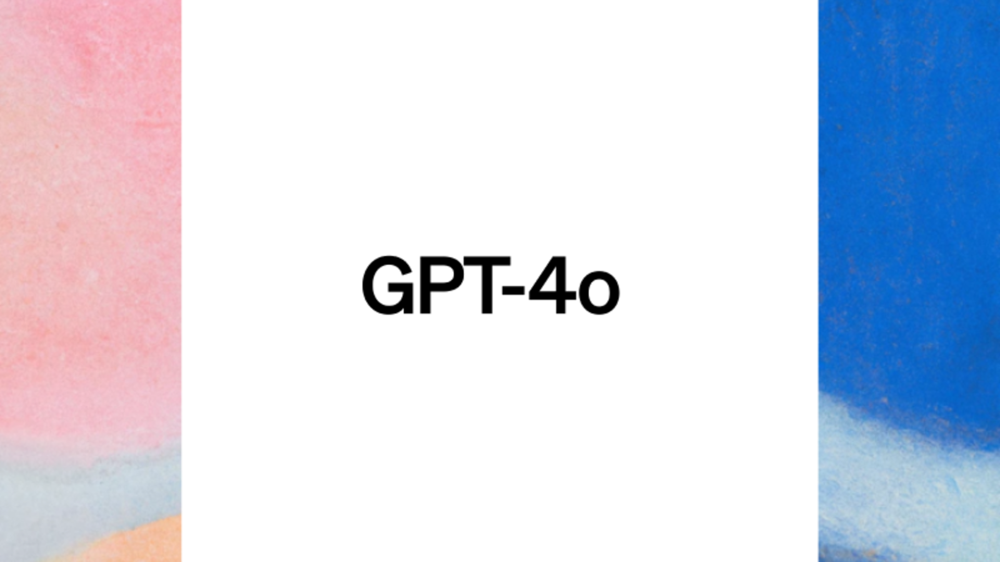

# GPT-4o — Model Overview

> [!tldr]
> 以端到端 omni 模型统一文本、视觉和低时延语音交互。 **我的判断：GPT-4o 的核心不是多加一个视觉编码器，而是减少多模型管线造成的信息与时延损失。**

## 谱系位置

| 字段 | 结论 |
|---|---|
| 团队 | OpenAI · GPT |
| 发布时间 | 2024-05 |
| Atlas 归类 | 主干正代 |
| 主要证据 | Tech Blog |
| 证据充分度 | 见“资料边界”，不把产品页补写成论文 |

GPT-4o 不是孤立 SKU，而是这条主线能力重心的一次迁移。上一代积累的通用语言能力仍是底座，但这一节点把评价重点移到：**以端到端 omni 模型统一文本、视觉和低时延语音交互。** 因此阅读它时不能只看一张 benchmark 表，而要看模型进入真实工作流后，规划、上下文管理、工具调用和失败恢复如何协同。

## 三个必须记住的事实

1. **原生 text / vision / audio**：这是区分前后代的第一条硬证据。
2. **更接近实时的人机响应**：它决定模型更适合怎样的上下文与工作负载。
3. **跨模态输出由单一模型处理**：它说明 family 的产品接口或能力边界如何变化。

## 技术变化怎么理解

### 1. 基础能力层

官方材料可以确认的核心转向是：以端到端 omni 模型统一文本、视觉和低时延语音交互。 这比“模型更聪明”更精确，因为它给出了比较维度；静态知识问答、长上下文利用、推理预算、多模态输入与工具执行不能混成一个总分。

### 2. Post-training 与行为层

闭源模型通常不公开完整数据配比、奖励模型或 RL 环境。本笔记因此只根据公开行为、接口和评测作判断。对 agent training 而言，更值得追踪的是模型是否能持续遵循约束、正确选择工具、消费工具返回值，并在中间步骤失败时修复计划。

### 3. Serving 与工作流层

同一正代内的速度档、成本档、dated snapshot 或上下文档位不重复拆成 Atlas 叶子。它们属于 family 内 serving 选择；只有官方明确形成可独立识别的正代节点，才进入主干时间线。

## 对 Agent Training 的启发

> [!insight]
> GPT-4o 的核心不是多加一个视觉编码器，而是减少多模型管线造成的信息与时延损失。

- 训练数据应保留完整轨迹：计划、调用、观测、验证与恢复，而非只保留最终答案。
- 评测至少拆成任务成功率、轨迹长度、无效调用、上下文成本和恢复成功率。
- 若官方没有训练消融，就不要把产品行为倒推出某一种 RL 或架构；应把它写成待验证假设。

## 横向比较时不要混淆

- **正代 vs. SKU**：family 内参数尺寸、速度档和服务快照不等于新代。
- **上下文窗口 vs. 有效利用**：窗口数字不能替代跨段检索和长程推理测试。
- **benchmark vs. workflow**：单题正确率不能说明长时程 agent 是否稳定。
- **官方事实 vs. 编辑判断**：前三节记录证据，本节及 insight 明确标出判断。

## 资料边界

> [!warning]
> 系统卡披露风险评估，但参数、数据配比和完整训练 recipe 未公开。

因此这份笔记的目标是达到**一手资料能支持的最高标准**，而不是用通用套话伪造参数、训练数据、架构和消融。若后续出现新的 Tech Report / System Card，应优先补进 `src/` 并据此重写技术细节。

## 一手资料

- [Tech Blog](https://openai.com/index/hello-gpt-4o/)
- [Tech Report / System Report](https://cdn.openai.com/gpt-4o-system-card.pdf)
- [[src/Source Index|本地来源索引]]
- [[src/assets/evidence-map.svg|本地证据地图]]

## 导航

- [[Topics/13_base_model/Base Model MOC|Base Model MOC]]
- [[gpt_4o_poster_zh|中文 Poster]]
