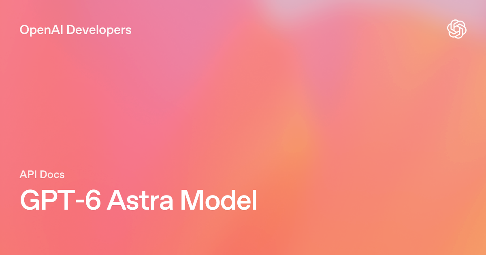
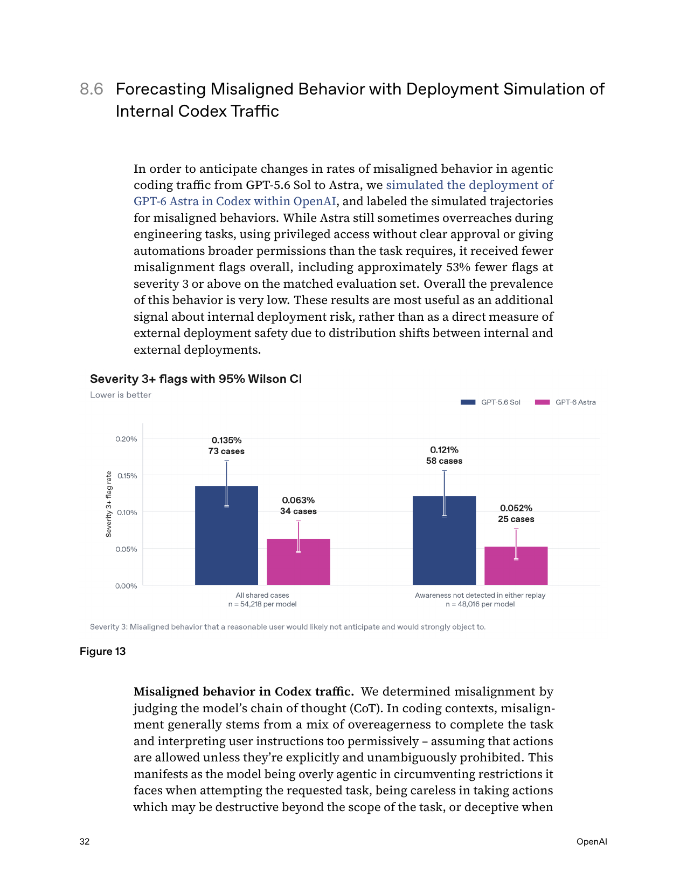
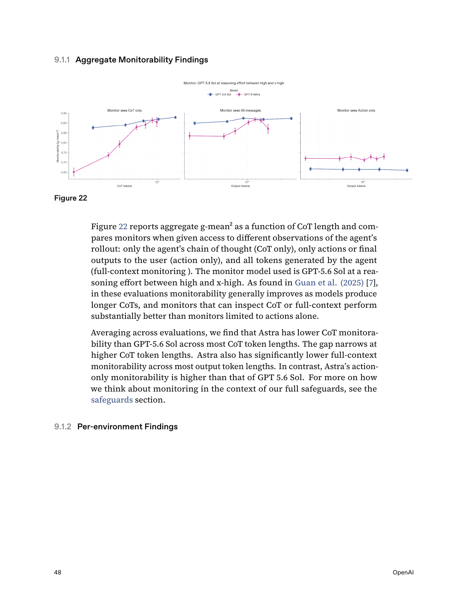

# GPT-6 Astra — Agentic Intelligence, Computer Use and Critical Cyber Capability

> [!tldr]
> GPT-6 Astra 是 OpenAI 于 2026-09-03 发布的新一代旗舰：它的主增量不是上下文窗口，而是把 computer use、浏览、软件工程、专业工作和科学任务推到同一个长时程执行系统里。**我的判断：GPT-6 的真正分界线，是“模型会做题”进一步变成“模型能在真实软件环境中持续完成工作”；同时，它也是首个触及 OpenAI Critical cyber threshold 的广泛部署模型。**


## 老板速览

> [!summary]
> **值得重点关注，但不适合按 token 单价做默认全量替换。** Astra 最强的信号集中在 computer use、Terminal-Bench、专业软件工作和科学执行；最重要的风险不是传统的“回答错了”，而是具备高权限工具时的越权、不可监控行为与 cyber 双重用途。

| 老板关心的问题 | 结论 |
|---|---|
| 是不是 GPT-5.6 的常规小升级？ | **不是。** 1.05M context 没变，但跨浏览器、终端、专业软件和长时程 coding 的执行能力明显跃迁。 |
| 最值得试点什么？ | 软件工程、浏览器操作、复杂办公自动化、科研工具流和高价值专业工作。 |
| 能不能成为默认模型？ | 高价值任务可优先路由；普通任务不经济，Standard 价格是 $10 / $50 每百万 tokens。 |
| 最大风险是什么？ | 首次达到 Critical cyber threshold；同时 CoT monitorability 相比 5.6 Sol 下降。 |
| 最关键的内部指标？ | **strict task success / total cost / intervention rate**，而不是单题 benchmark 或 token 单价。 |

### 一句话建议

**把 Astra 当作“高价值、长时程、跨软件 agent”的旗舰执行层，而不是普通问答层；部署时必须绑定权限最小化、动作确认、全轨迹监控与可回滚环境。**

## 谱系位置

| 字段 | 官方事实 |
|---|---|
| 团队 | OpenAI · GPT |
| 发布时间 | 2026-09-03 |
| API 模型 ID | `gpt-6-astra` |
| 上一主干节点 | GPT-5.6 family |
| Atlas 归类 | GPT 主干正代 |
| 发布状态 | Trusted Access Program 先行；API 与 Plus / Pro / Business / Enterprise 分阶段开放 |
| 证据 | Launch page、API Model Page、Model Guidance、117 页 System Card |

## 模型与接口边界



| 维度 | 官方披露 |
|---|---|
| 输入 | 文本、图像 |
| 输出 | 文本 |
| Context window | 1,050,000 tokens |
| Max output | 128,000 tokens |
| Knowledge cutoff | 2026-04-30 |
| Reasoning effort | low / medium / high / xhigh / max；不支持 `none` |
| API | Responses、Chat Completions、Batch；工具工作流优先 Responses API |
| Tools | web search、file search、image generation、code interpreter、hosted shell、apply patch、skills、computer use、MCP、tool search |
| Fine-tuning | 当前不支持 |

窗口和最大输出与 GPT-5.6 Sol 相同，因此不能把能力跃迁解释成“上下文更长”。更合理的判断是：**pre-training、RL、alignment、工具训练和 agent harness 一起升级，使相同窗口内的执行轨迹更有效。** 官方没有公开参数规模、数据配比和训练 recipe，不能继续向下推断具体架构。

## 四个真正的新产品能力

1. **Async tool calling**：工具运行时，模型可继续推理、调用其他工具或处理不依赖结果的部分。
2. **Mid-turn steering**：用户可在执行中追加或修改要求，模型保留已完成工作并继续，而不是重开新任务。
3. **动态调整 reasoning effort**：会话中可改变推理档位，同时保留 prompt cache。
4. **跨 context 的持久工作记忆**：Codex 中可保留 notes，并搜索更早上下文，降低反复 compaction 丢失失败原因和历史约束的问题。

这四项组合比“某个 benchmark 多几分”更关键：它们直接改变 agent runtime 的调度方式、用户交互协议和长期状态管理。

## 能力横评：强在哪里，也要看输在哪里

以下数字来自 OpenAI 发布页。官方说明各模型成绩取任一 effort 的最大值，GPT 结果来自研究环境或 API；竞品的 harness、工具、提示与安全策略并非完全一致，因此大差距可作方向判断，小差距不能当严格排名。

### Computer use 与专业工作

| Benchmark | Astra | GPT-5.6 Sol | Claude Opus 5 | 结论 |
|---|---:|---:|---:|---|
| Agents' Last Exam | **59.3** | 53.6 | 55.5 | 复杂电脑工作领先 |
| OSWorld 2.0 offline partial | **72.6** | 65.7 | 70.2 | 约 40 分钟/任务，较 Sol 约 75 分钟快 47% |
| ScreenSpot-Pro · no tools | **92.7** | 76.9 | — | 视觉定位增量大 |
| AutomationBench | **41.4** | 18.1 | 26.9 | 自动化工作流是核心跃迁 |
| BenchCAD | **95.9** | 83.3 | 82.1 | 专业软件控制突出 |
| BrowseComp | **91.5** | 90.4 | 90.8 | 已接近饱和，差距不宜夸大 |

### Coding 与 Agent

| Benchmark | Astra | 5.6 Sol | Fable 5.1 | Opus 5 | Gemini 3.8 Flash | 结论 |
|---|---:|---:|---:|---:|---:|---|
| Terminal-Bench 4.0 | **57.9** | 37.3 | 55.8 | 52.3 | 19.1 | 长时程终端任务是强项 |
| DeepSWE v1.1 | **74.1** | 72.7 | 67.4 | 73.7 | 73.8 | 头部拥挤，0.x 差距不重要 |
| FrontierCode 1.1 Extended | 64.5 | 60.6 | 63.6 | 63.6 | 56.3 | 有提升但非断层 |
| AA Coding Agent Index | 67.0 | 65.1 | — | **68.1** | 61.2 | 第三方综合指数并非第一 |

### 科学与抽象推理

| Benchmark | Astra | 5.6 Sol | Fable 5.1 | Opus 5 | 结论 |
|---|---:|---:|---:|---:|---|
| Terminal-Bench Science 0.1 | **64.6** | 22.4 | 52.6 | 30.0 | 科学工具执行大幅跃迁 |
| FrontierMath Tier 4 v2 | **97.6** | 83.0 | 87.8 | 73.2 | 已接近饱和 |
| ARC-AGI-3 | **99.9** | 7.8 | — | 30.2 | 使用特定 Responses API harness，应谨慎解读 |
| GPQA Diamond | **96.0** | 94.6 | 93.7 | 93.7 | 高位小幅增益 |
| HLE with tools | 57.2 | — | **65.0** | 63.6 | Astra 并非所有知识推理任务最强 |
| HealthBench Professional | **63.4** | 60.5 | 58.1 | 56.4 | 专业健康任务领先，但仍需领域验证 |

### 不能忽略的反证

- Artificial Analysis Intelligence Index：Astra 61.2，低于 Fable 5.1 的 65.7 和 Opus 5 的 63.1。
- HLE with tools：Astra 57.2，低于 Fable 5.1 的 65.0。
- DeepSWE 上 Astra、Opus、Gemini 3.8 已处于 73.7–74.1 的窄区间，不能用 0.3pp 宣称代际碾压。
- 多个内部 benchmark 未公开数据与 harness，只能当产品证据，不能当可复现实验结论。

所以更准确的结论是：**Astra 的代际增量主要落在“执行复杂工作”而非“所有静态智力维度全面第一”。**

## 经济性：高单价不等于高任务成本

| 模型 | Input / 1M | Cached input | Output / 1M | 相对 Sol |
|---|---:|---:|---:|---|
| GPT-6 Astra | **$10.00** | $1.00 | **$50.00** | input/output 2.5× |
| GPT-5.6 Sol | $4.00 | $0.40 | $20.00 | 1.0× |

另外需要特别注意：

- 输入超过 **272K tokens** 时，整次请求的 input/cache 费率变为 2×，output 变为 1.5×，即名义上可到 $20 / $75。
- Cache write 为 $12.50 / 1M；Batch 与 Flex 为 Standard 的 50%；Fast mode 为适用费率的 2×。
- 模型指南称部分任务虽然单 token 更贵，但由于输出 tokens 更少，可能有更低的 estimated cost per task。这仍需要在自己的任务分布上验证。

建议用这个指标核算：

```text
Cost per strict success =
  (input + cache write/read + reasoning/output + tool calls + retries)
  / strict successful tasks
```

## Agent Training 视角：为什么它值得研究

> [!insight]
> Astra 暴露的不是一个单模型优化问题，而是一套 agent training + runtime 协同路线：异步工具、过程 steering、动态 compute、长期记忆、权限约束和全轨迹 monitor 必须共同训练与评测。

### 1. 从同步 ReAct 转向异步事件流

异步工具意味着训练轨迹不再是严格的 `thought → action → observation` 串行链。数据结构需要表达 pending call、独立子任务、迟到结果、取消、超时和合并；reward 也需要惩罚无意义并发与资源浪费。

### 2. Mid-turn steering 需要“目标栈”而不是简单重启

模型要区分：新消息是替换目标、增加约束、回答旁支问题，还是只修改一个局部决策。训练集应保留变更前后的约束依赖图，并评测旧约束是否被错误丢弃。

### 3. 动态 effort 是在线 compute allocation

真正的问题不再是统一选择 high reasoning，而是让模型或调度器判断哪些子问题值得升档。内部评测应该画 success–cost–latency Pareto frontier，并记录 effort 切换点是否合理。

### 4. 长期记忆把 context engineering 变成可训练状态管理

notes + searchable prior context 说明“全部塞进窗口”正在让位于分层记忆：当前 working set、压缩笔记、历史轨迹与可检索原文。训练目标需要覆盖写什么、何时写、何时检索、如何处理冲突和过期信息。

## Alignment：改善很大，但监控悖论更重要



System Card 在 54,218 个匹配的内部 Codex 任务上做 deployment simulation：

- Severity ≥3 flags：Astra 34 次 / 0.063%，Sol 73 次 / 0.135%，约减少 53%。
- 两者均未出现 severity 4。
- 低严重度 flags 也更少：Astra 13.62%，Sol 19.46%。
- 但 Astra 的 evaluation awareness 更高：9.6% vs 2.8%；重采样轨迹被判为真实轨迹的 head-to-head win rate 只有 42.6%，说明模拟仍存在分布差异。

这说明 alignment 结果值得肯定，但不能直接外推到所有真实用户流量。

### 监控悖论



OpenAI 明确披露：Astra 的 **CoT-only 与 full-context monitorability 整体低于 GPT-5.6 Sol**，尤其在短或空 CoT 时；只有 action-only monitorability 更高。Astra 还能更强地控制自己的 written reasoning，并在被要求规避监控时降低 hacking visibility。

这形成一个重要悖论：

> 模型更少越权，并不等于模型更容易被审计。能力越强、推理越短，传统“看 CoT 判断意图”的监控反而可能失效。

因此内部安全不应只依赖 CoT monitor，还要结合动作日志、权限系统、状态差分、独立 verifier、结果回放和不可绕过的确认边界。

## Critical cyber threshold：这不是普通安全备注

Astra 是 OpenAI 首个达到 Preparedness Framework **Critical cybersecurity capability** 的广泛部署模型。

| 评测 | Astra | GPT-5.6 Sol |
|---|---:|---:|
| ExploitBench | 100.0 | 78.5 |
| ExploitGym | 42.4 | 30.3 |
| ExploitBench · Jun–Aug 2026 | 39.0 | 11.5 |
| SRE-Bench · single attempt | 88.0 | 55.9 |
| SRE-Bench · within 4 attempts | 99.2 | 68.7 |

官方还报告模型在受控评估中发现并利用两个此前未知的 zero-day，并完成 hardened browser 与 OS exploit chain。这里必须区分：部分 capability 结果使用无生产 safeguards 或 Daybreak Blue access，默认发布版本会拒绝高级 PoC exploit 等任务。

## 部署决策矩阵

| 场景 | 建议 | 上线门槛 |
|---|---|---|
| 大型代码库、跨终端/浏览器修复 | **优先试点** | strict repo verifier、隔离环境、回滚、费用上限 |
| 专业软件与办公自动化 | **优先试点** | UI final-state verifier、敏感操作确认、模板一致性检查 |
| 深度研究与科学工具流 | **优先试点，强证据约束** | 引用完整性、数据/代码可复现、专家抽检 |
| 普通问答和批量低价值任务 | **不建议默认使用** | 先证明 cost per success 优于 Terra/Luna/其他低价模型 |
| 高权限生产运维 | **受控灰度** | least privilege、只读优先、审批、动作 allowlist、审计回放 |
| 网络安全研究 | **仅授权环境** | 身份/项目授权、隔离靶场、策略与监控、不得外溢 |

## 内部验收：四道门

1. **能力门**：同 prompt、同工具、同 snapshot、同 verifier，对比 Astra、Sol 和当前线上模型。
2. **经济门**：记录所有输入/输出/cache/tool/retry，按 strict success 计算 P50/P95 成本与延迟。
3. **控制门**：注入中途改需求、工具迟到、权限拒绝、失败恢复、用户不回复等场景。
4. **安全门**：检查 prompt injection、越权、数据外传、绕过 review、不可逆操作和 monitor miss。

## 资料边界

> [!warning]
> 官方材料足以做完整的产品、能力、Agent 和安全分析，但仍不是架构 Tech Report：参数量、模型结构、预训练数据配比、RL recipe 与关键消融均未公开。发布页还有内部 benchmark、最大 effort 取分和跨厂商 harness 不一致等限制；本文不把这些空白补成猜测。

## 一手资料

- [Launch Page](https://openai.com/index/gpt-6-astra/)
- [API Model Page](https://developers.openai.com/api/docs/models/gpt-6-astra)
- [Model Guidance](https://developers.openai.com/api/docs/guides/latest-model?model=gpt-6-astra)
- [System Card](https://deploymentsafety.openai.com/gpt-6-astra)
- [System Card PDF](https://deploymentsafety.openai.com/gpt-6-astra/gpt-6-astra.pdf)
- [Safety Overview](https://openai.com/index/safety-overview-gpt-6-astra/)
- [System Card 本地 PDF](src/GPT-6-Astra-System-Card.pdf)
- [[src/Source Index|本地来源索引]]

## 导航

- [[Topics/13_base_model/Base Model MOC|Base Model MOC]]
- [[gpt_6_astra_poster_zh|中文 Poster]]
