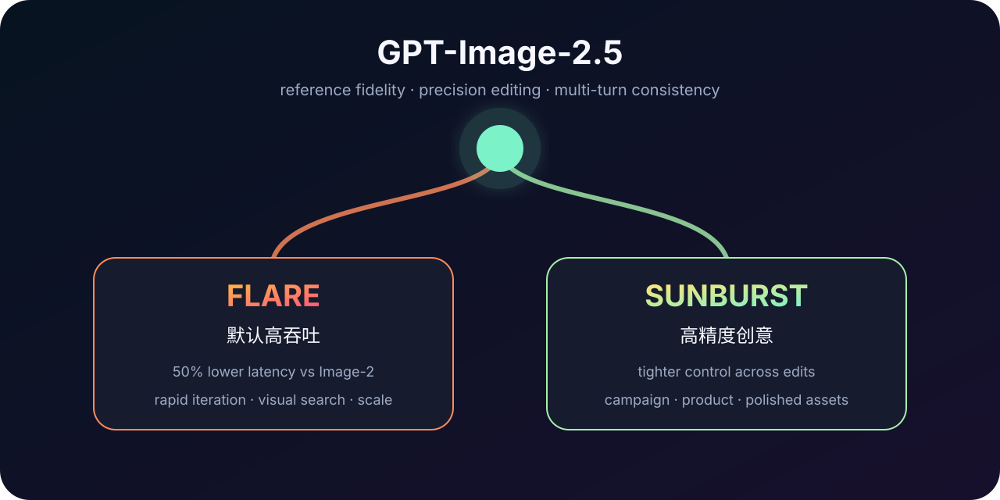

# GPT-Image-2.5 — Flare and Sunburst Family

> [!tldr]
> **GPT-Image-2.5 是 2026-09-08 发布的图像生成 / 编辑 family，Flare 与 Sunburst 共用 2.5 代能力，但分别占据高吞吐与高精度两个服务位。** 官方主张相较 GPT-Image-2，Flare 质量更高且延迟降低 50%；Sunburst 面向更严格的多轮编辑、品牌资产和生产级创意。它们应共用一个 Atlas 叶子，不应把两个 SKU 冒充两代模型。

## 一句话定位

2.5 的核心不是“又能文生图”，而是把生产工作流中最难的三件事同时往前推：

1. **编辑边界**：只改用户点名的元素，尽量保留主体、构图和品牌风格；
2. **多轮一致性**：连续编辑时减少人物、布局和细节漂移；
3. **速度分层**：Flare 负责默认规模化生成，Sunburst 负责高价值精修。

## Family 规格

| 维度 | GPT-Image-2.5 Flare | GPT-Image-2.5 Sunburst |
|---|---|---|
| Model ID | `gpt-image-2.5-flare` | `gpt-image-2.5-sunburst` |
| Dated snapshot | `gpt-image-2.5-flare-2026-09-08` | `gpt-image-2.5-sunburst-2026-09-08` |
| 定位 | 快速、高质量的日常图像生成 | 高精度图像生成与编辑 |
| 官方建议 | 默认选择；高吞吐、迭代、视觉搜索、原型 | campaign creative、商品图、精细多轮编辑 |
| 输入 | Text + image | Text + image |
| 输出 | Image | Image |
| Quality | low / medium / high / xhigh / max / auto | 同左 |
| Text input | $5 / MTok；cache $1.25 | 同左 |
| Image input | $8 / MTok；cache $2 | 同左 |
| Image output | $30 / MTok | $30 / MTok |
| API | Images API；Responses image tool | 同左 |

这两个 ID 的计费相同，选择逻辑主要是 **latency / precision**，而不是便宜版 / 贵版。官方博客称 Flare 比 GPT-Image-2 降低 50% latency，早期客户报告中还出现 2–4× 速度，但后者属于客户测试，不能当作统一 SLA。

## 能力变化

### Reference fidelity

主体身份、构图、光照和纹理在 reference-led workflow 中更稳定。对产品图、角色连续创作和模板化营销材料，这比单张“审美分”更重要。

### Precision editing

模型更能理解“只改这一处”的约束：改背景、文案、服装或商品时，减少对未指定区域的连带修改。真正该测的是 masked / unmasked 区域差异与语义一致性，而不是只让人挑更好看的图。

### Multi-turn consistency

多轮会话中，新的编辑更可能建立在上一步结果上，避免画面质量持续退化。生产评测至少要记录 identity consistency、layout drift、文字准确率和编辑后未修改区域的像素 / 语义保真度。

### Layout、透明背景与复杂指令

官方强调 infographic accuracy、layout、transparent background 和复杂视觉 brief。它使模型更适合海报、演示图、UI concept 和带品牌规则的系列资产，而不只是开放式艺术创作。

## 安全系统不是模型外的附注

System Card 描述了上游拒绝、输入图片检查、prompt + image 联合分析、输出图片检查和离线监控。图像模型更逼真后，deepfake、政治 / 性内容和真实人物伤害的风险也上升。

| 模型 | Safe generated ↑ | Unsafe blocked ↑ | Unsafe presented ↓ |
|---|---:|---:|---:|
| GPT-Image-2.5 Sunburst | 77.0% | 21.9% | **1.09%** |
| GPT-Image-2.5 Flare | **79.4%** | 19.2% | 1.41% |
| ChatGPT Images 2.0 baseline | 75.2% | **23.1%** | 1.64% |

官方提醒这是一组刻意构造的 adversarial prompts，不代表线上违规请求比例；不同 policy 子集样本量也影响统计精度。整体上 2.5 与 2.0 持平或更好，但个别小回退不具统计显著性。

两款 2.5 模型都没有跨过 Bio High 或 Cyber High；OpenAI 仍按较高风险采取预防性生物安全缓解。所有输出继续带 C2PA metadata 与不可见水印。

## 对评测与数据构造的启发

> [!insight]
> 对图像 agent，reward 不应只看最终审美。2.5 的产品主张几乎都要求“带状态的评测”：参考图、每轮编辑指令、未编辑区域、历史版本和最终用途必须一起保存。

建议把内部评测拆成：

- **single-turn quality**：prompt adherence、文字、布局、视觉质量；
- **edit locality**：目标区域变化是否充分，非目标区域是否稳定；
- **multi-turn retention**：第 N 轮是否保留第 1…N-1 轮已确认约束；
- **latency-to-accepted-image**：不是单次生成时间，而是到用户接受所需总轮数与成本；
- **safety utility**：违规拦截、正常创作误拒与真实人物编辑边界同时衡量。

## 资料边界

> [!info]
> 资料达到产品发布 + System Card 级，但不是架构 Tech Report。官方披露了接口、价格、安全栈、主要能力与两个 SKU 的定位，没有公开参数规模、训练计算、详细数据比例、架构与通用质量 benchmark。因此本文不制造参数表，也不宣称视觉质量的绝对排名。

## 一手资料

- [📰 Tech Blog](https://openai.com/index/introducing-chatgpt-images-2-5/)
- [🧯 System Card](https://deploymentsafety.openai.com/chatgpt-images-2-5)
- [📄 System Card PDF](https://deploymentsafety.openai.com/chatgpt-images-2-5/chatgpt-images-2-5.pdf)
- [🧩 Flare API Model Card](https://developers.openai.com/api/docs/models/gpt-image-2.5-flare)
- [🧩 Sunburst API Model Card](https://developers.openai.com/api/docs/models/gpt-image-2.5-sunburst)
- [[src/Source Index|本地来源索引]]

## 导航

- [[Topics/13_base_model/Base Model MOC|Base Model MOC]]
- [中文 Poster](gpt_image_2_5_poster_zh.html)
