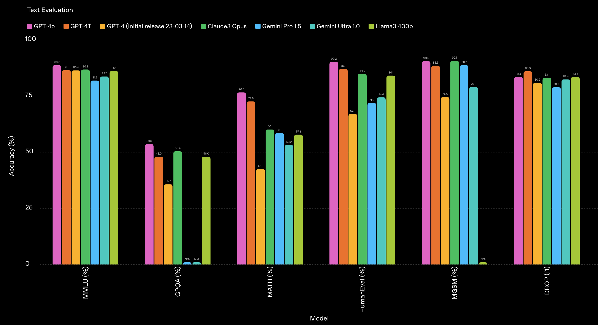
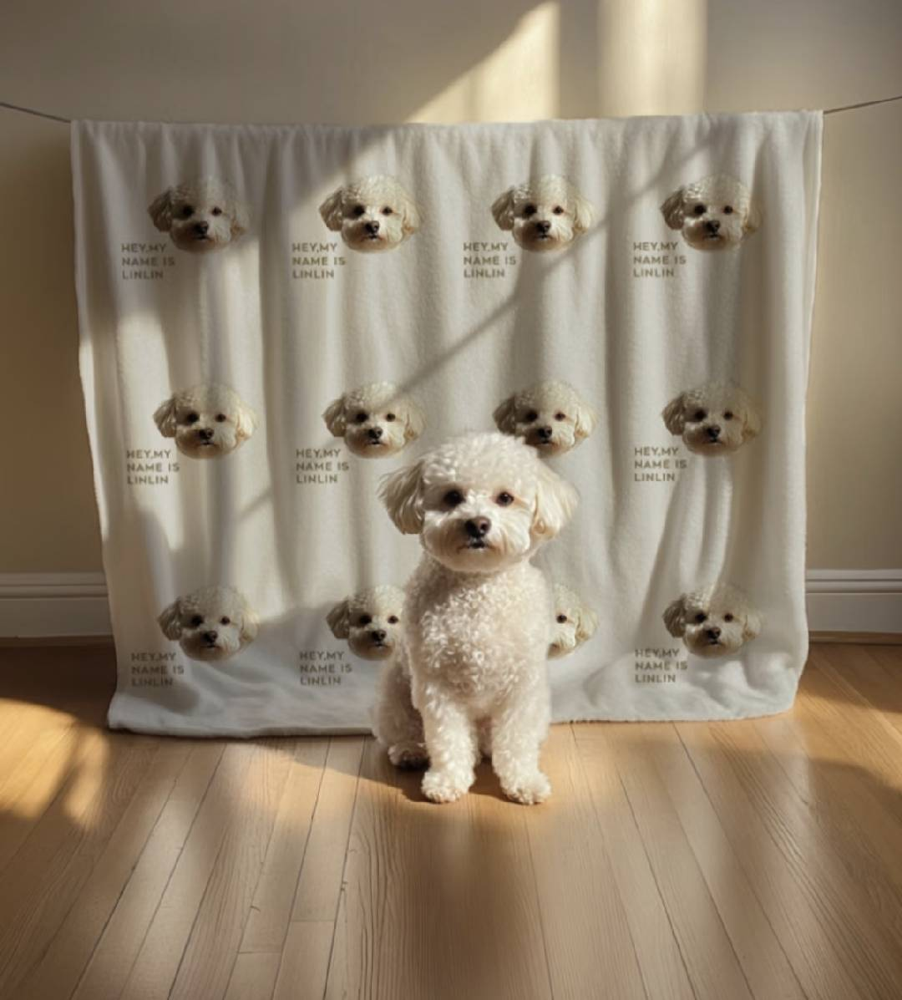

# MiMo-VL Technical Report

> [!tldr]
> MiMo-VL-7B 是第一个把 MiMo-7B-Base 的强文本推理能力迁移到多模态的 VLM。四阶段 curriculum 在 2.4T tokens 上逐步解锁：projector warmup → vision-language alignment → general multimodal → long-context reasoning。MORL（Mixed On-Policy RL）把 RLVR 和 RLHF 融合到统一框架。核心亮点：OSWorld-G 56.1 超越专门 UI agent UI-TARS，OlympiadBench 59.4 超越 72B 模型。

## 问题与动机

MiMo-7B 证明了小模型可以有强推理能力，但只在纯文本域。核心问题是：**如何把文本推理能力迁移到多模态，同时保持 GUI grounding 和视觉理解能力？**

挑战：
1. ViT + LLM 的端到端训练需要大量多模态数据
2. 视觉理解和文本推理的数据分布差异大
3. GUI grounding 需要特殊的 action prediction 能力

## 方法核心思路

### 1. 架构：MiMo-7B-Base + Qwen2.5-ViT

**三组件设计**：
1. **Vision Encoder（Qwen2.5-ViT）**：支持图像和视频的原生分辨率输入
2. **Projector（MLP）**：随机初始化，将视觉编码映射到 LLM  latent space
3. **LLM Backbone（MiMo-7B-Base）**：从文本版 MiMo-7B-Base 初始化，迁移强推理能力

### 2. 四阶段 Curriculum 训练（2.4T tokens）

| 阶段 | Tokens | ViT | LLM | Projector | 核心数据 |
|------|--------|-----|-----|-----------|---------|
| Stage 1 | 300B | ❄️ Freeze | ❄️ Freeze | ✅ Train | image-caption pairs |
| Stage 2 | 167B | ✅ Train | ❄️ Freeze | ✅ Train | interleaved image-text |
| Stage 3 | 1.4T | ✅ Train | ✅ Train | ✅ Train | OCR、grounding、video、GUI、synthetic reasoning |
| Stage 4 | 550B | ✅ Train | ✅ Train | ✅ Train | 长 CoT、高分辨率图像、长文档、长视频 |

**Stage 3 关键设计**：
- 保持 MiMo-7B-Base 的文本能力（limited text-only data）
- 加入 GUI interaction data（移动端、Web、桌面）
- CoT reasoning data 进入预训练

**Stage 4 关键设计**：
- 上下文从 8K 扩展到 32K
- MMMU 平均响应 token 从 680 增长到 2.5K

### 3. MORL（Mixed On-Policy RL）

> [!NOTE]
> MORL 是本文 post-training 的核心创新，把 RLVR 和 RLHF 融合到统一 on-policy RL 框架中，集成在 verl 框架内实现。

#### 3.1 统一架构

MORL 基于 **verl 框架**，配合 Seamless Rollout Engine，实现：
- **RLVR**（RL with Verifiable Rewards）：rule-based reward，可验证结果
- **RLHF**：model-based reward（reward model），隐式偏好对齐
- **Reward-as-a-Service (RaaS)**：统一接口，HTTP 部署 reward 模型，近零延迟 reward 计算
  - reward router 根据 query task type 动态选择对应 reward 函数
  - 所有 reward 归一化到 [0, 1]
  - 无 format reward 等额外信号

#### 3.2 RLVR — Verifiable Rewards（5 类任务）

| 任务类型 | 数据/方法 | Reward 计算 |
|---------|----------|------------|
| **Visual Reasoning** | 80K 可验证 STEM 题（过滤过：MiMo 成功率 > 90% 才用）；从多选转 free-answer 格式防 hack | Math-Verify 库 |
| **Text Reasoning** | 来自 MiMo-7B 的数学推理数据 | Math-Verify 库 |
| **Image Grounding** | general + GUI grounding 任务；bbox 预测用 GIoU，点预测看是否落在 GT box 内 | GIoU / IoU |
| **Visual Counting** | 计数准确性 reward | Accuracy |
| **Temporal Video Grounding** | 输出 `[mm:ss,mm:ss]` 时间戳 | 时序 IoU |

#### 3.3 RLHF — Preference Alignment（双 Reward Model）

**Query 构建**：
- 数据来源：开源指令数据 + 人工编写
- 多样性保障：embedding 聚类分析 pattern + 中英文平衡 + helpful/harmless 平衡
- 经过 screening 后形成最终 query set

**Pairwise Response 生成**：
1. 对每个 query，让 MiMo-VL-7B + 多个其他 top VLM 生成 response
2. advanced VLM 对这些 response 做 pairwise 排序
3. 排序结果用于训练 reward model

**Reward Model**：Bradley-Terry 目标训练

| RM 类型 | 初始化权重 | 职责 |
|---------|-----------|------|
| Text-only RM | MiMo-7B | 处理纯文本 query |
| Multimodal RM | MiMo-VL-7B | 处理含图像 query |

**防 Reward Hacking 设计**：
> ⚠️ **训练 query set = RL query set**：reward model 的训练样本（query + pairwise response 排序）和 RLHF 阶段实际优化时用的 query 是同一套。

这样设计是为了避免 reward model 在 unseen query 上给出虚高的 reward 分。如果 reward model 训练和 RL 阶段用不同 query，reward model 可能对训练 query 过拟合，RL policy 就能"作弊"拿到高分而不真正提升。同一套 query 让 reward 评估更诚实。

#### 3.4 On-Policy RL 算法（GRPO 变体）

##### PPO vs GRPO vs MiMo-VL GRPO 对比

**PPO（Proximal Policy Optimization）**：

$$\mathcal{J}_{\mathrm{PPO}}(\theta) = \mathbb{E}_{q\sim D, o\sim \pi_\theta} \left[\min\left(\frac{\pi_\theta(o|q)}{\pi_{\theta_{\mathrm{old}}}(o|q)} \hat{A}, \mathrm{clip}\left(\frac{\pi_\theta(o|q)}{\pi_{\theta_{\mathrm{old}}}(o|q)}, 1-\epsilon, 1+\epsilon\right) \hat{A}\right)\right]$$

- 需要 value network 估计 $V(s)$
- off-policy：需要 importance sampling 修正 $\pi_\theta / \pi_{\theta_{\mathrm{old}}}$
- clipped surrogate + KL penalty

**Vanilla GRPO（DeepSeek-Math，原版）**：

$$\mathcal{J}_{\mathrm{GRPO}}(\theta) = \mathbb{E}_{q\sim P(Q), \{o_i\}_{i=1}^G \sim \pi_{\theta_{\mathrm{old}}}} \left[\frac{1}{G}\sum_{i=1}^G \frac{1}{|o_i|}\sum_{t=1}^{|o_i|} \min\left(\mathrm{ratio} \cdot \hat{A}_{i,t}, \mathrm{clip}(\mathrm{ratio}, 1-\epsilon, 1+\epsilon) \cdot \hat{A}_{i,t}\right) - \beta \cdot \mathbb{D}_{KL}[\pi_\theta \| \pi_{\mathrm{ref}}]\right]$$

其中 $\mathrm{ratio} = \frac{\pi_\theta(o_{i,t}|q, o_{i,<t})}{\pi_{\theta_{\mathrm{old}}}(o_{i,t}|q, o_{i,<t})}$，$\hat{A}_{i,t} = \tilde{r}_i = \frac{r_i - \mathrm{mean}(\{r\})}{\mathrm{std}(\{r\})}$

- **Group-relative advantage**：同 group 内所有 response 的 reward 均值作为 baseline，不需要 value network
- **仍然有 clipped surrogate**：和 PPO 一样用 min(clip(...)) 防止大更新
- **仍然有 KL regularization**：向 reference policy $\pi_{\mathrm{ref}}$ 靠拢
- 每个 query 采样 $G=64$ 条 response

**MiMo-VL 的 GRPO 变体（Fully On-Policy）**：

$$\mathcal{J}_{\mathrm{GRPO}}(\theta) = \mathbb{E}_{q\sim D,\{o_i\}_{i=1}^G\sim \pi_\theta(\cdot|q)} \left[\frac{1}{\sum_{i=1}^G\left|o_i\right|}\sum_{i=1}^G \sum_{j=1}^{\left|o_i\right|} A_{i,j}\right]$$

其中 $A_{i,j} = \frac{r_i - \mathrm{mean}(\{r_i\}_{i=1}^G)}{\mathrm{std}(\{r_i\}_{i=1}^G)}$

| 维度 | Vanilla GRPO | MiMo-VL GRPO |
|------|-------------|--------------|
| **Clipped surrogate** | ✅ 有 $\min(\cdot, \mathrm{clip}(\cdot))$ | ❌ 无 |
| **KL regularization** | ✅ 有 $\beta \cdot D_{KL}[\pi_\theta \| \pi_{\mathrm{ref}}]$ | ❌ 无 |
| **Policy 更新次数** | 每个 query 多次梯度更新 | 每个 query 单步更新 |
| **采样策略** | 固定 G=64 | 动态采样 + 易样本过滤 + 重采样 |

**核心区别**：MiMo-VL GRPO 在 vanilla GRPO 基础上**移除了 clipped surrogate 和 KL regularization**，只保留最本质的 group-relative advantage 信号。rollout → 计算 advantage → 单步更新 → 重新 rollout。完全 on-policy，不需要 importance sampling。

## 实验结果

### 多模态理解（表4）

| Benchmark | MiMo-VL-7B-SFT | MiMo-VL-7B-RL | Qwen2.5-VL-7B | InternVL3-8B | GPT-4o |
|-----------|----------------|----------------|---------------|--------------|--------|
| MMMU (val) | 64.6 | **66.7** | 58.6 | 62.7 | 70.7 |
| MMMU-Pro (standard) | 45.2 | **46.2** | 34.7 | 45.6 | 56.5 |
| MMBench-en (test) | **84.5** | 84.4 | 83.5 | 83.4 | 84.6 |
| Mantis | **78.8** | 78.3 | 74.7 | 72.8 | 75.6 |

**RL 策略选择**：SFT vs RL 因 benchmark 而异。MMMU 需要 RL，MBench 需要 SFT。

### GUI Grounding（关键亮点）

| Benchmark | MiMo-VL-7B-RL | UI-TARS (specialized) | Qwen2.5-VL-7B |
|-----------|----------------|----------------------|---------------|
| OSWorld-G (no_refusal) | **56.1** | 52.4 | — |
| ScreenSpot | **87.3** | — | — |
| ScreenSpot-v2 | **90.5** | — | — |
| ScreenSpot-Pro (avg) | **41.9** | — | — |

**OSWorld-G 56.1** 是关键突破——一个通用 7B VLM 超越了专门为 GUI 设计的 UI-TARS。

### OlympiadBench

- **MiMo-VL-7B-RL：59.4**
- 超越所有对比模型，包括 72B 参数模型

**核心结论**：MiMo-VL-7B-RL 在 40 个评测任务中 35 个超越 Qwen2.5-VL-7B。

## 对研究的启发

> [!insight]
> MiMo-VL 对 GUI Agent 研究最有价值的发现是：通用 VLM 通过 GUI 数据的 curriculum 训练可以达到专门 GUI agent 的性能。这意味着未来 GUI agent 的瓶颈可能不在模型架构，而在 GUI 数据的质量和多样性。

**可转化的问题**：
- before/after screenshot prediction 是否可以作为 GUI 预训练任务？
- GUI action space 统一后（mobile/web/desktop），不同平台数据如何高效合流？
- 多模态 RL 的 reward 设计如何同时兼顾 reasoning 和 grounding？

## 相关资料

- arXiv：https://arxiv.org/abs/2506.03569
- 系列总览：[[Topics/13_base_model/Xiaomi_MiMo/2606_MiMo_Series/MiMo-Series-From-7B-Reasoning-Model-to-Omnimodal-Agent-Foundation-Models]]
- MiMo-7B：[[Topics/13_base_model/Xiaomi_MiMo/2505_MiMo_7B/MiMo]]
