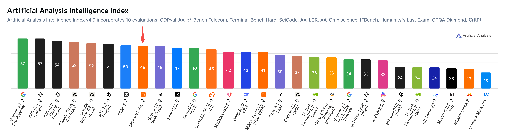

# MiMo-V2-Pro

> [!tldr]
> MiMo-V2-Pro 是小米 V2 系列的 **Pro 版本**，>1T 总参 / 42B 激活参数量级，Hybrid SWA ratio 从 V2-Flash 的 5:1 提升到 **7:1**，支持 **1M token 上下文**。核心定位：**OpenClaw 等 agent scaffold 的原生大脑**，在 ClawEval（61.5）和 PinchBench（81.0）上达到全球前三，接近 Claude Opus 4.6。



> [!warning]
> 本模型官方目前只公开 Tech Blog，没有独立 Technical Report 或开放权重 model card。所以下文可以达到“发布资料深读”标准，但达不到完整论文精读标准：精确训练 token、数据混合、RL 算法、消融和训练算力均不能从现有一手资料中恢复。

---

## 1. 问题与动机

V2-Flash 已经展示了 MoE + MTP + Hybrid SWA 的高效架构，但：
1. **15B 激活参数**对于 complex agentic tasks 仍有上限
2. **Agent scaffold 集成**需要更深度的 tool-use 优化
3. **长程任务**（browser automation、code debugging）需要更大 context window

V2-Pro 的目标：**成为 agent 系统的核心大脑**。

---

## 2. 核心方法

### 2.1 架构升级

| 特性 | V2-Flash | V2-Pro |
|------|----------|--------|
| Total Params | 309B | >1T |
| Active Params | 15B | 42B |
| Hybrid SWA Ratio | 5:1 | **7:1** |
| Context Window | 256K | **1M** |
| MTP Layers | 3 | 未披露 |

**关键设计**：Hybrid ratio 从 5:1 提升到 7:1，意味着 Global Attention 比例从 1/6 降到 1/8，更激进的 KV-cache 压缩，但通过更大模型容量弥补信息损失。

### 2.2 Agentic Post-Training

通过 **post-training scaling** 在更广泛的 agent tasks 上训练：
- SFT + RL 跨复杂多样的 agent scaffolds
- 更强的 tool-call 能力
- 多步推理稳定性

### 2.3 OpenClaw 原生集成

MiMo-V2-Pro 是 OpenClaw 的**原生大脑**：
- PinchBench 和 ClawEval 是 OpenClaw 标准评测
- 1M token context 支持高强度真实 Claw 应用流程

---

## 3. 实验结果

### 3.1 Agentic Benchmarks

| Benchmark | Task | MiMo-V2-Pro | MiMo-V2-Flash | Claude Opus 4.6 | Claude Sonnet 4.6 |
|-----------|------|-------------|---------------|-----------------|-------------------|
| **ClawEval** | General Agent | **61.5** | 48.1 | 66.3 | 66.3 |
| **PinchBench (avg.)** | OpenClaw Eval | **81.0** | 1040 | 81.5 | 79.2 |
| **GDPVal-AA** | Professional Tasks | **96.8** | 93.5 | 99.3 | 97.9 |
| **τ2-bench (Telecom)** | Tool Use | 78.0 | 78.6 | 80.8 | 79.6 |
| **Terminal-Bench 2.0** | Terminal Agent | **86.7** | 69.0 | 91.3 | 89.2 |

### 3.2 Coding Capabilities

| Benchmark | MiMo-V2-Pro | MiMo-V2-Flash | Claude Opus 4.6 | Kimi K2.6 |
|-----------|-------------|---------------|-----------------|-----------|
| **SWE-Bench Verified** | 71.7 | 71.7 | 77.8 | - |
| **SWE-Bench Multilingual** | **57.1** | 38.5 | 65.4 | - |
| **DeepSearch QA-F1** | - | - | - | - |

**亮点**：
- ClawEval 和 PinchBench 接近 Claude Opus 4.6，远超 Gemini 3 Pro（51.9/67.7）
- Terminal-Bench 2.0 达到 86.7
- SWE-Bench Multilingual 大幅领先 V2-Flash（57.1 vs 38.5）

### 3.3 Hunter Alpha 公开测试

V2-Pro 早期版本以 "Hunter Alpha" 代号在 OpenRouter 上线：
- 多日登顶日榜
- 累计超过 1T tokens 使用量
- 调用量最高的应用均为 coding 工具

---

## 4. 关键能力

### 4.1 前端 Agentic 开发

在 OpenClaw 内，V2-Pro 单次 query 生成功能完整的网页：
- Demo 1：1990年代印刷杂志风格（serif 标题 + monospace 正文 + 分栏网格 + 页码效果）
- Demo 2：3D 塔防游戏（Three.js + 多样化敌人+防御塔 + 升级路径）

### 4.2 OpenClaw 生态集成

合作伙伴：
- OpenClaw、OpenCode、KiloCode、Blackbox、Cline
- 提供一周免费 API 访问

---

## 5. 定价与 API

| Model | Context | Input | Output | Cache Write | Cache Read |
|-------|---------|-------|--------|-------------|------------|
| **MiMo-V2-Pro (≤256K)** | 256K | $1 | $3 | $0.20 | $0 |
| **MiMo-V2-Pro (256K-1M)** | 1M | $2 | $6 | $0.40 | $0 |
| Claude Sonnet 4.6 | - | $3 | $15 | $0.30 | $3.75 |
| Claude Opus 4.6 | - | $5 | $25 | $0.50 | $6.25 |

**优势**：1M context 不额外收费（无 multiplier）

---

## 6. 对研究的启发

> [!insight]
> **Agent scaffold co-design 是关键**。MiMo-V2-Pro 与 OpenClaw 的深度集成表明，模型能力需要与 agent 框架共同设计，而不是孤立地"刷 benchmark"。PinchBench 和 ClawEval 作为 OpenClaw 标准评测，正是这种 co-design 的体现。

> [!insight]
> **Hybrid SWA ratio 的 scaling**：从 5:1 到 7:1 表明 Global Attention 比例可以进一步压缩，通过更大的激活参数弥补。更激进的 SWA ratio 可能对 agentic tasks 更友好（需要更多 local 上下文）。

---

## 7. 与 V2-Flash / V2-Omni 的关系

```
V2-Flash (15B active, 256K, 5:1 SWA)
    ├── 定位：高效推理 + 快速实验
    └── 特点：MT-prefix scoring + MOPD

V2-Pro (42B active, 1M, 7:1 SWA)
    ├── 定位：复杂 agentic tasks + 长程任务
    └── 特点：更强的 coding + terminal + browser

V2-Omni (Omnimodal, 1M, 原生 tool calling)
    ├── 定位：全模态 agent
    └── 特点：image/video/audio/text 统一感知

V2.5 (开源多模态 agent)
    └── 定位：开源生态
```

---

## 相关资料

- 博客原文：[[2603_MiMo_V2_Pro/src/MiMo-V2-Pro - Xiaomi Blog]]
- MiMo-V2-Flash：[[Topics/13_base_model/Xiaomi_MiMo/2601_MiMo_V2_Flash/MiMo-V2-Flash]]
- MiMo-V2-Omni：[[Topics/13_base_model/Xiaomi_MiMo/2603_MiMo_V2_Omni/MiMo-V2-Omni]]
