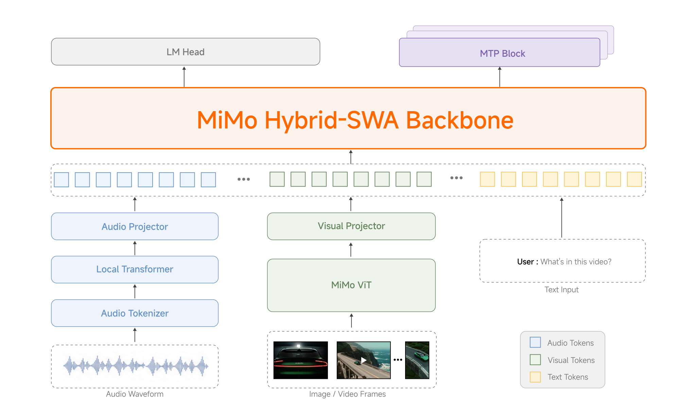

# MiMo-V2.5

> [!tldr]
> MiMo-V2.5 是小米 V2 系列的**开源多模态 agent 基座**：310B 总参 / 15B 激活参数，48T tokens 预训练，五阶段训练流程（text pretraining → projector warmup → multimodal pretraining → SFT/agentic post-training → RL/MOPD），支持 1M token 上下文。**全面开源** Base + post-trained 权重于 Hugging Face。核心亮点：在 Coding Agent（71.8 SWE-Bench Verified）、Claw-Eval（65.8）、Video Understanding（83.5 Video-MME）上达到 frontier-level，且 token plan 计费无 multiplier。



> [!warning]
> 本页依据官方 Tech Blog 与 Hugging Face model cards，而不是独立 technical report。官方公开了架构、训练阶段、规模和评测，但没有给出论文级的数据配比、完整训练超参和逐项消融；这些缺口不做推测。

---

## 1. 问题与动机

V2-Flash 和 V2-Pro 展示了 MoE + MTP + Hybrid SWA + MOPD 的技术栈威力，但：
1. **闭源 API**：研究社区无法复现训练过程
2. **缺少原生多模态**：V2-Flash/Pro 主要是 text-focused
3. **成本门槛**：1M context 的 multiplier 计费阻碍长程 agent 应用

V2.5 的目标：**开源 + 多模态 + 无 multiplier**。

---

## 2. 核心方法

### 2.1 模型规格

| 特性 | MiMo-V2.5-Base | MiMo-V2.5 |
|------|---------------|-----------|
| Total Params | 310B | 310B |
| Active Params | 15B | 15B |
| Architecture | Sparse MoE | Sparse MoE |
| Context | 256K | 1M |
| Precision | FP8 (E4M3) Mixed | FP8 (E4M3) Mixed |
| Modalities | Text + Visual + Audio | Text + Visual + Audio |

**Backbone 继承**：MiMo-V2.5 的语言 backbone 继承自 V2-Flash 的 Hybrid SWA 架构（5:1 ratio，128-token window），加上专用 visual 和 audio encoders（均为自研预训练）。

### 2.2 五阶段训练流程

```
Stage 1: Text Pretraining
    └── Diverse corpora → LLM backbone
    
Stage 2: Projector Warmup
    └── Align audio/visual projectors with LLM
    
Stage 3: Multimodal Pretraining
    └── High-quality cross-modal data at scale
    
Stage 4: SFT + Agentic Post-Training
    └── Progressively extend context: 32K → 256K → 1M
    
Stage 5: RL + MOPD
    └── Further strengthen perception, reasoning, agentic
```

**MOPD**（Multi-Teacher On-Policy Distillation）：V2-Flash 提出的 multi-domain RL teacher 合并方案，在 V2.5 中继续使用。

### 2.3 统一多模态感知

MiMo-V2.5 原生支持：
- 图像理解（OCR、图表、文档）
- 视频理解（带音频的原生 audio-video joint input）
- 音频理解（环境音分类、多说话人分离、长音频摘要）
- 文本推理

---

## 3. 实验结果

### 3.1 Agentic Benchmarks

| Benchmark | Task | MiMo-V2.5 | MiMo-V2-Pro | Kimi K2.6 | Claude Opus 4.6 | Gemini 3.1 Pro |
|-----------|------|-----------|-------------|-----------|-----------------|----------------|
| **SWE-Bench Verified** | Coding Agent | **71.8** | 71.5 | 77.1 | 67.8 | - |
| **MiMo Coding Bench** | Everyday Coding | **62.3** | 57.8 | 62.3 | 70.8 | 57.8 |
| **Claw-Eval Text** | Daily Agent | **65.8** | 57.1 | 66.7 | 65.4 | 68.5 |
| **Terminal-Bench 2.0** | Terminal Agent | **56.1** | 55.0 | 58.6 | 57.3 | 54.2 |

### 3.2 Image & Video Understanding

| Benchmark | Task | MiMo-V2.5 | MiMo-V2-Omni | Claude Opus 4.6 | Gemini 3 Pro |
|-----------|------|-----------|--------------|-----------------|--------------|
| **MMMU-Pro** | Multimodal Reasoning | **88.5** | 83.3 | 86.4 | 83.3 |
| **CharXiv RQ** | Chart Understanding | **77.9** | 76.8 | 73.9 | 81.0 |
| **HR-Bench (4k)** | Image Understanding | **87.2** | 86.7 | - | 89.0 |
| **Video-MME** | Video QA | **83.5** | 80.5 | - | 84.2 |
| **VideoHolmes** | Video Reasoning | **23.8** | 15.8 | 24.8 | 25.7 |
| **Claw-Eval Multimodal** | Multimodal Agent | **87.7** | 85.3 | - | 88.4 |

**亮点**：
- MMMU-Pro 88.5，超越 Claude Opus 4.6（86.4）和 V2-Omni（83.3）
- Video-MME 83.5，超越 V2-Omni（80.5）
- Claw-Eval Multimodal 87.7，紧追 Gemini 3 Pro（88.4）

---

## 4. 开源生态

### 4.1 Hugging Face 资源

| Model | Download |
|--------|----------|
| MiMo-V2.5-Base | [HF: XiaomiMiMo/MiMo-V2.5-Base](https://huggingface.co/XiaomiMiMo/MiMo-V2.5-Base) |
| MiMo-V2.5 | [HF: XiaomiMiMo/MiMo-V2.5](https://huggingface.co/XiaomiMiMo/MiMo-V2.5) |

包含：权重、tokenizer、完整 model card。

### 4.2 Token Plan 定价

| Model | Multiplier | 说明 |
|-------|------------|------|
| MiMo-V2.5 | **1x** | 无 multiplier |
| MiMo-V2.5-Pro | 2x | 更强能力 |

**关键改变**：1M context 不额外收费，降低长程 agent 应用的成本感知门槛。

---

## 5. 与 V2-Flash / V2-Pro / V2-Omni 的关系

```
MiMo-7B (Dense, reasoning base)
    ↓
MiMo-VL-7B (加入视觉)
    ↓
MiMo-V2-Flash (MoE 309B/15B, Hybrid SWA 5:1, MTP, MOPD)
    ↓         ↓         ↓
V2-Pro    V2-Omni    V2.5
(42B)    (Omnimodal) (开源)
    ↓
V2.5-Pro
```

**V2.5 的独特价值**：
1. **开源**：首个完整开源的 MiMo V2 系列多模态 agent 模型
2. **多模态**：整合 V2-Omni 的全模态能力到开源生态
3. **无 multiplier**：1M context 的实际可用性

---

## 6. 对研究的启发

> [!insight]
> **开源多模态 agent 基座的价值**：MiMo-V2.5 完整开源（权重 + 训练 recipe 摘要）使得社区可以复现 agent training pipeline。尤其是 MOPD 的三阶段流程（SFT → 分域 RL → on-policy distillation）是可复用的工程方案。

> [!insight]
> **五阶段训练流程的模块化**：text pretraining → projector warmup → multimodal pretraining → SFT → RL 的阶段划分清晰，每个阶段可独立调优。这对想做 multimodal agent 但缺资源的团队是很好的参考框架。

---

## 7. 与 V2.5-Pro 的关系

| 特性 | V2.5 | V2.5-Pro |
|------|------|----------|
| Active Params | 15B | 42B |
| 开源 | ✅ 完全开源 | ❌ 闭源 |
| Multimodal | ✅ | ✅ |
| Context | 1M | 1M |
| Target | 社区 / 研究 | 复杂 agentic tasks |

V2.5-Pro 是 V2.5 的"闭源 Pro 版本"，对应 V2-Flash → V2-Pro 的关系。

---

## 相关资料

- 博客原文：[[2604_MiMo_V2_5/src/MiMo-V2.5 - Xiaomi Blog]]
- MiMo-V2-Flash：[[Topics/13_base_model/Xiaomi_MiMo/2601_MiMo_V2_Flash/MiMo-V2-Flash]]
- MiMo-V2-Pro：[[Topics/13_base_model/Xiaomi_MiMo/2603_MiMo_V2_Pro/MiMo-V2-Pro]]
- MiMo-V2-Omni：[[Topics/13_base_model/Xiaomi_MiMo/2603_MiMo_V2_Omni/MiMo-V2-Omni]]
- MiMo Series Insight：[[Topics/13_base_model/Xiaomi_MiMo/2606_MiMo_Series/MiMo-Series]]
