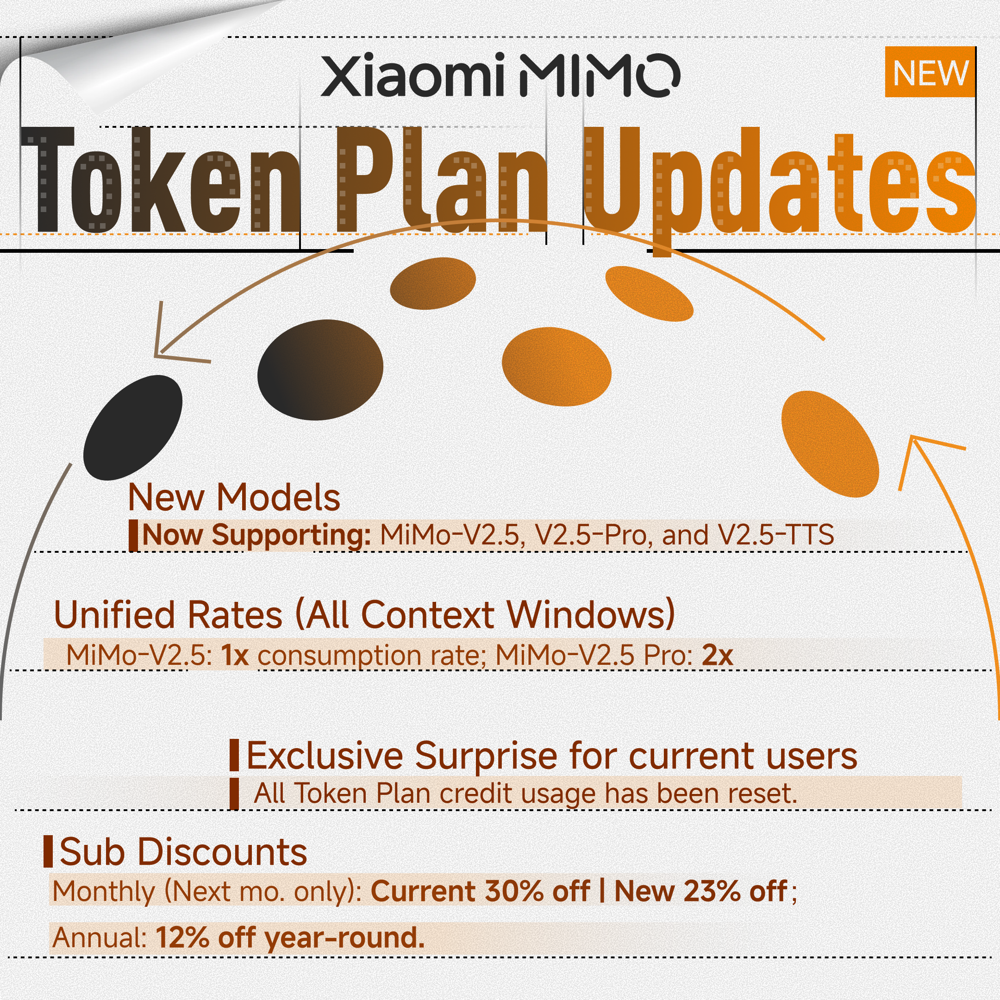

> [!tldr]
> MiMo-V2.5-Pro 是小米迄今为止最强的 Agentic 模型，1.02T 参数（42B active），基于混合注意力 + MTP 架构，在 SWE-Bench Pro、Terminal-Bench 2.0、τ³-bench 等指标上达到前沿水平，同时 Token 效率比 Claude Opus 4.6 高 40-60%。

> [!warning]
> 官方材料是 Tech Blog 与 Hugging Face model cards，不是完整 technical report。它足以核对规模、上下文、公开评测和产品能力，但不足以复原训练 recipe、数据配比、RL 环境构造和完整消融，因此本页明确低于论文精读的证据等级。

## 问题与动机

小米认为 Agent 能力的核心瓶颈在于：
1. **长程任务规划**：需要支持超过 1000 次 tool calls 的长程任务
2. **Token 效率**：不是分数越高越好，而是「用更少 token 达到同等能力」
3. **Harness 感知**：模型需要理解并充分利用 harness 环境

MiMo-V2.5-Pro 的目标是在保持高能力的同时，在 Agent 场景下实现最优的 cost-performance tradeoff。

## 方法核心

### 架构

- **1.02T 参数 Sparse MoE**，42B active parameters
- **Hybrid Attention**：SWA + GA 以 6:1 比例交织，128 token window，KV-cache 减少约 7×
- **MTP (Multi-Token Prediction)**：轻量 MTP 模块 + dense FFN，throughput 提升约 3×
- **1M token context window**

### 训练

- **Pretrain**：27T tokens，FP8 mixed precision，32K 序列长度
- **Post-training 三阶段**：
  1. **SFT**：建立基础指令遵循能力
  2. **Domain-Specialized RL**：数学、安全、Agent tool-use 等领域专用 RL
  3. **MOPD (Multi-Teacher On-Policy Distillation)**：单学生模型从多个教师模型的 on-policy rollouts 中学习 token 级指导

## 核心实验结果

### Coding Agent 能力

| Benchmark | MiMo-V2.5-Pro | MiMo-V2.5 | MiMo-V2-Pro | Claude Opus 4.6 | Gemini 3.1 Pro | GPT-5.4 |
|-----------|:-------------:|:---------:|:-----------:|:---------------:|:--------------:|:-------:|
| SWE-Bench Pro | **57.2** | 56.1 | 55.0 | 57.3 | 54.2 | 57.7 |
| Terminal-Bench 2.0 | **68.4** | 65.8 | 57.1 | 65.4 | 68.5 | 75.1 |
| MiMo Coding Bench | **73.7** | 71.8 | 71.5 | 77.1 | 67.8 | — |
| FrontierSWE (rank) | **#3.4** | — | #5.0 | #2.0 | #3.9 | #1.9 |

### General Agent 能力

| Benchmark | MiMo-V2.5-Pro | MiMo-V2.5 | MiMo-V2-Pro | Claude Opus 4.6 | Gemini 3.1 Pro | GPT-5.4 |
|-----------|:-------------:|:---------:|:-----------:|:---------------:|:--------------:|:-------:|
| GDPVal-AA (Elo) | **1581** | 1426 | — | 1606 | 1317 | 1674 |
| τ³-bench | **72.9** | 69.5 | 64.5 | 72.4 | 67.1 | 72.9 |
| Claw-Eval (pass^3) | **63.8** | 62.3 | 57.8 | 70.4 | 57.8 | 60.3 |
| Humanity's Last Exam | 48.0 / 34.0 | — | 40.0 / 28.0 | 53.0 / 40.0 | 51.4 / 44.4 | 58.7 / 42.7 |

### Token 效率（关键创新点）

> [!insight]
> MiMo-V2.5-Pro 在 ClawEval 上用 ~70K tokens/trajectory 达到 64% pass^3，比 Claude Opus 4.6 / Gemini 3.1 Pro / GPT-5.4 节省 40-60% tokens。这是通过 MOPD 多教师蒸馏实现的 —— 多个领域专家模型的 token 级指导被压缩到单一学生模型中。

## 硬核 Demo

### SysY Compiler in Rust

来自北大编译原理课程项目：实现完整 SysY 编译器（词法分析、语法分析、AST、Koopa IR、RISC-V 后端、性能优化）。

- **耗时**：4.3 小时，672 tool calls
- **结果**：233/233 全部通过（满分）
- **关键观察**：首次编译就通过 137/233（59%），说明模型在写代码前先设计了正确的架构

### 8K 行视频编辑器

仅用简单 prompt，模型自主完成了：
- 多轨时间线、剪辑裁剪、交叉淡入淡出、音频混合
- **1,868 tool calls，11.5 小时**
- 最终产物：8,192 行代码

### 模拟 EDA：FVF-LDO 设计与优化

在 TSMC 180nm CMOS 工艺下设计 LDO 稳压器，优化 6 个指标同时达标：
- Line Regulation: 22× 提升
- Load Regulation: 17× 提升
- Quiescent Current: 9× 提升
- Undershoot: 13× 提升

## 模型规格

| Model | Total Params | Active Params | Context | Precision | Download |
|-------|-------------|-------------|---------|-----------|----------|
| MiMo-V2.5-Pro-Base | 1.02T | 42B | 256K | FP8 (E4M3) Mixed | [HF](https://huggingface.co/XiaomiMiMo/MiMo-V2.5-Pro-Base) |
| MiMo-V2.5-Pro | 1.02T | 42B | 1M | FP8 (E4M3) Mixed | [HF](https://huggingface.co/XiaomiMiMo/MiMo-V2.5-Pro) |

## 关键洞察

1. **MOPD 是核心创新**：多个领域专家 RL 模型的知识通过 on-policy 蒸馏合并到单一学生模型，实现高能力 + 高效率的统一
2. **Harness awareness 是 Agent 能力的分水岭**：V2.5-Pro 展现出对 harness 环境的深度理解（memory 管理、context population）
3. **Token efficiency 是下一代 Agent 模型的核心竞争力**：不是追求绝对最高分，而是「分数 / token」的最优解
4. **长程任务（>1000 tool calls）需要架构层面的优化**：1M context + 高效 attention 是必要条件
