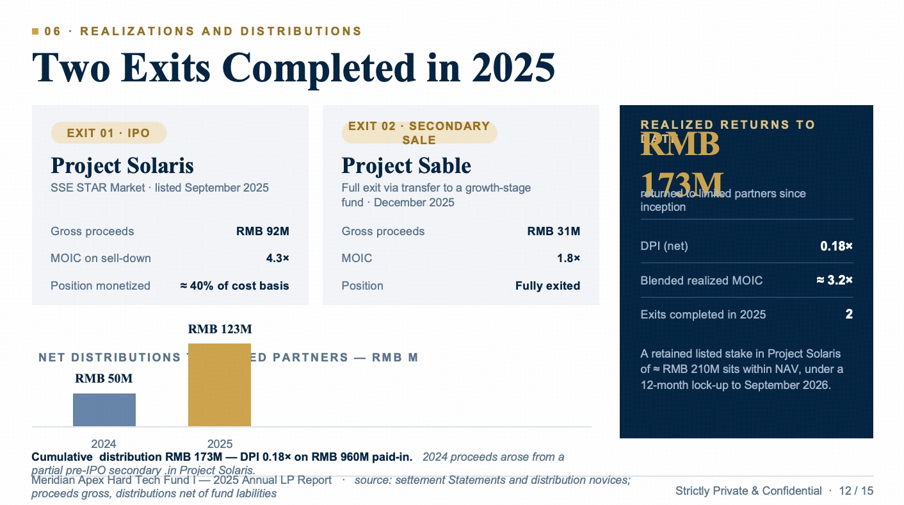
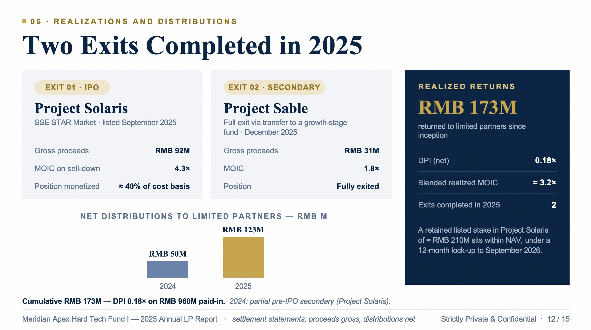
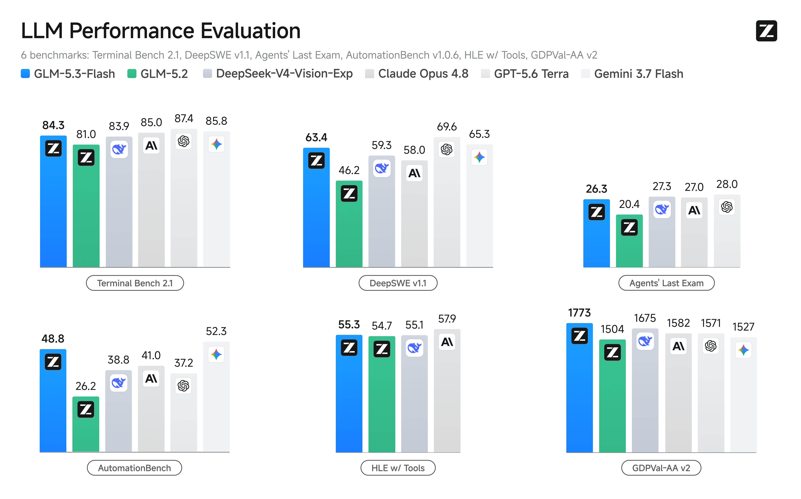

# GLM-5.3-Flash

> [!tldr]
> **GLM-5.3-Flash 不是“把 GLM-5.3 蒸馏得更便宜”，而是重新训练了一个面向低成本推理的 320B/18B 原生多模态 MoE 基座，并把 visual self-verification、环境反馈 RL、1M context 与国产芯片 serving 共同设计。** 我认为它最值得关注的不是单个 benchmark，而是将 agent 的观察—执行—渲染—再观察闭环直接放进模型训练和推理成本设计里。


## 一页速览

| 维度 | GLM-5.3-Flash |
|---|---|
| 发布 | 2026-08-26 |
| 定位 | GLM-5 系列首个原生多模态、低成本 frontier model |
| 参数 | 320B total / 18B activated，45 layers |
| 预训练 | 30T-token multimodal corpus；官方 model card 称为 newly trained base model |
| 架构 | MoE + linear/sparse hybrid attention + IndexPool + mHC |
| 输入 / 输出 | 文本、图片、视频、文件 → 文本 |
| Context / max output | 1M / 128K |
| API | `glm-5.3-flash`；强制 thinking；`reasoning_effort=low/high/max` |
| 开源 | Hugging Face，MIT；SGLang / vLLM / TokenSpeed / KTransformers |
| 标准 API 价 | 输入 ¥0.8/MTok，输出 ¥2.8/MTok；发布期两周 5 折 |

## 我的核心判断

### 1. “Flash” 的核心不是缩小总参，而是缩小每 token 的活跃计算与长上下文状态

GLM-5.3-Flash 总参 320B，与 GLM-4.5 的 355B 接近，但 activated parameters 从 32B 降到 18B、层数从 92 降到 45。它不是典型的小参数 Flash，而是“大容量、低激活”的 MoE 路线。

真正改变 serving 成本的是三件事：

- 线性注意力承担局部状态建模；
- 稀疏注意力通过 lightweight indexer 找全局证据；
- IndexPool 把 indexer 的 4 个 key cache 向量压成 1 个。

相对 GLM-5.3，官方给出的 attention compute / KV cache 降幅是 3.01× / 4.44×。这说明对 1M context agent，优化目标已经从“少算一点 attention FLOPs”扩展为“减少需要长期驻留和搬运的状态”。


### 2. 它把多模态训练目标从“看懂图片”推进到“用视觉做验证器”

官方强调 visual coding 的训练轨迹必须让模型：与环境交互 → 检视自己的渲染结果 → 判断问题 → 迭代修改。前端场景还加入 environment feedback RL 与基于真实用户流程的 agent verification。

这比传统 VLM 的静态 image QA 更接近 agent training：视觉不只是 observation encoder，而是测试时 critic / verifier 的输入。验证对象也从功能正确性扩展到布局、交互、审美和工作产品质量。

| 初始输出 | 视觉自验证后 |
|---|---|
|  |  |

### 3. 30T 多模态预训练、post-training 与 serving 是同一个成本-能力设计

官方将能力提升归结为三层协同：

1. 低激活、低 attention/KV 成本的架构；
2. 30T-token 多模态预训练语料；
3. 与国产芯片协同设计的 serving stack。

推理侧不是一句“支持国产芯片”，而是给出了 ReplaySSM、W8A8、INT8/FP8/BF16 混合缓存量化、Layer Split 和 EPD 解耦。相对初始基线，端到端 serving 提升 3×。更有意思的是 GLM-5.3 infra agent 参与了 kernel / serving 优化，模型开始介入自身部署系统的迭代。

### 4. 官方 benchmark 很强，但需要把“自报分数”和“可复现实证”分开

GLM-5.3-Flash 相比 GLM-5.2 的提升是系统性的，尤其 DeepSWE、Toolathlon、AutomationBench 和视觉任务；这支持“新基座 + 新架构 + 多模态训练”确实带来能力增益。

但比较时仍要保留三层口径：

- 多数分数由 Z.ai 自报，harness、context、timeout 与 sampling 并不完全统一。
- Z.ai Code Bench 是私有 benchmark，能降低污染但不能独立复现。
- Artificial Analysis 的 `$0.045/task` 是特定 benchmark 的折后任务成本，不能直接等同 API 价格。

因此更稳妥的结论是：**GLM-5.3-Flash 显著超过 GLM-5.2，并在 coding / agentic / vision 的综合 Pareto 上进入闭源 frontier 邻近区；“全面等价 Opus 4.8”仍需独立评测。**

## 架构拆解

### Hybrid Attention

| 组件 | 作用 | 对 agent 的意义 |
|---|---|---|
| Linear Attention | 递归状态建模，低成本捕获局部依赖 | 长轨迹持续读写时降低每 token 成本 |
| Sparse Attention | indexer 召回全局相关 token | 从 1M history 中找远距离证据 |
| IndexPool | 4:1 压缩 indexer key vectors | 降低 1M context 下 indexer 的 latency / memory |
| mHC | 约束 hyper-connection 的缩放行为 | 在减少层数和改变连接结构时保持训练稳定性 |
| MoE 18B active | 总容量 320B，但每 token 只激活少量专家 | 把知识容量与推理成本解耦 |

### Base model 结果怎么看

GLM-5.3-Flash-Base 在 LiveCodeBench-Base 37.6，高于 GLM-5-Base 34.4；MMLU 88.1 接近 GLM-5-Base 88.3。它并非所有传统 benchmark 都更高（如 BBH 86.6 vs. 87.4、SimpleQA 33.5 vs. 36.0），说明设计重点是 coding / multimodal / serving Pareto，而不是逐项压过 744B GLM-5-Base。

## 训练信号：哪些公开了，哪些没公开

### 已公开

- 30T-token multimodal pre-training corpus。
- visual coding 数据合成，强调 self-visual judgment 与 test-time improvement。
- 前端任务使用 environment-feedback RL。
- agent verifier 基于真实用户流程，检查 functional + rendered + interactive correctness。
- 工作流覆盖 code、browser、GUI、Office、金融、法律、视频、3D、CAD。

### 尚未公开

- 图像 / 视频 / 文本 / 代码的 token 配比和 curriculum。
- MoE 专家数、routing、linear:sparse layer ratio、IndexPool 具体公式。
- visual RL 的算法、reward 分解、trajectory 数量与长度。
- 审美 / 版面 verifier 的标注方式、稳定性和 reward hacking 防护。
- 是否复用 [[Topics/13_base_model/Zhipu_GLM/2606_GLM_5_2/GLM-5.2-Long-Horizon-Coding-Agent|GLM-5.2]] 的 SAO / slime / critic-based PPO，以及复用到什么程度。

## 关键结果

| Benchmark | GLM-5.3-Flash | GLM-5.2 | Opus 4.8 | 判断 |
|---|---:|---:|---:|---|
| Terminal Bench 2.1 | 84.3 | 81.0 | 85.0 | 接近 Opus，增幅温和 |
| DeepSWE v1.1 | 63.4 | 46.2 | 58.0 | 对 GLM-5.2 大幅提升，超过该 Opus 口径 |
| Toolathlon Verified | 78.4 | 59.9 | 76.2 | 工具调用强项 |
| AutomationBench | 48.8 | 26.2 | 41.0 | 长程自动化提升显著 |
| Agents' Last Exam | 26.3 | 20.4 | 27.0 | 接近 Opus |
| OfficeQA Pro | 62.4 | — | 48.9 | 专业文档视觉工作流强 |
| Chartography w/ Tools | 78.0 | — | 75.0 | 图表理解 + 工具使用强 |



## API 与使用注意

```json
{
  "model": "glm-5.3-flash",
  "messages": [
    {
      "role": "user",
      "content": [
        {"type": "text", "text": "分析这张图"},
        {"type": "image_url", "image_url": {"url": "https://example.com/image.png"}}
      ]
    }
  ],
  "thinking": {
    "type": "enabled",
    "clear_thinking": false
  },
  "reasoning_effort": "max",
  "temperature": 1,
  "top_p": 0.95,
  "stream": true,
  "tool_stream": true
}
```

几个容易踩坑的点：

- `thinking.type` 只支持 `enabled`，关闭会报错。
- `reasoning_effort` 支持 `low`、`high`、`max`，coding 推荐 `max`。
- 多图通过多个 `image_url` content block 传入，可用 URL 或 Base64 Data URL。
- 流式工具调用要同时开 `stream` 与 `tool_stream`，并拼接增量 arguments。
- 官方文档同时建议 `temperature=1` 与 `top_p=0.95`；迁移指南又建议通常只调一个，实验时应固定一项只 sweep 另一项。

## 对 Agent Training 的启发

> [!insight]
> GLM-5.3-Flash 提供了一个很具体的训练范式：**把“看见最终工作产品并判断哪里不对”变成轨迹的一部分，再用环境反馈和 agent verifier 训练。** 对当前研究而言，这比单纯增加 GUI 数据更重要——需要合成的是带 observation → action → render → critique → repair → verification 的闭环轨迹。

可以直接转成几条实验：

1. **视觉 verifier 蒸馏**：从强 VLM 生成 layout / interaction / aesthetics rubric，再训练轻量 verifier，比较 process reward 与 final-state reward。
2. **失败轨迹修复数据**：保留初始坏布局、视觉 critique、修复 patch 和最终通过状态，分别用于 SFT、DPO 与 online RL。
3. **跨 artifact 统一验证**：HTML、PPTX、DOCX、XLSX 都先渲染，再用同一“结构正确 + 视觉正确 + 可交互/可编辑”schema 打分。
4. **长上下文成本归一化**：比较 full attention、sparse attention、state/linear attention 在相同 solved-task rate 下的 KV cache、latency 与 rollout 成本，而不是只报 token throughput。
5. **防 reward hacking**：视觉 verifier 容易被局部遮挡、截图裁剪、伪造 success toast 欺骗，需要加入 hidden-state / DOM / file-level oracle 做交叉验证。

## 与 GLM-5.2 / 5.3 的关系

| 模型 | Base | 主升级 | 模态 | 关键定位 |
|---|---|---|---|---|
| GLM-5.2 | GLM-5.2 base | IndexShare、1M serving、SAO / long-horizon RL | 文本 | 长程 coding agent |
| GLM-5.3 | 与 GLM-5.2 相同 base | 扩大 post-training、环境与算力 | 文本 | frontier coding / cyber / long-horizon |
| GLM-5.3-Flash | **新训练的 320B/18B base** | hybrid attention、IndexPool、mHC、30T multimodal pretraining、visual RL | 原生多模态 | frontier-near ability at Flash cost |

## 资料

- [[src/00_Source_Index|官方资料与本地图片索引]]
- [[src/01_GLM-5.3-Flash - BigModel CN|智谱开放平台中文文档]]
- [[src/02_GLM-5.3-Flash - Z.ai Docs EN|Z.ai 英文开发文档]]
- [[src/03_GLM-5.3-Flash - Z.ai Blog|Z.ai 官方技术博客剪藏]]
- [[src/04_GLM-5.3-Flash - Hugging Face|官方 Hugging Face model card]]
- [[src/05_Migrate to GLM-5.3 - BigModel CN|迁移指南]]
- [[src/07_Chat Completion API - BigModel CN|Chat Completion API]]
- [[src/09_Pricing - BigModel CN|官方价格快照]]

## 待跟踪

- [ ] 等正式 technical report 补齐 architecture / pretraining / post-training 配方。
- [ ] 用统一 harness 复测 DeepSWE、Toolathlon、AutomationBench 和 OfficeQA Pro。
- [ ] 验证 1M context 下 IndexPool 的真实 KV cache、prefill、decode 与并发收益。
- [ ] 把 visual self-verification pipeline 与现有 GUI / Office agent 数据构建方法横向比较。
- [ ] 跟踪权重的 BF16 / FP8 部署要求与开源推理框架成熟度。
