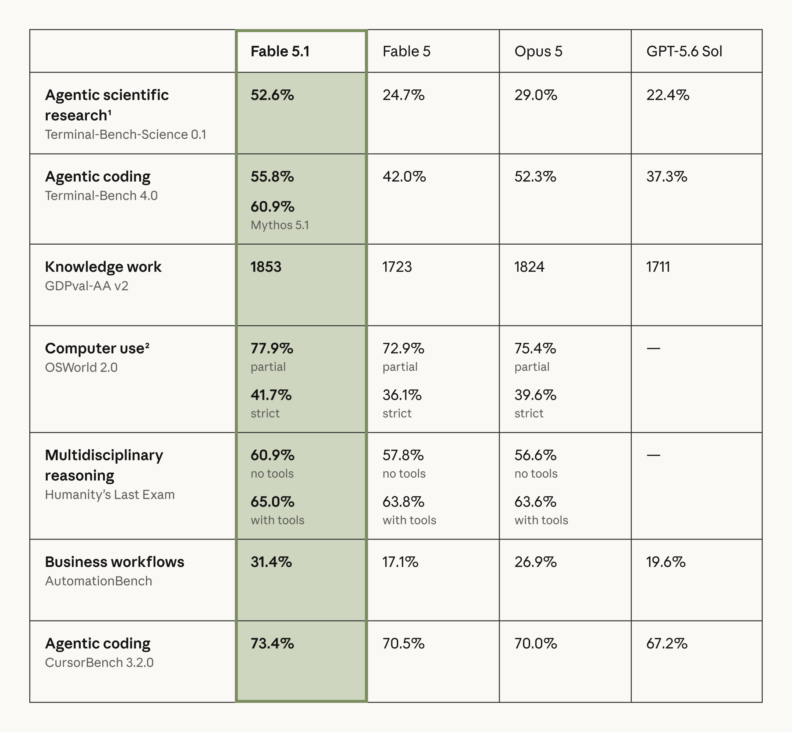

# Claude Fable 5.1

> [!tldr]
> **Fable 5.1 是 Anthropic 面向一般可用场景开放的 frontier-access Claude：它和受限访问的 Mythos 5.1 使用同一个底层模型，但部署 safeguards 不同。** 真正值得注意的不是单个 benchmark 第一，而是它把 1M context、128K 输出、adaptive thinking、agentic coding / research / business workflow 和一套明确的 fallback 机制放进同一个可部署模型。它不是 Claude 5 主干的新一代，而是 Anthropic 的「前沿能力访问层」。

> [!note]
> 上图来自 Anthropic 官方发布页。不同 benchmark 的 harness、effort、工具配置并不完全相同，不能把表格中的横向领先等同于所有真实工作负载都领先；本文在每个结论旁保留配置和证据边界。

## 一句话定位：同一底座，两种访问边界

Anthropic 在 2026-09-01 同时发布 **Claude Fable 5.1** 与 **Claude Mythos 5.1**。官方的关键定义是：两者是**同一 underlying model 的两种部署形态**。

| 维度 | Claude Fable 5.1 | Claude Mythos 5.1 |
|---|---|---|
| 可用性 | General availability | Trusted access only |
| 核心能力 | 与 Mythos 5.1 共用底层模型 | 与 Fable 5.1 共用底层模型 |
| 主要差异 | 部署时加入更积极的 classifiers / fallback | 更少限制，但需要受控访问 |
| Atlas 位置 | Anthropic · Frontier access 支线 | 本笔记中作为配对部署形态说明，不冒充另一套底座 |

这一区分很重要：**Fable / Mythos 不是能力大小档位，也不是像 Haiku / Sonnet / Opus 那样的常规产品分层。** 它们更像同一前沿 checkpoint 在不同风险边界下的服务接口。

## 核心规格

| 项目 | 官方值 | 对工程实践的含义 |
|---|---:|---|
| Model ID | `claude-fable-5-1` | API 中应使用精确 ID，不以营销名猜测 snapshot |
| Context window | 1M tokens | 可承载大型代码库、长文档与长轨迹，但不等于 1M 内每个信息点都能被同等利用 |
| Max output | 128K tokens | 适合长代码、长报告与多阶段工具结果整理，同时需要防止无约束输出拉高延迟和成本 |
| 输入模态 | Text + image | 视觉材料可以进入 agent 工作流；输出仍是 text |
| Thinking | Adaptive thinking 始终开启 | 默认 effort 为 high，可按消息调整 effort；不再把「是否思考」当成简单开关 |
| Knowledge / training cutoff | 2026-06 | 截止时间不替代检索；涉及最新事实仍需工具或外部资料 |
| 输入价格 | $10 / MTok | 高于日常轻量模型，适合高价值、长时程任务 |
| 输出价格 | $50 / MTok | 需要控制无效长输出与反复自述 |
| Cache read | $0.25 / MTok | 对重复长上下文、代码库前缀、规则与固定资料非常关键 |
| 生命周期 | Active；最早 2027-09-01 退役 | 可以进入生产评估，但仍应固定模型 ID 并做回归测试 |

> [!insight]
> **Fable 5.1 最有工程价值的价格不是 $10 / $50，而是 $0.25 的 cache read。** 对 agent training / evaluation 来说，长系统提示、工具规范、仓库上下文和评测规则若能稳定命中缓存，轨迹成本结构会从「上下文长度主导」变成「新增观察与动作主导」。

## 能力证据：提升集中在哪里

### 1. 长时程终端与科学研究

| Benchmark | Fable 5.1 | Fable 5 | Opus 5 | GPT-5.6 Sol |
|---|---:|---:|---:|---:|
| Terminal-Bench-Science 0.1 | **52.6%** | 24.7% | 29.0% | 22.4% |
| Terminal-Bench 4.0 | **55.8%** | 42.0% | 52.3% | 37.3% |

Terminal-Bench 4.0 评估真实终端 / CLI 工作，Terminal-Bench-Science 则把任务扩展到科研工作流。系统卡进一步说明：Terminal-Bench 4.0 结果在 Claude Code `--bare` 模式和最大 thinking effort 下测得；Mythos 5.1 在同一项目上为 60.9%。因此，**55.8% 是带明确 harness 的 agent 结果，不应写成裸模型通用能力。**

### 2. 真实业务工作流与知识工作

| Benchmark | Fable 5.1 | Fable 5 | Opus 5 | GPT-5.6 Sol |
|---|---:|---:|---:|---:|
| GDPval-AA v2 | **1853** | 1723 | 1824 | 1711 |
| AutomationBench | **31.4%** | 17.1% | 26.9% | 19.6% |

AutomationBench 不是单步问答：任务来自 CRM、Slack、Google Workspace 等企业应用，要求 agent 完成端到端业务流程。Fable 5.1 的 31.4% 仍然说明真实自动化远未解决，但相较 Fable 5 的 17.1% 是明显跃迁。**正确解读是工作流成功率翻升，而不是已经达到无人监督部署水平。**

### 3. Computer use 与 coding

| Benchmark | Fable 5.1 | Fable 5 | Opus 5 | GPT-5.6 Sol |
|---|---:|---:|---:|---:|
| OSWorld 2.0 partial | **77.9%** | 72.9% | 75.4% | - |
| OSWorld 2.0 strict | **41.7%** | 36.1% | 39.6% | - |
| CursorBench 3.2.0 | **73.4%** | 70.5% | 70.0% | 67.2% |

OSWorld 的 partial 与 strict 差距（77.9% vs. 41.7%）比单个领先数字更有信息量：模型常常能完成任务的一部分，但在严格的最终状态验收下仍会失败。对 agent 研究而言，这提示我们必须保存**最终状态、部分完成度和失败位置**，不能只用一个二元 reward 覆盖全过程。

### 4. 多学科推理与工具增益

| Humanity's Last Exam | Fable 5.1 | Fable 5 | Opus 5 |
|---|---:|---:|---:|
| No tools | **60.9%** | 57.8% | 56.6% |
| With tools | **65.0%** | 63.8% | 63.6% |

工具为 Fable 5.1 带来约 4.1 个百分点的绝对增益，但增益不是无限的。对训练设计而言，下一步不只是增加 tool calls，而是训练模型判断**何时调用、如何验证返回、何时停止继续检索**。

## 经济性：官方说的「更便宜」不是降价

Anthropic 估计，相比前代，Fable 5.1 在典型工作负载上可降低约 **25%** 的总体成本，在高度 agentic 的任务上最高可接近 **45%**。这不是简单的每 token 标价下降，而是来自更少的无效轨迹、更高的任务一次完成率与缓存结构。

因此应该用下面的口径做自己的 A/B test：

1. 每个成功任务的总 token 与总价格；
2. 平均工具调用次数、失败调用次数与重复调用次数；
3. 到达可验收最终状态所需的 turn 数；
4. cache hit 后的真实成本，而不是只对比公开 list price；
5. 在相同任务成功率目标下的最低 effort。

## Safeguards 与 fallback：能力评测不能脱离部署路径

Fable 5.1 会在部分高风险领域触发 classifiers，并把请求转交给已经发布、限制更成熟的模型：

- 部分 cyber 请求可能 fallback 到 **Claude Opus 4.8**；
- 部分 biology / medical 相关请求可能 fallback 到 **Claude Opus 5**；
- Anthropic 表示相较 Fable 5，Fable 5.1 的 cyber false positives 减少约 **60%**，基础 biology / medical fallback 减少约 **85%**；
- Fable 5.1 与 Mythos 5.1 的底座相同，但部署 safeguards 会使最终用户体验与 benchmark 行为出现差异。

> [!warning]
> **Fable 5.1 的可观察行为不总是单一 checkpoint 的行为。** 如果一个评测触发了 fallback，最终答案可能来自另一模型。研究者应记录响应元数据、拒答 / fallback 事件与模型路由，否则会把「部署系统」误写成「基础模型能力」。

## API / 迁移时真正会踩的坑

Fable 5.1 带来一些 additive features，也有会破坏旧工作流的行为变化。

### 新增能力

- per-message effort：同一会话不同阶段可使用不同 effort；
- turn-scoped system messages：规则可以只约束当前 turn；
- readable progress updates：长任务中可以返回更可读的进度；
- content provenance：为内容来源追踪提供更明确的接口支持；
- 更低的 cache read 成本，适合重复长前缀。

### Breaking changes

- forced tool use 的部分旧写法会报错，不能假设和 Fable 5 完全兼容；
- 早期模型无法读取 Fable 5.1 的 thinking blocks；
- 如果编辑历史消息，已有 thinking blocks 可能失效；
- adaptive thinking 始终开启，迁移时需要重新校准 latency、effort 与预算。

这意味着生产迁移不应只替换 model string。至少要回归：tool choice、长会话重放、消息编辑、缓存命中、thinking block 兼容和最大输出限制。

## 对 Agent Training / Evaluation 的启发

> [!insight]
> **Fable 5.1 的信号是：前沿模型竞争正在从单次回答正确率，转向「在安全路由、缓存、工具、长上下文和真实应用状态共同约束下完成任务」。** 训练与评测若仍只保存 prompt / answer 两列，会漏掉最关键的数据。

建议把 Fable 5.1 类模型的轨迹拆成五层：

1. **计划层**：目标分解、effort 选择、是否需要工具；
2. **执行层**：工具调用、computer use、终端操作与中间产物；
3. **状态层**：应用 / 文件 / 页面最终状态，而不仅是文本输出；
4. **路由层**：拒答、classifier、fallback、模型切换和缓存命中；
5. **验收层**：strict success、partial success、成本、时延和恢复成功率。

可直接转化成实验的问题：

- 同一任务在 high / medium effort 下，成功率和每成功任务成本的 Pareto 前沿是什么？
- 失败轨迹中有多少属于计划错误、工具错误、状态验证缺失或 fallback 影响？
- 1M context 的收益来自更多信息，还是来自更少的 retrieval / handoff？
- strict 与 partial success 的差值能否被状态验证器、恢复策略或 verifier-guided RL 缩小？
- cache-aware rollout 调度能否在不改变训练目标的情况下显著降低数据生成成本？

## 编辑判断

Fable 5.1 不应该进入 Claude 主干正代，因为它没有替代 Sonnet / Opus 的代际命名；它应该挂在 Anthropic 的 **Frontier access** 支线，并位于 Fable 5 之后。Mythos 5.1 在这里作为同底座的受限部署形态记录，避免把同一个底座重复统计成两代模型。

它最值得持续追踪的三件事是：

1. **agentic scientific research 的大幅跃迁是否能在独立 harness 复现**；
2. **strict state success 能否追上 partial success**；
3. **fallback / safeguards 对真实任务成功率、误拒和可解释性的影响**。

## 资料边界

> [!info]
> 官方资料足够达到系统卡级笔记：有 212 页 System Card、平台规格页、发布页、benchmark 配置和官方图表。因此这里不需要用「原始资料较少」解释篇幅。但 Anthropic 仍未公开参数量、完整训练数据配比、架构、优化器、RL recipe 和完整数据治理细节；这些部分不作猜测。

## 一手资料

- [Tech Blog / Announcement](https://www.anthropic.com/claude-fable-and-mythos-5-1)
- [Platform Docs](https://platform.claude.com/docs/en/models/fable-5-1/overview)
- [System Card (PDF)](https://www-cdn.anthropic.com/0339e6a7c5c7b87f5c07798616dc32c215d14235/Claude%20Fable%205.1%20%26%20Claude%20Mythos%205.1%20System%20Card.pdf)
- [What's new in Fable 5.1](https://platform.claude.com/docs/en/models/fable-5-1/whats-new-fable-5-1)
- [本地来源索引（网页发布版）](src/Source%20Index.md.html)
- [System Card 证据摘记（网页发布版）](src/System%20Card%20Evidence.md.html)

## 导航

- [[Topics/13_base_model/Base Model MOC|Base Model MOC]]
- [中文 Poster](claude_fable_5_1_poster_zh.html)
