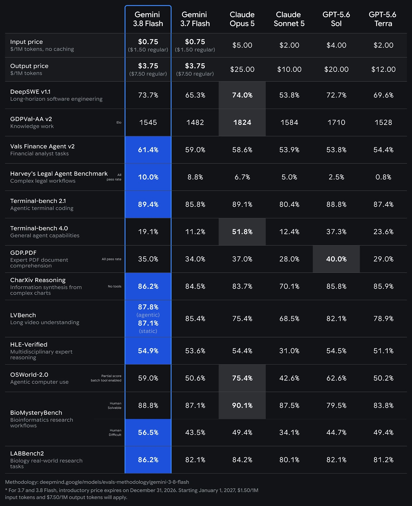

# Gemini 3.8 Flash — Software Engineering and Agentic Knowledge Work

> [!tldr]
> Gemini 3.8 Flash 是以 3.7 Flash 为底座的快速迭代：不换 1M 输入 / 64K 输出的服务边界，重点抬升软件工程、终端 agent、知识工作与研究流程。**我的判断：这是 Gemini 主时间线的新节点，而不是一个应被折叠的 Flash SKU。**

## 老板速览：它值得关注在哪里

> [!summary]
> **3.8 Flash 不是“便宜版最强模型”，而是当前最值得验证的高吞吐 agent 底座之一。** 它在 DeepSWE、Terminal-bench 2.1、金融/法务 agent、长视频和生物研究上展现强成本效率；但在 Terminal-bench 4.0、OSWorld-2.0 和 GDPVal-AA v2 上仍明显落后于某些高成本竞品。

| 老板关心的问题 | 结论 |
|---|---|
| 是不是全面替代高端模型？ | **不是。** 高难综合 agent / GUI 任务仍需要与 Opus 5、GPT-5.6 Sol 实测。 |
| 是不是值得做默认高吞吐底座？ | **值得。** 尤其是 coding、终端执行、文档/视频理解和专业研究批处理。 |
| 真正的经济性优势是什么？ | 不是 token 单价本身，而是高并发下的 **cost per successful task**。 |
| 最需要防的误判？ | 把不同 harness、不同推理档位、不同观测条件的官方数字当成严格同分布排名。 |

### 一句话建议

**把 3.8 Flash 纳入“规模化 agent 默认候选”，但不要在未跑内部同 harness 评测前，直接替换高难长时程任务的强模型。**

## 谱系位置

| 字段 | 结论 |
|---|---|
| 团队 | Google DeepMind · Gemini |
| 发布时间 | 2026-09-02 |
| 前代依赖 | Gemini 3.7 Flash |
| Atlas 归类 | 主干正代，当前 Gemini 最新叶子 |
| 主要证据 | Google DeepMind Model Card |

官方没有宣称一套全新架构，反而反复说明 3.8 Flash **based on Gemini 3.7 Flash**。因此，最合理的读法不是“新架构革命”，而是：保持 Flash 的产品边界，集中更新后训练、行为稳定性和真实 agent 工作负载。

## 模型与接口边界

| 维度 | 官方披露 |
|---|---|
| 输入 | 文本、图像、音频、视频 |
| 上下文 | 最高 1M tokens |
| 输出 | 文本 |
| 最大输出 | 64K tokens |
| 推理预算 | 支持可调 effort levels，在质量、成本与延迟之间取舍 |
| 分发渠道 | Gemini app、Enterprise Agent Platform、AI Studio、Gemini API、AI Mode、Antigravity |

这里最值得记住的是：**3.8 的价值不是窗口变大，而是在相同窗口和 Flash 经济性下，让 agent 轨迹更有用。**

## 评测：增益落在真实工作流

| 评测 | Gemini 3.8 Flash | Gemini 3.7 Flash | 变化 |
|---|---:|---:|---:|
| DeepSWE v1.1 · 长时程软件工程 | 73.7% | 65.3% | +8.4pp |
| Terminal-bench 2.1 · agentic terminal coding | 89.4% | 85.8% | +3.6pp |
| Terminal-bench 4.0 · 通用 agent 能力 | 19.1% | 11.2% | +7.9pp |
| OSWorld-2.0 · computer use partial score | 59.0% | 50.6% | +8.4pp |
| Vals Finance Agent v2 | 61.4% | 59.0% | +2.4pp |
| BioMysteryBench · human-difficult | 56.5% | 43.5% | +13.0pp |
| LABBench2 · 生物研究任务 | 86.2% | 82.1% | +4.1pp |
| HLE-Verified | 54.9% | 53.6% | +1.3pp |

官方图表显示了一个比“平均分更高”更重要的模式：增益集中在 **长时程 coding、终端操作、computer use、金融/法务/生物研究工作流**。这与 Model Card 对“software engineering and agentic knowledge workflows”的定位相互印证。

## 与海外头部模型的位置关系

以下均来自 Google 同一张官方评测图。它适合用于寻找位置，不适合用于宣称严格排名；原因见下一节的方法学审计。

| 评测 | Gemini 3.8 Flash | Claude Opus 5 | Claude Sonnet 5 | GPT-5.6 Sol | GPT-5.6 Terra | 解读 |
|---|---:|---:|---:|---:|---:|---|
| DeepSWE v1.1 | 73.7 | **74.0** | 53.8 | 72.7 | 69.6 | 与 Opus 5 / Sol 同一梯队 |
| GDPVal-AA v2 · Elo | 1545 | **1824** | 1584 | 1710 | 1528 | 通用知识工作不是它的最强项 |
| Vals Finance Agent v2 | **61.4** | 58.6 | 53.9 | 53.8 | 54.4 | 官方表中领先 |
| Harvey's Legal Agent | **10.0** | 6.7 | 5.0 | 2.5 | 0.8 | 全部模型绝对分仍低，不能忽略任务难度 |
| Terminal-bench 2.1 | **89.4** | 89.1 | 80.4 | 88.8 | 87.4 | 默认 Terminus 2 harness 下极强 |
| Terminal-bench 4.0 | 19.1 | **51.8** | 12.4 | 37.3 | 23.6 | 新一代通用 agent 任务上差距很大 |
| OSWorld-2.0 · partial | 59.0 | **75.4** | 42.6 | 62.6 | 50.2 | computer use 不是全面领先 |
| BioMysteryBench · difficult | **56.5** | 49.4 | 34.1 | 44.7 | 49.4 | 专业研究工作流突出 |
| LABBench2 | **86.2** | 84.2 | 80.1 | 82.1 | 81.2 | 生物实验工作流有优势 |

从这个横截面看，3.8 Flash 的形状很清楚：

- **强：**性价比、长时程 coding、终端执行、金融/法务 agent、生物研究、长视频。
- **中：**HLE、PDF/图表理解、一般 computer use。
- **弱：**Terminal-bench 4.0 所代表的更广泛通用 agent 能力，以及 GDPVal 表征的综合知识工作。

## 评测方法学审计：哪些数字真能横比

Google 另外发布了 4 页的评测方法说明。这份文档使用结果时比排名本身更重要。

### 总体口径

- Gemini 分数默认是 **pass@1**；“single attempt”不允许 majority voting 或并行 test-time compute。
- Gemini 3.8 Flash 默认使用 `gemini-3.8-flash` API 和默认 sampling，小样本 benchmark 会多轮平均以降低方差。
- 多数非 Gemini 分数来自各厂商自报或公开榜单，不是 Google 在同一环境全部复测。
- GPT-5.6 Terra 和 Sonnet 5 优先报最高 thinking / reasoning 档；无对应报告时用可得的最优 reasoning 结果。

### 关键不可比因素

| 评测 | 方法学限制 | 可以做的结论 |
|---|---|---|
| DeepSWE v1.1 | Gemini 3.8 为 Google 自测、mini-swe-agent + high thinking；其他模型取 Datacurve 主榜最高 thinking | 可判断处于头部梯队，不宜解读 0.x 分差 |
| Terminal-bench 2.1 | Gemini 自测；其他来自公开榜单 / Artificial Analysis；仅默认 Terminus 2 harness | 适合看方向，不等于所有 terminal agent harness |
| Terminal-bench 4.0 | 全部取官方公榜中各模型最高 thinking | 横向信号相对更强，但仍混合不同推理成本 |
| LVBench | Gemini / GPT 用 1024 frames，Claude 受 API 限制只用 300 frames | 不能把与 Claude 的差距全归因于模型能力 |
| OSWorld-2.0 | 报 partial score；Gemini / Sonnet 5 是 3 轮取最大值、每轮单尝试；500 steps、1080p、screenshot-only，加 batched tool call；且跑在 08.08 patch 之前 | 只能当作这一套 harness 的部分完成率，不是普适 GUI agent 成功率 |
| HLE-Verified | 自测 1,811 题；Sonnet 5 有大量题被内容策略拦截，Opus 5 也有少量 | 对竞品差距需同时考虑 safety filter |
| BioMysteryBench / LABBench2 | 都给予 Linux terminal、bioinfo tools、Python/R 与网络；BioMystery 网络限制允许域名 | 测到的是“模型 + 工具 + harness”系统，不是纯文本智力 |

### 证据信心分层

1. **高信心：**3.8 相对 3.7 的产品规格、官方定位、同 family 安全回归。
2. **中信心：**Google 同一口径自测的 Gemini 3.8 vs 3.7 增量，尤其是差距较大的任务。
3. **低到中信心：**3.8 与 Claude / GPT 的小分差排名，因为来源、harness、thinking level、frames 和 safety filter 不完全一致。

## 经济性怎么看

官方评测图给出的限时入门价为：

- Input: **$0.75 / 1M tokens**
- Output: **$3.75 / 1M tokens**
- 图中注明该入门价到 2026-12-31 结束；之后常规价为 $1.50 / $7.50。

价格不应单独与 benchmark 排名绑定。对 agent workload，真正该测的是 **cost per successful task**：包括推理 tokens、工具往返、失败重试和超时。

### 价格只是名义上限，不是任务成本

| 模型 | Input $/1M | Output $/1M | 相对 3.8 Flash 入门价 |
|---|---:|---:|---|
| Gemini 3.8 Flash · 入门价 | **0.75** | **3.75** | 1.0× |
| Gemini 3.8 Flash · 2027 常规价 | 1.50 | 7.50 | 2.0× |
| Claude Sonnet 5 | 2.00 | 10.00 | 2.67× |
| GPT-5.6 Terra | 2.00 | 12.00 | input 2.67× / output 3.2× |
| GPT-5.6 Sol | 4.00 | 20.00 | 5.33× |
| Claude Opus 5 | 5.00 | 25.00 | 6.67× |

但这个表还缺三个成本项：不同 effort 的 token 消耗、任务失败后的重试次数、以及工具调用造成的轨迹长度。如果 3.8 需要更高 effort 或更多重试才达到高端模型的完成率，名义单价优势会被稀释。

## 部署决策矩阵

| 任务类型 | 建议 | 理由 | 上线前门槛 |
|---|---|---|---|
| 大规模 coding / code review / 终端任务 | **优先试点** | DeepSWE 和 Terminal 2.1 接近或达到头部，单价低 | 内部 repo 同 harness success rate 不低于当前基线 |
| 金融/法务/生物研究辅助 | **优先试点，强验证** | 官方表中优势明显 | 必须有来源引用、规则 verifier 与人工复核 |
| 长视频/多模态资料理解 | **值得试点** | 1M context + 1024-frame 评测表现强 | 在业务真实视频长度上测召回、时序定位和成本 |
| 高难通用长时程 agent | **不要直接替换** | Terminal 4.0 与 Opus 5 / Sol 差距大 | 用自有任务跑完整 final-state verifier |
| GUI / computer use | **作为中成本路由** | OSWorld partial 分强于 3.7，但不是最优 | 重新统一分辨率、steps、观测和工具 schema |
| 多语言面向用户任务 | **谨慎灰度** | 官方披露 multilingual safety 回归 | 中文及目标语言的 safety / refusal 双向回归 |

## 建议的内部验证：三道门

### Gate 1 · 能力

- 用同一 system prompt、同一工具 schema、同一环境 snapshot 对比 3.8 Flash、3.7 Flash 和现有强模型。
- 不只报 partial progress，必须有 final-state verifier 的 strict success。
- 按 coding、research、document/video、computer use 分开报告，不合并总分。

### Gate 2 · 经济性

- 分别测试 low / medium / high effort，记录 input、output、cache、tool latency 与重试。
- 核心指标用 `总成本 / strict successful tasks`，同时报 P50 / P95 延迟。
- 引入超时和空转惩罚，防止长轨迹用 token 堆出表面成功。

### Gate 3 · 风险

- 单独跑中文/多语言 safety、jailbreak、误拒绝与高风险工具调用集。
- 记录高 effort 是否改变拒绝、幻觉或越权调用模式。
- 对专业领域不验证“最终答案像不像”，而验证来源、证据链、工具参数和最终状态。

## 安全与局限

Model Card 没有回避退步：

- 相对 3.7 Flash，多语言安全自动评测 **+5.4pp（越低越好）**，官方明确称为小幅回归。
- Text-to-text safety 为 -0.4pp，image-to-text safety 为 0.0pp。
- Unjustified refusals 为 +1.1pp（越低越好），不应误读成改善。
- 人工红队未发现 egregious concerns，儿童安全达到发布阈值。
- Google 判断 3.8 Flash 相对 3.7 没有 Frontier Safety Framework 中有意义的新能力或重大增幅，因此仍不太可能触及 T/CCLs。

此外，官方提醒模型仍可能幻觉，高 effort 可能消耗更多 tokens，并偶发慢响应或超时。知识截止时间为 2026-03，但部分领域可能仍只到 2025-01。

## 对 Agent Training 的启发

> [!insight]
> 3.8 Flash 最有价值的信号是：在没有换一套显性架构或上下文规格的情况下，多个真实工作流评测同时上升。这更像是后训练、工具环境与轨迹质量的改进问题。

对自己的 agent training 工作，可以直接拆出三个实验方向：

1. 同一任务分别用不同 effort 运行，测量成功率—成本—延迟 Pareto frontier。
2. 把 Terminal / OSWorld 类任务的失败拆成计划、调用、观测、验证和恢复，避免只记最终分数。
3. 对多语言 agent 另建 safety regression set，不要用英文安全结论代替中文与其他语言。

## 资料边界

> [!warning]
> 这是一份 Model Card，不是完整 Tech Report。官方明确说明了依赖、接口、主要评测和安全结果，但没有公开参数规模、训练数据配比、详细 post-training recipe 与消融实验。本笔记不对这些空白作推测。

## 一手资料

- [Google DeepMind Model Card](https://deepmind.google/models/model-cards/gemini-3-8-flash/)
- [Official PDF](https://storage.googleapis.com/deepmind-media/Model-Cards/Gemini-3-8-Flash-Model-Card.pdf)
- [Evaluation methodology PDF](https://storage.googleapis.com/deepmind-media/gemini/gemini_3-8_flash_model_evaluation.pdf)
- [Model Card 本地 PDF](src/Gemini-3.8-Flash-Model-Card.pdf)
- [评测方法本地 PDF](src/Gemini-3.8-Flash-Evaluation-Methodology.pdf)
- [[src/Official Model Card|Model Card 原页快照]]
- [[src/Gemini 3.8 Flash Model Card|Model Card 本地阅读版]]

## 导航

- [[Topics/13_base_model/Base Model MOC|Base Model MOC]]
- [[gemini_3_8_flash_poster_zh|中文 Poster]]
