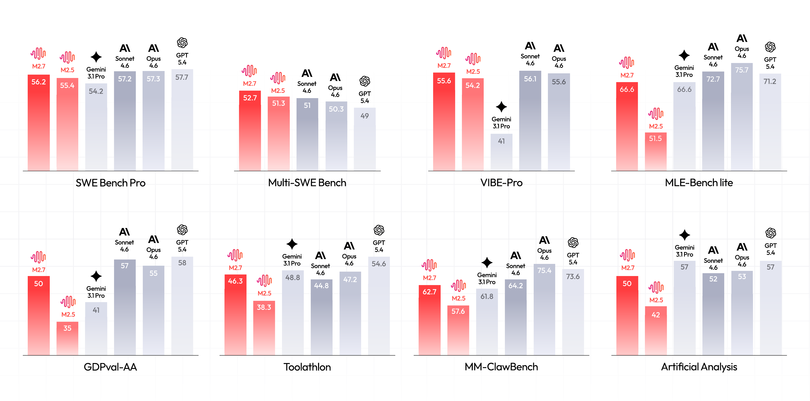
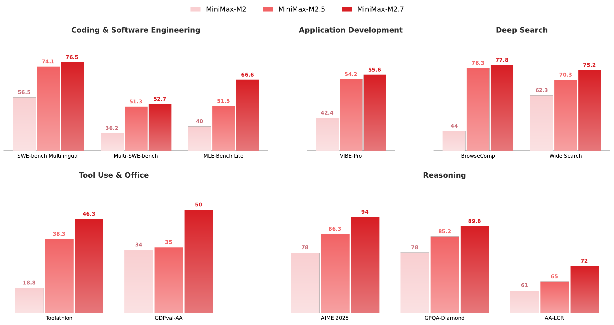
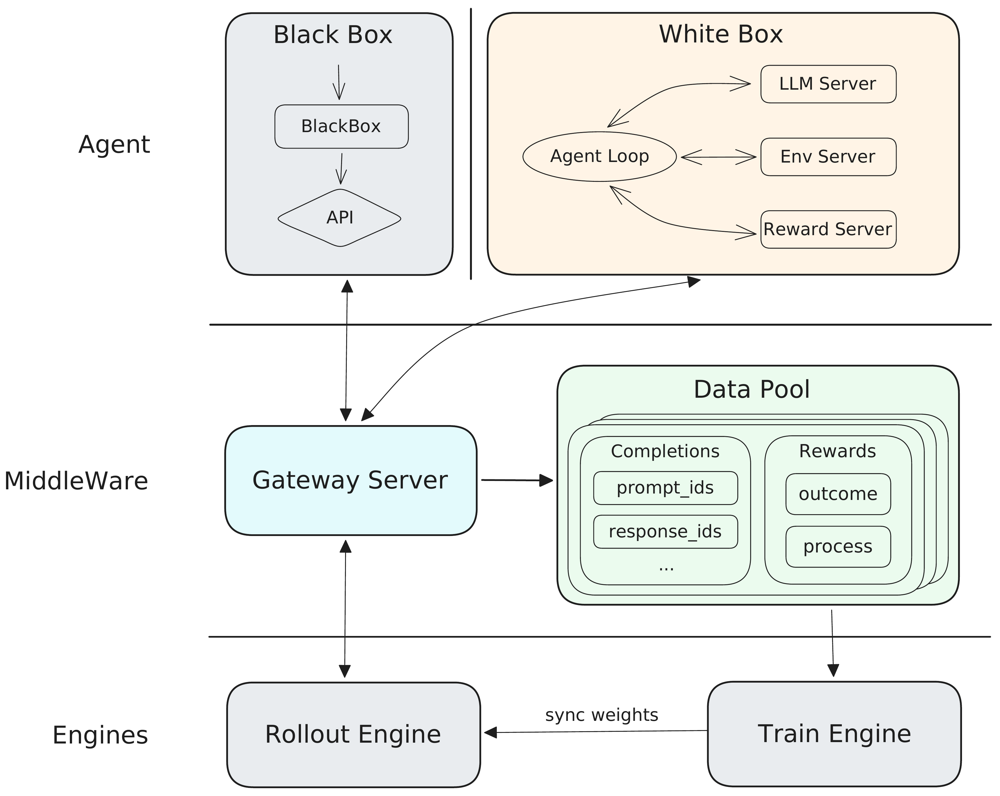
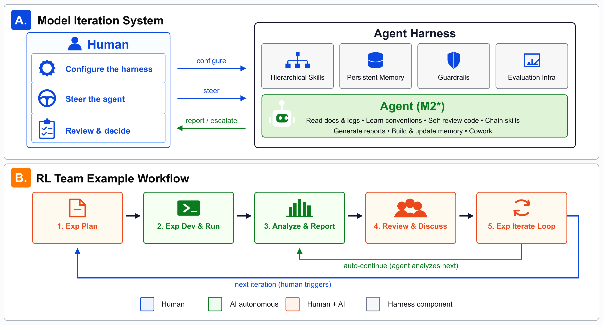

# TL;DR

MiniMax-M2 系列是"小激活、大智能"理念的实践：仅 9.8B 激活参数（总计 229.9B）即可媲美比其大一个数量级的闭源模型。M2.7 展现出**自我进化**能力——能自主调试训练流程、修改 agent scaffold，在 MLE Bench Lite 上与 Gemini 3.1 Pro 持平。



## 问题与动机

M2 的核心洞察是：**Agent 场景的独特挑战**

1. **超长上下文**：Agent 任务天然需要极长的上下文（192K 原生窗口，agent 轨迹可达数百步）
2. **训练-推理 gap**：Agent 场景下环境动态复杂，标准 RL 难以稳定扩展
3. **多域能力平衡**：Agent 既要能写代码、也要能做搜索、还要处理办公软件

M2 提出的解决方案是三位一体：
- **Agent 数据管道**：可验证轨迹 + artifact-aligned reward
- **Forge RL 系统**：支持白盒/黑盒 agent 的统一训练框架
- **Self-Evolution**：模型参与自身训练流程的改进

## 方法核心思路

### 1. 架构设计：Mini Activations



| 规格 | M2 |
|------|-----|
| 总参数量 | 229.9B |
| 激活参数量 | 9.8B |
| Expert 数量 | 256（细粒度 MoE + sigmoid gating） |
| Attention | Full MHA with GQA |
| 上下文窗口 | 192K |
| MTP | Multi-Token Prediction（兼作投机解码） |

### 2. Agent 数据管道

M2 的数据管道强调 **grounding**：

- **Agentic Coding**：可执行工作区 + 验证 reward
- **Agentic Cowork**：搜索、多工具、workspace 操作
- **Reward 设计**：不仅看最终结果，还要求 artifact 对齐

关键发现：提升每条轨迹的 reward 质量和可信度（通过可执行验证或 judge-model 检查）是释放基础模型潜力的关键。

### 3. Forge RL 系统



Forge 是专为 agentic RL 设计的系统，三个核心解耦模块：

```
Agent Side ←→ Middleware (Gateway Server + Data Pool) ←→ Training/Inference Side
```

**关键特性**：

| 特性 | 设计 |
|------|------|
| 白盒/黑盒 Agent 支持 | 环境边界定义在模型生成接口，支持任意 agent 架构 |
| Windowed FIFO | 缓解 agent  rollout 时间方差大（秒级到小时级）的问题 |
| Prefix Tree Merging | 共享前缀的多个 completion 合并计算，训练加速 up to 40x |
| MTP 投机解码 | MTP 模块与 RL policy 联合训练，保证 draft acceptance rate |
| Prefill-Decode 分离 | MoE 架构下 prefill/decode 解耦调度 |
| 全局 KV Cache Pool | DFS-backed L3 KV cache，最大化 prefix 复用 |

**RL 算法**：CISPO（继承自 M1）

### 4. Interleaved Thinking

M2 提出的 Agent 思维模式，核心是**在思考和工具执行之间交替，同时保留完整推理状态**。

#### 4.1 形式化定义

$$\tau = (r_1, a_1, o_1, r_2, a_2, o_2, \ldots, r_T, a_T, o_T)$$

- **$r_t$** = reasoning tokens（思考/推理片段）
- **$a_t$** = action tokens（工具调用）
- **$o_t$** = observation（工具返回结果）

每个推理片段 $r_t$ 以**完整历史**为条件：$r_t \sim p(\cdot \mid r_1, a_1, o_1, \ldots, r_{t-1}, a_{t-1}, o_{t-1})$，让模型能够修订计划、更新假设、整合新证据后再选下一个 action。

#### 4.2 论文明确批判的两种替代方案

| 方法 | 问题 | 论文原话 |
|------|------|---------|
| **Front-loaded reasoning** | 所有 reasoning tokens 都在 action 之前输出完，无法根据中间观察动态调整 | "preventing adaptation to intermediate observations" |
| **Stateless per-turn reasoning** | 每轮生成 $r_t$ 前把 $r_{<t}$ 全部从 context 剥离，模型无法复用之前的分析 | "preventing the model from building on earlier analysis" |

#### 4.3 Reasoning State Persistence — 最关键的设计

**保留推理状态（Interleaved Thinking）**：
$$\mathcal{H}_{t+1} = \mathcal{H}_t \oplus [\mathrm{assistant}(r_t, a_t)] \oplus [\mathrm{tool}(o_t)]$$

**丢弃推理状态（对照消融）**：
$$\mathcal{H}_{t+1}^{\text{(drop)}} = \mathcal{H}_t \oplus [\mathrm{assistant}(a_t)] \oplus [\mathrm{tool}(o_t)]$$

丢弃 reasoning blocks 的后果（论文原话）：*"forcing the model to re-derive context, constraints, and partial conclusions at every turn, leading to **cumulative state drift** and degraded self-correction"*

#### 4.4 Plan-Act-Reflect Loop

| 阶段 | 含义 |
|------|------|
| **Plan** | 基于历史推理和观察结果制定/修订策略 |
| **Act** | 选择并执行工具调用 |
| **Reflect** | 评估观察结果是否符合预期，更新世界模型，决定是否修正计划 |

三个核心收益：self-correction through reflection、sample efficiency（复用而非重推导）、debuggability（可解释的推理痕迹）。

#### 4.5 消融实验

论文通过**在每个 turn 调用模型之前从 context 中 strip 掉之前的 thinking blocks** 来做消融对照（对应 $\mathcal{H}_{t+1}^{\text{(drop)}}$ 模式）。

**实验结论**：
- 所有 agentic benchmarks 上保持**一致提升**
- **提升最大的是**：deep search 和 software engineering（需要长 horizon 多步推理的任务）
- 短 horizon 任务差异不大
- 核心洞察：interleaved thinking 的价值与任务的 **sustained planning and iterative refinement** 需求正相关

这与 M2.7 在 BrowseComp（+33.8）、RISE（+14.1）等 deep search 任务上的巨大提升相互印证。

### 5. Composite Reward 设计

M2 指出标准 outcome-based reward 对长轨迹（192K tokens，数千步 action）**信用分配不足**。因此设计了复合 reward：

$$
r_t = \alpha \cdot r_t^{\text{process}} + \beta \cdot r_t^{\text{speed}} + r_t^{\text{perf}}
$$

- **Process Reward**：中间行为（语言混合惩罚、工具调用格式错误惩罚、结构化推理奖励）
- **Task Completion Time Reward**：鼓励并行执行而非串行
- **Reward-to-Go with Baseline**：减少长 horizon 任务的梯度方差

### 6. Self-Evolution（M2.7）



M2.7 展示了**早期自我进化**能力：

- **Model Iteration System**：人类设定目标、引导 agent、审查输出
- **Agent Harness**：完全由 M2.7 模型生成（零人类代码）
- **双循环工作流**：人类触发主要迭代决策，agent 在审查之间自主执行分析/调试/配置调整

M2.7 在 MLE Bench Lite（22 个 Kaggle 竞赛）上：
- 3 次独立 24 小时试验，平均 66.6% medal rate
- 与 Gemini 3.1 Pro 持平
- 最优运行：9 金、5 银、1 铜

M2.7 还执行了完全自主的 100 轮迭代循环来优化内部编程 scaffold，引入 loop 检测等机制，实现 30% 的性能提升。

### 7. Mixed-Domain RL Training

M2 采用四域混合训练：reasoning、coding、agent、general。在每个 stage 内同时从四个域采样，防止灾难性遗忘。

课程设计沿三个轴调整：
- **域混合比例**：早期侧重 reasoning/general，后期增加 agent/coding
- **上下文长度**：分域扩展（先短 horizon 再长）
- **难度分布**：逐步向更难实例倾斜

## 关键结果

### M2.7 vs Closed-Weight Frontier

| Benchmark | M2.7 | Claude Opus 4.6 | GPT-5.4 | Gemini 3.1 Pro |
|-----------|------|-----------------|---------|----------------|
| SWE-bench Pro | 56.2 | 57.3 | **57.7** | 54.2 |
| AIME 2026 | 94.2 | 92.5 | **97.0** | 88.7 |
| GPQA-Diamond | 89.8 | **89.6** | 92.0 | 94.1 |
| BrowseComp | 77.8 | **84.0** | 82.7 | 85.9 |
| MLE Bench Lite | 66.6 | **75.7** | 71.2 | 66.6 |

### M2 系列演进（M2 → M2.5 → M2.7）

所有 11 个 benchmarks 在三个版本上均持续提升：
- 最大涨幅：BrowselComp +33.8, Toolathlon +27.5, MLE Bench Lite +26.6
- 涨幅与数据管道投入正相关

## 对研究的启发

> [!insight]
> M2 的 Agent 设计（interleaved thinking、composite reward、Forge 系统）对 GUI Agent 研究有直接参考价值。特别值得关注的是 **Forge 的白盒/黑盒 agent 支持** —— 这意味着任何 agent scaffold 都可以接入 RL 训练，无需修改 agent 本身。对于 GUI Agent 的 RL 训练基础设施设计，这是值得借鉴的思路。另外，M2.7 的 self-evolution 展示了模型可以参与自身训练流程，但目前主要在 ML engineering 任务上验证，**在 GUI 环境中的 self-evolution** 仍是一个开放问题。

## 相关链接

- HF Model Cards：[M2](src/model_cards/MiniMax-M2.md) · [M2.1](src/model_cards/MiniMax-M2.1.md) · [M2.5](src/model_cards/MiniMax-M2.5.md) · [M2.7](src/model_cards/MiniMax-M2.7.md)
- 官方 Tech Blogs：[M2](src/tech_blogs/MiniMax-M2.md) · [M2.1](src/tech_blogs/MiniMax-M2.1.md) · [M2.5](src/tech_blogs/MiniMax-M2.5.md) · [M2.7](src/tech_blogs/MiniMax-M2.7.md)

- 论文: [arXiv Link](https://arxiv.org/abs/2605.26494)
- 源码: [GitHub - MiniMax-AI/MiniMax-M2](https://github.com/MiniMax-AI/MiniMax-M2)
